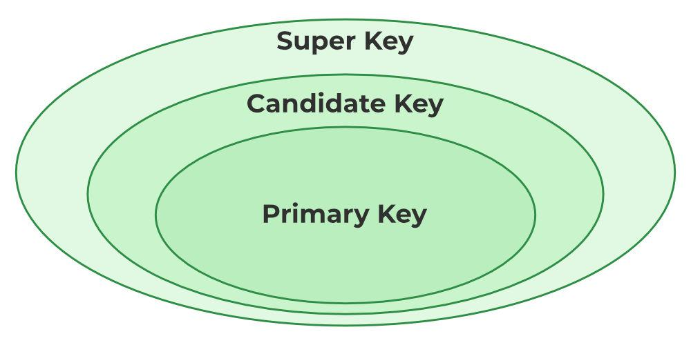
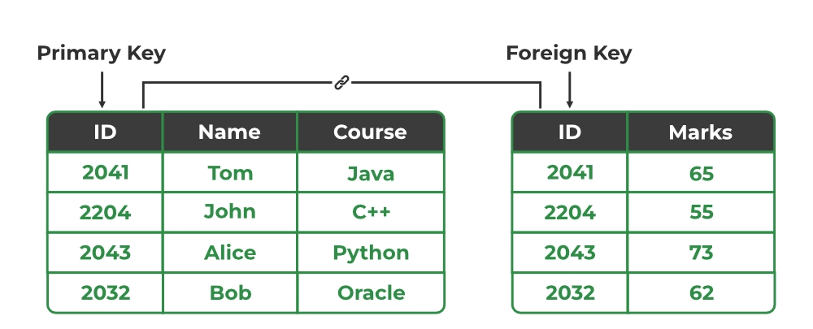
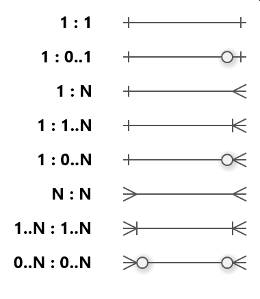
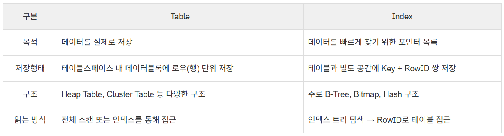

- PK, FK란?

    
    Super Key(슈퍼키) : 튜플(레코드, 행)을 유일하게 식별할 수 있는 속성(1개 이상) 집합 
    
    Candidate Key(후보키) : 튜플을 유일하게 식별할 수 있는 최소한의 속성 집합
    
    **Primary Key(기본키, PK)** : 테이블의 튜플을 유일하게 식별하기 위해 후보키 집합에서 선택된 키
    
    - 중복 값, NULL 값 허용 X
    - 단일 속성 가능, 여러 속성의 조합도 가능(⇒ Composite Key, 복합키)
    - 행을 식별하는 것이 본래 목적이며, 많은 DBMS는 PK에 고유 인덱스를 함께 만들어 조회에도 활용할 수 있음
    
    Alternate Key(대체키) : 기본키로 선택되지 않은 후보키

    
    **Foreign Key(외래키)** : 다른 테이블의 후보키(보통 PK, 또는 UNIQUE)를 참조하는 속성
    
    - 테이블 간의 관계를 구현하고, 존재하지 않는 부모를 참조하지 못하게 하여 **참조 무결성**을 유지
    - 중복 값은 가능하며, 관계가 선택 사항이면 `NULL`도 가능함. 반드시 연결되어야 하는 관계에만 `NOT NULL`을 둠
    - 부모 행을 삭제하거나 PK를 변경할 때의 동작은 업무 규칙에 따라 `RESTRICT`, `CASCADE`, `SET NULL` 등을 선택

- ERD란?

    **ERD(Entity Relationship Diagram)**
    
    데이터베이스의 개체들 사이 관계를 시각적으로 표현한 것, DB 설계 과정에서 사용하는 모델링 기법
    
    구성요소
    
    - Entity(개체)
    관리하고자 하는 정보의 실체
        
        사람, 역할, 이벤트, 개념, 객체와 같이 정의할 수 있는 것 (명사)
        
        개체 유형 : 명사의 범주 (ex : 음식, 스포츠, 국가)
        
        인스턴스 : 개체 유형 내의 개별 개체 (ex : 채소의 인스턴스는 브로콜리, 당근, etc)
        
    - Attribute(속성)
        
        개체 또는 개체 유형을 정의하는 자질, 특성
        
        -단순 속성  : 더 이상 단순화 되거나 추가 속성으로 분리될 수 없는 속성(ex : 우편번호)
        
        -복합 속성 : 두 개 이상의 속성으로 분리할 수 있는 속성(ex : 주소 → 도로 번호 + 도로명  + …)
        
        -파생 속성 : 다른 속성으로부터 유도(계산)되는 속성 (ex : 총 급여 → 근무 시간, 급여 기간, …)
        
        -다중값 속성 : 하나의 인스턴스(레코드)가 한 속성에 대해 2개 이상의 값을 가질 수 있는 속성                                  (ex : 취미, 상품 목록, etc) 
        
    
    - Relationship(관계)
        
        ERD의 개체를 연결하는 연결선, ERD 내의 개체가 서로 연관되는 방식을 나타냄

- 연관관계란? 그리고 연관관계를 설정하는 방법은?

    **연관 관계** : 개체 간의 논리적 연결
    
    관계 유형(Cardinality)과 선택성(Optionality)
    
    - 관계 개수뿐 아니라 최소·최대 참여 수를 함께 표현함. 예: `0..1`, `1..1`, `0..N`, `1..N`
    - 일 대 일 (one to one)
        
        1 대 1 로 매칭되는 관계 (ex : 1대학 ↔ 1총장)
        
        - DB에서는 한쪽 FK에 `UNIQUE` 제약을 두어야 1:1이 보장됨. 어느 쪽에 FK를 둘지는 어느 쪽이 필수인지와 생명주기를 보고 결정
    - 일 대 다 (one to many)
        
        1 대 다수로 매칭되는 관계 (ex : 1대학 ↔ N학과)
        
    - 다 대 다 (many to many)
        
        다수와 다수가 매칭되는 관계 (ex : N교수 ↔ M학생)
        
    
    **설정 방법**
    
    1. 개체 도출 및 속성 정의
        
        저장할 개체 정의, 각 개체(테이블)의 기본키, 일반 속성 설정
        
    2. 관계 유형 식별
    3. 관계 구현 위치와 외래키 부여
        
        관계 자체에 고정된 방향이 있는 것은 아니며, 구현할 때 FK를 어느 테이블에 둘지 결정함
        
        1:N 관계에서는 일반적으로 N 쪽에 1의 기본키를 외래키로 추가
        
        N:M 관계는 연결 테이블을 만들어 두 개의 1:N 관계로 변환. 연결 테이블에는 가입일, 역할, 수량처럼 **관계 자체의 속성**도 둘 수 있음
        
        - 두 FK를 복합 PK 또는 UNIQUE로 묶으면 같은 관계가 중복 저장되는 것을 막을 수 있음
    4. 식별/비식별 관계 설정
        
        식별 관계 : 부모 테이블의 기본키가 자식 테이블의 기본키의 일부가 될 때
        
        비식별 관계 : 부모 테이블의 기본키가 자식 테이블의 일반 속성(외래키)가 될 때
        
    

    
    crow’ foot notation을 이용하여 관계 유형 표현

- 정규화란?

  **정규화** : DB 설계에서 데이터를 효율적으로 구성하기 위해 사용하는 프로세스

  이점

    - 데이터 중복 감소

      데이터를 한 곳에만 저장하여 공간 절약, 효율성 개선

    - 데이터 이상치 제거

      삽입, 삭제, 업데이트 이상(Anomaly) 방지

        - 삽입 이상 : 데이터를 삽입할 때 의도하지 않은 데이터까지 삽입해야만 하는 현상
        - 삭제 이상 : 데이터를 삭제할 때 의도하지 않은 데이터까지 삭제되는 현상
        - 업데이트 이상 : 중복 데이터 중 일부만 수정되어 모순이 일어나는 현상
    - 데이터 무결성 개선

      데이터가 정확하고, 한 곳에만 저장되도록 보장하여 데이터의 정확성, 일관성 유지

    정규형 : 정규화를 위한 일련의 규범적 규칙, 데이터 중복 및 이상에 대한 솔루션
    
    - **함수 종속** : `학생ID → 학생명`처럼 왼쪽 값이 정해지면 오른쪽 값도 하나로 결정되는 관계. 2NF·3NF·BCNF를 판단하는 기준
    - 제 1 정규형 (1NF) : 구조적 기반
        
        규칙 : 모든 열에는 고유한 이름이 있어야 하며 모든 셀에는 분할할 수 없는 단일 값만 포함되어야 한다.
        
        해결하는 문제 : 항목 목록을 단일 셀에 넣을 수 없다. 각 목록은 자체 행을 가지며, 이를 통해 데이터를 검색하고 관리할 수 있다.
        
    - 제 2 정규형(2NF) : 부분 종속 항목 제거
        
        규칙 : 테이블은 이미 1NF에 있어야 하며, 모든 키가 아닌 열은 일부가 아닌 전체 복합키에 의존해야 한다.
        
        - 복합 후보키가 있을 때 특히 확인하며, 후보키가 하나의 컬럼뿐인 테이블은 부분 종속이 없으므로 보통 2NF를 만족함.
        
        해결하는 문제 : 데이터는 완전히 속한 위치에만 저장해야 한다.                                                            ex) 키가 (OrderID, ProductID)인 테이블에서,  속성 ‘제품 가격’은 ProductID에만 종속 → 테이블에 포함 X  ⇒ ProductID와 제품 가격을 별도의 테이블로 이동
        
    - 제 3 정규형(3NF) : **이행 종속** 항목 제거
        
        규칙 : 테이블은 2NF에 있어야 하며, 키가 아닌 열은 기본키에만 종속되어야 한다.
        
        해결하는 문제 : 키가 아닌 하나의 데이터가 다른 키가 아닌 데이터의 값을 결정하는 것을 방지
        
        - 예: `학생ID → 학과ID → 학과명`이면 학과명은 학생ID에 직접 의존하지 않으므로 학과 테이블로 분리
    - 보이스-코드 정규형(BCNF)
        
        규칙 : 모든 함수 종속 `X → Y`에서 결정자 X는 후보키여야 함
        
        - 3NF보다 더 엄격한 형태로, 후보키가 여러 개인 테이블에서 3NF여도 남을 수 있는 중복을 추가로 줄임
        - 분해하면 일부 함수 종속 보존이 어려울 수 있으므로, 무조건 BCNF까지 가기보다 무결성·조회·갱신 요구를 함께 고려

- 반 정규화란?

  **반 정규화** : 실제 병목이 확인된 조회를 빠르게 하기 위해 데이터 중복·집계값 저장을 의도적으로 허용하는 기법

  조회는 빨라질 수 있지만, 쓰기 로직과 정합성 관리가 복잡해지므로 먼저 인덱스·쿼리 개선·캐시·뷰 같은 대안을 검토

  반 정규화를 수행하는 경우

    - 정규화에 충실했을 때 종속성, 활용성은 향상되지만 수행 속도가 느려지는 경우
    - 다량의 범위를 자주 처리해야 하는 경우
    - 특정 범위의 데이터만 자주 처리해야 하는 경우
    - 요약/집계 정보가 자주 요구되는 경우

  반 정규화 절차

    1. 대상 조사 및 검토

       데이터 처리 범위, 통계성 등 확인 ⇒ 반 정규화 대상 조사

    2. 다른 방법 유도 검토

       반 정규화 수행 전 다른 방법 검토 (ex : 클러스터링, 뷰, 인덱스 튜닝)

    3. 반 정규화 적용

  반 정규화 기법

    - 계산된 컬럼 추가

      필요해 보이는 계산된 컬럼을 추가

    - 테이블 수직 분할

      컬럼을 분할해 하나의 테이블을 두 개 이상의 테이블로 분할

    - 테이블 수평 분할

      하나의 테이블에 있는 값을 기준으로 테이블을 분할

    - 테이블 병합
        - 1:1 관계의 테이블을 하나로 병합
        - 1:N 관계의 테이블을 하나로 병합(많은 양의 데이터 중복 발생)
        - 슈퍼 타입과 서브 타입 관계가 발생하면 테이블을 병합
            - EX

              슈퍼 타입 - 고객                                                                                                                     서브 타입 - 개인 고객 / 법인 고객   ⇒ 부모 자식 관계

    - 파티션 기법

      파티션을 사용하여 테이블을 분할 → 논리적으로는 하나의 테이블, but 여러 개의 데이터 파일에 나누어 저장

      ⇒ 데이터 조회 시 엑세스 범위⬇️, I/O 성능 향상, 각 파티션 독립적 백업 및 복구 가능

- DB에서의 상속 관계 표현은 어떻게 하는가?

  RDB 에는 객체지향 언어의 상속 관계가 직접 존재하지 않으며, 슈퍼 타입 - 서브 타입 관계로 표현함

  JPA에서는 루트 엔티티에 `@Inheritance(strategy = ...)`를 지정해 매핑 전략을 선택하며, 지정하지 않으면 단일 테이블 전략이 기본값

  **구현 전략**

    - 조인 전략

      각 개체를 별도의 테이블로 변환 후, 조인을 통해 전체 데이터를 구성

      특징

        - 각 개체가 테이블로 분리되어 관리
        - 자식 테이블의 PK가 부모 테이블 PK를 참조하는 FK 역할도 함
        - 부모 클래스는 추상 클래스로 둘 수 있지만 필수는 아님
        - 정규화된 테이블 구조

      장점

        - 정규화 된 테이블, 외래키 참조 무결성 제약조건 활용 가능
        - 설계가 깔끔하고, 저장 공간 효율⬆️

      단점

        - 조회 시 다수의 조인 필요 → 성능 저하 발생 가능
        - 조회 쿼리가 복잡해지고, 데이터 저장 시 INSERT가 2번 호출

    - 단일 테이블 전략

      모든 개체를 하나의 통합 테이블로 구성하는 방식 → JPA 기본 전략

      특징

        - 구분 컬럼(Discriminator Column)으로 각 행이 어떤 하위 타입인지 구분
        - 부모 클래스는 추상 클래스로 둘 수 있지만 필수는 아님

      장점

        - 조인이 필요 X → 성능⬆️, 쿼리 단순화

      단점

        - 자식 개체에 매핑된 컬럼은 NULL 허용
        - 테이블 크기가 증가 → 조회 성능 저하

    - 구현 클래스마다 테이블 전략

      각 서브 타입을 별도의 테이블로 변환하는 방식

      특징 및 장점

        - 서브 타입을 명확히 구분해 처리 가능
        - NOT NULL 제약조건 적용 가능

      단점

        - 여러 자식 테이블 조회 시 UNION → 성능⬇️
        - 자식 테이블을 통합하기 어려움, 권장X

  **`@MappedSuperclass`**

    - 공통 컬럼만 자식 엔티티에 물려주고, 부모 자체는 엔티티·테이블·조회 대상이 되지 않게 하는 방식
    - `@Inheritance`의 세 가지 테이블 상속 전략과는 다른 용도

- 인덱스란?

  **인덱스(Index)** : DB가 원하는 행을 더 적게 읽도록 돕는 보조 자료구조

  인덱스 항목은 검색 키와 행 위치 정보를 연결하며, B-Tree가 가장 흔하지만 Hash, GIN, BRIN 등 용도별 구조도 있음

  

  장점

    - 검색 성능 향상

      실제 `WHERE`, `JOIN`, `ORDER BY`, `GROUP BY`에서 자주 쓰이고 선택도가 높은 컬럼에 특히 유리

    - 정렬/그룹핑 최적화

      쿼리의 정렬 방향·컬럼 순서가 인덱스와 맞으면 별도 정렬 비용을 줄일 수 있음

    - 복합 인덱스

      `(a, b)` B-Tree 인덱스는 일반적으로 선두 컬럼 `a` 조건이 있는 쿼리에서 가장 효율적이므로, 컬럼 순서는 실제 쿼리 조건 순서를 보고 정함

    단점
    
    - 쓰기 성능 저하
        
        INSERT, UPDATE, DELETE 시 인덱스 갱신 → 오버헤드 발생
        
    - 저장 공간 증가
        
        테이블과 별개의 저장 공간 차지
        
    - 인덱스는 무조건 추가하지 않음
        
        쓰기 비용과 공간 비용이 있으므로, 느린 쿼리와 실행 계획을 확인한 뒤 필요한 인덱스만 추가. FK 컬럼 인덱스도 DBMS의 자동 생성 여부가 다르므로 사용하는 DB 기준으로 확인