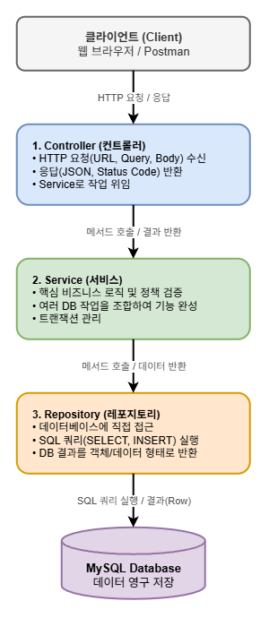
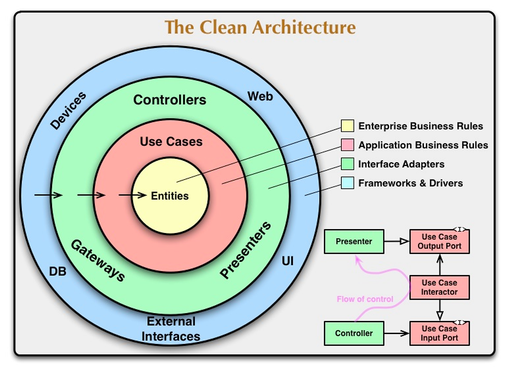
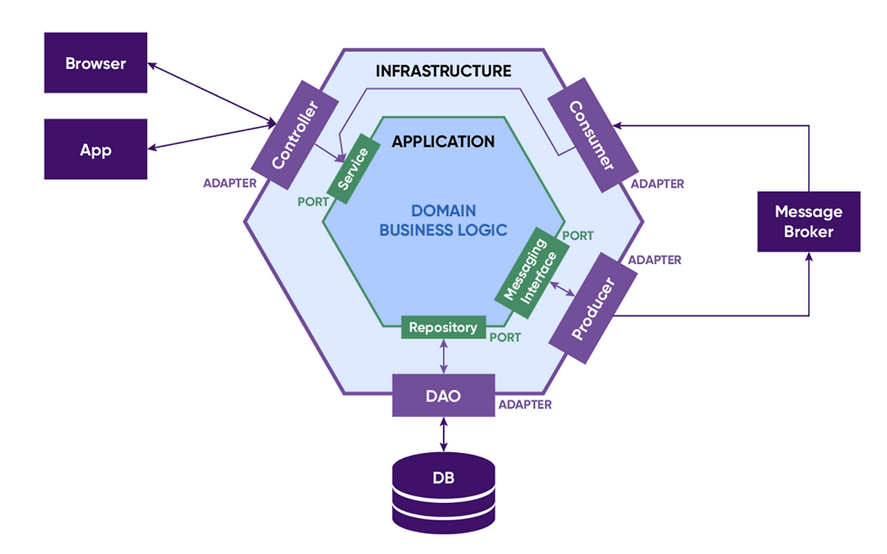

# Backend Chapter03

## 키워드 정리

- 3계층 아키텍처 이외에 어떤 아키텍처들이 있을까?
    
    ### 3계층 아키텍처
    
    
    
    - Presentation Layer (표현 계층) / `@RestController`, `@Controller`
    - **Business Layer (비즈니스 계층) / `@Service`**
    - **Persistence Layer (영속성 / 데이터 접근 계층) / `@Repository`**
    
    ### 4계층 아키텍처
    
    - 4-Layer가 존재하는 이유:
        - 시스템의 규모와 복잡도가 증가함에 따라, 서비스 계층(Service Layer)이 '트랜잭션 관리 및 작업 흐름 제어(오케스트레이션)'와 '순수 도메인 비즈니스 규칙(상태 변경 및 정책 연산)'을 모두 떠안으면서 **단일 클래스의 책임이 과도하게 집중(비대화)되는 문제**가 발생합니다.
        - 이를 해결하기 위해 서비스 계층의 역할을 다음 두 계층으로 명확히 분리한 것입니다.
            - **응용 계층 (Application Layer):** 유스케이스(Use Case)의 작업 흐름 조정, 트랜잭션 경계 설정, 보안 검증 등 **시스템 운영 및 절차 제어**를 전담
            - **도메인 계층 (Domain Layer):** 프레임워크나 외부 인프라 기술에 종속되지 않은 채, 데이터와 핵심 업무 규칙(비즈니스 정책 및 불변식)을 캡슐화한 **엔티티(Entity) 및 도메인 모델** 전담
    - **4-Layer 구조:**
        1. **Presentation Layer:** 외부 요청/응답 접수 (Controller)
        2. **Application Layer:** 비즈니스 작업의 순서(Flow) 제어 및 트랜잭션 관리
        3. **Domain Layer (추가됨):** 외부 기술과 무관하게 데이터와 핵심 비즈니스 연산 규칙을 갖는 엔티티(Entity)
        4. **Infrastructure Layer:** DB 접근(Repository), 외부 결제 API, 메일 발송 등 인프라 기술 일체
    
    ### 계층형 아키텍처의 문제점
    
    **설계 경계 강제의 어려움**
    
    - 계층 간 구분이 단순 관례에 의존하므로, 바쁜 실무에서 `Controller ➔ Repository`로 직접 호출하는 등 계층 스킵(Layer Skipping)이 발생하기 쉽습니다.
    
    **DB 및 영속성 프레임워크에 대한 종속성 (DB 주도 설계)**
    
    - `Presentation ➔ Business ➔ Persistence`로 의존성이 흘러가기 때문에, 비즈니스 계층이 DB 테이블 구조와 JPA 기술(지연 로딩, 영속성 컨텍스트, 프록시)에 강하게 엮입니다.
    - 결과적으로 DB 스키마나 쿼리가 바뀌면 도메인 비즈니스 로직까지 연쇄적으로 수정해야 하는 취약점이 생깁니다.
    
    **비용 측면**
    
    - 계층별 객체 매핑(DTO ↔ Entity)과 인터페이스 관리로 인해 단순 기능 구현 시 초기 작업 비용(코드량)이 증가합니다.
    
    ---
    
    - 헥사고날 아키텍처
        
        헥사고날 아키텍처는 이러한 클린 아키텍처를 일반화한 구조 중 하나이며, 유지보수성과 확장성을 높이기 위해 고안되었다. 어댑터와 포트를 중심으로 구성되어 포트와 어댑터 아키텍처로 불리기도 한다. 이를 통해 비즈니스 로직을 외부로부터 격리시켜  외부 시스템과 의존성을 최소화한다.
        
        - 핵심 비즈니스 로직은 중앙의 도메인 영역에 위치하며, 입출력을 처리하는 포트와 어댑터를 통해 외부와 소통한다.
        - 도메인 로직과 인프라 스트럭처 계층을 명확히 분리함으로써 변경 사항이 도메인 로직에 미치는 영향을 줄일 수 있다.
        - 해당 구조는 유지보수를 용이하게하여 시스템의 다양한 부분을 독립적으로 개발하고 테스트할 수 있는 환경을 제공한다.
        - 헥사고날 아키텍처는 도메인 중심 설계와 밀접하게 연관되어있어 비즈니스 로직의 중심성을 강조한다.
    - 클린 아키텍처
        
        클린 아키텍처는 비즈니스 규칙이 외부로부터 독립적으로 만들어 테스트를 용이하게 하고, 비즈니스 규칙이 외부의 영향을 받지 않는다.
        
        - 도메인 코드가 바깥으로 향하는 어떠한 의존성도 없어야 한다. 모든 의존성은 안쪽을 향하고 있다.
        - 도메인은 어떤 영속성 프레임워크가 사용되는지 알 수 없다.
        - 영속성 계층이 도메인 계층에 의존하고, 영속성 엔티티를 도메인 엔티티로 변환하는 과정이 필요하다.
        - 도메인 밖에는 유스케이스가 있고, 이는 단일 책임을 갖기 위해 조금 더 세분화 되어 있다.( ex. UserService ⇒ RegisterUserService )
    
    #### 헥사고날(Hexagonal) & 클린(Clean) 아키텍처
    
    - **공통 핵심:**
        - **의존성 역전(DIP):** 도메인 계층은 바깥(DB, 웹 프레임워크)의 존재를 전혀 알지 못하며, 모든 화살표가 **외부에서 중앙(도메인)으로만** 향합니다.
        - **기술의 탈부착화:** DB를 MySQL에서 MongoDB로 바꾸거나, HTTP API 대신 메시지 큐(Kafka)를 연동하더라도 중앙의 비즈니스 코드는 단 한 줄도 수정되지 않습니다.
    - **클린 아키텍처의 특징:**
        - 계층을 세부적인 동심원(Entities ➔ Use Cases ➔ Interface Adapters ➔ Frameworks)으로 나누고, 비즈니스 흐름을 단일 책임 단위(예: `RegisterUserService`, `RentalBookService`)로 잘게 분리합니다.
        
        
        
    - **헥사고날 아키텍처의 특징:**
        - **포트(Port):** 도메인이 외부에 요구하거나 외부에 제공하는 인터페이스 (규격서)
        - **어댑터(Adapter):** 규격서에 맞춰 실제로 동작하는 외부 구현체 (Controller, JPA Repository, 외부 API 연동 클라이언트)
        
        
        
    
    ---
    
    ### 3계층 아키텍처가 가장 널리 쓰이는 이유와 스프링의 최적화
    
    - **3-Layer가 가장 대중적인 이유:**
        - 직관적이고 단순하여 팀원 간 소통 비용이 가장 적고 빠른 개발이 가능합니다. 대부분의 웹 애플리케이션 요구사항을 복잡한 구조 없이 깔끔하게 해결합니다.
    - **스프링과의 연계 (최적화):**
        - 스프링은 태생부터 빈(Bean) 등록 시 `@Controller`, `@Service`, `@Repository`라는 스테레오타입 어노테이션을 아예 계층별로 기본 제공할 정도로 3계층에 완벽히 최적화되어 있습니다.
        - 상위 계층이 하위 계층을 주입받아 쓰는 단방향 흐름(`Controller ➔ Service ➔ Repository`)이 스프링의 핵심 철학인 의존성 주입(DI)과 가장 자연스럽게 맞아떨어집니다.
    - **유연성:**
        - 스프링이 3-Layer에만 갇혀 있는 것은 아닙니다. 시스템 규모가 커지면 인터페이스(Port)를 두어 헥사고날/클린 아키텍처 구조로 확장하거나, 중간에 도메인 모델을 분리한 4-Layer로 유연하게 얼마든지 변형하여 사용할 수 있습니다.
    
    ---
    
    https://tech.kakaopay.com/post/home-hexagonal-architecture/
    
- SQL Injection을 포함한 대표적인 웹 보안 공격 기법
    
    ### OWASP Top 10
    
    OWASP(Open Web Application Security Project)는 안전한 소프트웨어 개발을 위해 활동하는 글로벌 비영리 오픈소스 보안 단체입니다. 정기적으로 전 세계 수만 개의 웹 애플리케이션 침해 데이터를 분석하여 **가장 위험하고 빈번한 10대 보안 취약점 목록**을 발표합니다.
    
    https://top10.owasp.org/2025/
    
    #### 주요 취약점 4선 (실제 OWASP 순위 기준)
    
    - **A01: Broken Access Control (권한 제어 실패 / IDOR)**
        - **개념:** 사용자의 인증/인가 권한을 엄격히 검증하지 않아 타인의 데이터나 권한에 접근 가능한 결함.
        - **예시:** 로그인한 일반 사용자 A가 본인의 대여 내역 URL인 `GET /rentals/10`에서 숫자만 `11`로 바꿨을 때 다른 사용자 B의 대여 기록이 조회되는 경우.
    - **A02: Cryptographic Failures (암호화 실패)**
        - **개념:** 비밀번호나 결제 정보 같은 민감 데이터를 암호화하지 않거나 취약한 알고리즘을 사용한 경우.
        - **예시:** DB `users` 테이블에 사용자 비밀번호를 `1234` 평문 그대로 저장해 유출 사고 발생 시 모든 계정이 탈취되는 경우.
    - **A03: Injection (SQL Injection 포함)**
        - **개념:** 입력값을 그대로 쿼리 문자열에 합쳐 의도치 않은 SQL 문을 실행시키는 공격.
        - **예시:** 로그인 입력창에 `' OR 1=1 --`를 넣어 비밀번호 검증을 우회하고 관리자로 로그인하는 공격.
    - **A05: Security Misconfiguration (보안 설정 오류)**
        - **개념:** 기본 비밀번호 사용, 불필요한 포트 개방, 상세 에러 페이지 노출 등의 결함.
        - **예시:** 서버 에러(500) 발생 시 브라우저 화면에 자바 스택 트레이스와 DB 테이블 명세가 그대로 노출되어 내부 시스템 구조 힌트를 공격자에게 제공하는 경우.
    
    #### 최근 웹 생태계 대표 보안 이슈: Log4Shell (CVE-2021-44228)
    
    - **원인:** 자바 진영의 표준 로깅 라이브러리인 Log4j에서 로그 문자열 속 `${jndi:ldap://...}` 문법을 필터링 없이 파싱하고 원격 코드를 다운로드해 실행해 버리는 결함이 발생했습니다.
    - **파급력:** 단순 검색창이나 HTTP Header(User-Agent 등)에 악성 문자열만 실어 보내도 서버의 루트 권한이 해커에게 장악당해 전 세계 백엔드 시스템에 긴급 패치가 진행되었습니다.
    
- 커넥션 풀(Connection Pool)이란?
    
    #### 단일 커넥션 생성의 비용 문제 (도입 배경)
    
    클라이언트가 DB 작업을 요청할 때마다 서버가 매번 새로 연결을 생성하면 다음과 같은 고비용 작업이 반복됩니다:
    
    1. 네트워크 상의 **TCP 3-Way Handshake** (SYN → SYN-ACK → ACK)
    2. 애플리케이션과 MySQL 서버 간의 **인증 및 보안 세션 협상** (계정/비밀번호 확인, SSL 협상)
    3. MySQL 내부의 세션 메모리 할당 및 트랜잭션 격리수준 초기화
    4. 쿼리 수행 후 **TCP 4-Way Handshake**를 통한 소켓 해제
    
    트래픽이 급증하면 쿼리 실행 자체보다 **커넥션을 맺고 끊는 네트워크 오버헤드와 CPU 점유** 때문에 서버 스레드가 고갈되어 `Connection Timeout`과 서버 다운이 발생합니다. 이를 방지하기 위해 일정량의 커넥션을 미리 열어두고 빌려 쓴 뒤 반납하는 커넥션 풀(Connection Pool)이 필수화되었습니다.
    
    #### 커넥션 풀 라이브러리 비교 및 HikariCP
    
    - **Apache Commons DBCP / C3P0 (과거 표준):**
        - 스레드 간 락 경합(Synchronization Lock)이 심해 동시 요청이 많을 때 병목이 발생했습니다. (뮤텍스 느낌)
        - 커넥션 유효성 검사 비용이 무겁고(테스트 쿼리를 보냄) 프레임워크 풋프린트가 컸습니다(라이브러리 자체가 큼).
    - **HikariCP (현재 Spring Boot 2.x/3.x 기본 채택):**
        - 바이트코드 수준까지 최적화하여 라이브러리 용량이 약 130KB로 매우 가볍습니다.
        - Java의 `FastList`와(불필요한 범위 체크 없앰) 커스텀 락-프리(Lock-Free) 큐를 채택해 락 경합을 극소화하여 기존 DBCP 대비 수배 이상의 빠른 처리량과 낮은 지연시간을 제공합니다.
        - 락프리
            
            문을 잠그고 1명씩 들여보내는 대신, CPU 하드웨어 수준의 동시 처리 기술(CAS 알고리즘)을 써서 여러 손님이 동시에 와도 줄을 세우지 않고 각자 빈 키를 낚아채 갈 수 있게 만들어 대기 시간을 없앴습니다.
            
    
    ### Pool 크기 설정 시 고려사항
    
    Thread Pool과 Connection Pool은 서로 균형이 중요합니다:
    
    1. Thread Pool이 Connection Pool보다 너무 클 때:
        - 많은 스레드가 적은 수의 커넥션을 기다림
        - 스레드들이 커넥션을 기다리며 대기 상태
        - 결과적으로 응답 지연 발생
    2. Connection Pool이 Thread Pool보다 너무 클 때:
        - 사용하지 않는 커넥션이 많아짐
        - 데이터베이스 서버의 리소스 낭비
        - 불필요한 메모리 사용
- Raw SQL vs ORM
    
    #### 핵심 차이점
    
    - **Raw SQL (JdbcTemplate, MyBatis):** SQL 중심. 개발자가 쿼리를 문자열로 직접 짜고, 결과를 자바 객체 필드에 수동으로 매핑합니다.
    - **ORM (JPA / Hibernate):** 객체 중심. DB 테이블을 Entity 객체로 추상화하여 마치 자바 컬렉션의 객체를 다루듯 DB를 조작합니다.
    
    #### 코드 예시 비교
    
    ```java
    // 1) Raw SQL (JdbcTemplate): 쿼리 작성 및 ResultSet 수동 매핑 필요
    public Book findById(Long id){
        String sql = "SELECT id, title, price FROM book WHERE id = ?";
        return jdbcTemplate.queryForObject(sql, (rs, rowNum) -> new Book(
            rs.getLong("id"),
            rs.getString("title"),
            rs.getInt("price")
        ), id);
    }
    
    // 2) ORM (Spring Data JPA): 쿼리 작성 없이 메서드 호출만으로 완성
    public interface BookRepository extends JpaRepository<Book, Long>{
        // 내부적으로 SELECT * FROM book WHERE id = ? 자동 생성
    }
    
    // 서비스 호출부
    Book book = bookRepository.findById(id).orElseThrow();
    ```
    
    #### 장단점 요약
    
    | **구분** | **Raw SQL (JdbcTemplate, MyBatis)** | **ORM (JPA / Hibernate)** |
    | --- | --- | --- |
    | **장점** | • 복잡한 조인, 통계 쿼리, DB 고유 힌트 작성이 직관적임<br>• 실행되는 쿼리를 100% 개발자가 통제 가능 | • 반복적인 CRUD 코드 제거로 생산성 대폭 향상<br>• 객체 지향적 도메인 설계 가능<br>• 컴파일 타임 문법 체크 및 1차 캐시 최적화(SQL 쿼리가 아닌 자바 언어이므로 체크 가능)(같은 API 안에서 1번책 3번 조회하면 DB에 쿼리 3번 보내지 않고 메모리에 보관된걸 재사용) |
    | **단점** | • 테이블 컬럼 수정 시 수많은 SQL 문자열을 수작업 수정해야 함<br>• 특정 DB 방언(MySQL, Oracle 등)에 종속됨 | • 러닝 커브가 높음 (내부 동작 규칙을 숙지해야함)<br>• N+1 문제, 지연 로딩 등 메커니즘 미숙지 시 심각한 성능 저하 |
- INSERT 외에 데이터를 다루는 핵심 SQL 문법
    
    #### 실무 사용 비중과 통계적 흐름
    
    일반적인 웹 서비스(커머스, 게시판, 도서관 등)의 트래픽은 Read-Heavy 특성을 띱니다. 통상 **전체 쿼리 트래픽의 70~80% 이상을 SELECT가 차지**하며, 나머지 20~30%를 **INSERT, UPDATE, DELETE**가 나누어 갖습니다.
    
    #### 문법별 주의사항
    
    - **SELECT: `SELECT *` 지양 및 인덱스 활용**
        - 불필요한 모든 컬럼을 조회하면 메모리와 네트워크 대역폭이 낭비되며, 인덱스만으로 결과를 반환하는 **커버링 인덱스(Covering Index)** 최적화 혜택을 받을 수 없습니다.
        - `WHERE SUBSTRING(title, 1, 2) = '자바'`처럼 인덱스 컬럼을 함수로 가공하면 인덱스를 타지 못하고 Full Table Scan이 일어납니다.
    - **UPDATE: 트랜잭션 락(Lock) 경합과 WHERE 누락**
        - `WHERE` 절을 실수로 빠뜨리면 테이블 전체 데이터가 수정되는 대형 사고가 발생하므로 프로덕션에서는 세이프 모드(`SQL_SAFE_UPDATES`)를 권장합니다.
        - 데이터를 수정할 때 배타적 락(X-Lock)이 걸리므로, 긴 트랜잭션 안에서 일찍 UPDATE를 수행하면 후속 요청들이 대기(Lock Timeout) 상태에 빠집니다.
    - **DELETE: 물리 삭제 대신 논리 삭제(Soft Delete) 고려**
        - `DELETE`는 데이터를 물리적으로 완전히 삭제하므로 연관 외래 키(FK) 참조 무결성 제약 에러가 발생하기 쉽고 실수 시 복구가 어렵습니다.
        - 실무에서는 `is_deleted = true` 플래그나 삭제 시각(`deleted_at`)을 기록하는 **논리 삭제(Soft Delete)** 패턴을 주로 사용합니다.
    - **JOIN: N+1 및 카테시안 곱(Cartesian Product) 주의**
        - 조인 조건(`ON`)을 누락하거나 일대다 조인을 무분별하게 걸면 카테시안 곱으로 인해 결과 데이터가 수십 배로 팽창하여 DB 메모리가 고갈될 수 있습니다. 복잡한 조인은 실행 계획(`EXPLAIN`)을 통해 인덱스 적용 여부를 반드시 확인해야 합니다.