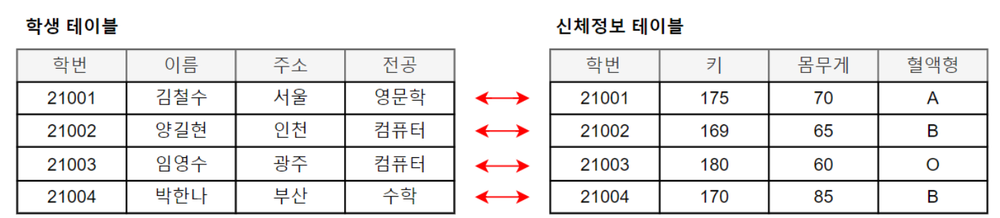
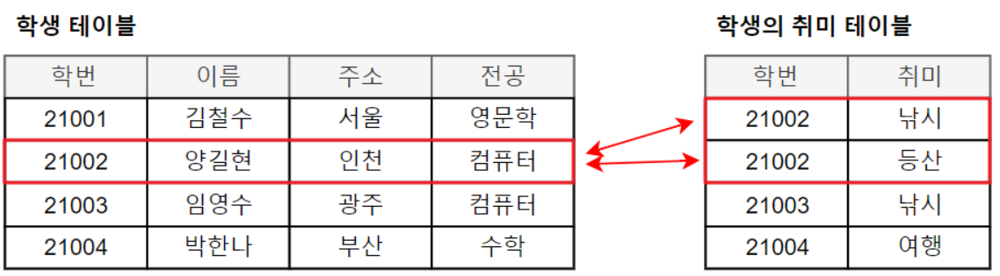
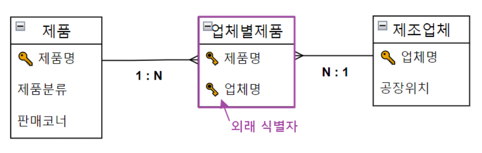

- PK, FK란?

  ## 기본키(Primary Key)

  테이블 내에서 **각 행(데이터) 식별해주는 고유한 값을 가지는 속성**

    - 기본키는 null 값을 가질 수 없으며 오직 하나의 값만을 가져야 한다 **( UNIQUE + NOT NULL )**
    - **유일성** : 각 행 내에서 유일한 값을 가져서 각 기본키의 값이 중복되어서는 안된다
    - **최소성** : 기본키를 구성하는 속성은 행을 구분하는데에 꼭 필요한 속성만을 사용해야 한다

  ## 외래키(Foreign Key)

  **다른 테이블의 PK와 연결되어서 테이블 간의 관계를 나타내는 속성**

    - FK를 선언하는 테이블에서 다른 PK를 가져와 참조한다
        - FK가 포함된 테이블을 자식 테이블, FK 값을 제공하는 테이블을 부모 테이블이라고 한다
    - **참조 무결성 제약조건** : 외래키 값은 **NULL**이거나 **부모 테이블의** **기본키 값**과 동일해야한다
    - 외래키는 기본키와 달리 **중복된 값을 가질 수 있다**
        - 하나의 부모 데이터를 여러 자식 데이터가 참조할 수 있기 때문이다
        - ex) 여러 학생이 같은 학과를 참조하는 경우 `department_id` 값은 중복될 수 있다
    - 외래키는 관계가 필수가 아니라면 **NULL 값을 가질 수 있다**
        - ex) 아직 담당자가 배정되지 않은 `task`의 `manager_id`
    - 다대다 관계에서는 보통 **중간 테이블을 만들어 각각의 PK를 FK로 저장한다**
        - ex) 회원-상품 찜 → `Favorite(member_id, product_id)`
- ERD란?

  ## ERD(Entity-Relationship Diagram)

  DB의 구조와 연관관계를 한눈에 파악할 수 있도록 시각적으로 나타낸 그림

    - **Entity, Attribute, Relationship** 으로 이루어져 있다
        - Entity : 관리하려는 데이터의 대상으로 실제 DB에서는 보통 **테이블**
        - Attribute : 엔티티가 가지고 있는 정보로 실제 DB에서는 **Column**
        - Relationship : 엔티티끼리 어떤 관계를 가지고 있는지 표현하는 것

  ### Entity 관계 표기 방법

    - 식별자 관계 : 자식이 FK 중 하나로 부모의 PK를 가지면서 **해당 FK를 PK로도 가짐**
        - 강한 연결관계
        - 실선 표현
    - 비식별자 관계 : 자식이 FK 중 하나로 부모의 PK를 가짐
        - 약한 연결관계
        - 점선 표현

  ### **ERD 관계의 카디널리티**

    - **One to one : 1 대 1 대응**



    - **One to many : 1 대 N 대응**



    - **Many to many : N 대 M 대응**
        - 2개의 엔티티만으로는 표현이 어렵기 때문에 주로 **추가로 매핑 테이블을 두고 각각의 PK를 FK로 가져서 해결**



- 연관관계란? 그리고 연관관계를 설정하는 방법은?

  ## 연관관계

  **테이블과 테이블 사이에 맺어지는 관계**를 의미
  관계형 데이터베이스에서는 일반적으로 **한 테이블의 FK가 다른 테이블의 PK 또는 UNIQUE한 키를 참조**함으로써 연관관계를 표현함

    - 연관관계의 종류
        - 1 : 1
        - 1 : N
        - N : M

  ### 연관관계를 설정하는 방법

    - 일반적으로는 **FK를 사용해서 테이블 간의 연관관계를 설정**한다
    - 코드
        - **1 : 1**

            ```jsx
            -- 부모 테이블
            CREATE TABLE member (
                member_id BIGINT PRIMARY KEY
            );
            
            -- 자식 테이블
            CREATE TABLE orders (
                order_id BIGINT PRIMARY KEY,
                member_id BIGINT **UNIQUE**, -- 중복으로 FK를 가질 수 없음(일대일)
            
                FOREIGN KEY (member_id) -- member_id라는 FK 선언
                    REFERENCES member(member_id) -- 해당 FK를 member테이블의 member_id에서 참조
            );
            ```

        - **1 : N**

            ```jsx
            -- 부모 테이블
            CREATE TABLE member (
                member_id BIGINT PRIMARY KEY
            );
            
            -- 자식 테이블
            CREATE TABLE orders (
                order_id BIGINT PRIMARY KEY,
                member_id BIGINT, -- UNIQUE가 없음
            
                FOREIGN KEY (member_id) -- member_id라는 FK 선언
                    REFERENCES member(member_id) -- 해당 FK를 member테이블의 member_id에서 참조
            );
            ```

        - **N : M**

            ```jsx
            -- 부모 테이블
            CREATE TABLE member (
                member_id BIGINT PRIMARY KEY
            );
            
            -- 자식 테이블
            CREATE TABLE orders (
                order_id BIGINT PRIMARY KEY,
            );
            
            -- 매핑 테이블
            CREATE TABLE member_order (
            		member_id BIGINT,
            		order_id BIGINT,
            		PRIMARY KEY(member_id, order_id),
            	
            		**FOREIGN KEY (member_id) REFERENCES member(member_id),
            		FOREIGN KEY (order_id) REFERENCES order(order_id)**	
            );
            ```

- 정규화란?

  ## 정규화

  **데이터 베이스의 중복을 줄이는 것과 이상 현상 방지를 목적**으로 테이블을 나누는 과정

    - 장점
        - 이상 현상 방지
            - 삽입 이상 : 필요한 데이터만 따로 넣을 수 없는 관계
            - 수정 이상 : 같은 정보를 여러 곳에서 모두 수정해야 하는 문제
            - 삭제 이상 : 어떤 데이터를 삭제했는데 원하지 않은 정보까지 같이 사라지는 문제
        - 정규화가 잘된 테이블은 **기존 구조의 변경 없이** 확장에 자유로움
        - 유지보수 용이
    - 단점
        - 지나친 정규화는 JOIN을 많이 하게해서 **성능 저하를 유발**할 수 있다

  ### 정규화 단계

    - **제 1 정규화**

      → 테이블의 모든 속성은 **원자값**을 가져야 한다.

      **한 속성에 여러 개의 값이 들어가 있는 경우** → 별도의 칼럼으로 분리

      | **주문 번호** | **상품 코드** | 상품명 | 상품 가격 | 주문 수량 |
              | --- | --- | --- | --- | --- |
      | 536365 | 22715, 51914 | A, B | 10.68, 11.12 | 12, 12 |
      | 536366 | 22633 | C | 12.15 | 6 |

      | **주문 번호** | **상품 코드** | 상품명 | 상품 가격 | 주문 수량 |
              | --- | --- | --- | --- | --- |
      | 536365 | 22715 | A | 10.68 | 12 |
      | 536365 | 51914 | B | 11.12 | 12 |
      | 536366 | 22633 | C | 12.15 | 6 |
    - **제 2 정규화**

      기본키가 2개 이상의 속성으로 구성되어 있을 때 다른 속성들은 기본키의 일부가 아닌 기본키 전체에 의해 특정(종속) 되어야 한다

      | **주문 번호** | **상품 코드** | 상품명 | 상품 가격 | 주문 수량 |
              | --- | --- | --- | --- | --- |
      | 536365 | 22715 | A | 10.68 | 12 |
      | 536365 | 51914 | B | 11.12 | 12 |
      | 536366 | 22633 | C | 12.15 | 6 |

      여기서 주문 번호화 상품 코드가 기본 키인 경우

        - (주문 번호, 상품 코드) → (주문 수량) : 제 2 정규화 원칙을 따름
        - (상품 코드) → (상품명, 상품 가격) : **기본키의 일부 속성에 의해 특정(종속)** 되므로 제 2 정규화 원칙을 위반함

      → 따라서 상품 코드, 상품명, 상품 가격을 속성으로 가지는 테이블을 생성해서 분리해야함

      | **주문 번호** | 상품코드(FK) | 주문 수량 |
              | --- | --- | --- |
      | 536365 | 22715 | 12 |
      | 536365 | 51914 | 12 |
      | 536366 | 22633 | 6 |

      | **상품 코드** | 상품명 | 상품 가격 |
              | --- | --- | --- |
      | 22715 | A | 10.68 |
      | 51914 | B | 11.12 |
      | 22633 | C | 12.15 |
    - **제 3 정규화**

      어떠한 속성이 기본키가 아닌 **일반 속성에 종속**되어 있다면 이를 별도의 테이블로 분리해야함

      | **주문 번호** | 주문 날짜 | 회원 번호 | 이름 | 국가 |
              | --- | --- | --- | --- | --- |
      | 536365 | 2026-09-10 | 1001 | 빈 | 대한민국 |
      | 536366 | 2026-09-11 | 1002 | 써니 | 미국 |
      | 536367 | 2026-09-12 | 1001 | 빈 | 대한민국 |
      | 536368 | 2026-09-12 | 1003 | 브라이언 | 영국 |

      | **주문 번호** | 주문 날짜 | **회원 번호** |
              | --- | --- | --- |
      | 536365 | 2026-09-10 | 1001 |
      | 536366 | 2026-09-11 | 1002 |
      | 536367 | 2026-09-12 | 1001 |
      | 536368 | 2026-09-12 | 1003 |

      | **회원 번호** | 이름 | 국가 |
              | --- | --- | --- |
      | 1001 | 빈 | 대한민국 |
      | 1002 | 써니 | 미국 |
      | 1003 | 브라이언 | 영국 |
- 반 정규화란?

  ## 반 정규화

  **조회 성능 향상과 개발과 운영의 단순화**를 위해서 정규화를 통해
  **나누어진 테이블을 일부 합치거나 중복을 허용**하는 기법

    - **장점**
        - JOIN이 줄면서 조회 성능 향상
        - 읽기가 많은 서비스에 유리
            - 자주 조회하지만 수정은 적은 데이터에서 효과적임
    - **단점**
        - 데이터 중복 발생
        - 데이터 불일치 가능성
        - 수정·삽입·삭제가 복잡해짐

  ### 반 정규화 기법

    - **테이블 병합**
        - **join이 너무 많아 응답이 느려질 때** 관련 테이블을 합치는 방법

          회원(회원번호, 이름) | 회원상세(회원번호, 주소, 전화번호)
          → 회원 정보를 조회할 때마다 JOIN해야 한다면
          회원(회원번호, 이름, 주소, 전화번호) 처럼 하나의 테이블로 합칠 수 있음.

    - **테이블 분할**
        - **테이블에 데이터나 속성이 너무 많아 무거울 때**, 수평(데이터 행) 기준이나 수직(칼럼) 기준으로 쪼개는 방법
        - **수평 분할**

          주문(주문번호, 주문날짜, ...)
          → 데이터가 너무 많다면
          2025년_주문 | 2026년_주문 처럼 행을 기준으로 나눌 수 있음

        - **수직 분할**

          회원(회원번호, 이름, 이메일, 주소, 프로필사진, 자기소개)
          → 자주 사용하는 정보와 그렇지 않은 정보를 나누어
          회원(회원번호, 이름, 이메일) | 회원상세(회원번호, 주소, 프로필사진, 자기소개) 처럼 칼럼 기준으로 분리할 수 있음.

    - **테이블 추가**
        - **매번 전체 데이터를 가져오기 벅찰 때**, 필요한 데이터만 가지고 있는 테이블을 추가로 만드는 방법

          주문 데이터가 수백만 건 있는데 매번 오늘 판매량 조회
          → 일별상품판매(날짜, 상품번호, 판매수량) 테이블을 따로 만들어 미리 집계

    - **계산된 칼럼 추가**
        - join이나 연산 시간을 줄이기 위해 다른 테이블의 데이터나 계산 결과를 미리 칼럼으로 추가해 두는 방법

          주문상품(가격, 수량) 주문 금액을 조회할 때마다 가격 × 수량을 계산해야 한다면
          주문상품(가격, 수량, 총금액)처럼 총금액을 미리 저장할 수 있음

- DB에서의 상속 관계 표현은 어떻게 하는가?

  ## DB에서의 상속 관계

  DB에서는 객체 지향의 상속 관계 대신 **슈퍼타입(Supertype)–서브타입(Subtype)** 관계로 표현한다

  **ISA 관계**

    - 밑 그림에서 member와 student, professor는 ISA 관계
    - student **is a** member
    - professor **is a** member

    ```jsx
                Member
            ┌─────────────┐
            │ member_id PK│
            │ name        │
            │ email       │
            └──────┬──────┘
                   │
                 ISA
              ┌────┴────┐
              │         │
          Student    Professor
    ```

  ### 표현 방법

  **단일 테이블 전략 (Single Table Strategy)**

  테이블 하나에 부모와 자식의 모든 속성을 합쳐서 만드는 방식

    - 이 때에는 DTYPE 속성을 이용해서 현재 어떤 테이블인지를 표시
    - 테이블마다 안 쓰는 속성은 NULL로 표시
    - join이 필요 없어 조회 속도가 빠르고 쿼리가 단순하지만 NULL이 많이 생겨 낭비되는 공간 존재

  **조인 전략 (Joined Strategy)**

  부모 테이블과 자식 테이블을 각각 따로 만들고, 자식 테이블이 부모의 기본키를 외래키이자 기본키로 가지는 방식

    - 정규화 원칙에 잘 맞고 저장 공간도 효율적이지만 join을 많이 사용해야 해서 성능 저하, 쿼리 복잡 등 문제 존재

  **개별 테이블 전략 (Table per Concrete Class)**

  부모 테이블을 만들지 않고 각각 자식 테이블에 부모의 속성(공통으로 사용하는 데이터)을 전부 넣는다

    - 부모 타입을 이용해서 전체 데이터를 통합해서 봐야할 때 큰 어려움 존재
        - 보통 거의 사용 X
- 인덱스란?

  ## 인덱스

  **추가적인 저장 공간을 활용하여 데이터 베이스 테이블에 저장된 데이터의 검색 속도를 향상**시키는 자료구조

  ex) 100만개의 식당 메뉴 데이터가 있을 때 특정 날짜와 특정 식당의 데이터 찾기

  **인덱스가 없다면** DB가 1번 행부터 100만 번째 행까지 확인해야 할 수도 있음 ← **Full Table Scan(전체 테이블 탐색)**

  **인덱스가 있다면** 빠르게 해당 날짜 위치를 찾아서 접근 가능

    ```sql
    CREATE INDEX idx_date_restaurant ON Meals(제공_날짜);
    ```

  | 제공_날짜 + 식당_이름 (인덱스) | 실제 데이터 위치(주소) |
      | --- | --- |
  | 2024-03-01_학생식당 | ID 1번 위치로 가시오 |
  | ... | ... |
  | 2026-03-16_기숙사식당 | ID 99999번 위치로 가시오 |

  ### 인덱스 장점

    - **검색 속도가 빨라진다.**
        - WHERE 조건을 이용한 데이터 조회 성능이 향상된다.
    - **정렬 성능을 높일 수 있다.**
        - ORDER BY 등의 연산에서 인덱스를 활용할 수 있다.
    - **JOIN 성능을 높일 수 있다.**
        - 조인에 사용되는 컬럼에 인덱스가 있으면 데이터를 더 빠르게 찾을 수 있다.

  ### 인덱스 단점

    - **추가 저장 공간이 필요하다.**
        - 테이블 데이터 외에 인덱스도 별도로 저장해야 한다.
    - **데이터 변경 성능이 떨어질 수 있다.**
        - INSERT, UPDATE, DELETE가 발생하면 인덱스도 함께 수정해야 한다.
    - **인덱스가 너무 많으면 오히려 성능이 떨어질 수 있다.**
        - 저장 공간이 늘어나고 데이터 변경 시 관리해야 할 인덱스도 많아진다.