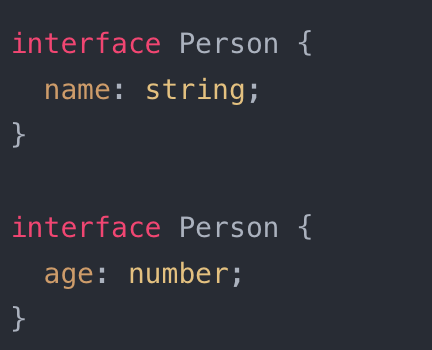
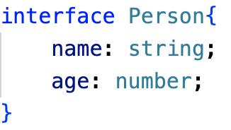
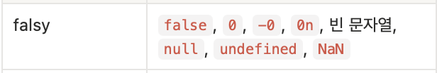

#TypeScript 핵심 문법 및 타입 시스템#

TypeScript와 정적 타입 검사

JavaScript와 비교했을 때 TypeScript는 오류를 언제, 어떤 방식으로 확인하나요?

코드가 실행되기 전에 값의 종류가 알맞은지 확인.

TypeScript는 JavaScript의 상위 집합으로 타입을 추가하면 편집기에서 잘못된 프로퍼티나 함수 사용을 더 일찍 알려주고 변수와 함수가 어떤 값을 다루는지 쉽게 확인 가능

JavaScript는 동적 타입 언어로 주로 런타임에서 오류가 발생하지만

TypeScript는 정적 타입 검사로 컴파일 타임에 오류를 미리 찾는다.

컴파일 타임 오류와 런타임 오류는 어떤 차이가 있나요?

컴파일 타임: 코드가 실행되기 전, 빌드 되는 과정

런타임: 프로그램이 실제로 실행되는 단계

컴파일 타임에 오류를 발견하게 되면 오류를 수정하기 전까지 코드가 실행되지 않게됨.

런타임 오류는 프로그램이 실행 중에 잘못된 논리나 데이터로 인해 발생하는 오류로 대부분 프로그램이 실행되는 중에 발생. 실제 코드가 실행되기 전엔 알 수 없다.

TypeScript의 타입 정보가 실행되는 JavaScript에 남지 않는 이유는 무엇일까요?

JavaScript는 동적타이핑으로 실행시에 타입이 정해지지만 TypeScript는 정적타이핑으로 타입을 미리 선언하게 된다.

TypeScript로 작성한 코드를 컴파일하게 되면 JavaScript 코드로 변환되어 타입 정보가 남지 않게 된다.

타입 추론과 타입 모델링

TypeScript가 타입을 추론하도록 두는 경우와 타입을 직접 작성하는 경우는 각각 언제 알맞을까요?

초기화된 변수를 선언할 때, 기본값이 설정된 매개 변수, 반환 값이 있는 함수의 경우 추론하게 두는게 낫지만 개발자가 잘못된 타입의 값을 사용하는 등의 실수를 미리 방지하고자 직접 작성한다.

객체와 함수의 형태를 타입으로 표현하면 어떤 실수를 미리 찾을 수 있을까요?

위와 마찬가지로 존재하지 않는 속성을 사용하거나 속성에 잘못된 타입의 값을 넣는 등의 실수를 미리 방지할 수 있다.

type과 interface는 표현 범위와 확장 방식에서 어떤 차이가 있을까요?

type

객체뿐 아닌 원시타입의 별칭, 유니언 타입도 표현 가능

&로 타입 조합 가능 → 교차타입

같은 이름으로 재선언 가능

같은 이름의 type을 여러개 정의할 시 에러

interface

주로 객체 표현(number 등의 원시타입 X)

extends로 확장

서로 호환된다면 하나로 합쳐짐(선언 병합)

유니언 타입과 타입 좁히기

여러 타입 중 하나가 될 수 있는 값을 유니언 타입으로 표현하면 어떤 장점이 있나요?

잠재적인 타입들을 열거해 놓은 타입으로 아직 어떤 타입의 값이 대입될 지 모를 때 사용

리터널 타입으로 선택지를 정할 수 있게 된다.

조건문, typeof와 판별 프로퍼티는 타입을 어떻게 좁히나요?

조건문

조건을 통해 특정 값, 타입을 확인 후 타입을 좁힌다.

typeof

원시타입을 구분할 때

현재 타입의 값을 확인한 후 타입을 좁힌다. if(typeof a === "string")

판별 프로퍼티

객체 내부가 같은 모양인지 확인 후 타입을 좁힌다.

null과 undefined가 포함된 값을 안전하게 다룰 때 옵셔널 체이닝과 널 병합 연산자는 어떤 역할을 하나요?

옵셔널 체이닝(optional chaining)

?. → 옵셔널 체이닝 연산자

연산자 앞의 값이 null 또는 undefined일 시 오류가 아닌 undefined를 반환해줌

널 병합 연산자

?? → 왼쪽 값이 null 또는 undefined일 때만 오른쪽 값을 사용.

|| → 왼쪽 값이 falsy 이면 오른쪽 값 사용

falsy

타입 안전성과 제네릭

any와 unknown은 타입 검사를 허용하는 방식이 어떻게 다른가요?

any는 타입검사를 거의 끄므로 잘못된 코드를 놓치기 쉬움 → 어떤 타입이든 할당 가능

unknown의 경우 어떤 값이든 받을 수 있지만 사용 전 타입 확인을 해야함 → 타입 좁히기를 만드시 해야함 → 더 안전

여러 타입을 받을 때 unknown과 제네릭은 각각 어떤 상황에 알맞을까요?

unknown : 어떤 타입이 들어올지 모를 때 받아서 타입 확인 후 사용할 때

제네릭 : 어느정도 정해진 타입을 받으며 타입 정보를 유지해야할 때

제네릭은 입력 타입과 출력 타입의 관계를 어떻게 유지하나요?

제네릭은 호출 시점에 타입이 결정되어 입력과 출력이 같은 타입이라는 것을 보장 → 안전

