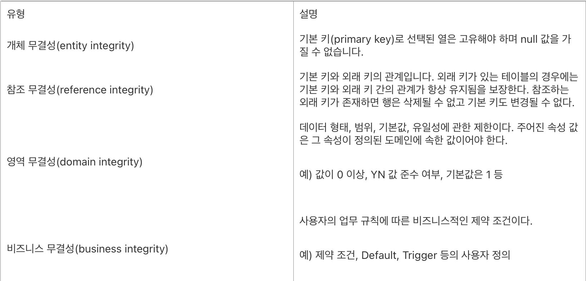
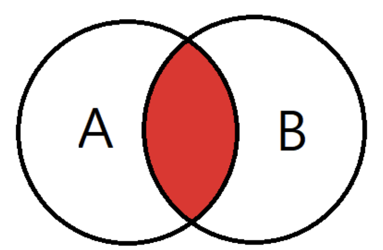
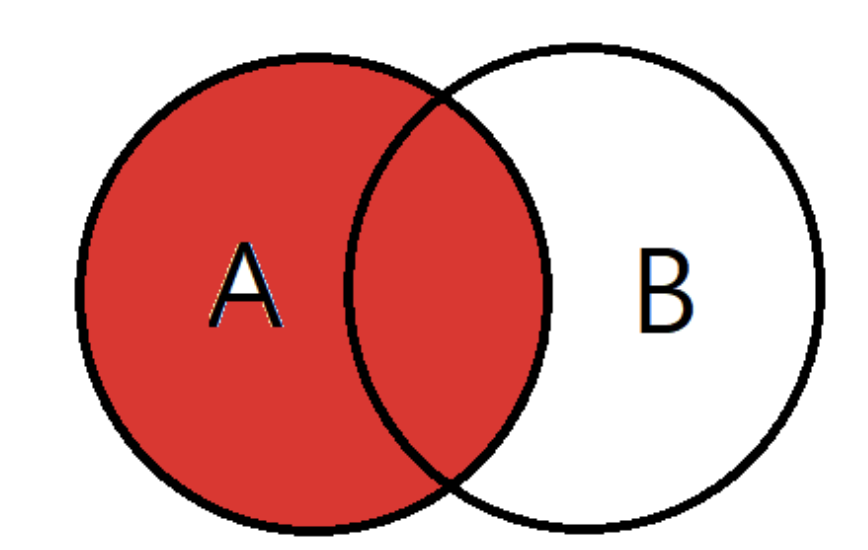
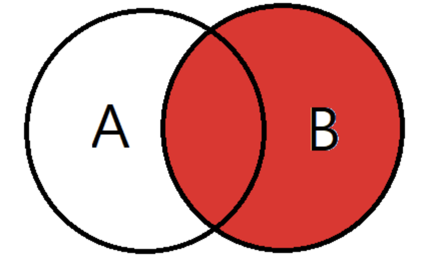
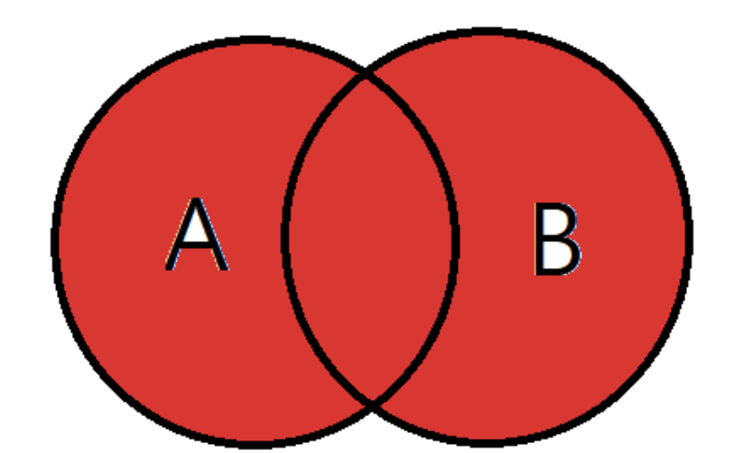
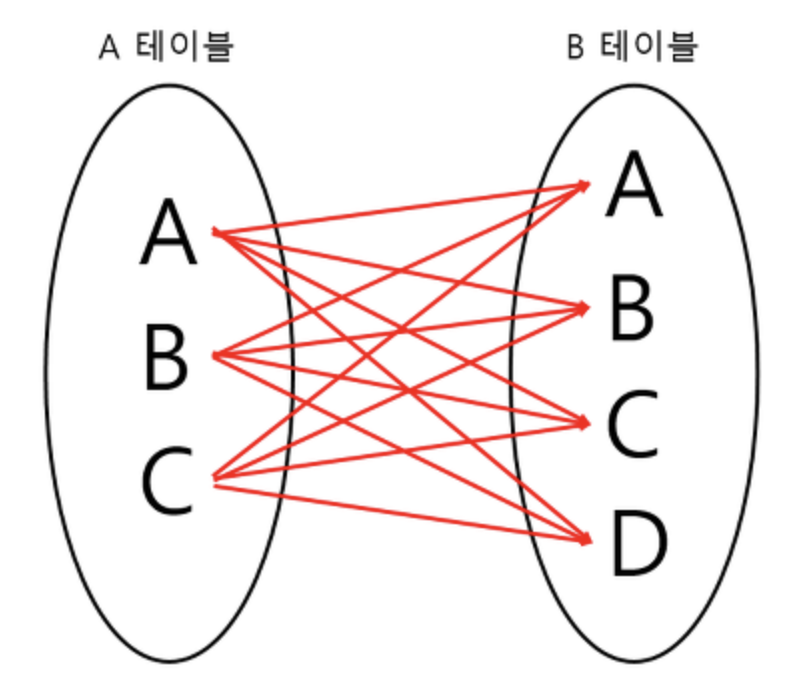
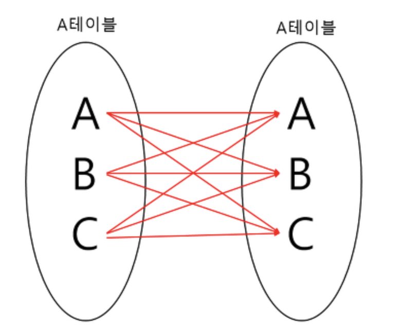

- 1. 요구사항 → SQL로 번역하기
    
    찾아보기: 화면 요구사항을 SELECT 컬럼, FROM 테이블, JOIN 관계, WHERE 조건, ORDER BY/LIMIT으로 나누는 방법을 정리해 보세요.
    
    작성 순서:  SELECT → FROM → WHERE → GROUP BY →HAVING → ORDER BY
    
    우선 SELECT 에 어떤 컬럼을 보여줄 것인지 적는다.
    
    이후 FROM에 어떤 테이블에서 가져올 지 결정
    
    WHERE에 어떤 행만 남길지 정합니다.
    
    GROUP BY에 어떤 기준으로 묶을지 결정
    
    HAVING은 묶인 결과에 조건을 지정하여 줍니다.
    
    ORDER BY에 결과를 어떤 순서로 정렬할지 결정하게 됩니다. 
    
    LIMIT은 결과에서 몇 개의 행을 제한할 것인지 정하는 구문
    
    이후 
    
    FROM → ON → JOIN → WHERE → GROUP BY → HAVING → SELECT →DISTINCT → ORDER BY 순서로 작동하게 됩니다. 
    
- 2. DDL과 DML
    
    찾아보기: CREATE TABLE이 테이블 구조를, INSERT가 행 데이터를 담당하는 이유와 ALTER TABLE과의 차이를 살펴보세요.
    
    DDL : **데이터 구조 정의어**로 데이터 베이스의 전체 골격을 구성
    
    - CREATE: 새로운 테이블을 생성
    - ALTER: 기존 테이블 구조 변경
    - DROP: 기존 테이블 삭제
    - TRUNCATE: 기존 테이블 초기화
    - RENAME: 기존 테이블 이름 변경
    
    DML : **데이터 조작어**로 데이터베이스 내부에 실제로 저장된 데이터들을 다룸
    
    - SELECT: 저장된 데이터 조회
    - INSERT: 새로운 데이터 저장
    - UPDATE: 저장된 데이터 수정
    - DELETE: 저장된 데이터 삭제
    
    INSERT와 ALTER의 차이
    
    INSERT : 테이블에 새로운 행을 더하는 것
    
    ALTER : 테이블에 새로운 컬럼을 더하는 것
    
    즉, ALTER는 테이블의 구조를 변경하는 것이고 INSERT는 행 안의 값을 변경하는 것이다.
    
- 3. PK·FK와 JOIN 조건
    
    찾아보기: PK·FK가 무엇을 보장하는지, ON 절에서 관계가 잘못 연결되면 왜 중복 행이 생기는지 확인해 보세요.
    
    PK와 FK는 **데이터의 무결성**을 보장
    
    데이터의 무결성 
    
    데이터베이스에 저장된 데이터 값과 사용자가 의도한 데이터 값의 일치
    
    데이터의 정확성, 유효성, 일관성, 신뢰성이 지켜져야 한다.
    
    주로 데이터의 연산에 제한을 두어 무결성 유지
    
    데이터 무결성 종류
    
    - 개체 무결성
    - 참조 무결성
    - 영역 무결성
    - 비즈니스 무결성
    
    
    
    **JOIN**
    
    INNER JOIN : 교집합. 기준 테이블과 JOIN 테이블의 중복된 값
    
    
    
    LEFT OUTER JOIN: 기준 테이블 + JOIN 테이블에서 중복되는 값
    
    
    
    RIGHT OUTER JOIN: 중복되는 값 + JOIN 테이블의 값
    
    
    
    FULL OUTER JOIN: 합집합. 기준 테이블과 JOIN 테이블의 모든 데이터( 
    
    
    
    CROSS JOIN: 모든 경우의 수 (카디널리티 곱)
    
    
    
    SELF JOIN : 자기자신과 자기 자신의 조인
    
    
    
    ON: 조인 조건을 지정하는 방법 (ON A.id = B.id)
    
    한 행이 원하지 않는 여러 행과 연결될 수 있다. → 중복 행이 생긴다.
    
    따라서 DINTINCT 또는 GROUP BY 를 사용하여 중복값을 제거한다.
    
    DINSINCT : unique한 행을 조회할 때 사용
    
    GROUP BY : 집계 데이터를 구할 때 사용
    
    둘이 동작 방식은 같지만 distinct는 중복 제거 후 정렬을 하지 않는다는 차이가 있다.
    
- 4. WHERE와 NULL
    
    찾아보기: WHERE 조건에서 NULL을 = 과 비교할 수 없는 이유와 IS NULL을 사용하는 이유를 알아보세요.
    
    WHERE : 행을 조건에 충족하는 행만 필터링할 때 사용 
    
    AND, OR 연산자를 통해 조건 조합 가능
    
    순차적으로 평가된다.
    
    NULL : 값이 없다.
    
    IS NULL : NULL 값을 찾을 때
    
    IS NOT NULL : NULL 이 아닌 값, 비어있지 않은 값 찾을 때
    
    즉, 값이 존재하는지를 물어보는 것
    
    NULL은 일반적인 값이 아닌 값이 없는 것을 의미하기 때문에 = 으로 비교할 수 없다.
    
    따라서 전용 문법인 IS NULL을 사용하여 비교하여야 한다.
    
- 5. ORDER BY와 일관된 정렬
    
    찾아보기: ORDER BY가 없을 때 목록 순서가 보장되지 않는 이유와 동일 값일 때의 보조 정렬 기준을 찾아보세요.
    
    ORDER BY : 조회된 데이터를 정렬
    
    숫자, 문자열, 날짜 등을 기준으로 오름차순(ASC), 내림차순(DESC)으로 정렬 가능(기본은 오름차순)
    
    데이터의 변경 없이 결과의 **보는 순서**만 바꾼다.
    
    ORDER BY가 없을 때 병렬로 출력되게 되면 출력 버퍼에 매번 다른 값이 출력되어 출력의 일관성이 유지되지 않는다. → 매번 다르게 출력된다.
    
    동일 값의 경우 후행 필드를 기준으로 정렬하게 된다.
    
    첫 정렬 값이 같을 때 보조 정렬 기준은 “,”로 뒤에 추가하여 정렬한다.
    
    보조 기준을 지정하지 않으면 동일 값일 때 순서가 보장되지 않는다.
    
- 6. LIMIT / OFFSET과 페이지네이션
    
    찾아보기: LIMIT/OFFSET이 페이지 번호 방식과 어떻게 연결되는지, 데이터가 많아질 때 어떤 한계가 있는지 살펴보세요.
    
    LIMIT : 가져올 행의 수(결과 중 처음부터 몇 개)
    
    OFFSET : 앞에서 건널 뛸 행의 수(어디서 부터) (page - 1) X 페이지 당 개수
    
    Pagination: 검색 결과를 가져올 때 데이터를 쪼개 번호를 매겨 일부만 가져오는 기법
    
    OFFSET 방식: LIMIT와 OFFSET을 사용하여 select의 결과 중 일부만 가져옴
    
    단점으로는 대량의 데이터에서 뒷부분을 조회할 때 속도가 저하된다. 또한 잦은 데이터 추가와 삭제가 있을 경우 데이터의 중복과 누락이 생길 수 있다. 
    
    CURSOR 방식: cursor가 가리키는 레코드부터 일정 개수만큼 가져옴.
    
    CURSOR 방식은 OFFSET 방식과 달리 기준점까지 뛰어넘고 이후에 필요한 부분에서 값을 가져오기 때문에 OFFSET 방식에 비해 빠르다.