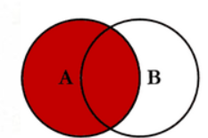

- 1. 요구사항 → SQL로 번역하기

찾아보기: 화면 요구사항을 SELECT 컬럼, FROM 테이블, JOIN 관계, WHERE 조건, ORDER BY/LIMIT으로 나누는 방법을 정리해 보세요.

### 요구 사항을 세분화하기

**무엇을 보여줄지 → 어디서 가져올지 → 어떻게 연결할지 → 어떤 것만 고를지 → 어떤 순서와 개수로 보여줄지**

    - **SELECT**: 요구 사항에서 화면에 보일 결과의 값들
    - **FROM:** 기준이 되는 테이블, 데이터가 들어있는 곳
    - **JOIN**: 다른 테이블의 데이터도 필요할 때
        - **ON**: 다른 테이블과 매핑할 때 사용할 조건
    - **WHERE**: 조회할 조건
    - **ORDER BY**: 정렬 순서
    - **LIMIT**: 가져올 행의 수

### **예시**

  <aside>
  💡

반납일이 반납 예정일보다 늦은 책의 제목과 이용자 이름을 반납일 순으로 10개만 가져오기

  </aside>

SELECT: 책의 제목과 이용자 닉네임 /  FROM: 반납 테이블 / JOIN: 이용자 테이블, 책 테이블 /
WHERE: 반납일이 반납 예정일보다 늦음 / ORDER BY: 반납일 순 / LIMIT: 10개

  ```sql
  SELECT
      b.title,
      u.nickname
  FROM rental r
  JOIN book b
      ON r.book_id = b.book_id
  JOIN users u
      ON r.user_id = u.user_id
  WHERE
      r.returned_at > r.due_at
  ORDER BY
      r.returned_at ASC
  LIMIT 10;
  ```

### **LEFT JOIN**



왼쪽 테이블의 모든 데이터를 유지하고 오른쪽 테이블에서는 왼쪽 테이블과 일치하는 데이터 값만 붙인다 일치하는게 없다면 NULL

- 2. DDL과 DML

찾아보기: CREATE TABLE이 테이블 구조를, INSERT가 행 데이터를 담당하는 이유와 ALTER TABLE과의 차이를 살펴보세요.

### DDL/DML

    - **DDL(Data Definition Language): 테이블이나 DB 구조 자체를 만들거나 바꾸는 명령어**
        - CREATE, ALTER, DROP, TRUNCATE
    - **DML(Data Manipulation Language): 테이블 안의 실제 데이터를 조회하거나 추가, 수정, 삭제하는 명령어**
        - SELECT, INSERT, UPDATE, DELETE

### CREATE vs ALTER vs INSERT

    - **CREATE**: 테이블 하나를 새로 생성하는 명령어
        - 새로운 구조를 만드는 것

        ```sql
        CREATE TABLE user (
            user_id INT,
            name VARCHAR(20)
        );
        ```

    - **ALTER**: 이미 만들어진 테이블의 구조를 수정하는 것
        - 컬럼 추가, 삭제, 타입 변경 등

        ```sql
        ALTER TABLE user
        ADD age INT;
        ```

    - **INSERT**: 테이블 안에 실제 데이터를 추가하는 것
        - 구조가 바뀌는게 아니라 행이 추가됨

        ```sql
        INSERT INTO user (user_id, name, age)
        VALUES (1, '수빈', 21);
        ```

- 3. PK·FK와 JOIN 조건

찾아보기: PK·FK가 무엇을 보장하는지, ON 절에서 관계가 잘못 연결되면 왜 중복 행이 생기는지 확인해 보세요.

### PK / FK

    - **PK:** 각 행을 **유일하게 식별**해주는 값
        - **UNIQUE**
        - **NOT NULL**
    - **FK**: 다른 테이블의 PK나 UNIQUE 값을 참조해서 **테이블 사이의 관계를 보장**
        - 존재하지 않는 값은 참조 불가

### ON절에서 중복 행이 생기는 이유

JOIN에서는 ON절을 통해 조건에 맞는 값과 매칭을 한다
이를 통해 주로 원하는 대상 값만을 걸러내는데 이 과정해서 문제가 되는 경우가 발생할 수 있다

    - **1:N 관계를 1:1 관계라고 착각한 경우**


        | book_id | title |
        | --- | --- |
        | 1 | 데미안 |
        | 2 | 어린왕자 |
        
        | rental_id | book_id | user_id |
        | --- | --- | --- |
        | 101 | 1 | 10 |
        | 102 | 1 | 20 |
        | 103 | 2 | 30 |
        
        | book_id | title | rental_id |
        | --- | --- | --- |
        | 1 | 데미안 | 101 |
        | 1 | 데미안 | 102 |
        | 2 | 어린왕자 | 103 |
    - **ON에서 아예 잘못된 컬럼을 연결한 경우**
        
        
        | book_id | title | category_id |
        | --- | --- | --- |
        | 1 | 데미안 | 2 |
        | 2 | 어린왕자 | 2 |
        
        | rental_id | book_id | user_id |
        | --- | --- | --- |
        | 101 | 1 | 2 |
        | 102 | 1 | 2 |
        | 103 | 2 | 2 |
        
        ```sql
        ON b.book_id = r.book_id -> b.category_id = r.user_id;
        ```
        
        | book | rental |
        | --- | --- |
        | 데미안 | 101 |
        | 데미안 | 102 |
        | 데미안 | 103 |
        | 어린왕자 | 101 |
        | 어린왕자 | 102 |
        | 어린왕자 | 103 |
    - **ON 조건이 부족한 경우**
        
        대여한 사용자가 그 책을 찜했는지 확인한다
        
        | rental_id | user_id | book_id |
        | --- | --- | --- |
        | 1 | 10 | 100 |
        | 2 | 10 | 200 |
        
        rental 테이블
        
        | user_id | book_id |
        | --- | --- |
        | 10 | 100 |
        | 10 | 300 |
        
        book_like 테이블
        
        여기서 user_id만 사용하여 JOIN하면
        
        | rental_id | 대여한 책 | 찜한 책 |
        | --- | --- | --- |
        | 1 | 100 | 100 |
        | 1 | 100 | 300 |
        | 2 | 200 | 100 |
        | 2 | 200 | 300 |
        
        이므로 user_id뿐만 아니라 book_id도 같이 비교해야 한다
        
        | rental_id | user_id | book_id | is_liked |
        | --- | --- | --- | --- |
        | 1 | 10 | 100 | TRUE |
        | 2 | 10 | 200 | FALSE |
- 4. WHERE와 NULL

찾아보기: WHERE 조건에서 NULL을 = 과 비교할 수 없는 이유와 IS NULL을 사용하는 이유를 알아보세요.

### NULL

    - 숫자 0과 빈 문자열과는 다름 → 값이 없는 **상태**, 입력 전 **상태**
    - 데이터가 아직 입력되지 않았거나 값을 알 수 없을 때 사용
    - NULL이 포함된 산술 연산의 결과는 보통 NULL

**NULL을 =으로 비교할 수 없는 이유**

NULL은 값을 알 수 없음을 의미하기 때문에 일반적인 비교 연산자인 = 등은 사용 불가
사용한다면 → TRUE/FALSE 가 아닌 **UNKNOWN**

**WHERE은 TRUE인 행만 조회**

→ NULL 여부를 확인할 때는

    - IS NULL → NULL인 데이터
    - IS NOT NULL → NULL이 아닌 데이터
- 5. ORDER BY와 일관된 정렬

찾아보기: ORDER BY가 없을 때 목록 순서가 보장되지 않는 이유와 동일 값일 때의 보조 정렬 기준을 찾아보세요.

### ORDER BY가 없을 때 목록 순서가 보장되지 않는 이유

    - SQL의 조회 결과는 기본적으로 **순서가 없는 집합**으로 취급됨
    - ORDER BY를 사용하지 않으면 DB가 데이터를 **어떤 순서로 가져올지 직접 결정함**
    - 이 순서는 다음 상황에 따라 달라질 수 있음
        - 어떤 **인덱스**를 사용하는지
        - 실행 계획이 어떻게 바뀌는지
        - 데이터가 추가·삭제되는지
        - DB가 데이터를 병렬로 처리하는지
    - 지금 실행했을 때 id 순서처럼 보여도 **다음 실행에서도 같은 순서라는 보장은 없음**

  ```sql
  SELECT *
  FROM book;
  ```

→ 조회되는 책의 순서는 보장되지 않음

  ```sql
  SELECT *
  FROM book
  ORDER BY book_id ASC;
  ```

→ book_id 기준 오름차순으로 순서가 보장됨

### 동일한 값이 있을 때 보조 정렬 기준

정렬 기준의 값이 같은 데이터가 여러 개라면 그 데이터들 사이의 순서는 다시 보장되지 않음

예를 들어

  ```sql
  SELECT *
  FROM rental
  ORDER BY due_at ASC;
  ```

due_at이 같은 대여 기록이 여러 개라면 그 기록들의 순서는 일정하지 않을 수 있음

그래서 **두 번째 정렬 기준**을 추가하면 됨

  ```sql
  SELECT *
  FROM rental
  ORDER BY due_at ASC, **rental_id ASC;**
  ```

    - 먼저 due_at 기준으로 정렬함
    - due_at이 같다면 rental_id 기준으로 정렬함

특히 마지막 정렬 기준으로 **PK처럼 값이 고유한 컬럼**을 넣으면 결과 순서를 확실하게 만들 수 있음

- 6. LIMIT / OFFSET과 페이지네이션

찾아보기: LIMIT/OFFSET이 페이지 번호 방식과 어떻게 연결되는지, 데이터가 많아질 때 어떤 한계가 있는지 살펴보세요.

### LIMIT / OFFSET과 페이지 번호 방식

LIMIT은 **조회할 데이터의 개수**, OFFSET은 **앞에서 건너뛸 데이터의 개수**를 지정함

    - LIMIT 10 → 최대 10개의 데이터 조회
    - OFFSET 20 → 앞의 20개 데이터를 건너뜀
    - 페이지 번호 방식에서는 페이지 번호에 따라 OFFSET을 계산해서 사용함
        - OFFSET = (페이지 번호 - 1) × 한 페이지의 데이터 개수

예를 들어 한 페이지에 10개씩 보여주는 경우

  ```
  SELECT *
  FROM review
  ORDER BY review_id DESC
  LIMIT 10 OFFSET 0;
  ```

→ 1페이지 조회

  ```
  SELECT *
  FROM review
  ORDER BY review_id DESC
  LIMIT 10 OFFSET 10;
  ```

→ 앞의 10개를 건너뛰고 다음 10개를 조회하므로 2페이지에 해당함

  ```
  SELECT *
  FROM review
  ORDER BY review_id DESC
  LIMIT 10 OFFSET 20;
  ```

→ 앞의 20개를 건너뛰고 다음 10개를 조회하므로 3페이지에 해당함

따라서 페이지 번호가 커질수록 OFFSET 값도 커지게 됨

### 데이터가 많아질 때 LIMIT / OFFSET의 한계

OFFSET 값이 커질수록 DB가 **앞쪽 데이터를 많이 확인하고 건너뛰어야 해서 성능이 떨어질 수 있음**

예를 들어

  ```
  SELECT *
  FROM review
  ORDER BY review_id DESC
  LIMIT 10 OFFSET 100000;
  ```

→ 최종적으로 필요한 데이터는 10개지만 앞의 많은 데이터를 확인한 뒤 100000개를 건너뛰어야 함

    - 데이터가 적을 때는 큰 문제가 없을 수 있음
    - 데이터가 많아지고 뒤쪽 페이지로 이동할수록 조회 비용이 커질 수 있음
    - 자주 사용하는 WHERE + ORDER BY 조건에 적절한 인덱스가 있으면 성능 개선에 도움될 수 있음
    - 하지만 OFFSET 자체가 매우 커지는 문제를 완전히 해결해주는 것은 아님

### 데이터가 추가되거나 삭제될 때 발생할 수 있는 문제

OFFSET은 데이터의 **현재 위치를 기준으로 건너뛰는 방식**이라 조회 중 데이터가 추가되거나 삭제되면 중복이나 누락이 발생할 수 있음

예를 들어

1페이지를 조회한 뒤 새로운 게시글이 맨 앞에 추가되면 기존 데이터들이 한 칸씩 뒤로 밀림

그 상태에서

  ```
  LIMIT 10 OFFSET 10
  ```

으로 2페이지를 조회하면 1페이지에서 이미 확인했던 데이터가 다시 포함될 수도 있음

반대로 중간에 데이터가 삭제되면 아직 보지 못한 데이터를 건너뛰는 경우도 생길 수 있음

따라서 데이터가 자주 변경되는 게시글이나 피드에서는 이런 문제를 고려해야 함

### 데이터가 많은 경우 사용할 수 있는 커서 기반 페이지네이션

OFFSET 대신 **마지막으로 조회한 데이터의 값을 기준으로 다음 데이터를 가져오는 방식**을 사용할 수도 있음

예를 들어 review_id = 100까지 조회했다면

  ```
  SELECT *
  FROM review
  WHERE review_id < 100
  ORDER BY review_id DESC
  LIMIT 10;
  ```

→ 100보다 작은 review_id 중 다음 10개를 바로 조회함

    - 앞의 데이터를 OFFSET만큼 건너뛸 필요가 없음
    - 데이터가 많아져도 비교적 일정한 성능을 유지하기 좋음
    - 데이터 추가로 인한 페이지 중복이나 누락 문제도 줄일 수 있음
    - 게시글 목록이나 무한 스크롤 API에서 많이 사용됨
    - 대신 10페이지로 바로 이동처럼 특정 페이지 번호로 이동하는 기능은 구현하기 어려움

따라서 **페이지 번호로 자유롭게 이동해야 하면 LIMIT / OFFSET 방식**, **데이터가 많거나 다음 목록을 계속 불러오는 방식이면 커서 기반 페이지네이션**을 고려할 수 있음