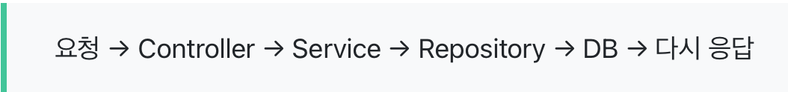
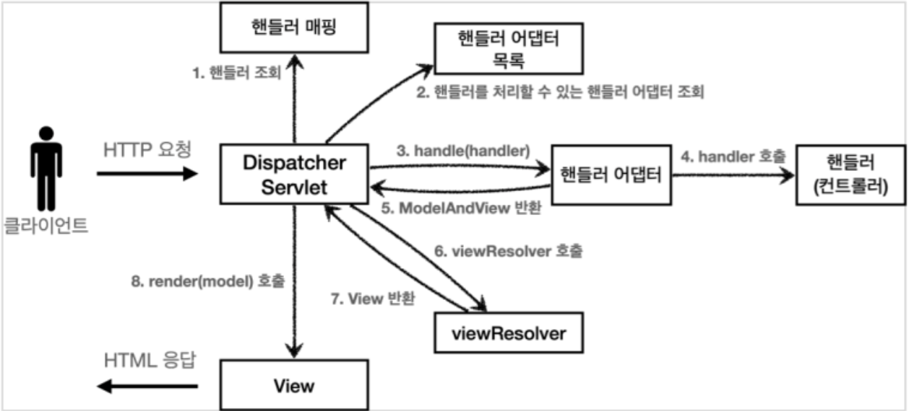
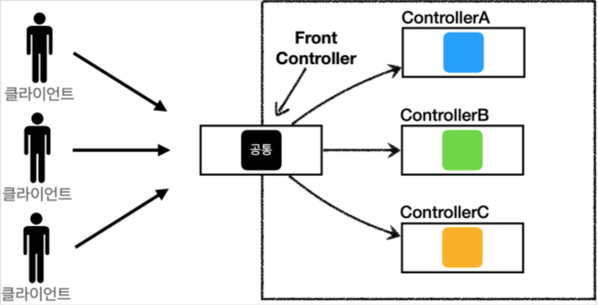
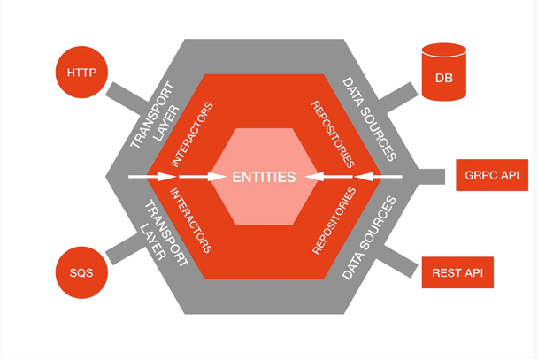
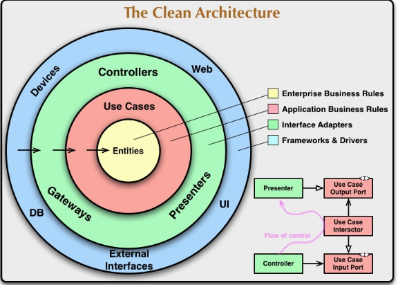
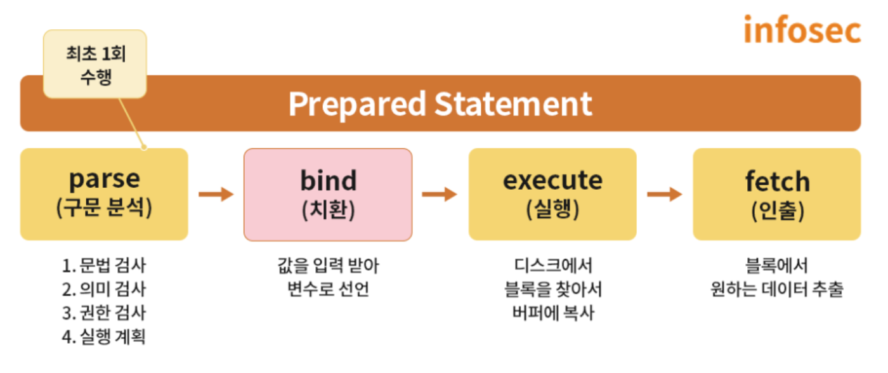
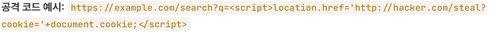
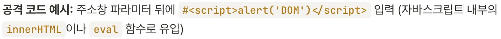
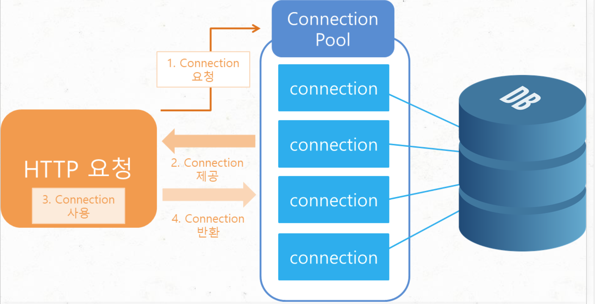
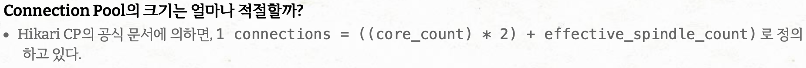

- 3계층 아키텍처 이외에 어떤 아키텍처들이 있을까?

  **3계층 아키텍처** : 플랫폼을 3계층으로 나누어 별도의 논리적/물리적 장치에 구축 및 운영하는 형태

  **Controller**

  브라우저에서 URL을 호출 시 가장 먼저 받는 곳(요청 받는 곳)

  어떤 API가 호출되었는지 판단 → URL의 값이나 Query 파라미터 꺼냄 → Service로 넘김 → Service에서 받은 결과를 그대로 응답으로 돌려줌

  “처리”보단 “연결”하는 곳

  **Service**

  실제 로직이 들어가는 곳 (로직 : 단순한 값 계산 + 비즈니스 규칙 처리)

  상태 확인, 제외, 권한에 따른 정보, 추가 데이터 조합 등 판단과 처리

  따라서 Service는 프로그램의 두뇌 역할이라 볼 수 있다

  **Repository**

  데이터베이스와 직접 연결

  조회, 저장, 삭제 등 데이터를 가져오거나 저장하는 작업(CRUD) 담당

  Repository는 **DB 작업만** 해야한다



  독립적인 유지보수와 코드 재사용성의 장점이 있다

  **스프링 MVC(Model, View, Controller)**

  애플리케이션을 개발할 때 사용하는 디자인 패턴

  model, view, controller로 구분

  **Model**

  요청사항을 처리하기 위한 작업

  처리한 작업의 결과를 응답으로 돌려준다

  **View**

  애플리케이션 화면에 보이는 리소스 제공

  View 기술 :

    - HTML 페이지 출력
    - PDF, Excel 등의 문서 형태로 출력
    - XML, JSON 등 특정 형식의 포맷으로 변환

  Controller

  클라이언트의 요청을 직접적으로 전달받는 엔드포인트. Model과 View 중간에서 상호작용

  요청 → 비즈니스 로직을 거침 → model 데이터 생성 → model 데이터를 View로 전달해준다



    1. Dispatcher Servlet에서 공통적인 내용 처리 후 어떤 컨트롤러로 보낼지 판단
    - Front Controller



      Front Controller : 클라이언트의 요청에서 공통된 부분 담당

    1. 핸들러 매핑 : 핸들러 조회 진행 → 요청된 URL에 매핑된 핸들러(컨트롤러) 조회
    2. 핸들러 어댑터 목록 : 핸들러를 실행할 수 있는 핸들러 어댑터 조회
    3. 핸들러 어댑터 : 각 방식을 수행하기 위한 핸들러 어댑터를 미리 구현해둔 후 필요한 어댑터를 사용
    4. 핸들러 실행
    5. ModelAndView 반환 : 핸들러가 반환하는 정보르 ModelAndView로 변환 및 반환
    6. viewResolver 호출 : 반환된 화면 이름을 실제 HTML 파일경로로 찾아준다
    7. View : 실행

  MVC패턴을 도입하며 UI영역과 도메인(비즈니스 로직) 영역으로 구분되어 영향을 주지 않으며 개발과 유지보수가 가능해졌다

    - 그 외

      헥사고날 아키텍처(Hexagonal Architecture)



      애플리케이션을 육각형으로 표현하여 내부엔 비즈니스 로직, 외부엔 다양한 어댑터가 위치하며 각 변은 외부와 통신을 위한 포트

      클린 아키텍처(Clean Architecture)



      비즈니스 로직을 외부 요소로부터 독립시키는 것을 목표로 동심원 형태로 구성되며 각 원은 소프트웨어의 서로 다른 영역을 나타낸다.

- SQL Injection을 포함한 대표적인 웹 보안 공격 기법

  **SQL Injection** : 클라이언트 입력값에 임의의 SQL 문을 주입해서 데이터베이스에 저장된 중요한 데이터를 가져오는 기술

  Error Based Sql Injection : 데이터베이스의 에러 메시지를 활용하여 DB의 구조와 정보를 파악 후 민감한 데이터 탈취

  Union Based Sql Injection : union 키워드를 이용하여 원래의 요청에 한 개의 쿼리를 추가해서 정보를 얻어내는 공격기법

  Blind Sql Injection : 에러 메시지나 데이터가 직접적으로 노출되지 않을 때 sql 문의 결과(참/거짓)를 이용하는 공격기법

  **방어기법**

  **Prepared Statement 사용**

  구문 분석 과정을 최초 1회만 수행하여 생성된 결과를 메모리에 저장해 필요할때마다 사용하는 방법

  사용자 입력값을 미리 변수로 선언하여 대입하기 때문에 SQL 문법에 영향을 미치는 입력이 들어와도 작용하지 못한다



  **화이트 리스트 기반 필터링**

  사전에 안전하다고 검증된 입력만 허용 후 나머지는 모두 차단

  **XSS(크로스 사이트 스크립팅)** : 사용자의 입력값을 검증이나 인코딩 없이 응답 페이지에 포함할 때 발생하는 클라이언트 타겟팅 공격

  반사형 XSS : 입력창에 주입된 악성 코드가 데이터베이스에 저장되지 않고 서버의 응답 웹 페이지를 통해 브라우저로 즉시 반사되어 실행


  저장형 XSS : 게시글, 댓글, 프로필 등 웹 서버 단의 데이터베이스나 파일 시스템에 악성 스크립트가 영구적으로 저장. 페이지를 열람하는 모든 정상 사용자의 브라우저에서 자동 실행 → 피해 규모가 가장 크다


  DOM 기반 XSS : 웹 서버의 응답이나 페이지 변조 없이 브라우저 내부에서 자체 구동되는 자바스크립트가 안전하지 않은 환경 변수 객체를 파싱하여 브라우저 소스 코드 트리 구조를 오염시킨다


  **방어 기법**

  HTML 엔티티 인코딩 : 특수문자를 &lt;, &gt; 등으로 완전 치환

  최신 가이드라인 반영 : 검증된 보안 라이브러리를 활용하여 화이트리스트 기반 태그 필터링 수행

  웹서버 설정 : 웹서버 응답 헤더에

  X-XSS-Protection: 1; mode=block →  인증 정보 탈취 방지

  Content-Security-Polict 설정 → 스크립트, 이미지 등을 불러올 수 있는지 제한

  중요 인증 쿠키에 HttpOnly 속성 활성화 → 세션 쿠키, 토큰 탈취 위험 방지

  **CSRF(크로스 사이트 요청 위조)** : 로그인 되어있는 사용자의 브라우저를 이용하여 공격자가 의도한 데이터 변경 요청을 강제 송출하는 권한 도용 공격 기법

  브라우저가 특정 도메인으로 HTTP 요청을 보낼 때, 해당 사이트용 세션 쿠키를 헤더에 자동으로 실어서 전송하는데 이 특성을 이용해 사용자가 악성 스크립트가 숨겨진 위장 페이지나 게시글을 읽도록 유도

  **방어 기법**

  CSRF 토큰 동작 원리 : 중요 입력 폼 화면을 요청시 추측 불가능한 무작위 암호학적 난수를 생성하여 hidden 필드로 주입하여 응답

  검증 매커니즘 : 사용자가 폼 데이터 전송시 서버는 세션에 저장된 토큰값과 날아온 토큰 값의 일치 검증

  **SSRF(서버 사이드 요청 위조) :** 공격자가 방화벽 정책에 막혀 접근할 수 없는 자원을 보안 경계선 전면에 노출된 웹 서버를 프록시 허브로 악용하여 대리 공격하게 하는 기법

  이미지URL 입력란에 정상 주소 대신 내부 사설 루프백 주소나 사설 관리자 주소 주입 → 웹 서버가 해당 웹 주소로 직접 접속하여 이미지, RSS피드 , 외부 API 자원을 다운로드하여 파싱하게 된다

  **방어 기법**

  입력한 URL에 대한 화이트 리스트 접근 통제 구현

  웹 서버 자체의 아웃바운드 방화벽 규칙 수립 → 지정된 외부 도메인 외의 사설 대역으로 요청이 나가는 것을 네트워크 레벨에서 DROP 정책으로 격리

- 커넥션 풀(Connection Pool)이란?

  Connection : DB를 사용하기 위해 DB와 애플리케이션 간 통신을 할 수 있는 수단(DB 연결 객체)

  DB를 연결할 때마다 Connection 객체 생성시 네트워크 비용, 리소스 사용, 비용적 측면에서 좋지 않다 → Connection pool

  커넥션 풀 : 웹 컨테이너가 실행되면서 일정량의 Connection을 미리 만들어서 pool에 저장했다가 클라이언트 요청이 오면 Connection 객체를 빌려주고 임무가 완료되면 반납받아서 pool에 저장하는 기법

  → 데이터베이스 연결이 필요할 때 연결을 재사용할 수 있도록 관리되는 DB연결의 **캐시**


  동시 접속자가 많을 시 Connection은 한정되어있어 쓸 수 있는 Connection이 반납될 때까지 기다려야한다. 그렇다고 Connection을 너무 많이 생성하게 되면 메모리를 많이 차지하게 된다. → 적정량이 중요하다


  **종류**

  commons-dbcp : 아파치에서 제공하는 커넥션 풀 라이브러리

  tomcat-jdbc-pool : tomcat에 내장된 Apache Commons 라이브러리 기반

  HikariCP : 스프링 부트 2.0부터 기본 JDBC 커넥션 풀

  -zero-overhead : 간접적인 추가 처리 시간 및 메모리 사용 최소화

  장점

    - 성능 향상 : 응답 시간 단축, 애플리케이션 성능 향상
    - 자원 관리 : 연결을 생성하고 유지하는데 필요한 자원 최적화
    - 동시성 관리 : 동시에 여러 요청 처리 가능 → 다수의 사용자가 접속해도 안정적
    - 연결 풀링 : 연결의 개수 제한, 초과할 시 대기하도록 하여 DB 서버 과부하 방지
    - 커넥션 오버헤드 감소 : 반복적인 연결/해제 작업에 따른 오버헤드 감소

- Raw SQL vs ORM

  **Raw SQL(Native SQL)** : 가장 기본적이고 낮은 수준의 데이터베이스 상호 작용 형태

  장점

  직접적이고 빠름 : ORM 번역의 오버헤드가 없다

  복잡한 쿼리 작성 가능

  많은 기능 제공 → 필요에 따른 최적화 가능

  다른 지식 없이 Python, SQL에 대해서만 알아도 된다.

  단점

  SQL Injections: 안전하지 않음

  오타 감지 안됨

  다른 데이터베이스 엔진으로 전환 시 쿼리 변경해야한다

  유지보수가 어려움

  **ORM(Object-Relational Mapper)** : 각 데이터베이스 테이블에 대해 object를 만든다(객체지향적 사고방식이랑 연관이 있다)

  →언어 고유의 표현이 존재하게돼 자동 완선 및 구문 강조 작업 제공 가능

  장점

    - 프로그래밍 생산성 향상 : 쓸데 없는 코드(선언문, 콜백함수, 종료 등)가 사라짐 → 가독성, 생산성 향상
    - 눈에 잘 띔 : 코드 간결
    - DB 쿼리 의존성 감소 : 특정 DB에 종속적이지 않다 → Object에만 집중 가능

  단점

    - 수정이 어려움 : SQL보다 자세하기 않아서 수정이 상대적 어려움
    - 복잡한 쿼리작성 : ORM이 지정한 명령만 가능
    - 느림 : DB에 직접 명령을 내리는 것이 아니라 Raw Query에 비해 느림

  단순함, 직접적인, 정확도, 효율성 등 성능이 중요하면 Raw SQL

  유지보수, 안전성이 중요하며 성능을 어느정도 포기할 수 있다면 ORM이 좋다


- INSERT 외에 데이터를 다루는 핵심 SQL 문법

  DML(Data Manipulatioin Language - 데이터 조작어)

  테이블 내의 레코드를 조회, 추가, 수정, 삭제할 때 사용하는 명령어

  SELECT : 데이터 조회

    ```jsx
    SELECT title FROM movies WHERE 'Iron Man';
    ```

  INSERT : 새로운 행 추가

    ```jsx
    INSERT INTO movies(title) VALUES ('Super Man');
    ```

  UPDATE : 기존 데이터의 값 수정

    ```jsx
    SELECT title FROM movies WHERE 'Iron Man';
    ```

  DELETE : 특정 데이터 행 삭제

    ```jsx
    DELETE FROM movies
    WHERE title = 'super man';
    ```

  이를 “CRUD”라고 부른다.