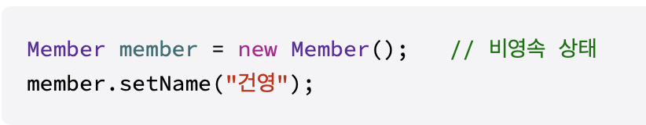
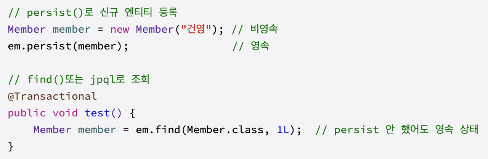
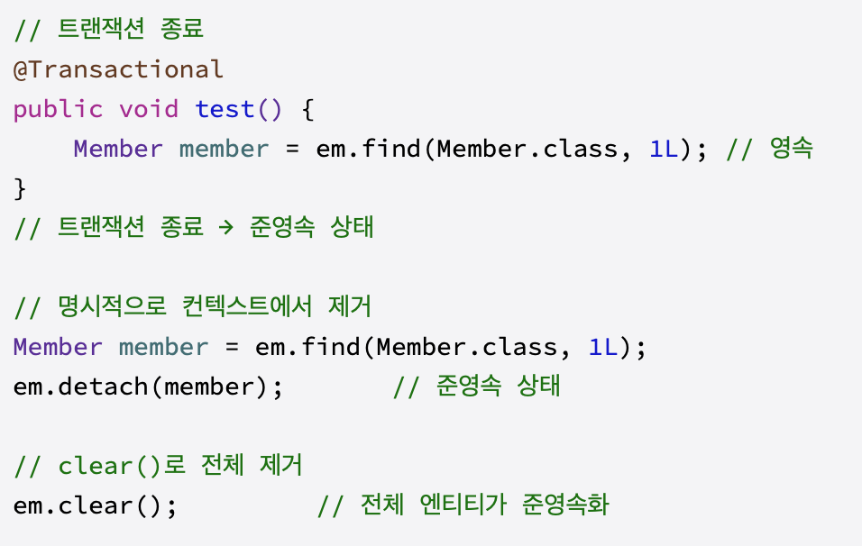
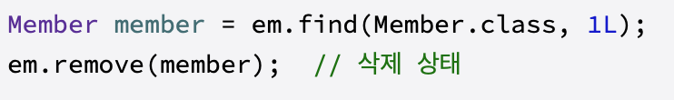
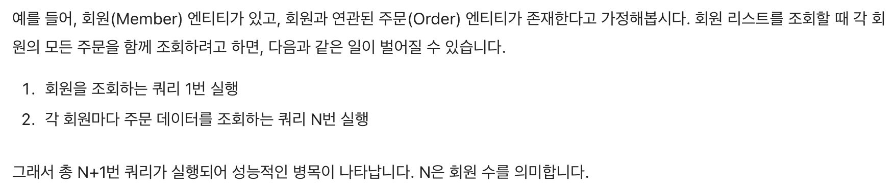

- **JPA / Hibernate와 TypeORM** — ORM과 구현체·라이브러리의 역할은 어떻게 다른가?
  - 

        ORM : 객체와 DB 테이블을 연결하는 개념
        
        JPA : Java ORM의 표준 명세. Entity를 어떻게 만들고 관계 표현을 어떻게 할지에 대한 규칙은 정하지만 직접 동작하진 않는다.
        
        Hibernate : JPA 규칙을 실제로 구현한 Java ORM 구현체. Entity를 보고 sql을 만들고 db와 통신
        
        TypeORM : TypeScript/Node.js에서 사용하는 ORM 라이브러리. 
        
        즉, JPA는 규칙, Hibernate는 규칙을 수행하는 엔진, JPA는 Repository 사용을 편하게 하는 도구, ORM은 이 기능들을 한 라이브러리로 제공한다

- **Entity Lifecycle과 Persistence Context** — 엔티티를 저장할 때 즉시 SQL이 실행되지 않을 수 있는 이유는 무엇인가?
  - 

        Entity : 테이블과 대응하는 하나의 클래스
        
        영속성 : 데이터가 객체가 프로그램 종류 후에도 사라지지 않고 지속되는 특성
        
        **영속성 컨텍스트** : Entity를 영구 저장하는 환경
        
        Entity Manager를 통해서 접근 가능하다.
        
        DB에서 읽어온 객체, Entity Manager를 통해 조회, 저장한 객체를 저장하고 있는 메모리 공간
        
        영속 객체를 보관하고있어 commit 시점에 컨텍스트에 있는 객체와 프로그램 사용한 객체의 변경이 발생한 경우 변경 내용을 db에 반영한다
        
        엔티티를 식별자 값으로 구분되므로 식별자 값이 있어야 한다
        
        **Entity Lifecycle**
        
        비영속(Transient): 영속성 컨텍스트와 전혀 관계가 없는 상태
        
        JPA가 아직 모르는 관리되지 않는 상태

        영속(Persistent) : 영속성 컨텍스트에 저장된 상태
        
        EntityManager에 의해 관리되는 상태

        준영속(Detached) : 영속성 컨텍스트에 저장되었다가 분리된 상태
        
        영속상태였다가 이젠 영속성 컨텍스트가 관리하지 않는 상태

        삭제(Removed) : 삭제된 상태

        JPA는 엔티티를 영속성 컨텍스트에서 먼저 관리하여 바로 SQL을 실행하지 않을 수 있다.

- **DTO와 API Contract** — Entity를 그대로 응답하면 어떤 문제가 생길까?
  - 

        DTO(Data Transfer Object) : 데이터 전송 객체 : 프로세스 간에 데이터를 전달하는 객체
        
        복잡한 로직이 없는 순수하게 전달하고 싶은 데이터만 있다.
        
        API Contract : API 인터페이스에 대해 형식적으로 합의된 명세(규칙)
        
        Entity를 그대로 응답하면 DB구조가 API응답 형식과 강하게 묶인다.
        
        DB 컬럼명이 그대로 외부에 노출
        
        비밀번호 등의 필드가 노출
        
        DB구조나 Entity 필드 변경 시 프론트엔드 응답도 바뀜 등의 문제로 Entity는 DB 매핑용으로 유지하고 API응답은 따로 만들어 필요한 값과 형식만 전달한다.

- **Validation** — 요청 검증을 Controller 단에서 수행해야 하는 이유는 무엇인가?
  - 

        Validation(유효성 검사) : 클라이언트가 서버로 보낸 데이터가 보낸 올바른 형식과 규칙에 맞는지 서버 측에서 확인하는 과정
        
        Validation을 해야하는 이유
        
        잘못된 데이터가 서비스 레이어까지 도달
        
        빈 문자열 또는 null이 DB에 저장
        
        NullpointertException 발생 가능
        
        보안 취약점
        
        비정상적 데이터 전송
        
        SQL Injection, XSS 등의 공격에 노출
        
        데이터 무결성 훼손
        
        형식에 맞지 않는 값 전송
        
        긴 문자열로 인한 DB 에러
        
        Controller는 외부 요청이 처음으로 들어오는 경계라서 잘못된 데이터를 막기에 좋다.

- **N+1 Query** — 관계 데이터를 함께 조회할 때 쿼리가 예상보다 많이 실행되는 이유는 무엇인가?
  - 

        N+1 문제란
        
        데이터베이스를 연동하는 애플리케이션에서 자주 발생하는 성능 이슈 중 하나로, 주로 연관된 엔티티를 조회할 때 불필요한 추가 쿼리가 다수 발생하는 상황

        즉, 연관 엔티티를 조회할 때 목록을 가져오는 1번의 쿼리 뒤에, 각 항목의 연관 데이터를 조회하는 쿼리가 N번 추가로 실행되기 때문에 발생하게 된다.
        
        해결방법
        
        Fetch Join : fetch join을 사용하면 부모와 자식 엔티티를 한 번의 조인 쿼리로 가져올 수 있다.
        
        EntityGraph : 특정 연관관계 조회 시 함계 로딩하여 쿼리 수준에서 fetch 전략을 동적으로 변경 가능
        
        Batch Size 조절 : 로딩 시 여러 건을 한 번에 묶어서 쿼리 보내므로 쿼리 횟수를 줄여준다
        
        DTO 직접 조회 : DTO 생성자 표현식을 사용해 join 된 쿼리 결과를 객체로 직접 받는다.

- **Migration과 synchronize** — 운영 환경에서 자동 스키마 변경이 위험한 이유는 무엇인가?
  - 

        Migration : 운영환경으로부터 더 낫다고 여겨지는 다른 운영환경으로 옮겨가는 과정
        
        데이터 마이그레이션 : 데이터베이스 또는 데이터 저장소에서 데이터를 다른 위치로 이동하는 프로세스
        
        소프트웨어 마이그레이션 : 기존의 소프트웨어 시스템을 새로운 버전이나 다른 플랫폼으로 이전하는 프로세스
        
        시스템 마이그레이션 : 기존의 하드웨어나 운영 체제를 새로운 하드웨어나 운영 체제로 이전하는 프로세스
        
        인프라스트럭처 마이그레이션 : 네트워크, 서버, 스토리지 등의 it인프라를 다른 위치로 이동하는 프로세스
        
        synchronize : 동기화 : 여러 프로세스나 스레드가 동시에 공유자원에 접근하려할 때 데이터의 일관성을 보장하기 위해 실행 순서를 제어하는 기법
        
        deadlock : 교착상태 : 잘못된 자원 관리로 인하여 둘 이상의 프로세스 또는 스레드들이 아무것도 진행하지 않는 상태. **서로 영원히 대기하는 상태**
        
        운영 환경에서 자동 스키마 변경을 허용하면 애플리케이션 실행만으로 테이블, 컬럼이 수정되거나 삭제되는 문제가 생길 수 있다.