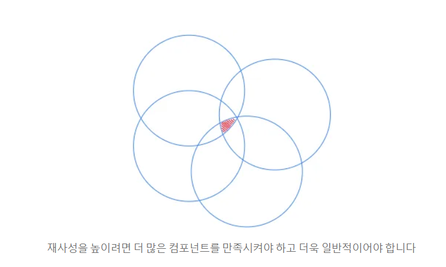

# Frontend Chapter02

## 키워드 정리

- React 컴포넌트와 JSX
    - JSX는 HTML과 어떤 점이 다르며 React 컴포넌트 안에서 어떤 역할을 하나요?
        
        
        | 구분 | HTML | JSX(React) |
        | --- | --- | --- |
        | 실행 환경 | 브라우저가 직접 해석 | JavaScript 엔진이 실행 |
        | 파일 명 | .html 파일 | .js / .jsx 파일 |
        | 문법 기반 | 마크업 언어 | JavaScript 확장 문법 |
        | 동적 표현 | 제한적 | JavaScript 표현식 사용 가능 |
        | 이벤트 처리 | 문자열 기반 | 함수 기반 |
        - 개발자가 현재 데이터에 맞는 화면의 모습을 JSX로 작성 → (Vite 같은 빌드 도구가 JSX를 JavaScript로 바꿈) → React는 컴포넌트가 반환한 JSX를 읽고 브라우저 화면에 반영
            - HTML : 데이터 값을 바꾸려면 DOM 에 직접 접근(JS)하여 수정해야 함
            - JSX : 중괄호 { }를 통해 변수, 함수 호출, 산술 연산 등을 즉시 렌더링하여 반영함.
        - 문법 및 구조
            - CamelCase 사용
            - 여러 요소는 하나의 부모 요소로 감싼다
                
                ```tsx
                function MovieList() {
                  return (
                //React의 JSX 문법에서는 컴포넌트가 반드시 하나의 부모 요소(Single Root Element)만 반환해야 합니다.
                    <> //이렇게 감싸줘야한다.
                    <MovieCard />
                    <MovieCard />
                    </>
                  );
                }
                ```
                
                - JSX는 겉보기엔 HTML처럼 생겼지만, 내부적으로는 자바스크립트 함수 호출로 변환되기 때문에 발생하는 규칙입니다. - 리턴값이 하나인 것과 동일
                
                ```tsx
                // 실제 자바스크립트 변환 모습
                return React.createElement(
                  React.Fragment,
                  null,
                  React.createElement(MovieCard, null),
                  React.createElement(MovieCard, null)
                );
                ```
                
            - 모든 태그는 닫아야한다
    - 하나의 화면을 여러 컴포넌트로 나누면 어떤 장점이 있으며, 분리 기준은 어떻게 정할 수 있을까요?
        - 컴포넌트는 React UI를 이루는 기본 단위임
        - 장점: **재사용성 향상**, 유지보수 용이성, 코드 가독성 증가, 독립적 테스트 가능 …
        - 분리 기준: 반복해서 사용하는 UI, 한 가지 역할이 분명한 UI, 코드가 길어져 따로 읽고 싶은 부분을 컴포넌트로 나눌 수 있어요.
            - 재사용 가능한 컴포넌트 → 일반적 == 보편적이다
                - Q. 다른 컴포넌트가 가져가서 사용할 수 있도록 보편적인 속성을 갖고 있는가?
                → 재사용하려는 컴포넌트에는 정말 공통적인 것들만 남겨두고 사용하는 컴포넌트의 고유한 것은 속성으로 전달하자
                    
                    
                    
            - 단일 책임 원칙 (Single Responibility Principle)
                - 각 컴포넌트는 하나의 기능에만 집중하도록 설계해야 한다. 여러 기능을 수행하거나 여러 역할을 가지고 있으면 안된다. 이를 통해 유지보수가 쉽고 재사용성이 높아진다.
                - 여러 기능이 필요하다면 각각의 역할을 하는 것들을 하나의 컴포넌트를 구현하고 조합한다.
            - headless 기반의 추상화
                - UI(스타일링)을 제외하고, 상태나 데이터와 관련된 부분은 따로 다루는 패턴이다.
                - 즉 컴포넌트는 상태를 가지는 컴포넌트와 상태를 가지지 않는 컴포넌트로 나뉜다. 상태를 가지는 컴포넌트는 state를 관리하므로 비즈니스 로직과 상태 업데이트 코드를 포함한다.
    - 조건부 렌더링과 목록 렌더링은 데이터에 따라 보여 줄 컴포넌트를 어떻게 결정하나요?
        - **삼항 연산자 (`Condition ? ComponentA : ComponentB`)**:
            - 데이터 조건에 따라 두 가지 상반된 UI 중 하나를 반드시 선택해야 할 때 사용합니다.
            - 예: 데이터 존재 여부에 따른 빈 상태 화면 분기
                
                ```tsx
                {movies.length === 0 ? (
                  <EmptyView message="등록된 영화가 없습니다." />
                ) : (
                  <MovieList movies={movies} />
                )}
                ```
                
        - **`Array.prototype.map()`을 통한 1:1 매핑**:
            - 배열의 길이만큼 순회하며 각 아이템 데이터를 props로 자식 컴포넌트에 전달합니다.
            - 데이터 배열의 크기(N개)에 맞춰 N개의 컴포넌트 인스턴스가 생성됩니다.
                
                ```tsx
                <ul>
                  {movies.map((movie) => (
                    <MovieCard
                      key={movie.id}
                      movie={movie}
                      onToggleBookmark={handleToggleBookmark}
                    />
                  ))}
                </ul>
                ```
                
        - **`key`를 통한 요소 식별 및 DOM 조작 결정**:
            - React는 렌더링할 컴포넌트를 결정할 때 고유 식별자인 `key`를 기준으로 이전 가상 DOM과 새 가상 DOM을 비교합니다.
            - 배열 데이터의 순서가 변경되거나 항목이 추가/삭제될 때, 전체 목록을 다시 그리는 대신 **어떤 컴포넌트를 유지하고, 어떤 컴포넌트를 새로 생성하거나 제거할지** `key`를 기준으로 정확하게 판별합니다.
- props와 단방향 데이터 흐름
    - 부모와 자식 컴포넌트 사이에서 props는 어떤 역할을 하나요?
        - props는 부모 컴포넌트가 자식 컴포넌트를 사용할 때 전달하는 입력값 (읽기 전용 객체)
        - 컴포넌트 함수는 전달받은 props 객체를 읽어 서로 다른 화면을 만들어요. 데이터는 부모에서 자식 방향으로 내려가며, 자식은 전달받은 props를 직접 바꾸지 않아요.
    - 데이터가 부모에서 자식으로만 흐르면 화면의 변화를 추적하는 데 어떤 도움이 되나요?
        - React의 데이터는 기본적으로 부모에서 자식으로 내려가요. 이를 단방향 데이터 흐름이라고 해요. 값이 어디에서 왔는지 위쪽으로 따라갈 수 있어 화면의 동작을 찾기 쉬워요.
        - 자식 컴포넌트 안에서 `title = "다른 영화"`처럼 props를 직접 바꾸지 않아요. 자식이 다른 값을 보여 줘야 한다면 부모가 새로운 props를 전달해야 해요.
    - props에 TypeScript 타입을 붙이면 컴포넌트를 잘못 사용하는 실수를 어떻게 찾을 수 있나요?
        - TypeScript 타입을 Props에 정의하면, 코드를 브라우저에서 실행(런타임)해 보기 전에 에디터 작성 시점과 빌드 시점(컴파일 타임)에 실수를 즉시 잡아낼 수 있습니다.
        - 필수 Props 누락 감지, 잘못된 데이터 타입 전달 방지, 오타 및 존재하지 않는 Props 전달 방지 …
        - 구조분해할당과 일반 방식
            
            ```tsx
            function MovieCard(props: MovieCardProps) {
              // props 객체 안의 값을 꺼내기 위해 매번 'props.'을 붙여야 함
              return (
                <article>
                  <h2>{props.title}</h2>
                  <p>{props.releaseDate}</p>
                  <p>{props.isBookmarked ? "북마크됨" : "북마크 안 됨"}</p>
                </article>
              );
            }
            ```
            
            ```tsx
            function MovieCard({ title, releaseDate, isBookmarked }: MovieCardProps) {
              // 'props.' 없이 변수 이름만 직접 사용
              return (
                <article>
                  <h2>{title}</h2>
                  <p>{releaseDate}</p>
                  <p>{isBookmarked ? "북마크됨" : "북마크 안 됨"}</p>
                </article>
              );
            }
            ```
            
- 상태와 리렌더링
    - 일반 변수와 state(상태)는 값이 바뀐 뒤 화면을 다시 보여 주는 방식이 어떻게 다른가요?
        - 일반 변수의 값을 바꿔도 React는 값이 바뀌었는지 알지 못한다.
        - 컴포넌트를 다시 실행(리렌더링)하지 않으므로 브라우저 화면에는 여전히 이전 값이 그대로 남아 있음
        - 다른 이유로 컴포넌트가 리렌더링되면 함수가 처음부터 다시 실행되어 변수가 초기값으로 리셋됩니다.
        - 
        - React는 컴포넌트 함수를 다시 호출하여 가상 DOM을 비교(Diffing)한 뒤, **달라진 부분만 실제 브라우저 DOM에 즉각 반영**합니다. 리렌더링 후에도 React 메모리에 상태 값이 안전하게 보존됩니다.
    - React에서 원본 상태를 직접 수정하지 않고 새로운 값으로 업데이트해야 하는 이유는 무엇일까요?
        - React는 성능을 위해 상태 변경 여부를 객체의 세부 내용까지 일일이 뒤져보지 않고, 참조 주소(메모리 주소)가 달라졌는지만 비교(`Object.is` 얕은 비교)합니다.
        - **직접 수정 시 문제 (`movie.isBookmarked = true`)**
            - 객체 내부의 속성은 바뀌었지만, 객체 자체의 **메모리 주소는 이전과 동일**합니다.
            - React는 "주소가 같으니 데이터가 안 바뀌었네?"라고 판단하여 **리렌더링을 건너뛰거나 화면을 제때 갱신하지 않는 버그**가 발생합니다.
        - **새 값으로 업데이트 시 (`{ ...movie, isBookmarked: true }`)**
            - 기존 객체를 복사하여 새로운 메모리 주소를 가진 객체를 만듭니다.
            - React가 주소 변경을 단 한 번의 연산으로 즉시 감지하여 빠르고 정확하게 화면을 갱신할 수 있습니다.
            - 과거 상태와 현재 상태가 분리되므로 디버깅(타임머신 디버깅), Undo/Redo 기능 구현, `React.memo` 최적화가 가능해집니다.
    - 이전 상태로 다음 상태를 계산할 때 업데이터 함수를 사용하는 이유는 무엇일까요?
        - React는 한 이벤트 핸들러 안에서 상태 변경이 여러 번 일어나면 이를 모아서 한 번에 처리(Batch)합니다.
            
            ```tsx
            function handleClick() {
              // 현재 count가 0일 때
              setCount(count + 1); // setCount(0 + 1) -> 1 요청
              setCount(count + 1); // 여전히 이전 렌더 시점의 count(0) 참조 -> setCount(0 + 1) -> 1 요청
              setCount(count + 1); // setCount(0 + 1) -> 1 요청
            }
            // 결과: 3번 실행했지만 count는 3이 아니라 1이 됨
            ```
            
            함수가 실행되는 시점의 `count` 스냅샷(0)만을 기억하고 있기 때문에 계산이 덮어씌워집니다.
            
        - 업데이트 함수 사용시
        
        ```tsx
        function handleClick() {
          setCount((prev) => prev + 1); // 큐에 등록: 0 -> 1
          setCount((prev) => prev + 1); // 앞의 계산 결과(1)를 받음: 1 -> 2
          setCount((prev) => prev + 1); // 앞의 계산 결과(2)를 받음: 2 -> 3
        }
        // 결과: 정확히 3이 반영됨
        ```
        
        - React 내부의 업데이트 대기 큐(Queue)에 계산 함수를 등록해 둡니다.
        - React가 큐를 차례대로 실행하면서 **직전 업데이트 결과의 가장 최신 값(`prev`)을 다음 함수의 인자로 확실하게 보장**해주므로, 연속 클릭이나 비동기 작업 중에도 상태 누락 없이 정확한 계산이 이루어집니다.
- 상태 공유와 Context
    - 여러 컴포넌트가 같은 상태를 사용해야 할 때 상태를 어느 컴포넌트에 두는 것이 좋을까요?
        - **상태의 위치**: 두 개 이상의 컴포넌트가 같은 데이터에 반응해야 한다면, 상태는 항상 **그 둘을 포괄하는 가장 가까운 공통 부모**에 둡니다.
        - **데이터 흐름 (위 → 아래)**: 부모는 자식에게 `props`로 상태 값을 전달합니다.
        - **이벤트 흐름 (아래 → 위)**: 자식은 스스로 상태를 바꿀 수 없으므로, 부모가 건네준 이벤트 콜백 함수(`onToggle`)를 실행하여 부모에게 "상태를 바꿔달라"고 신호를 보냅니다.
        - **Single Source of Truth(SSoT)**: 동일한 데이터가 여러 곳에 흩어져 불일치가 일어나는 버그를 원천 차단합니다.
    - props 전달, 상태 끌어올리기와 Context는 각각 어떤 상황에 알맞을까요?
        - props 전달: 가까운 컴포넌트 한두 개에 값을 전달한다면 props를 먼저 사용해요. 어떤 값이 어디에서 왔는지 코드만 보고 쉽게 알 수 있어요.
        - Context: 테마, 로그인 사용자, 언어처럼 같은 값을 멀리 떨어진 여러 컴포넌트가 필요로 할 때 Context를 고려해요. Context를 사용하기 전에 컴포넌트 구성이나 상태 위치를 더 단순하게 바꿀 수 있는지도 확인해요.
    - 모든 값을 Context로 전달하면 어떤 문제가 생길 수 있을까요?
        - 같은 값을 여러 단계 아래의 컴포넌트가 모두 필요로 하면 중간 컴포넌트가 사용하지 않는 props까지 계속 전달해야 할 수 있어요. 이를 **props drilling(프롭 드릴링)**이라고 불러요.
        - 불필요한 전체 리렌더링 (성능 저하) : Context의 `value` 객체에 포함된 값 중 단 하나만 변경되어도, 해당 Context를 구독(`useContext` / `use`)하고 있는 모든 컴포넌트가 강제로 다시 렌더링됩니다.
        - 데이터 흐름 추적의 어려움