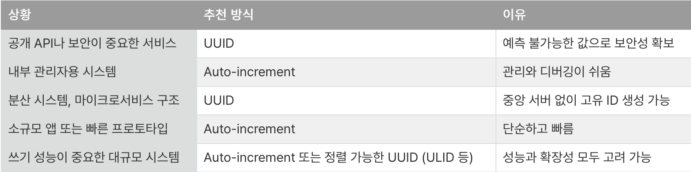
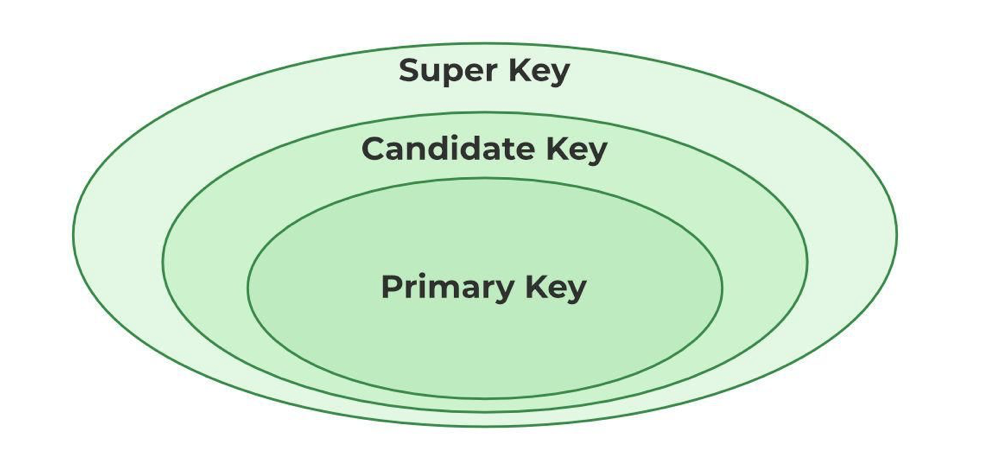
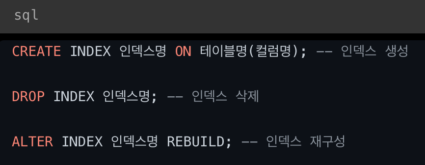

#요구사항을 데이터로 바꾸기#

- PK, FK란?

  Primary Key(기본키) : 특정 데이터를 식별하기 위한 값

    - 중복, NULL X
    - Auto Increment : 숫자가 자동으로 1씩 증가(순서 느낌)
        - 성능 최적화 : 연속된 정수 값으로 구성된 PK는 인덱싱 및 조회 성능에 좋음.
        - 고유성이 보장된다. (중복X) (전역 고유성은 보장되지 않음)
        - ID를 통해 데이터 구조 유추 가능 → 보안에 안좋음
    - UUID : 랜덤값 (128비트, 하이픈 포함 36자 문자열)
        - 전 세계적으로 고유한 값을 가지게 됨 → 충돌 위험 매우 적음 → 복제, 백업에 좋음
        - 중앙 관리 필요X
        - 예측 불가 → 보안에 좋음
        - 예측 불가 → 보안에 좋음
        - 크기, 성능, 가독성은 안좋음

  

  Foreign Key(외래키) : 다른 테이블의 데이터와 관계를 연결하기 위한 키

    - 다른 테이블에 있는 기본 키를 참조하여 사용할 때
    - FK가 PK가 될 순 없음 → 외래 키가 기본 키가 된다면 테이블을 합쳐야 함
    - FK가 PK의 일부가 될 순 있음
    - 이 외

      Super Key(슈퍼키): 각 데이터를 유일하게 식별할 수 있는 속성

        - 학번, 주민등록번호 등 유일하게 식별할 수 있는 속성
        - Super Key를 포함하면 다른 어떤 속성을 포함하여도 슈퍼키라 할 수 있음
        - 그럼 PK와 다른 점은? Super Key는 유일성만 만족. PK는 최소성까지 만족한 키

      Candidate Key(후보키) : Super Key들 중 최소한의 속성으로 구분 가능한 키

        - 유일성 + 최소성 → PK로 선택 될 자격이 되는 키

      Alternate Key(대체키) : 후보키들 중 PK로 선택되지 않은 키

      

- ERD란?

  Entity Relationship Diagram

  DB 구조를 한눈에 파악하기 위한 테이블(데이터) 간의 관계를 그림으로 설명해주는 다이어그램

    - Entity

      테이블을 구성하는 구성성분(사람, 사건, 장소, 오브젝트 등)

      DB에서의 테이블 곧 Entity

      테이블의 각 필드들이 Entity 속성이다

      Weak Entity : 다른 Entity에 의존적인 Entity → 자식의 속성들에 의해 식별할 수 없음

      유형, 무형, 문서, 이력, 코드 엔터디…

    - API

      프로그램 간 상호작용을 위한 규칙 또는 인터페이스 → 프로그램 끼리 정해진 형식으로 데이터를 주고받는 방법.

    **선택(Optional)**
    

    
    0 이상
    

    
    0 or 2 이상
    

    
    0 or 1
    
    ---
    
    **필수(Mandatory)**
        

    
    1 이상
    

    
    무조건 1개
    
    ---
    

    
    2 이상 (여러개)
    

    
    1 개
    
    동그라미 붙어있으면 없어도 된다.
    
    세로 선 있으면 1개 가능. 세로 선 두 개 있으면 반드시 1개.
    
    포크선은 여러 개.
    
    식별관계 / 비식별관계
    
    - 식별관계(실선) - 강한 연결관계
        
        부모테이블의 기본키(PK)를 자식테이블에서 기본 키로 사용하는 경우(자식의 주식별자)
        
    - 비식별 관계(점선) - 약한 연결관계
        
        부모테이블의 기본키(PK)를 자식테이블이 가지고 있지만 기본키로 사용하지 않는 경우(자식의 일반 속성)

- 연관관계란? 그리고 연관관계를 설정하는 방법은?

  다대다 관계인 경우 데이터 중복을 막기 위해 정규화. 테이블 따로 만들자

  1:1, 1:N, N:M 관계가 있다

  다대다(N:M) 관계는 테이블 두 개로 구현하는 것은 불가능함 → 각 테이블의 PK를 FK로 참조하는 연결테이블(매핑 테이블)을 사용하면 된다.

  위의 실습에서 나왔듯 책과 태그 관계에서 책 테이블, 태그 테이블, 책-태그 테이블로 구성하여 책-태그라는 연결테이블(매핑테이블)을 사용하였다.

- 정규화란?

  정규화의 목표 : 테이블 간에 중복된 데이터를 허용하지 않는 것

  이로써 무결성, 일관성, 유연성을 향상시킬 수 있다.

  여기서 무결성이란

    - 도메인 무결성
        - 타입에 맞지 않거나 NULL/NOT NULL에 맞지 않게 들어왔을 때 저장 거부
    - 개체 무결성
        - 기본키(PK)가 겹치거나 중복 시도할 시 에러
    - 참조 무결성
        - 존재하지 않는 데이터가 생성되는 것을 막아줌
        - 부모데이터가 없으면 자식데이터도 생성 불가

  **제 1 정규화**

  테이블의 컬럼이 하나의 값을 갖도록 테이블을 분해 → 원자성

  **제 2 정규화**

  완전 함수 종속을 만족하도록 테이블 분해

  완전 함수 종속 : 기본키의 부분집합이 결정자가 되지 않는 것

  ex) 기본키가 두 개의 후보키로 이루어진 키일 때 테이블을 나눠 중복 데이터 제거 가능

  **제 3 정규화**

  이행적 종속을 없애도록 테이블 분해

  이행적 종속 : A→B, B→C 일 때 A→C가 성립되는 것

  **BCNF(Boyce-codd Normal Form)**

  모든 결정자가 후보키가 되도록 테이블 분해 → 후보키 집합에 없는 컬럼이 결정자가 되어서는 안된다.

  여기서 결정자란 한 행을 알았을 때 다른 행을 알 수 있는 경우

  ex)과목 → 교수

  이때 이를 따로 테이블을 분해하는 것이다.

  **제 4 정규화**

  다치 종속 제거

  다치 종속 : 같은 테이블 내에서 두 개 이상의 컬럼이 또 다른 컬럼에 종속되는 것

  **제 5 정규화**

  조인 종속 제거

  조인 종속 : 하나의 릴레이션을 여러 개의 릴레이션을 분해했다가 다시 조인시 데이터 손실이 없지만 필요없는 데이터가 생기는 것

- 반 정규화란?

  DB 성능 향상을 위해 데이터 중복을 허용하고 조인을 줄임.

  조회 속도 향상 but 유연성은 낮아짐

  언제? → 데이터를 조회할 때 조인으로 인한 성능저하가 예상될 때 → 조회에 대한 처리성능이 더 중요하다고 판단될 때(읽기가 많고 쓰기는 적을 때)

  테이블 반정규화

  테이블 통합, 수평 분할, 수직 분할, 중복 테이블 추가, 통계테이블 추가, 이력 테이블 추가, 부분 테이블 추가

  컬럼 반정규화

  중복 컬럼 추가, 파생 컬럼추가, 이력 테이블 추가, PK에 의한 컬럼 추가, 응용시스템 오작동 대비 컬럼 추가

  관계 반정규화

  중복관계 추가

- DB에서의 상속 관계 표현은 어떻게 하는가?

  **상속관계 매핑**

  엔터티간의 상속 관계를 DB에 표현할 필요가 있을 때 사용

  엔터티간 상속 관계를 표현해야하는 경우

    - is-a 관계 : 특정 엔터티가 다른 엔터티의 특성을 물려받을 때
    - 부모타입으로 일관되게 관리해야할 때(공통된 부모)

  논리 모델 구현

  슈퍼타입, 서브타입을 사용하여 객체의 상속 관계를 유사하게 표현

  슈퍼타입 : 공통 속성 / 서브타입 : 특수 속성

  물리 모델 구현

  조인 테이블 전략

  FK를 이용하여 조인을 통한 데이터 조회 방식

  물리 모델 구현 중 가장 정규화되어 있다.

  단일 테이블 전략

  논리 모델에 존재하는 모든 데이터를 하나의 테이블로 구현

  구현 클래스 테이블 전략

  논리 모델에 존재하는 각 서브 타입을 하나의 테이블로 구현

- 인덱스란?

  DB 테이블에서 데이터를 빠르게 검색할 수 있도록 도와주는 자료구조

  인덱스 생성, 삭제, 재구성

  DB는 기본적으로 전체 테이블을 순차 탐색하지만 인덱스를 사용하게 되면 전체 스캔하지 않고 빠르게 접근 가능

  순차탐색 : 데이터가 저장된 목록 중의 모든 데이터를 차례로 조사하여 찾는 것

  인덱스 : 데이터의 주소를 기억, 관리 → 데이터 파일

  데이터 검색 → 데이터가 저장된 주소 → 주소값 → 데이터 파일 → 데이터

