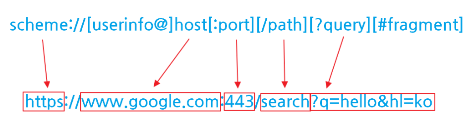

- URL과 라우팅
    - URI, URL, path와 route는 각각 무엇이며 어떤 차이가 있을까요?

      ## **URI(Uniform Resource Identifier)**

      리소스를 식별하는 문자열, 리소스의 이름이자 주소

        - 컴퓨터나 장치가 인터넷상의 자원을 찾고 인식할 수 있도록 도움
        - 하위 개념으로 url, urn 가 있음
            - urn: 리소스를 이름으로 매핑해서 찾는 규약

      ### URL**(Uniform Resource Locator)**

      네트워크 상에서 자원이 어디 있는지 위치를 알려주기 위한 규약



        - **scheme**
            - 주로 프로토콜 나타내는 데에 사용
            - ex) http, https, ftp 등
        - **host**
            - 주로 도메인명 또는 ip 주소를 직접 사용
        - **port**
            - 접속 포트
            - 일반적으로 생략 가능
                - 생략 시 http → 80 / https → 443 / 톰캣 → 8080
        - **path**
            - 서버 안에서 특정 자원이나 페이지의 위치를 나타냄
            - ex) /movies/10, /users/profile
        - **query**
            - 추가적인 조건이나 데이터를 전달할 때 사용
            - ? 뒤에 key=value 형태로 작성
        - **fragment**
            - 페이지 내부의 특정 위치를 가리킬 때 사용
            - # 뒤에 작성

      ### route

        - 특정 path에 어떤 화면이나 동작을 연결해 놓은 규칙
        - URL 자체를 의미하는 것이 아니라, **해당 경로로 접근했을 때 무엇을 보여주거나 실행할지 정하는 것**

        ```jsx
        export const Route = createFileRoute("/search")({
          component: SearchPage,
        });
        ```

        - `"/search"` → **path**
        - `SearchPage` → 해당 path에서 보여줄 **화면**
        - `createFileRoute("/search")({ ... })` → path와 화면을 연결한 **route**
    - path param과 search param은 각각 어떤 값을 표현할 때 사용하는 것이 좋을까요?
        - **path param**
            - URL의 **경로에 포함되는 변수 값**
                - `/movies/$movieId` → `/movies/10`
            - **특정 자원 하나를 식별할 때** 사용하는 것이 좋음
            - URL 경로 자체의 값으로 들어가기 때문에 해당 값이 없으면 어떤 자원을 조회할지 알 수 없는 경우에 사용
        - **search param**
            - URL 뒤에 붙는 추가 조건 값
                - ? 뒤에 key=value 형태로 작성
                - `search?query=스파이더맨`
            - 조회 결과에 **추가 조건을 줄 때** 사용하는 것이 좋음
            - 필터링, 검색어, 정렬, 페이지 번호 등에 주로 사용
    - 검색어, 필터나 현재 화면의 상태를 URL에 포함하면 공유와 새로고침에 어떤 장점이 있을까요?
        - URL에 포함하면 현재 화면 상태를 그대로 URL에 저장함
        - **공유**
            - URL만 전달해도 상대방이 같은 검색 결과나 필터 상태를 줄 수 있음
        - **새로고침**
            - 화면 상태가 URL에 남아 있기 때문에 새로고침해도 **검색어나 필터가 초기화되지 않고 복원 가능**
            - 브라우저의 앞으로 가기/뒤로 가기에서도 이전 상태를 복원하기도 쉬움
- SPA와 MPA
    - SPA와 MPA는 각각 무엇이며 화면을 이동하는 방식에 어떤 차이가 있을까요?
        - SPA와 MPA는 페이지 전환 방식에서 차이가 있음
            - 페이지 이동 시 기존 html을 유지 or 새로운 html을 서버에 요청하는가

      ## SPA**(Single Page Application)**

        - 한 개(Single)의 페이지로 구성된 Application
        - 즉 하나의 html 문서를 기반으로 애플리케이션이 동작함
            - 페이지를 이동해도 새로운 html을 요청하지 않고 js가 필요한 데이터만을 전달 받아 화면을 그린다

      ### 장점

        - 속도 향상
        - 개발 간소화
            - 페이지 렌더링 코드 작성 필요 없음
        - 클라이언트 상태 유지 쉬움
            - 하나의 애플리케이션이 브라우저 안에서 계속 실행되는 구조

      ### 단점

        - 초기 로딩 비용이 큼
        - SEO(검색엔진 최적화) 이슈
            - 자바스크립트를 읽지 못하는 검색엔진에 대해서 크롤링이 되지않아 인덱싱 과정에서 추가 비용이나 지연 발생 → 검색 결과 노출 불가

      ## MPA**(Multiple Page Application)**

        - 여러 개(Multiple)의 Page로 구성된 Application
        - 새로운 페이지를 요청할 때마다 서버에서 렌더링된 정적 리소스(HTML, CSS, JavaScript)가 다운로드
        - 페이지 이동하거나 새로고침하면 전체 페이지를 다시 렌더링

      ### 장점

        - SEO 친화적
            - 각 페이지마다 서버에서 만들어진 HTML이 존재하기 때문에 검색엔진이 내용을 확인하기 쉬움
            - 페이지마다 검색엔진 최적화를 따로 적용하기도 쉬움
        - 규모가 큰 사이트를 관리하기 편리함
            - 각각의 페이지가 비교적 독립적으로 동작하기 때문에 페이지별로 기능을 나누어 관리하기 쉬움
            - 다양한 기능과 많은 콘텐츠를 가진 사이트에 사용하기 좋음

      ### 단점

        - 페이지 이동이 느릴 수 있음
            - 페이지를 이동할 때마다 서버에 요청해서 **새로운 HTML 페이지를 받아와야 함**
            - 네트워크가 느리면 페이지 전환도 느려질 수 있음
        - 페이지 이동 시 화면이 끊겨 보일 수 있음
            - 새로운 페이지를 불러오는 동안 잠깐 **빈 화면이나 로딩 화면이 나타날 수 있음**
        - 더 많은 리소스를 사용할 수 있음
            - 페이지를 이동할 때마다 HTML, CSS, JavaScript 등의 파일을 다시 불러올 수 있음
            - SPA보다 서버와의 통신이나 데이터 전송량이 많아질 수 있음
    - SPA의 클라이언트 내비게이션은 새로운 HTML 문서를 받는 일반적인 페이지 이동과 어떻게 다를까요?
        - SPA의 클라이언트 내비게이션은 페이지를 이동할 때에 새로운 html 문서를 서버에서 다시 받아오지 않는다
        - 과정
            - 처음에 하나의 HTML을 받아옴
            - 이후 페이지를 이동할 때는 JavaScript가 URL 변화를 감지
            - 필요한 데이터만 서버에서 받아오고, **화면의 필요한 부분만 변경**
            - React Router, TanStack Router 같은 클라이언트 라우터가 이 역할을 함

        ```jsx
        //일반 페이지 이동
        /movies
        → 서버에 /movies/10 요청
        → 새로운 HTML 문서 응답
        → 전체 페이지 다시 렌더링
        
        //SPA
        **/movies
        → /movies/10으로 URL 변경
        → Router가 URL 확인
        → MovieDetail 컴포넌트 렌더링
        → 필요한 영화 데이터만 요청**
        ```

    - SPA와 MPA는 각각 어떤 서비스나 화면에 적합할까요?
        - SPA
            - 사용자가 **페이지 안에서 자주 클릭하고 데이터를 변경하는 서비스**
            - 화면 전환이 많고 **빠른 반응성**이 중요한 서비스
            - 로그인 후 계속 사용하는 서비스에 적합

          → 웹사이트보다는 하나의 프로그램처럼 동작하는 서비스

        - MPA: 화면의 개수가 많고 검색 결과에 잘 걸려야하는 서비스
            - 각 페이지가 **독립적인 콘텐츠**를 가지고 있는 서비스
            - 검색엔진에서 페이지가 잘 노출되는 **SEO가 중요한 서비스**
            - 사용자가 특정 페이지를 읽고 다른 페이지로 이동하는 형태에 적합

          → 콘텐츠를 보여주는 것이 중심이고 각 URL의 페이지가 중요한 서비스

- Tailwind CSS
    - CSS 규칙을 직접 작성하는 방식과 비교했을 때 Tailwind CSS의 특징은 무엇일까요?

      ## Tailwind CSS

        - 미리 만들어진 유틸리티 **클래스**를 조합해서 스타일을 작성하는 방식
        - 별도의 CSS 파일에 스타일 규칙을 많이 작성하지 않고 **HTML/JSX 안에서 바로 스타일을 적용**

        ```jsx
        //일반 css
        .button {
          background-color: blue;
          color: white;
          padding: 8px 16px;
          border-radius: 8px;
        }
        
        //tailwind
        **<button className="bg-blue-500 text-white px-4 py-2 rounded-lg">
          버튼
        </button>**
        ```

      ### 장점

        - CSS를 직접 작성하는 시간을 줄일 수 있음
        - 미리 정의된 클래스를 조합해 **빠르게 스타일 구현 가능**
        - 컴포넌트 단위로 스타일을 관리하기 편해 **유지보수가 쉬움**
        - **반응형 디자인 구현이 간편함**
            - sm:, md:, lg: 같은 접두사를 붙여 화면 크기에 따라 스타일을 변경할 수 있음
        - 빠르게 화면을 만들어야 하는 **프로토타이핑에 유리함**

      ### 단점

        - 클래스가 많이 붙으면 **HTML/JSX 코드가 길고 복잡해질 수 있음**
        - Tailwind에서 제공하지 않는 특정 스타일은 별도의 CSS가 필요할 수 있음
        - 임의 값을 너무 많이 사용하면 **코드의 가독성과 디자인 일관성이 떨어질 수 있음**
    - styled-components와 Tailwind CSS는 스타일을 작성하고 생성하는 방식이 어떻게 다를까요?
        - **styled-components**
            - JavaScript/TypeScript 파일 안에서 **CSS 문법을 직접 작성**
            - 컴포넌트와 스타일을 하나로 묶어서 관리하는 **CSS-in-JS 방식**
            - 작성한 스타일을 바탕으로 클래스명을 만들고 CSS를 생성, 적용함
            - props나 상태 값에 따라 **동적으로 스타일을 바꾸기 편함**

            ```jsx
            const Button = styled.button`
              background: blue;
              color: white;
            `;
            
            <Button>버튼</Button>
            ```

        - **Tailwind CSS**
            - **미리 정의된 유틸리티 클래스**를 조합해서 스타일 적용
            - 소스 코드에서 사용한 클래스를 확인해서 **필요한 CSS를 생성**
            - 별도의 스타일 컴포넌트를 만들지 않고 JSX의 className에서 바로 스타일 지정

            ```jsx
            <button className="bg-blue-500 text-white">
              버튼
            </button>
            ```

    - Tailwind CSS에서 `bg-${color}-500`처럼 class 이름을 동적으로 조합하면 스타일이 생성되지 않을 수 있는 이유는 무엇일까요?
        - tailwind는 미리 소스파일을 스캔해서 클래스 이름을 보고 필요한 css를 생성해놓는 방식으로 작동
        - 위처럼 동적으로 만들면 어떤 값이 올지 모르기 때문에 필요한 css 생성 불가

        ```jsx
        const colors = {
          red: "bg-red-500",
          blue: "bg-blue-500",
          green: "bg-green-500",
        };
        
        <div className={colors[color]}>
        ```

        - 이런 식으로 완성됨 클래스 이름을 적어놓고 사용
    - 상태에 따라 달라지는 스타일은 완성된 class 이름의 매핑이나 CSS 변수를 이용해 어떻게 표현할 수 있을까요?

      ### **완성된 class 이름 매핑**

        - 상태별로 사용할 **완성된 Tailwind class 이름을 미리 정의**해두는 방식
        - Tailwind가 클래스 이름을 직접 확인할 수 있어서 필요한 CSS를 정상적으로 생성할 수 있음
        - 상태의 종류가 정해져 있을 때 사용하기 좋음

        ```jsx
        const statusStyle = {
          success: "bg-green-500 text-white",
          error: "bg-red-500 text-white",
          warning: "bg-yellow-500 text-black",
        };
        
        <div className={statusStyle[status]}>
          상태 표시
        </div>
        ```

        - `status` 값에 따라 미리 정의된 class를 선택해서 적용

      ### CSS 변수 사용

        - Tailwind class 이름은 고정하고 **실제 스타일 값만 CSS 변수로 변경**하는 방식
        - 색상처럼 값의 종류가 많거나 실행 중 계속 달라지는 경우 사용하기 좋음

        ```jsx
        <div
          style={{ "--bg-color": color }}
          className="bg-[var(--bg-color)]"
        >
          상태 표시
        </div>
        ```

        - bg-[var(--bg-color)]는 고정된 class라서 Tailwind가 인식 가능
        - 실제 배경색은 color 값에 따라 CSS 변수 -bg-color가 변경되면서 달라짐
        - 상태 종류가 정해져 있으면 **class 매핑 방식**
        - 스타일 값이 다양하게 바뀌어야 하면 **CSS 변수 방식**을 사용할 수 있음