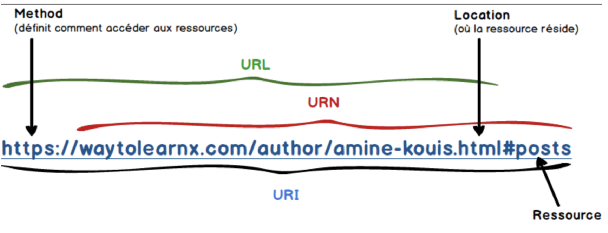
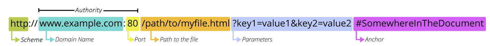
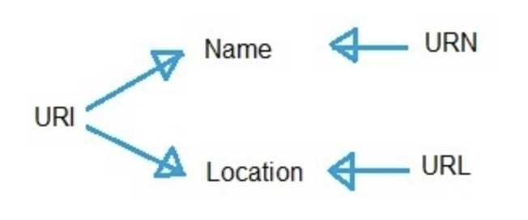
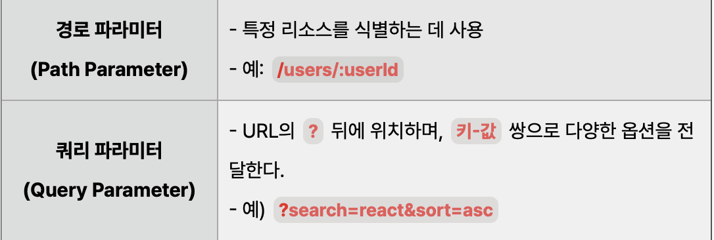

- URL과 라우팅
    - URI, URL, path와 route는 각각 무엇이며 어떤 차이가 있을까요?
    - path param과 search param은 각각 어떤 값을 표현할 때 사용하는 것이 좋을까요?
    - 검색어, 필터나 현재 화면의 상태를 URL에 포함하면 공유와 새로고침에 어떤 장점이 있을까요?


  URI(Uniform Resource Identifier)(통합 자원 식별자) : 리소스를 식별하는 문자열을 넓게 부르는 말(자원의 식별자)

    - 웹에서 사용하는 논리적, 물리적 리소스 식별
    - 고유한 문자열 시퀀스
    - 인터넷에서 요구되는 기본조건

  URL(Uniform Resource Locator)(웹 주소) : URI에서 리소스에 접근할 방법과 위치를 나타내는 주소(위치)

    - 네트워크 상에서 리소스의 위치를 알려주는 규약
    - URI의 서브셋


  URL 구조

    - scheme(protocol) : HTTP, HTTPS(보안 강화)
    - domain name

      최상위 도메인 : .com, .net 등

      차상위 도메인 : www., m. 등

      도메인 이름 : google, naver 등

    - port : 어떤 서버를 사용할지 결정

      표준을 사용하는 경우 일반적으로 생략

      HTTP : 80

      HTTPS : 443

    - path : 파일 경로
    - parameter(쿼리 스트링) : key = value 형태
    - anchor : 특정 요소 지시 (해시태그로 스크롤 없이 다로 이동)

  URN(Uniform Resocuce Name)(통합 자원 이름) : 자원의 이름을 나타내는 말(이름)

    - 리소스 자체에 부여된 영구적인 유일한 이름 → 안 변함
    - 리소스가 이름에 매핑되어야해서 이름으로 부여하면 찾기가 힘듬 → 잘 안씀(대부분 URL)


  URI가 가장 큰 개념. URI 안에 URN과 URL이 포함되어있다.

  route : 앱이 정한 규칙(특정 URL 경로와 매칭되는 컴포넌트 렌더링)

  path를 받아와 상세화면을 보여주는 규칙

  path: URL 경로(실제 경로)

  React Router : React 애플리케이션에서 클라이언트 측 라우팅을 쉽게 구현하도록 도와주는 라이브러리

  리액트 자체론 라우팅 기능 제공 X

  path param(경로 파라미터) : 특정 리소스 식별

  search param(쿼리 파라미터) : ? 뒤에 위치, key = value 쌍으로 옵션 전달

  

  URL에 현재 화면의 상태를 포함하게 되면 주소를 복사하여도 같은 검색, 필터 등의 상태를 사용할 수 있고 새로고침, 북마크 등을 한 후에도 복원 가능하다.

- SPA와 MPA
    - SPA와 MPA는 각각 무엇이며 화면을 이동하는 방식에 어떤 차이가 있을까요?
    - SPA의 클라이언트 내비게이션은 새로운 HTML 문서를 받는 일반적인 페이지 이동과 어떻게 다를까요?
    - SPA와 MPA는 각각 어떤 서비스나 화면에 적합할까요?

  SPA(Single Page Application) : 처음 받은 HTML 문서를 유지한 채 JavaScript가 브라우저 주소 기록과 하면을 바꾸는 앱 구조

  →새로운 페이지를 불러오는 것이 아닌 현재 페이지를 동적으로 다시 작성(필요한 데이터만 JSON으로 전달받아 페이지 갱신)

  장점

    - 속도, 응답시간 : 변경되는 부분만 갱신되므로 속도가 빠르다.
    - 모바일 친화적 : 모바일 앱도 SPA와 동일한 아키텍처에서 개발
    - 개발 간소화 : 서버에서 렌더링을 위한 코드가 필요 X
    - 로컬 스토리지 캐시 : 로컬 스토리지를 효과적으로 캐시 가능. 다음에 이 데이터를 사용 시 오프라인에서도 작동한다.

  단점

    - 초기 구동 속도 : 최초 접근 시 모든 정적 리소스를 다운로드하기 때문에 초기 구동이 느림.
    - SEO(검색 엔진 최적화) 이슈 : JavaScript를 읽지 못하는 검색엔진에선 크롤링 안됨 → 색인 불가
    - 보안 문제 : 공격자가 웹사이트 입력칸에 악성 코드를 심을 수 있음.

  Gmail, Google 지도, GitHub, Facebook 등

  빠른 반응성, 모바일 앱에 가까운 UX가 필요한 경우 적합

  MPA(Multi Page Application) : 다른 URL로 이동할 때 서버에서 새로운 HTML 문서를 받아 화면을 바꾸는 구조

  새로운 페이지를 요청할 때마다 서버에서 렌더링된 정적 리소스가 다운로드된다.

  페이지 이동 및 새로고침 시 전체 페이지 다시 렌더링

  장점

    - SEO 친화적 : 여러 페이지 생성 가능 → 많은 키워드 타게팅 가능 → 검색 엔진에 좋음
    - 확장성 : 다중 페이지로 원하는 만큼 페이지 추가 가능

  단점

    - 페이지 이동 시 느림 : 새로운 페이지 이동 시 전체 페이지 렌더링
    - 보안 및 유지보수 : 페이지가 많아 유지보수 어려움

  Amazon(제품의 수를 원하는 만큼 콘텐츠 추가)

  SEO나 보안, 서버 중심 처리가 중요할 시 적합

- Tailwind CSS
    - CSS 규칙을 직접 작성하는 방식과 비교했을 때 Tailwind CSS의 특징은 무엇일까요?
    - styled-components와 Tailwind CSS는 스타일을 작성하고 생성하는 방식이 어떻게 다를까요?
    - Tailwind CSS에서 `bg-${color}-500`처럼 class 이름을 동적으로 조합하면 스타일이 생성되지 않을 수 있는 이유는 무엇일까요?
    - 상태에 따라 달라지는 스타일은 완성된 class 이름의 매핑이나 CSS 변수를 이용해 어떻게 표현할 수 있을까요?

  Tailwind css : 유틸리티 우선의 css 프레임워크, 클래스 이름을 통해 직접 스타일을 HTML에 적용 가능

  → 모듈화, 디자인 일관성, 디자인의 빠른 구현

  유틸리티 클래스 : 버튼, 모달 등의 같은 요소가 아닌 글자 색상, 사이즈 등 각각의 css속성과 값

  미리 작성된 utility class를 조합하여 사용

  장점

    - css 작성 시간 대폭 감소
    - 유지보수 용이 : 컴포넌트 기반 접근 방식
    - 커스터마이징, 반응형 디자인 구현 간편
    - 실제로 사용한 클래스만 css에 작성됨 → 최적화된 css

  단점

    - css 파일이 커짐 : 새로운 스타일을 적용할 때마다 css 클래스가 생성됨 → 페이지 로딩 시간이 늘어남
    - tailwind css로 구현 불가한 경우 css 작성 → 일관성 깨짐

  styled-components : CSS-in-JS의 라이브러리로 JavaScript 파일 내에 css 작성

  각 컴포넌트에 고유한 클래스를 자동으로 생성해줌→스타일 충돌 방지

  Javascript 내에서 css 규칙을 작성해 컴포넌트별 class 생성

  장점

    - 컴포넌트 단위 모듈화 : 재사용성, 보수성 향상
    - 동적 스타일링이 편함 : 변수를 이용하여 스타일을 동적으로 변경 가능

  단점

    - Javascript 파일 크기 증가 : style이 javascript 파일 내에 포함됨
    - 런타임 성능 저하 : style이 렌더링 시점에 생성됨 → 렌더링 성능 저하

  tailwind에서 동적으로 class이름을 조합할 때 템플릿 리터럴 내에서 변수를 사용해 동적으로 클래스 생성시 Tailwind css가 해당 클래스를 파악하지 못함 → 빌드시에 정확한 클래스 이름이 존재해야 한다.

  즉, 완전한 클래스 네임일 때만 생성 가능

  따라서 미리 색상별로 완성된 class를 객체에 저장 후 그 값을 선택해야 한다.

    ```jsx
    예시
    const colorClasses = {
      red: "bg-red-500 text-white",
      blue: "bg-blue-500 text-white",
      green: "bg-green-500 text-white",
    } as const;
    
    type Color = keyof typeof colorClasses;
    
    function StatusBadge({ color }: { color: Color }) {
      return (
        <span className={`rounded px-2 py-1 ${colorClasses[color]}`}>
          {color}
        </span>
      );
    }
    
    <StatusBadge color="red" />
    <StatusBadge color="blue" />
    <StatusBadge color="green" />
    ```

  상태에 따라 달라지는 스타일의 경우 가능한 상태별로 미리 class이름을 객체에 매핑한 뒤 현재 상태에 맞는 값을 선택한다. 값 자체가 사용자 입력 등에 따라 완전히 동적으로 바뀌는 경우엔 css 변수를 이용한다.