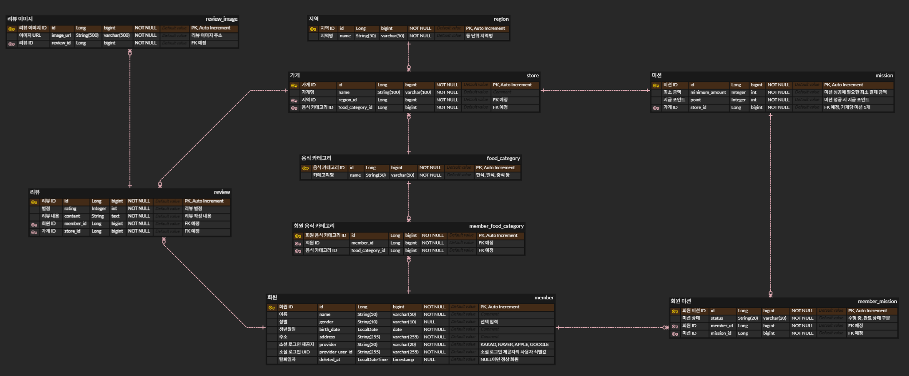

# Chapter01

ERD 사진

설명

<aside>

## 1. 요구사항 분석

IA와 와이어프레임을 확인하여 서비스에서 필요한 데이터를 먼저 정리하였다.

서비스의 핵심 기능은 지역별 가게의 미션을 수행하고 포인트를 획득하는 것이며, 회원가입 과정에서는 회원 정보와 선호 음식 카테고리를 입력받는다.

화면을 기준으로 필요한 데이터를 분석한 결과 다음과 같은 엔티티가 필요하다고 판단하였다.

- 회원
- 지역
- 음식 카테고리
- 가게
- 미션
- 회원 미션
- 회원 음식 카테고리
- 리뷰
- 리뷰 이미지

---

## 2. 회원 및 음식 카테고리 설계

회원가입 화면을 확인한 결과 이름, 성별, 생년월일, 주소 등의 회원 정보가 필요했다.

로그인은 카카오, 네이버, 애플, 구글 소셜 로그인을 사용하고 있었기 때문에 소셜 로그인 제공자를 저장하는 `provider`와 소셜 로그인 사용자를 식별하기 위한 `provider_user_id`를 회원 테이블에 포함하였다.

또한 회원가입 과정에서 한 회원이 여러 개의 음식 카테고리를 선택할 수 있었다.

한 명의 회원이 여러 음식 카테고리를 선택할 수 있고, 하나의 음식 카테고리 역시 여러 회원에게 선택될 수 있기 때문에 회원과 음식 카테고리는 N:M 관계라고 판단하였다.

따라서 N:M 관계를 해소하기 위해 `member_food_category` 중간 테이블을 추가하였다.

member 1 : N member_food_category
food_category 1 : N member_food_category

결과적으로 member와 food_category는 N:M 관계가 된다.

---

## 3. 지역 및 가게 설계

와이어프레임에서는 지역을 선택한 후 해당 지역에 존재하는 가게를 확인할 수 있었다.

지역은 `~동` 단위로 관리되는 것으로 판단하여 `region` 테이블을 만들었다.

한 지역에는 여러 개의 가게가 존재할 수 있지만 하나의 가게는 하나의 지역에 속하므로 다음과 같이 설계하였다.

region 1 : N store

또한 가게는 하나의 대표 음식 카테고리를 가지도록 설계하였다.

하나의 음식 카테고리에는 여러 가게가 존재할 수 있으므로 다음과 같은 관계가 된다.

food_category 1 : N store

따라서 `store` 테이블에는 `region_id`와 `food_category_id`를 FK로 두었다.

---

## 4. 가게 및 미션 설계

와이어프레임의 미션 정보를 확인한 결과 미션에는 최소 식사 금액과 미션 성공 시 지급되는 포인트가 필요했다.

따라서 `mission` 테이블에 다음 정보를 저장하도록 설계하였다.

- `minimum_amount` : 미션 성공을 위해 필요한 최소 결제 금액
- `point` : 미션 성공 시 지급되는 포인트
- `store_id` : 해당 미션이 등록된 가게

현재 기획에서는 하나의 가게에 하나의 미션이 존재하는 구조라고 판단하여 가게와 미션을 1:1 관계로 설계하였다.

store 1 : 1 mission

`mission`의 `store_id`를 FK로 사용하여 미션이 어느 가게에 속하는지 확인할 수 있도록 하였다.

---

## 5. 회원의 미션 수행 기록 설계

한 회원은 여러 개의 미션을 수행할 수 있으며, 하나의 미션 역시 여러 회원이 수행할 수 있다.

따라서 회원과 미션은 N:M 관계가 된다.

member N : M mission

N:M 관계를 직접 연결하지 않고 `member_mission`이라는 중간 테이블을 추가하였다.

member 1 : N member_mission
mission 1 : N member_mission

`member_mission`에는 `member_id`와 `mission_id`를 FK로 저장한다.

또한 IA에서 수행 중인 미션과 완료한 미션을 구분하여 보여주고 있었기 때문에 회원별 미션 진행 상태를 저장하기 위한 `status` 컬럼을 추가하였다.

이를 통해 같은 미션이라도 회원마다 서로 다른 진행 상태를 저장할 수 있도록 하였다.

---

## 6. 리뷰 설계

미션 수행 후 사용자가 가게에 리뷰를 작성할 수 있으며 리뷰 화면에서는 별점, 리뷰 내용, 사진을 입력할 수 있었다.

따라서 `review` 테이블에는 다음 정보를 저장하도록 설계하였다.

- `rating` : 별점
- `content` : 리뷰 내용
- `member_id` : 리뷰를 작성한 회원
- `store_id` : 리뷰가 작성된 가게

한 회원은 여러 가게에 리뷰를 작성할 수 있고 하나의 가게에는 여러 회원의 리뷰가 작성될 수 있으므로 다음과 같은 관계로 설계하였다.

member 1 : N review
store 1 : N review

또한 동일한 회원이 같은 가게에 여러 개의 리뷰를 작성하지 못하도록 `member_id`와 `store_id`의 조합에 UNIQUE 제약조건을 적용하는 것을 고려하였다.

---

## 7. 리뷰 이미지 설계

와이어프레임에서는 리뷰 작성 시 사진을 최대 3장까지 첨부할 수 있었다.

리뷰 테이블에 `image1`, `image2`, `image3`과 같이 이미지 컬럼을 직접 만드는 대신 별도의 `review_image` 테이블을 생성하였다.

review 1 : N review_image

`review_image`에는 `review_id`와 `image_url`을 저장한다.

이를 통해 하나의 리뷰에 여러 개의 이미지를 저장할 수 있도록 하였으며, 최대 3장이라는 제한은 애플리케이션 로직에서 처리하도록 설계하였다.

---

## 8. PK / FK 및 제약조건 설정

테이블명과 컬럼명은 snake_case 소문자 컨벤션으로 통일하였다.

모든 테이블의 PK는 다음과 같이 통일하였다.

id BIGINT PK AUTO_INCREMENT

각 테이블은 독립적인 PK인 `id`를 가지고 있기 때문에 관계는 ERDCloud에서 Non-Identifying Relationship(비식별 관계)으로 연결하였다.

또한 필수 데이터에는 NOT NULL을 적용하고 선택적으로 입력하는 데이터에는 NULL을 허용하였다.

예를 들어 회원의 성별은 선택 입력이므로 NULL을 허용하였다.

회원 탈퇴 시 데이터를 바로 삭제하지 않고 기존 미션 및 리뷰 기록과의 관계를 유지할 수 있도록 `member` 테이블에 `deleted_at` 컬럼을 추가하여 Soft Delete가 가능하도록 설계하였다.

---

## 9. 최종 관계 정리

### 지역 · 가게 · 미션

- `지역 1 : N 가게`
    - 하나의 지역에는 여러 가게가 존재할 수 있다.
- `음식 카테고리 1 : N 가게`
    - 하나의 음식 카테고리에는 여러 가게가 존재할 수 있다.
- `가게 1 : 1 미션`
    - 하나의 가게는 하나의 미션을 가진다.

### 회원 · 미션

- `회원 1 : N 회원 미션`
- `미션 1 : N 회원 미션`
    - 회원과 미션의 N:M 관계를 `회원 미션` 중간 테이블을 통해 관리한다.

### 회원 · 선호 음식 카테고리

- `회원 1 : N 회원 음식 카테고리`
- `음식 카테고리 1 : N 회원 음식 카테고리`
    - 회원과 음식 카테고리의 N:M 관계를 `회원 음식 카테고리` 중간 테이블을 통해 관리한다.

### 회원 · 가게 · 리뷰

- `회원 1 : N 리뷰`
    - 한 회원은 여러 가게에 리뷰를 작성할 수 있다.
- `가게 1 : N 리뷰`
    - 하나의 가게에는 여러 회원의 리뷰가 작성될 수 있다.
- `리뷰 1 : N 리뷰 이미지`
    - 하나의 리뷰에는 여러 개의 이미지를 첨부할 수 있다.
</aside>
