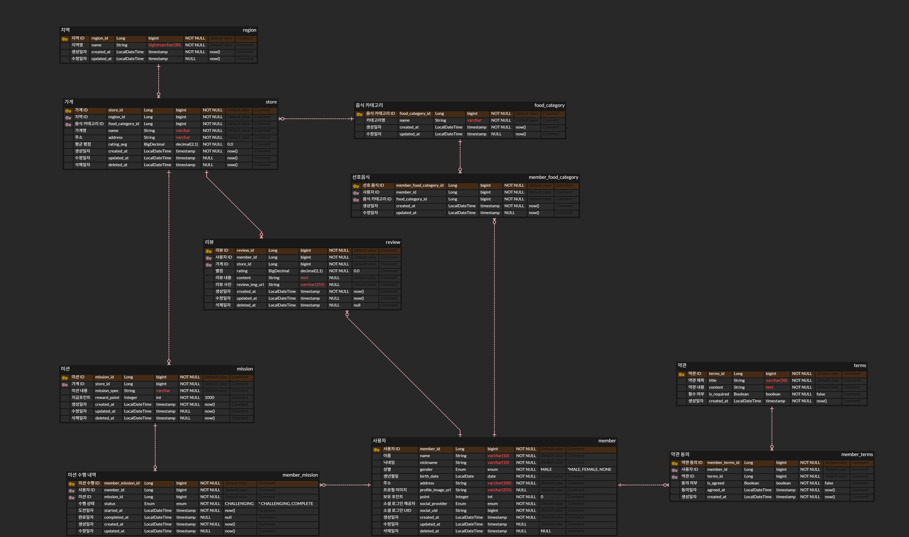

# 1주차 미션 — ERD 설계

## ERD

## 테이블 구성

### 회원 영역

- `member` — 소셜 로그인 정보, 프로필, 보유 포인트
- `terms` / `member_terms` — 약관과 동의 내역
- `food_category` / `member_food_category` — 음식 카테고리와 선호 음식

### 지역·가게 영역

- `region` — 지역 (안암동 등)
- `store` — 가게. 지역과 음식 카테고리를 참조

### 미션 영역

- `mission` — 가게별 미션 (조건 금액, 지급 포인트, 마감일)
- `member_mission` — 회원의 미션 수행 내역

### 리뷰 영역

- `review` — 가게 리뷰 (별점, 내용)

## 중간 매핑 테이블로 분리

와이어프레임에서 확인한 N:M 관계는 다음과 같다.

- **회원 ↔ 미션**: 한 회원이 여러 미션에 도전하고, 한 미션을 여러 회원이 수행할 수 있다.
- **회원 ↔ 음식 카테고리**: 회원가입 화면에서 선호 음식을 중복 선택할 수 있다.
- **회원 ↔ 약관**: 약관마다 동의 여부를 따로 저장해야 한다.

중간 테이블 없이 `member` 테이블에 선호 음식 목록을 한 컬럼에 몰아넣으면 1NF 위반이기 때문에
`member_mission`, `member_food_category`, `member_terms`로 분리했다.