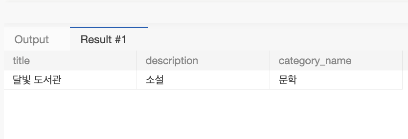
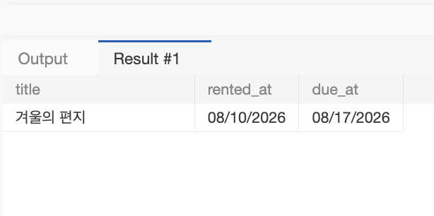
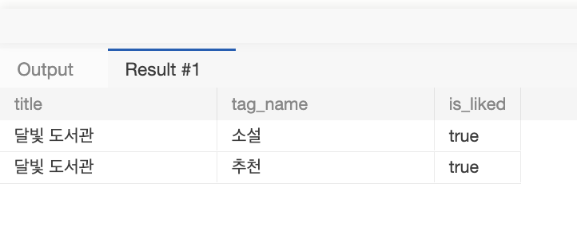

- **미션 기록**


1. 미션 1. 문학 카테고리의 대여 가능한 도서를 최신순으로 10개 조회합니다.
    - 미션 1 결과에는 책 제목, 설명, 카테고리 이름을 포함합니다.
    
    ```sql
    SELECT 
        b.title,
        b.description,
        c.name AS category_name
    FROM book b
    JOIN category c ON b.category_id = c.category_id
    WHERE c.name = '문학'
      AND b.is_available = TRUE
    ORDER BY b.book_id DESC
    LIMIT 10;
    ```
    
    - book 테이블 기준으로 도서와 1:N 관계인 카테고리의 이름을 노출하기 위해 category 테이블 JOIN
    - 카테고리명이 문학인 도서와 현재 대여 가능한 상태의 도서만 필터링
    - 최신순으로 정렬하기 위해 b.book_id DESC, 상위 10건만 가져오도록 LIMIT 10
        
        
        
2. 미션 2. 특정 사용자가 아직 반납하지 않은 책을 반납 예정일 순으로 조회합니다.
    - 미션 2 결과에는 책 제목, 대여일, 반납 예정일을 포함합니다.
    
    ```sql
    SELECT 
        b.title,
        r.rented_at,
        r.due_at
    FROM rental r
    JOIN book b ON r.book_id = b.book_id
    WHERE r.user_id = 1
      AND r.returned_at IS NULL
    ORDER BY r.due_at ASC;
    ```
    
    - 대여 내역 추적을 위해 rental 테이블을 기준으로, 대여된 책의 제목 표시를 위해 book 테이블 JOIN
    - 조회 대상인 특정 회원(user_id = 1)과 아직 도서를 반납하지 않은 상태(r.returned_at IS NULL)를 조건으로 지정
    - 반납 예정일 순 = 반납 마감 기한이 임박한 도서 = 반납 예정일 기준 오름차순 ASC
        
         
        
3. 미션 3. 특정 책의 태그 목록과 특정 사용자의 좋아요 여부를 조회합니다.
    
    ```sql
    SELECT 
        b.title,
        t.name AS tag_name,
        CASE 
            WHEN bl.user_id IS NOT NULL THEN TRUE 
            ELSE FALSE 
        END AS is_liked # 1 또는 0 반환 
    FROM book b
    LEFT JOIN book_tag bt ON b.book_id = bt.book_id
    LEFT JOIN tag t ON bt.tag_id = t.tag_id
    LEFT JOIN book_like bl 
           ON b.book_id = bl.book_id 
          AND bl.user_id = 1
    WHERE b.book_id = 1;
    ```
    
    “책 상세 화면에서 태그 목록과 현재 사용자의 좋아요 여부를 함께 확인한다.”
    
    - 특정 도서 상세 정보를 바탕으로 하므로 book 테이블 기준, N:M 매핑 테이블인 book_tag를 거쳐 tag 테이블로 연결
    - 태그가 없거나 좋아요를 누르지 않아도 도서 정보가 누락되지 않도록 LEFT JOIN 적용
    - 특정 책으로 범위를 좁히고 book_like 테이블과의 조인 조건에 현재 로그인한 사용자 조건을 함께 부여
    - 테이블: book, book_tag, tag, book_like
    - 관계: book → book_tag → tag / book → book_like
    - 조건: 선택한 book_id와 현재 로그인한 user_id
        
         
        
4. 각 쿼리에서 기준 테이블, JOIN한 이유, WHERE 조건, 정렬·목록 기준을 설명합니다.
    - 확장. 자신의 1주차 ERD에서 같은 방식으로 화면 조회 요구사항 1개와 SQL을 작성합니다.
5. 공통 더미 데이터에서 실행한 결과를 캡처합니다.
    - 1주차 기준 ERD 또는 자신의 ERD에서 JOIN 경로를 표시합니다.
    - 실행 결과가 요구사항 문장과 일치하는지 한 문장으로 검증합니다.