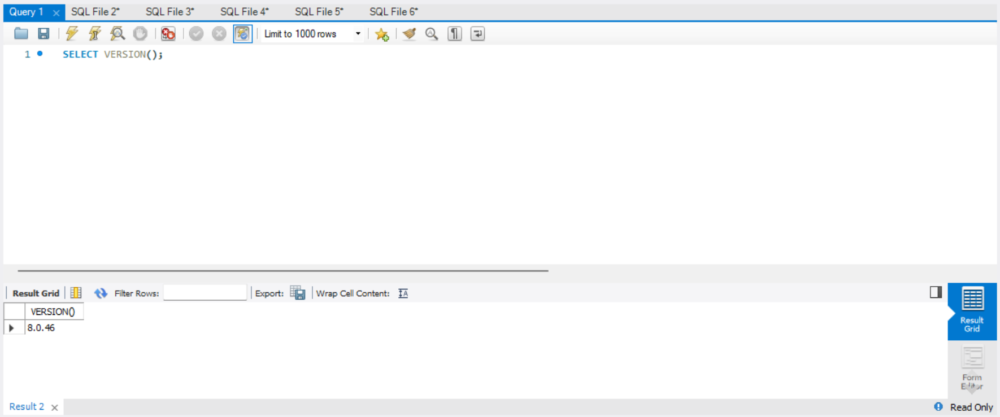
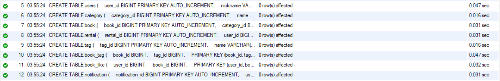
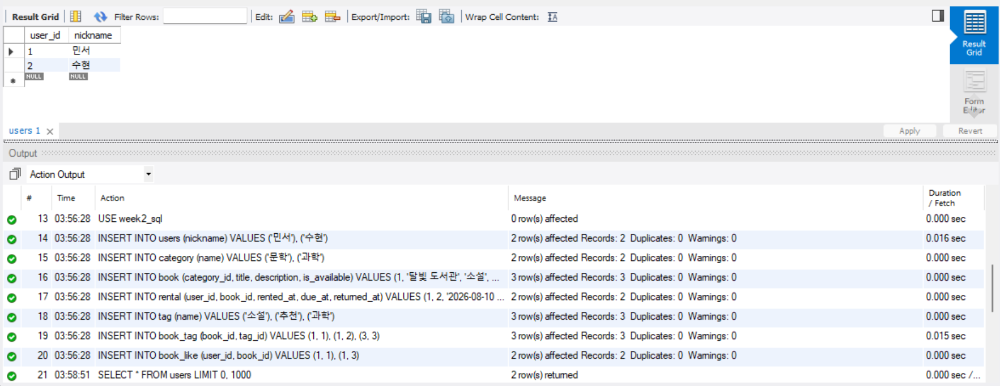
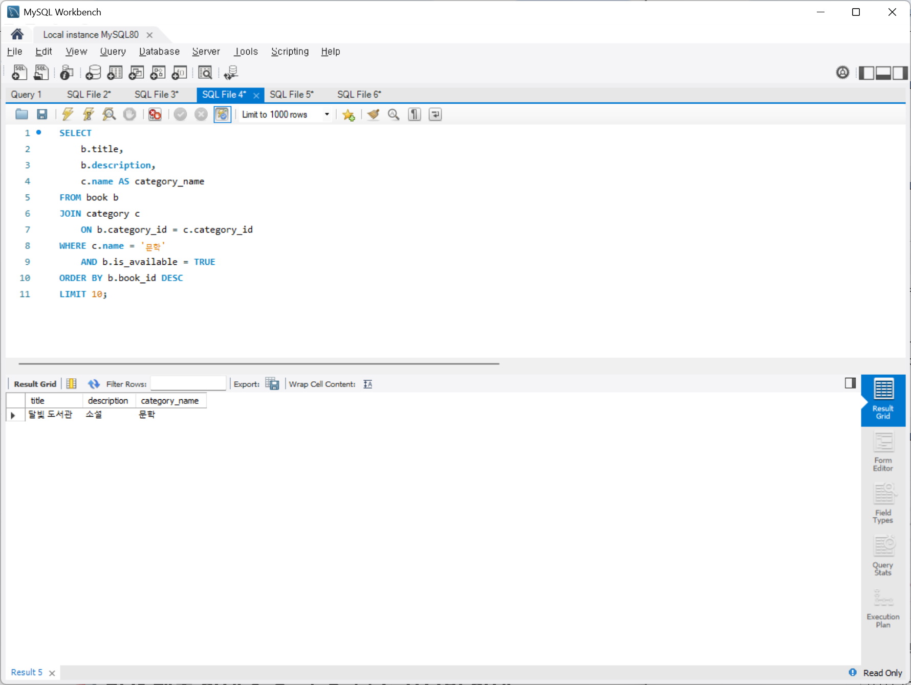
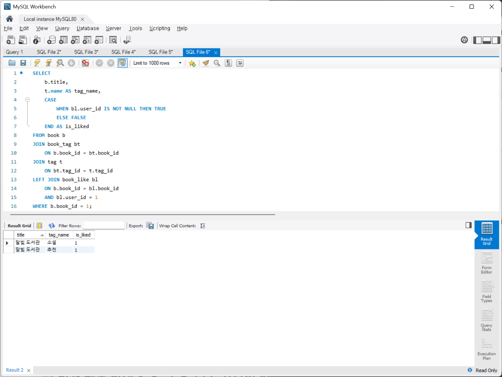
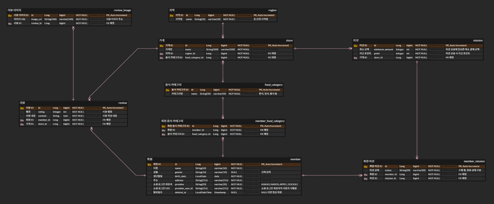

# Chapter02

## 0. 실습 환경 준비

### MySQL 연결 확인

MySQL Workbench에서 로컬 MySQL 서버에 접속한 뒤 정상적으로 연결되었는지 확인하기 위해 다음 쿼리를 실행했다.

```sql
SELECT VERSION();
```

실행 결과 MySQL 버전이 정상적으로 조회되는 것을 확인했다.



---

### 테이블 생성

제공된 `01_schema.sql`을 실행하여 실습에 필요한 테이블을 생성했다.

생성된 테이블은 `users`, `category`, `book`, `rental`, `tag`, `book_tag`, `book_like`, `notification`이다.

각 테이블이 정상적으로 생성되었고, PK와 FK를 통해 테이블 간 관계가 설정된 것을 확인했다.



---

### 공통 더미 데이터 추가

제공된 `02_seed.sql`을 실행하여 사용자, 카테고리, 책, 대여 기록, 태그, 좋아요 등의 공통 더미 데이터를 추가했다.

데이터가 정상적으로 추가되었는지 확인하기 위해 다음 쿼리를 실행했다.

```sql
SELECT * FROM users;
```

실행 결과 `민서`, `수현` 사용자가 정상적으로 조회되는 것을 확인했다.



---

# 1. 미션 1 — 문학 카테고리의 대여 가능한 도서 조회

## 요구사항

> 문학 카테고리의 대여 가능한 도서를 최신순으로 최대 10개 조회한다.
> 
> 
> 결과에는 책 제목, 설명, 카테고리 이름을 포함한다.
> 

---

## 진행 과정

### ① 기준 테이블 선택

책의 제목, 설명, 대여 가능 여부가 필요하기 때문에 `book` 테이블을 기준으로 시작했다.

### ② JOIN 확인

`book`에는 `category_id`만 저장되어 있고 실제 카테고리 이름은 `category` 테이블에 저장되어 있다.

따라서 `book.category_id`와 `category.category_id`를 기준으로 JOIN하여 두 테이블이 정상적으로 연결되는지 먼저 확인했다.

```sql
SELECT *
FROM book b
JOIN category c
    ON b.category_id = c.category_id;
```

### ③ WHERE 조건 추가

문학 카테고리이면서 대여 가능한 책만 필요하므로 다음 조건을 추가했다.

```sql
WHERE c.name = '문학'
    AND b.is_available = TRUE;
```

조건을 적용한 뒤 공통 더미 데이터에서 해당 조건을 만족하는 책만 조회되는 것을 확인했다.

---

## 최종 SQL

```sql
SELECT
    b.title,
    b.description,
    c.name AS category_name
FROM book b
JOIN category c
    ON b.category_id = c.category_id
WHERE c.name = '문학'
    AND b.is_available = TRUE
ORDER BY b.book_id DESC
LIMIT 10;
```

---

## JOIN 관계

- **JOIN 경로:** `book → category`
- **관계:** `category 1 : N book`
- **연결 기준:** `book.category_id = category.category_id`

---

## 쿼리 설명

기준 테이블은 책 정보를 가지고 있는 `book`이다. 카테고리 이름을 조회하기 위해 `category_id`를 기준으로 `category` 테이블을 JOIN하고, 문학 카테고리이면서 대여 가능한 책만 조회했다.

제공된 테이블에는 별도의 등록일 컬럼이 없기 때문에 이번 실습에서는 `book_id`가 큰 데이터를 최근에 등록된 데이터로 보고 내림차순으로 정렬했으며, `LIMIT 10`으로 최대 10개만 조회했다.

---

## 실행 결과



---

## 결과 검증

> 문학 카테고리이면서 대여 가능한 `달빛 도서관`이 조회되어 요구사항과 일치하는 것을 확인했다.
> 

---

# 2. 미션 2 — 미반납 도서 조회

## 요구사항

> 특정 사용자가 대여한 도서 중 아직 반납하지 않은 도서를 반납 예정일 순으로 조회한다.
> 
> 
> 결과에는 책 제목, 대여일, 반납 예정일을 포함한다.
> 

---

## 진행 과정

### ① 기준 테이블 선택

사용자의 대여 기록, 대여일, 반납 예정일, 반납 여부가 필요하기 때문에 `rental` 테이블을 기준으로 시작했다.

### ② JOIN 확인

`rental`에는 `book_id`만 존재하고 책 제목은 `book` 테이블에 저장되어 있다.

따라서 `rental.book_id`와 `book.book_id`를 기준으로 JOIN하여 대여 기록과 책 정보가 정상적으로 연결되는지 먼저 확인했다.

```sql
SELECT *
FROM rental r
JOIN book b
    ON r.book_id = b.book_id;
```

### ③ WHERE 조건 추가

`user_id = 1`인 사용자의 대여 기록 중 아직 반납하지 않은 데이터만 조회하도록 조건을 추가했다.

```sql
WHERE r.user_id = 1
    AND r.returned_at IS NULL;
```

`returned_at IS NULL`은 반납 시간이 기록되어 있지 않다는 의미이므로 아직 반납하지 않은 도서로 판단했다.

---

## 최종 SQL

```sql
SELECT
    b.title,
    r.rented_at,
    r.due_at
FROM rental r
JOIN book b
    ON r.book_id = b.book_id
WHERE r.user_id = 1
    AND r.returned_at IS NULL
ORDER BY r.due_at ASC;
```

---

## JOIN 관계

- **JOIN 경로:** `rental → book`
- **관계:** `book 1 : N rental`
- **연결 기준:** `rental.book_id = book.book_id`

---

## 쿼리 설명

기준 테이블은 대여 정보를 가지고 있는 `rental`이다. `rental`에는 책 제목이 없기 때문에 `book_id`를 기준으로 `book` 테이블을 JOIN했다.

`user_id = 1`이면서 `returned_at IS NULL`인 기록만 조회했으며, 먼저 반납해야 하는 책부터 확인할 수 있도록 `due_at`을 오름차순으로 정렬했다.

---

## 실행 결과


---

## 결과 검증

> `user_id = 1`인 사용자가 아직 반납하지 않은 `겨울의 편지`가 조회되었으며, 대여일과 반납 예정일도 함께 표시되어 요구사항과 일치하는 것을 확인했다.
> 

---

# 3. 미션 3 — 도서 태그 및 좋아요 여부 조회

## 요구사항

> 특정 도서의 태그 목록과 특정 사용자가 해당 도서를 좋아요했는지 여부를 조회한다.
> 

---

## 진행 과정

### ① 기준 테이블 선택

특정 도서를 기준으로 태그와 좋아요 여부를 조회해야 하기 때문에 `book` 테이블을 기준으로 시작했다.

### ② 책과 태그 JOIN 확인

`book`과 `tag`는 N:M 관계이므로 두 테이블을 직접 연결하지 않고 중간 테이블인 `book_tag`를 이용했다.

먼저 다음 쿼리를 실행하여 책과 태그가 정상적으로 연결되는지 확인했다.

```sql
SELECT *
FROM book b
JOIN book_tag bt
    ON b.book_id = bt.book_id
JOIN tag t
    ON bt.tag_id = t.tag_id
WHERE b.book_id = 1;
```

실행 결과 `book_id = 1`인 `달빛 도서관`에 `소설`, `추천` 태그가 연결되어 있는 것을 확인했다.

### ③ 좋아요 여부 추가

특정 사용자가 해당 책을 좋아요했는지 확인하기 위해 `book_like`를 추가로 연결했다.

좋아요 기록이 존재하지 않는 경우에도 책과 태그 정보는 조회되어야 하기 때문에 `book_like`에는 `LEFT JOIN`을 사용했다.

---

## 최종 SQL

```sql
SELECT
    b.title,
    t.name AS tag_name,
    CASE
        WHEN bl.user_id IS NOT NULL THEN TRUE
        ELSE FALSE
    END AS is_liked
FROM book b
JOIN book_tag bt
    ON b.book_id = bt.book_id
JOIN tag t
    ON bt.tag_id = t.tag_id
LEFT JOIN book_like bl
    ON b.book_id = bl.book_id
    AND bl.user_id = 1
WHERE b.book_id = 1;
```

---

## JOIN 관계

**태그 조회**

- **JOIN 경로:** `book → book_tag → tag`
- **관계:** `book N : M tag`
- **중간 테이블:** `book_tag`
- **연결 기준:** `book.book_id = book_tag.book_id`, `book_tag.tag_id = tag.tag_id`

**좋아요 조회**

- **JOIN 경로:** `book → book_like`
- **관계:** `users N : M book`
- **중간 테이블:** `book_like`
- **연결 기준:** `book.book_id = book_like.book_id`
- **사용자 조건:** `book_like.user_id = 1`

---

## 쿼리 설명

기준 테이블은 조회할 책을 나타내는 `book`이다. 책과 태그는 N:M 관계이므로 `book_tag`를 거쳐 `tag`를 JOIN했으며, 특정 사용자의 좋아요 여부를 확인하기 위해 `book_like`도 연결했다.

`book_id = 1`인 책을 조회하고 `user_id = 1`의 좋아요 기록 존재 여부를 `CASE`로 판단했다. 좋아요 기록이 없는 경우에도 책과 태그가 조회될 수 있도록 `book_like`에는 `LEFT JOIN`을 사용했다.

---

## 실행 결과



---

## 결과 검증

> `달빛 도서관`의 `소설`, `추천` 태그가 조회되었으며 `is_liked = 1`로 나타나 `user_id = 1` 사용자가 해당 도서를 좋아요한 상태임을 확인했다.
> 

---

# 4. 확장 미션 — 1주차 ERD 활용

## ERD 수정 과정

기존 1주차 ERD에서는 `store`와 `mission`의 관계를 1:1로 설계했다.

하지만 한 가게가 시즌이나 기간에 따라 여러 개의 미션을 제공할 수 있다는 피드백을 반영하여 `store 1 : N mission` 관계로 수정했다.

- **수정 전:** `store 1 : 1 mission`
- **수정 후:** `store 1 : N mission`

이를 통해 하나의 가게에서 여러 개의 미션을 제공할 수 있도록 변경했다.



---

## 요구사항

> 안암동에 위치한 가게의 이름과 해당 가게에서 제공하는 미션의 최소 결제 금액, 지급 포인트를 조회하고 지급 포인트가 높은 순으로 정렬한다.
> 

---

## 진행 과정

### ① 기준 테이블 선택

가게를 중심으로 해당 가게가 속한 지역과 제공하는 미션 정보를 조회해야 하기 때문에 `store` 테이블을 기준으로 시작했다.

### ② region JOIN

`store`에는 `region_id`만 존재하고 실제 지역 이름은 `region` 테이블에 저장되어 있으므로 `region`을 JOIN한다.

### ③ mission JOIN

미션의 최소 결제 금액과 지급 포인트는 `mission` 테이블에 저장되어 있으므로 `store.id`와 `mission.store_id`를 기준으로 JOIN한다.

이번에 수정한 `store 1 : N mission` 관계에 따라 하나의 가게에 연결된 여러 미션을 조회할 수 있다.

---

## 최종 SQL

```sql
SELECT
    s.name AS store_name,
    m.minimum_amount,
    m.point
FROM store s
JOIN region r
    ON s.region_id = r.id
JOIN mission m
    ON s.id = m.store_id
WHERE r.name = '안암동'
ORDER BY m.point DESC;
```

---

## JOIN 관계

- **JOIN 경로:** `region → store → mission`
- **관계 1:** `region 1 : N store`
- **관계 2:** `store 1 : N mission`
- **연결 기준 1:** `region.id = store.region_id`
- **연결 기준 2:** `store.id = mission.store_id`

---

## 쿼리 설명

기준 테이블은 가게 정보를 가지고 있는 `store`이다. 가게가 속한 지역을 확인하기 위해 `region`을 JOIN하고, 해당 가게에서 제공하는 미션 정보를 조회하기 위해 `mission`을 JOIN했다.

`WHERE` 조건으로 안암동에 위치한 가게만 조회하고, 지급 포인트가 높은 미션부터 확인할 수 있도록 `point`를 내림차순으로 정렬했다.

---

# 5. 미션 수행 질문

## Q1. 어떤 요구사항에서 어떤 테이블을 기준으로 시작했나요?

각 요구사항에서 조회하려는 핵심 정보가 들어 있는 테이블을 기준으로 시작했다.

- **미션 1 — `book`**
책의 제목, 설명, 대여 가능 여부가 필요했기 때문에 `book`을 기준으로 시작했다.
- **미션 2 — `rental`**
대여일, 반납 예정일, 반납 여부가 필요했기 때문에 `rental`을 기준으로 시작했다.
- **미션 3 — `book`**
특정 책을 기준으로 태그와 좋아요 여부를 확인해야 했기 때문에 `book`을 기준으로 시작했다.
- **확장 미션 — `store`**
특정 지역의 가게와 해당 가게에서 제공하는 미션을 조회하기 위해 `store`를 기준으로 시작했다.

---

## Q2. JOIN이 필요한 이유를 1주차 기준 ERD의 관계로 설명할 수 있나요?

필요한 정보가 하나의 테이블에 모두 저장되어 있지 않고 ERD의 관계에 따라 여러 테이블에 나누어 저장되어 있기 때문에 JOIN이 필요하다.

- **미션 1:** `category → book` / `1:N`
- **미션 2:** `book → rental` / `1:N`
- **미션 3:** `book → book_tag → tag` / `N:M`
- **미션 3 좋아요:** `users → book_like → book` / `N:M`
- **확장 미션:** `region → store → mission` / `1:N`, `1:N`

따라서 각 테이블에 나누어 저장된 정보를 PK와 FK 관계를 기준으로 연결하여 한 번에 조회하기 위해 JOIN을 사용했다.

---

## Q3. 더미 데이터에서 결과가 예상과 달랐을 때 어떤 조건 또는 관계를 먼저 확인했나요?

결과가 예상과 다를 경우 먼저 `WHERE`에 작성한 조건이 실제 더미 데이터와 일치하는지 확인하고, 그다음 JOIN에 사용한 PK와 FK가 올바르게 연결되어 있는지 확인했다.

미션 1에서는 `문학` 카테고리와 `is_available = TRUE` 조건을 확인했고, 미션 2에서는 `user_id = 1`과 `returned_at IS NULL` 조건을 확인했다.

미션 3처럼 N:M 관계를 사용하는 경우에는 `book`이나 `tag` 테이블만 확인하는 것이 아니라, 실제 관계를 저장하고 있는 중간 테이블인 `book_tag`와 `book_like`에 해당 `book_id`, `tag_id`, `user_id`의 관계 데이터가 존재하는지도 함께 확인했다.
