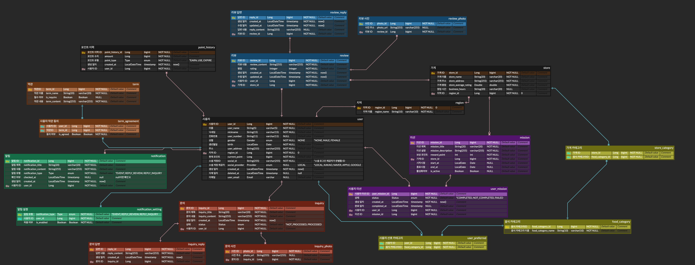
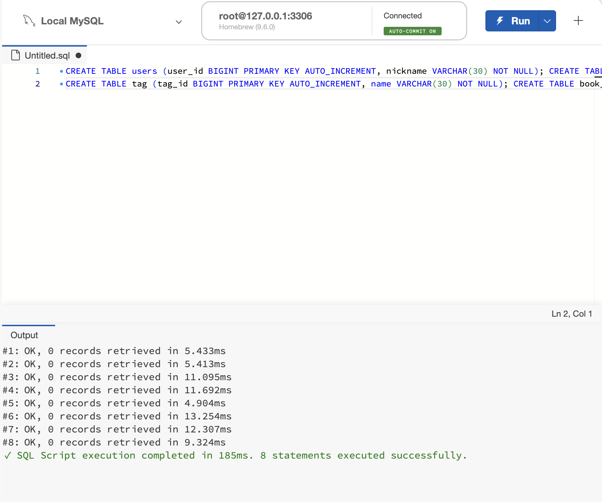
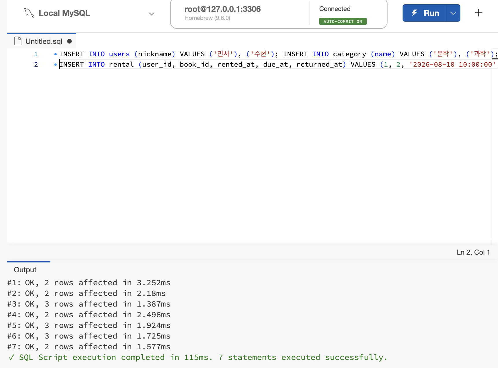
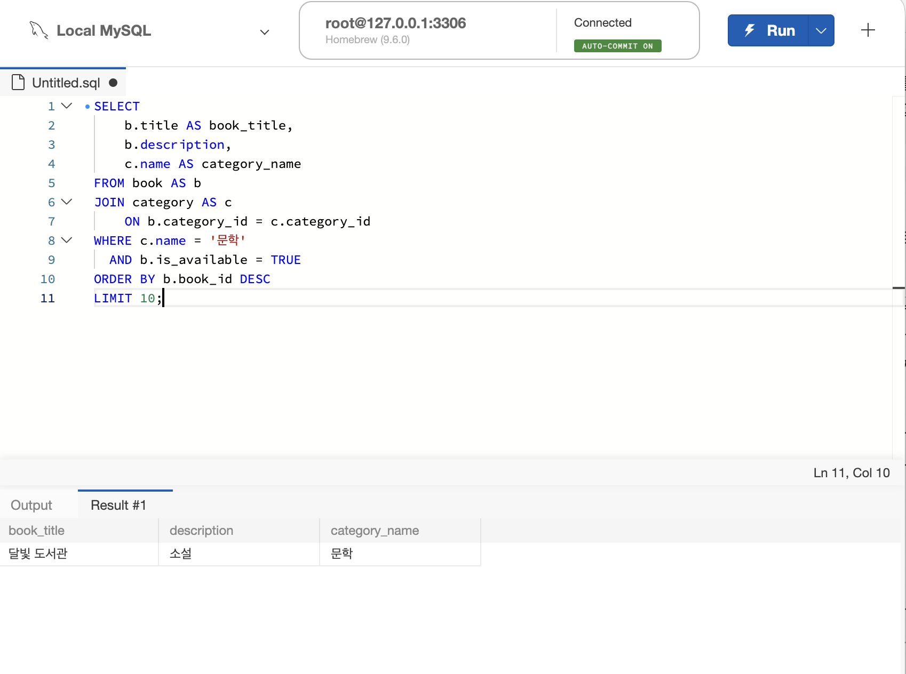
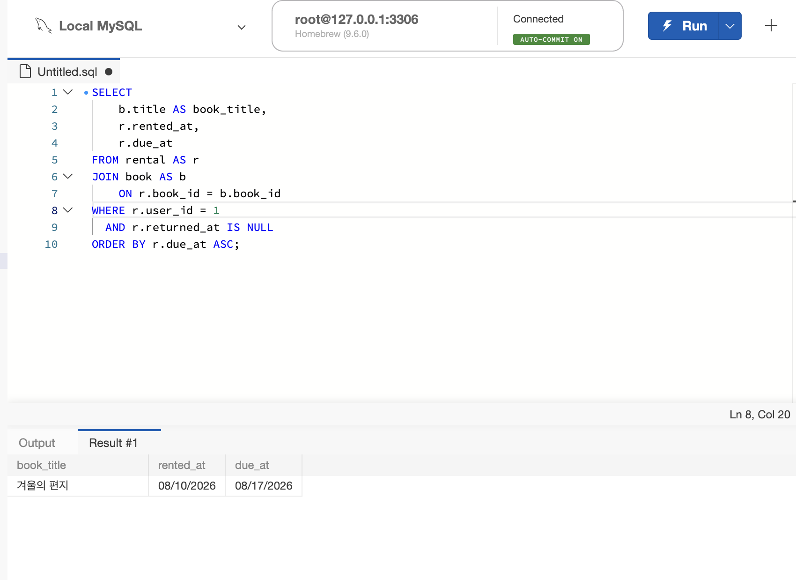
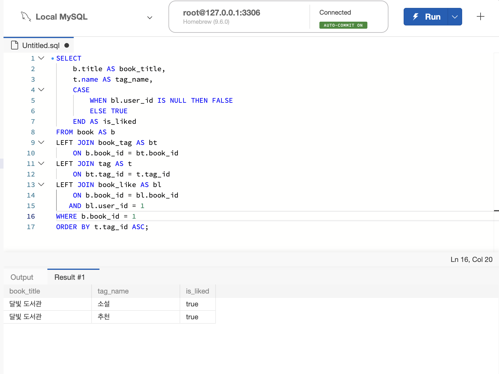

- **미션 기록**

  ERD 사진

  

  JOIN 경로 : user_mission → mission → store

  설명

    <aside>

  

  01_schema.sql 실행 화면

  

  02_seed.sql 실행화면

  

  미션 1 SQL, 실행화면

  기준 테이블은 `book`이며, 카테고리 이름을 가져오기 위해 `book.category_id → category.category_id`를 JOIN했다. 문학 카테고리이면서 대여 가능한 도서만 WHERE로 제한했고, 생성일 컬럼이 없으므로 `book_id DESC`를 최신순 기준으로 사용해 10개만 조회했다.

  

  미션 2 SQL, 실행화면

  기준 테이블은 사용자별 대여 기록을 가진 `rental`이며, 책 제목을 가져오기 위해 `rental.book_id → book.book_id`를 JOIN했다. 특정 사용자의 미반납 도서만 WHERE로 조회하고, 반납 예정일이 가까운 순서대로 `due_at ASC` 정렬했다.

  

  미션3 SQL, 실행화면

  기준 테이블은 상세 정보를 조회할 책인 `book`이며, 태그는 `book → book_tag → tag` 경로로, 좋아요 여부는 `book → book_like` 경로로 JOIN했다. 선택한 책만 WHERE로 제한하고, 태그가 없는 책이나 좋아요하지 않은 사용자도 책 정보는 보이도록 LEFT JOIN을 사용했으며 태그 ID 순으로 정렬했다.

    ```sql
    SELECT
        s.store_name,
        m.mission_title,
        m.mission_description,
        m.reward_point,
        m.end_at,
        um.status
    FROM user_mission AS um
    JOIN mission AS m
        ON um.mission_id = m.mission_id
    JOIN store AS s
        ON m.store_id = s.store_id
    WHERE um.user_id = 1
      AND m.is_active = TRUE
      AND (m.end_at IS NULL OR m.end_at >= CURRENT_DATE)
    ORDER BY m.end_at ASC;
    ```

  확장 미션

  기준 테이블은 사용자가 참여한 미션 기록을 가진 `user_mission`이며, 미션 정보와 가게 이름을 가져오기 위해 `user_mission → mission → store` 순서로 JOIN했다. 특정 사용자의 완료되지 않은 활성 미션만 WHERE로 조회하고, 화면에서 마감이 가까운 미션부터 보이도록 `end_at ASC` 정렬했다.

    </aside>