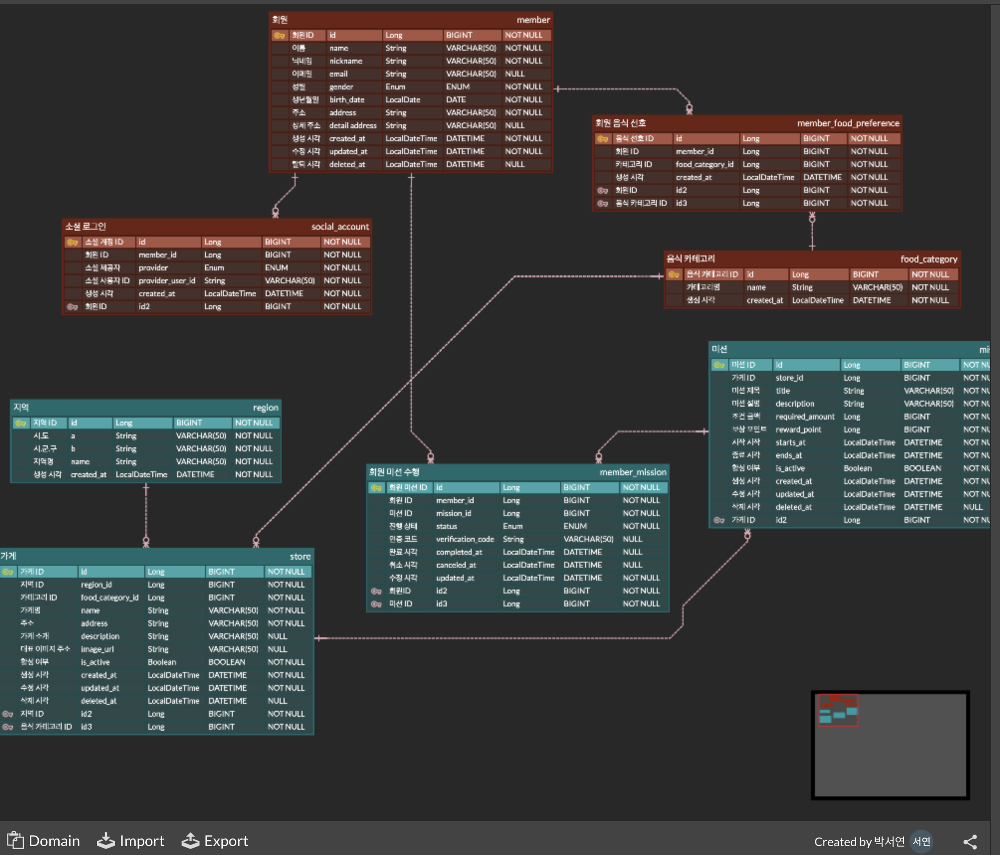
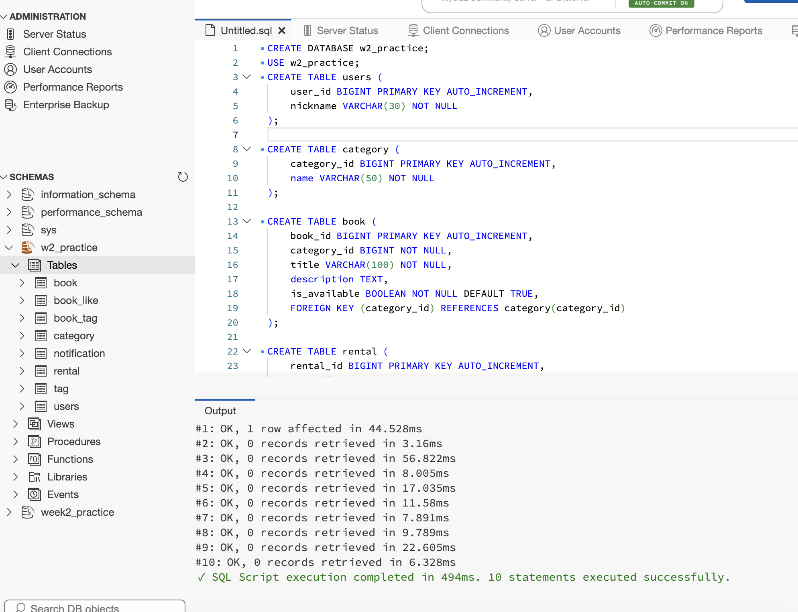
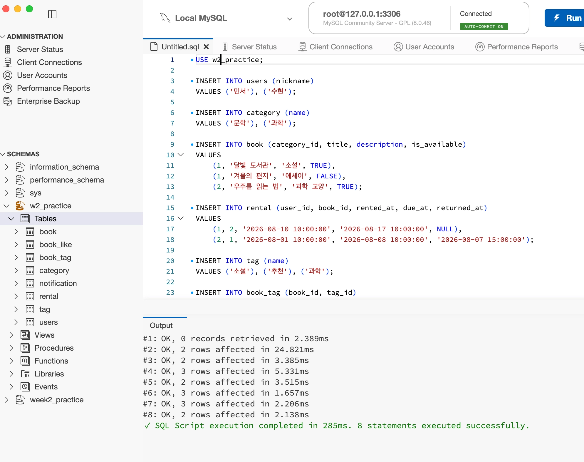
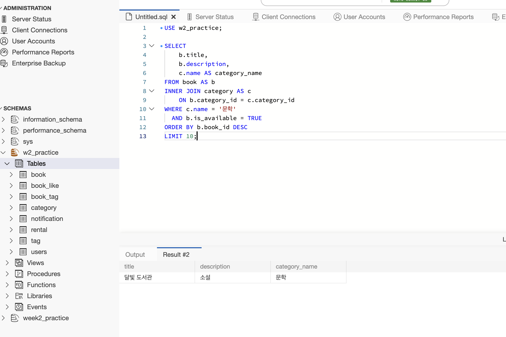
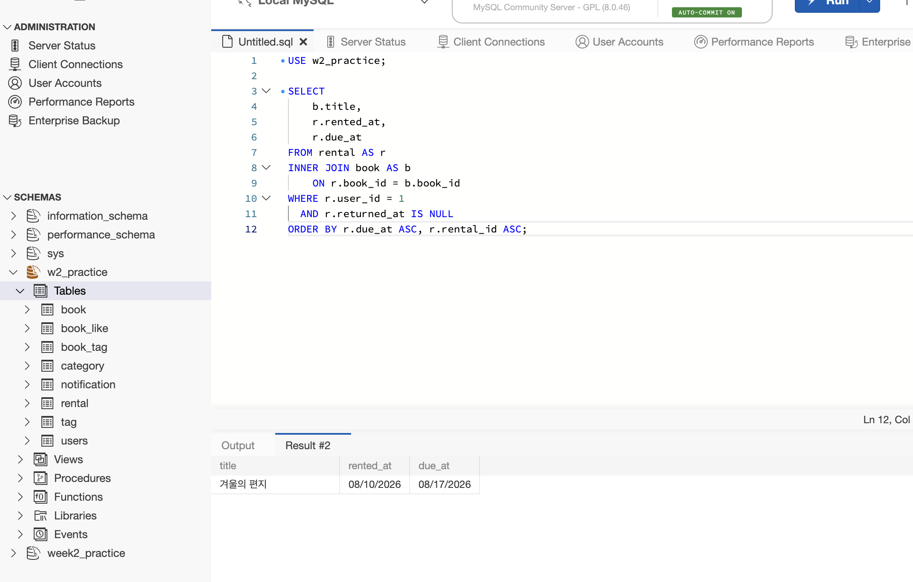
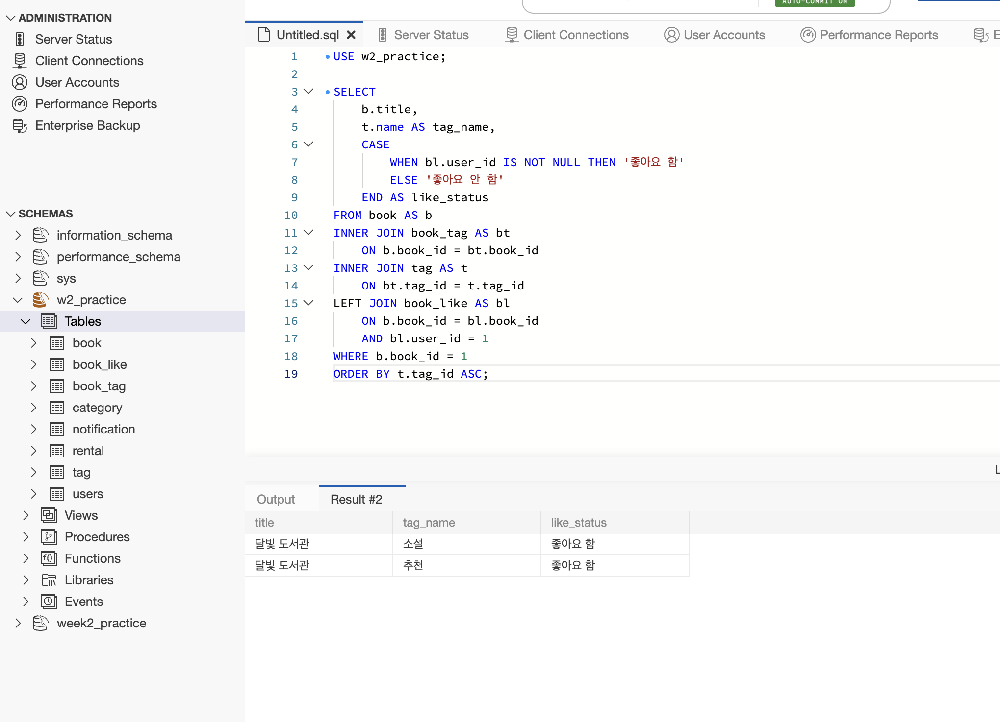

## ERD

---

## 01_schema.sql, 02_seed.sql 실행 화면

### 01_schema.sql

### 02_seed.sql

---

## 미션 1. 문학 카테고리의 대여 가능한 도서 최신순으로 10개 조회

book을 기준 테이블로 사용하며, 책의 카테고리 이름을 가져오기 위해 category를 category_id로 INNER JOIN한다. WHERE에서 카테고리 이름이 ’문학’이고 is_available이 TRUE인 책만 선택한다.  book_id 내림차순을 최신순 기준으로 사용하고, LIMIT 10으로 최대 10개를 조회한다. 

---

## 미션 2. 특정 사용자가 아직 반납하지 않은 책을 반납예정일 순으로 조회

대여 기록이 저장된 rental을 기준 테이블로 사용하며, 책 제목을 가져오기 위해 book을 book_id로 INNER JOIN한다. WHERE에서 user_id가 1인 민서의 기록 중 returned_at이 NULL인 미반납 기록만 선택한다. due_at 오름차순으로 정렬하되 같은 예정일은 rental_id 오름차순으로 정렬하고, 조회 개수 제한이 없으므로 LIMIT 없이 모두 조회한다.

---

## 미션 3. 특정 책의 태그 목록과 특정 사용자의 좋아요 여부 조회

book을 기준 테이블로 사용하고, 해당 책에 연결된 태그 이름을 가져오기 위해 book→book_tag→tag 순서로 JOIN했다. 또한 현재 사용자의 좋아요 여부를 확인하기 위해 book_like를 LEFT_JOIN했으며, WHERE에서는 조회할 책을 book_id=1로 지정했다.

태그는 tag_id 오름차순으로 정렬하고, 해당 책의 모든 태그를 조회해야 하므로 LIMIT은 사용하지 않았다.book_like는 좋아요하지 않은 경우에도 책과 태그가 조회되어야 하기 때문에 INNER JOIN이 아닌 LEFT JOIN을 사용했다.