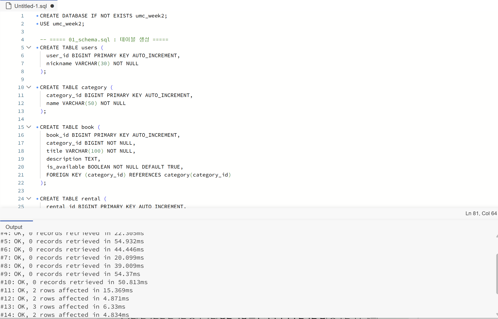
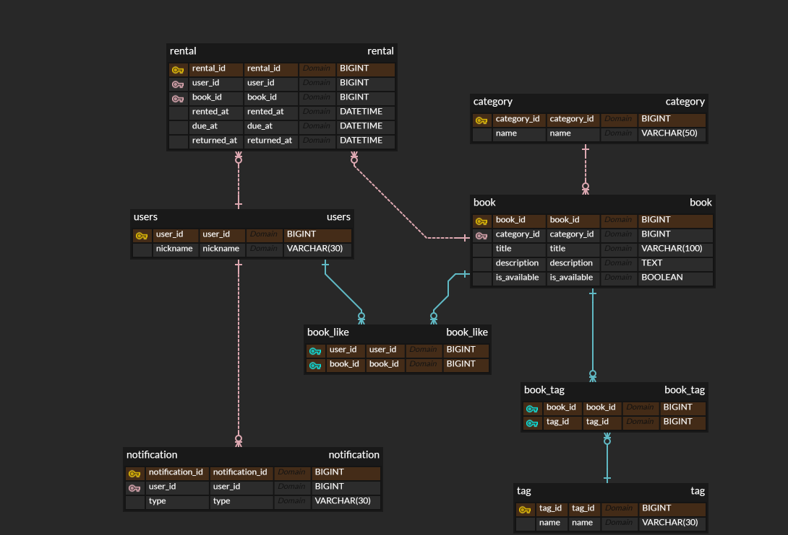
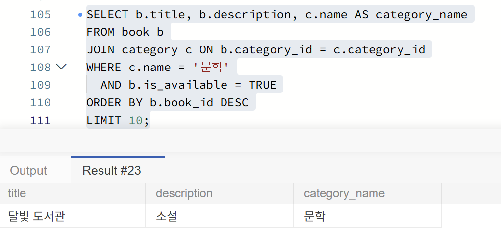
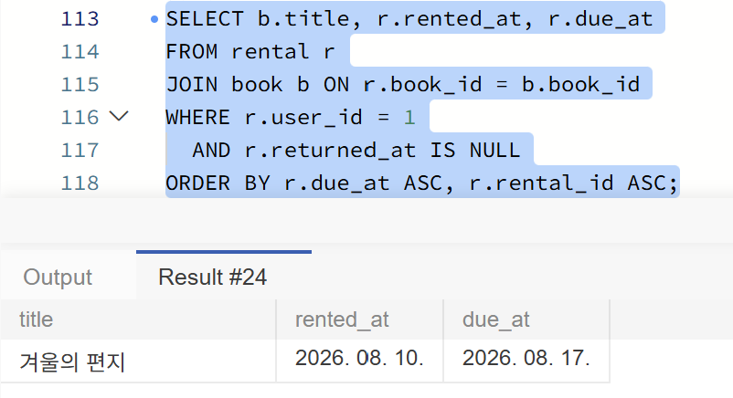
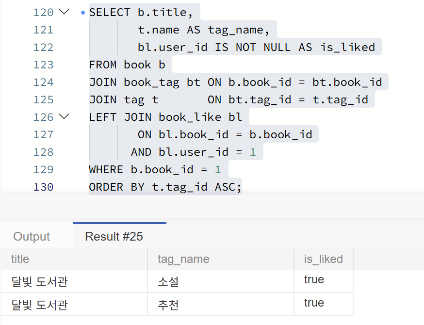
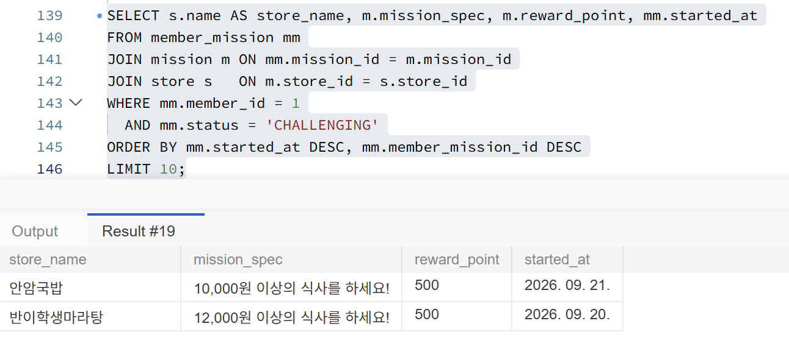

# 2주차 미션 — 요구사항을 SQL로 조회하기



## ERD



## 미션 1. 문학 카테고리의 대여 가능한 도서

```sql
SELECT b.title, b.description, c.name AS category_name
FROM book b
JOIN category c ON b.category_id = c.category_id
WHERE c.name = '문학'
  AND b.is_available = TRUE
ORDER BY b.book_id DESC
LIMIT 10;
```



기준 테이블은 `book`이고, 카테고리 이름이 `category`에만 있어 `category_id`(FK = PK)로 JOIN했다. WHERE로 문학 카테고리와 대여 가능한 책만 남기고, `book_id` 내림차순(최신순)으로 10개를 조회했다.

## 미션 2. 특정 사용자가 반납하지 않은 책

```sql
SELECT b.title, r.rented_at, r.due_at
FROM rental r
JOIN book b ON r.book_id = b.book_id
WHERE r.user_id = 1
  AND r.returned_at IS NULL
ORDER BY r.due_at ASC, r.rental_id ASC;
```



기준 테이블은 대여 기록이 있는 `rental`이고, 책 제목을 가져오기 위해 `book_id`(FK = PK)로 `book`을 JOIN했다. WHERE로 특정 사용자와 `returned_at IS NULL`인 기록만 남기고, 반납 예정일 오름차순으로 정렬했다.

## 미션 3. 특정 책의 태그 목록과 좋아요 여부

```sql
SELECT b.title,
       t.name AS tag_name,
       bl.user_id IS NOT NULL AS is_liked
FROM book b
JOIN book_tag bt ON b.book_id = bt.book_id
JOIN tag t       ON bt.tag_id = t.tag_id
LEFT JOIN book_like bl
       ON bl.book_id = b.book_id
      AND bl.user_id = 1
WHERE b.book_id = 1
ORDER BY t.tag_id ASC;
```



기준 테이블은 `book`이고, 태그는 N:M 관계라 `book_tag`를 거쳐 `tag`까지 JOIN했다. 좋아요는 없을 수도 있어 `book_like`를 LEFT JOIN하고 사용자 조건을 ON 절에 두었으며, 특정 책만 WHERE로 조회하고 `tag_id`로 정렬했다.

## 1주차 ERD 확장 쿼리

**요구사항**: 특정 사용자가 진행 중인 미션을 최근 도전한 순으로 보여 준다.

```sql
SELECT s.name AS store_name, m.mission_spec, m.reward_point, mm.started_at
FROM member_mission mm
JOIN mission m ON mm.mission_id = m.mission_id
JOIN store s   ON m.store_id = s.store_id
WHERE mm.member_id = 1
  AND mm.status = 'CHALLENGING'
ORDER BY mm.started_at DESC, mm.member_mission_id DESC
LIMIT 10;
```



기준 테이블은 회원의 미션 기록이 있는 `member_mission`이고, 미션 정보와 가게 이름을 위해 `mission → store` 순으로 JOIN했다. WHERE로 특정 회원의 진행 중 미션만 남기고, 최근 도전 순으로 10개를 조회했다.