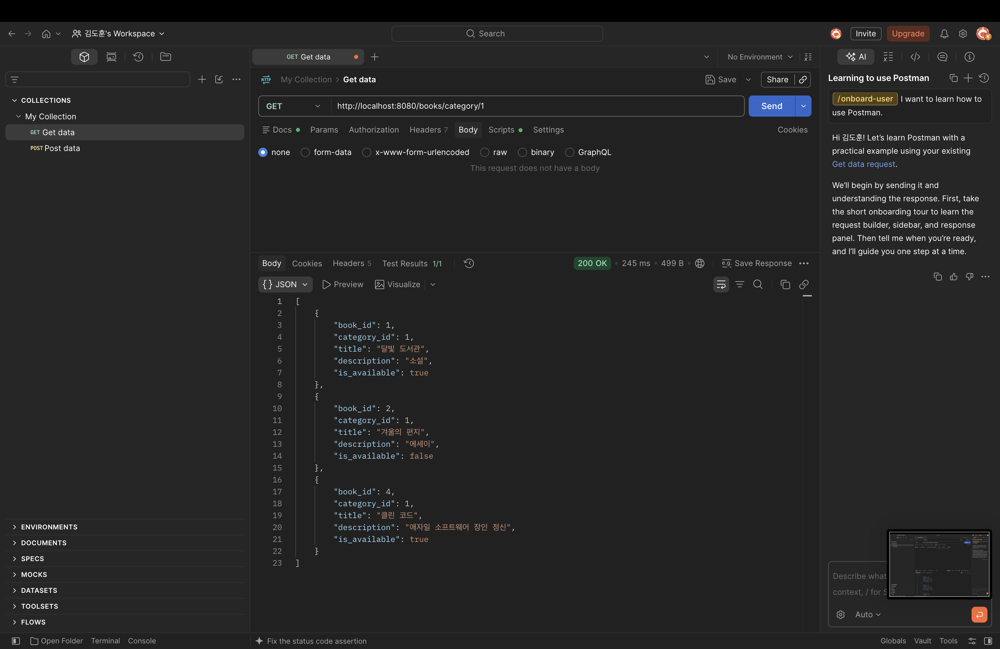
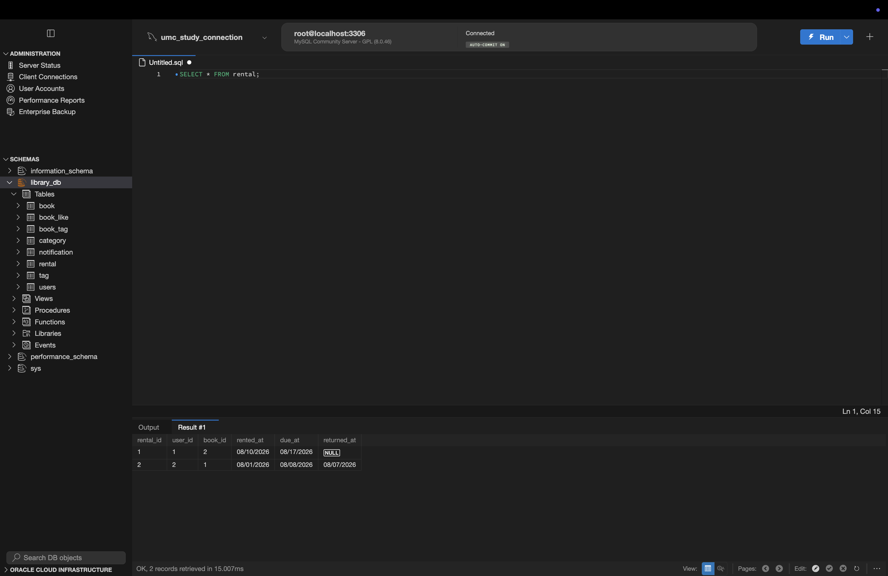
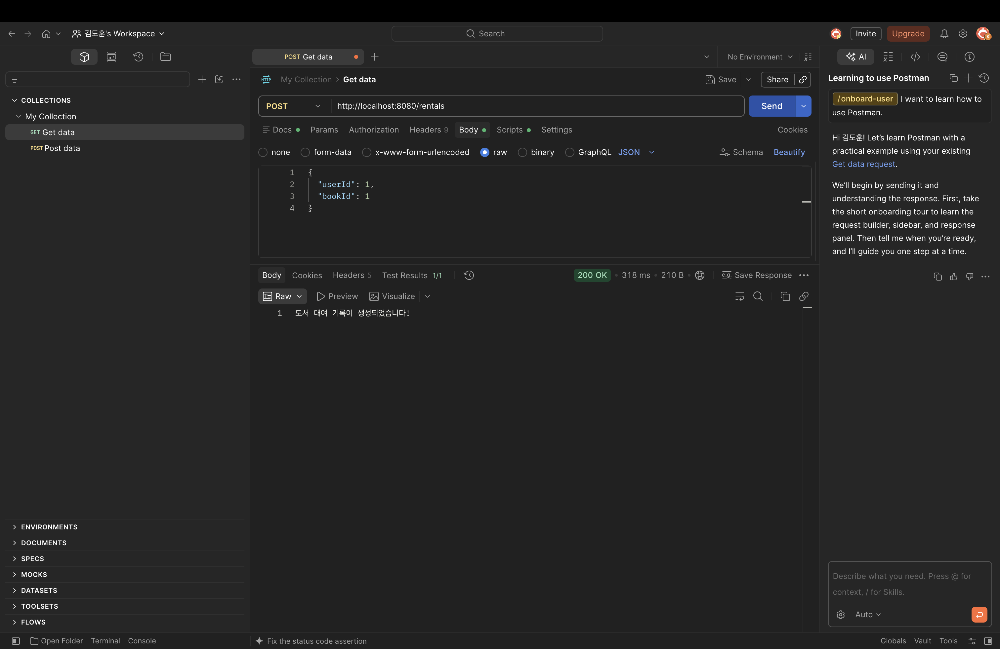
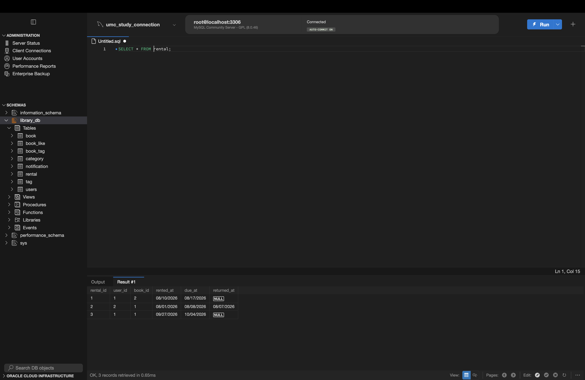

# Backend Chapter03

## 미션 기록

## 미션 1 · 특정 카테고리 도서 목록 조회 API 구현

**`GET /books/category/{categoryId}`**

### 요구사항

- Path Variable(경로 변수)로 categoryId를 전달받습니다.
- `WHERE category_id = ?` 조건절을 적용한 생 SQL 쿼리를 작성하여 해당 카테고리의 책들만 반환하세요.

### 전체 데이터 흐름

```
[클라이언트 (Postman)]
       │  HTTP GET /books/category/1
       ▼
[BookController] ── @PathVariable("categoryId")로 '1' 추출 (long type)
       │  bookService.getBooksByCategory(1)
       ▼
[BookService] ── 비즈니스 로직 처리 및 중계
       │  bookRepository.findBooksByCategoryId(1)
       ▼
[BookRepository] ── JdbcTemplate.queryForList("SELECT * FROM book WHERE category_id = ?", 1)
       │  SQL 실행 요청
       ▼
[MySQL Database] ── category_id = 1 조건에 일치하는 행(Row)만 필터링하여 반환
       │
       ▼ (역방향 전달)
[스프링 부트 엔진] ── 데이터를 JSON 배열([ {...}, {...} ])로 직렬화
       │
       ▼  HTTP 200 OK + JSON Body
[클라이언트 (Postman 화면에 출력)]
```

### 계층별 역할 구분

#### BookController

역할: 클라이언트의 HTTP 요청 진입점(Presentation Layer)으로서, URL 경로의 데이터를 검증·추출하고 비즈니스 계층의 처리 결과를 JSON 응답으로 반환합니다. `@GetMapping("/category/{categoryId}")`로 엔드포인트를 매핑하고, `@PathVariable`을 사용해 URL 경로에 포함된 `categoryId`를 `Long` 타입으로 추출한 뒤 `BookService`로 넘깁니다.

```java
import org.springframework.web.bind.annotation.PathVariable;

// URL 경로의 {categoryId} 값을 @PathVariable을 통해 Long 타입 변수로 꺼냅니다.
@GetMapping("/category/{categoryId}")
public List<Map<String, Object>> getBooksByCategory(@PathVariable("categoryId") Long categoryId) {
    return bookService.getBooksByCategory(categoryId);
}
```

#### BookService

역할: 핵심 업무 규칙과 작업 흐름(Business Layer)을 담당하며, 컨트롤러와 리포지토리 사이에서 데이터 검증 및 유스케이스 조율을 전담합니다. 컨트롤러로부터 전달받은 `categoryId`를 받아 도서 조회라는 비즈니스 흐름을 처리하고, 실제 DB 조회를 위해 `BookRepository`의 메서드를 호출하여 결과를 상위 계층으로 전달합니다.

```java
// 카테고리 ID를 넘겨받아 창고지기(Repository)에게 DB 조회를 요청합니다.
public List<Map<String, Object>> getBooksByCategory(Long categoryId) {
    return bookRepository.findBooksByCategoryId(categoryId);
}
```

#### BookRepository

역할: 데이터베이스와의 직접 통신(Persistence Layer)을 전담하며, 상위 계층이 비즈니스 로직에만 집중할 수 있도록 실제 쿼리 실행 및 데이터 매핑만을 처리합니다. `JdbcTemplate`을 활용해 SQL Injection을 방지하는 파라미터 바인딩(`WHERE category_id = ?`) 쿼리를 작성하고, 조회된 도서 레코드 목록을 `List<Map<String, Object>>` 형태로 반환합니다.

```java
// 카테고리별 도서 조회 쿼리문 실행
public List<Map<String, Object>> findBooksByCategoryId(Long categoryId) {
    // 1. ? 바인딩 문법을 사용한 생 SQL 쿼리 정의
    String sql = "SELECT * FROM book WHERE category_id = ?";

    // 2. ? 자리에 categoryId 값을 채워 넣어 MySQL에 쿼리를 전송합니다.
    // 조회된 레코드 목록을 List<Map<컬럼명, 데이터값>> 형태로 변환하여 반환합니다.
    return jdbcTemplate.queryForList(sql, categoryId);
}
```

### 과제 결과



### 트러블슈팅

**Trailing Slash(`/`)로 인한 404 Not Found**

- **원인:** Spring Boot 3.x부터는 URL 끝의 슬래시를 엄격히 구분하여 `/books/category/1/` 요청 시 매핑을 찾지 못함.
- **해결:** Postman 주소 끝의 `/`를 제거하고 `@PathVariable` import 누락을 해결한 뒤 재시작.

**Path Variable vs Request Body**

- **Path Variable:** 리소스의 고유 식별자(ID)를 URL 경로의 일부로 명시할 때 사용 (`/books/category/{categoryId}`).
- **Request Body:** 생성/수정할 복잡한 데이터 객체를 HTTP 본문에 JSON 형식으로 전달할 때 사용 (`POST /books`, `POST /rentals`).

---

## 미션 2 · 신규 도서 대여 기록 생성 API 구현

**`POST /rentals`**

### 요구사항

- Request Body로 userId와 bookId를 전달받습니다.
- rental 테이블에 대여 기록을 삽입하는 쿼리를 작성하세요.
  (rented_at은 현재 시간 NOW(), due_at은 7일 뒤인 DATE_ADD(NOW(), INTERVAL 7 DAY)로 설정)

### 전체 데이터 흐름

```
[클라이언트 (Postman)]
       │  HTTP POST /rentals
       │  JSON Body: {"userId": 1, "bookId": 1}
       ▼
[RentalController] ── @RequestBody로 Map<String, Object> 본문 수신
       │  rentalService.createRental(body)
       ▼
[RentalService] ── "userId", "bookId" 추출 후 Long 타입 형변환(1L, 1L)
       │  rentalRepository.saveRental(1L, 1L)
       ▼
[RentalRepository] ── JdbcTemplate.update(INSERT INTO rental ..., 1L, 1L)
       │  SQL 실행 요청 (NOW(), DATE_ADD 함수 포함)
       ▼
[MySQL Database] ── rental 테이블에 신규 대여 레코드 1건 INSERT
       │
       ▼ (역방향 전달: 영향받은 행 수 1 반환)
[스프링 부트 엔진] ── 성공 응답 문자열("도서 대여 기록이 생성되었습니다!") 처리
       │
       ▼  HTTP 200 OK + 텍스트 본문
[클라이언트 (Postman 화면에 출력)]
```

### 계층별 역할 구분

#### RentalController

역할: 클라이언트의 `POST` 요청 본문(JSON)을 수신하여 비즈니스 계층에 전달하고, 작업 완료 메시지를 응답하는 표현 계층(Presentation Layer) 역할을 수행합니다. `@PostMapping`과 `@RequestBody`를 사용해 클라이언트가 보낸 JSON 데이터를 `Map<String, Object>` 형태로 받아 `RentalService`로 전달합니다.

```java
// POST http://localhost:8080/rentals
@PostMapping
public String createRental(@RequestBody Map<String, Object> body) {
    rentalService.createRental(body);
    return "도서 대여 기록이 생성되었습니다!";
}
```

#### RentalService

역할: 요청된 대여 데이터를 비즈니스 규칙에 맞게 가공하고 트랜잭션 흐름을 제어하는 비즈니스 계층(Business Layer) 역할을 수행합니다. 전달받은 `Map` 객체에서 `"userId"`와 `"bookId"` 키값을 추출하고 문자열 변환을 거쳐 `Long` 타입으로 파싱한 뒤, 영속성 계층인 `RentalRepository`로 전달합니다.

```java
public void createRental(Map<String, Object> body) {
    // Request Body에서 userId와 bookId 추출 후 Long 변환
    Long userId = Long.valueOf(String.valueOf(body.get("userId")));
    Long bookId = Long.valueOf(String.valueOf(body.get("bookId")));

    rentalRepository.saveRental(userId, bookId);
}
```

#### RentalRepository

역할: MySQL 데이터베이스와 직접 통신하여 신규 대여 레코드를 저장하는 데이터 접근 계층(Persistence Layer) 역할을 수행합니다. `JdbcTemplate.update()`를 사용하여 `rental` 테이블에 삽입하는 SQL을 작성하고, 파라미터 바인딩을 통해 안전하게 실행합니다.

```java
public void saveRental(Long userId, Long bookId) {
    // 요구사항: rented_at은 NOW(), due_at은 DATE_ADD(NOW(), INTERVAL 7 DAY)
    String sql = "INSERT INTO rental (user_id, book_id, rented_at, due_at) " +
            "VALUES (?, ?, NOW(), DATE_ADD(NOW(), INTERVAL 7 DAY))";

    // INSERT 작업은 jdbcTemplate.update()를 사용합니다.
    jdbcTemplate.update(sql, userId, bookId);
}
```

### 과제 결과

**과제 전**



**Postman 성공**



**과제 후**


