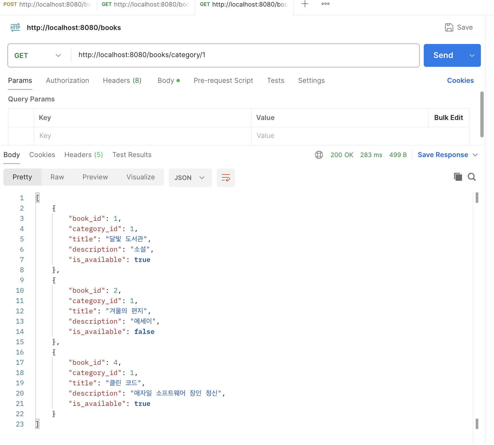
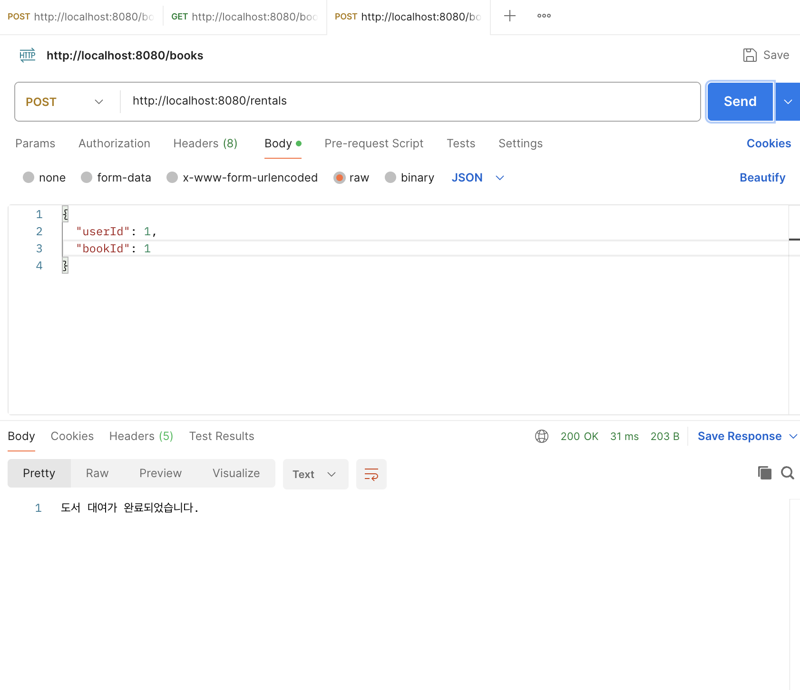
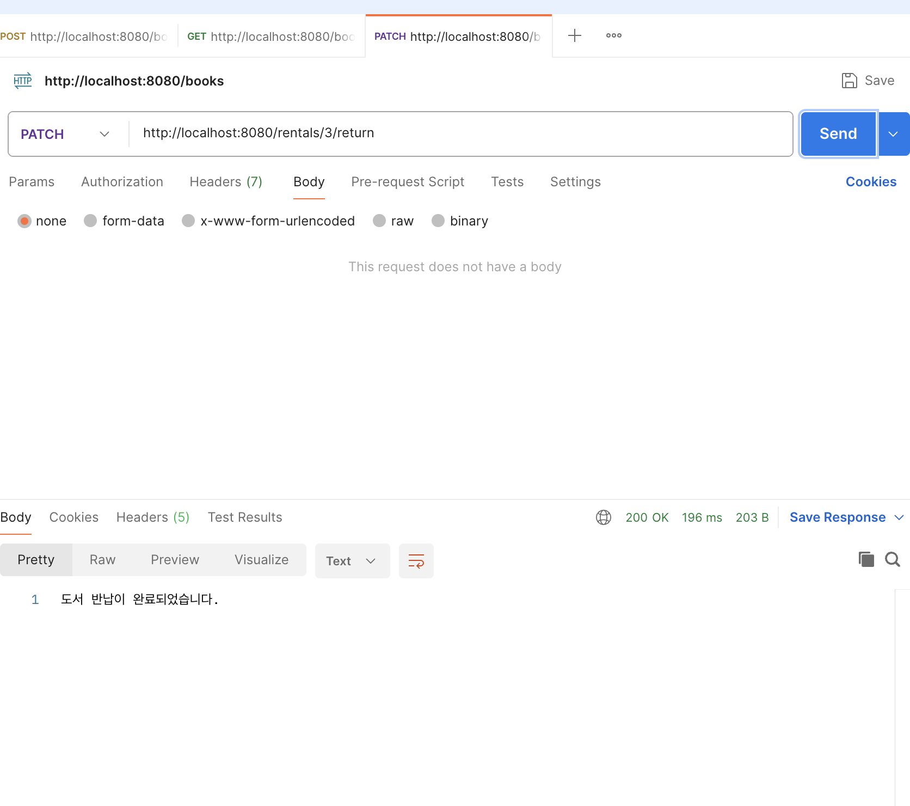

- **미션 기록**

  **필수 미션**

  **1. 특정 카테고리 도서 목록 조회**

    ```java
    @GetMapping("/books/category/{categoryId}")
    public List<Map<String, Object>> getBooksByCategoryId(
            @PathVariable Long categoryId
    ) {
        return bookService.getAllBooksByCategoryId(categoryId);
    }
    ```

    ```java
    public List<Map<String, Object>> findAllByCategory(Long categoryId) {
        String sql = "SELECT * FROM book WHERE category_id = ?";
    
        return jdbcTemplate.queryForList(sql, categoryId);
    }
    ```

    - 경로 변수로 받은 `categoryId`를 Service를 거쳐 Repository에 전달. `WHERE category_id = ?`로 해당 카테고리의 도서만 조회하고, 값을 SQL 문자열에 붙이지 않고 바인딩.

  

  **2. 신규 도서 대여 기록 생성**

    ```java
    @PostMapping("/rentals")
    public String createRental(
            @RequestBody
            Map<String, Object> body
    ) {
        bookService.createRental(body);
        return "도서 대여가 완료되었습니다.";
    }
    ```

    ```java
    public void saveRental(Map<String, Object> body) {
        String sql = "INSERT INTO rental (user_id, book_id, rented_at, due_at) VALUES (?, ?, NOW(), DATE_ADD(NOW(), INTERVAL 7 DAY))";
    
        jdbcTemplate.update(
                sql,
                body.get("userId"),
                body.get("bookId")
        );
    }
    ```

    - 요청 본문의 `userId`, `bookId`를 받아 대여 기록을 INSERT. 두 ID는 `?`에 바인딩하고, 대여 시각과 7일 뒤 반납 예정일은 DB의 `NOW()`, `DATE_ADD()`로 계산.

  

  **선택 미션**

  **도서 반납 처리**

    ```java
    @PatchMapping("/rentals/{rentalId}/return")
    public String updateRental(
            @PathVariable Long rentalId
    ) {
        bookService.updateRental(rentalId);
        return "도서 반납이 완료되었습니다.";
    }
    ```

    ```java
    public void updateRental(Long rentalId) {
        String sql = "UPDATE rental SET returned_at = NOW() WHERE rental_id = ?";
    
        jdbcTemplate.update(
                sql,
                rentalId
        );
    }
    ```

    - 경로 변수 `rentalId`로 수정할 대여 기록을 지정하고, 새 기록을 만드는 대신 기존 행의 `returned_at`만 현재 시각으로 갱신.

  