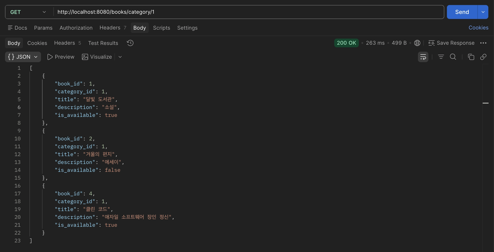
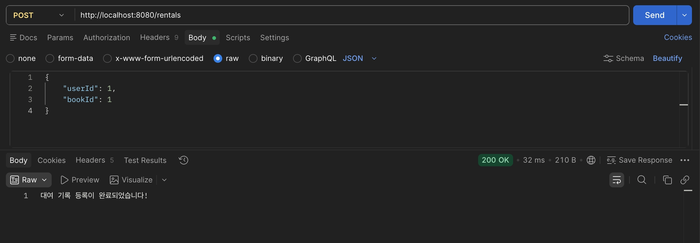

- **미션 기록**
    
    ## 미션 1. 특정 카테고리 도서 목록 조회 API
    
    **`GET /books/category/{categoryId}`**
    
    - Path Variable로 `categoryId`를 전달받는다.
    - `WHERE category_id = ?` 조건절을 쓴 생 SQL로 해당 카테고리의 책만 반환한다.
    
    ### 1. Repository
    
    ```java
    // BookRepository
    public List<Map<String, Object>> findByCategoryId(Long categoryId) {
        String sql = "SELECT * FROM book WHERE category_id = ?";
    
        return jdbcTemplate.queryForList(
                sql,
                categoryId
        );
    }
    ```
    
    ### 2. Service
    
    ```java
    // BookService
    public List<Map<String, Object>> getBooksByCategory(Long categoryId){
        return bookRepository.findByCategoryId(categoryId);
    }
    ```
    
    ### 3. Controller
    
    ```java
    // BookController  (클래스에 @RequestMapping("/books"))
    @GetMapping("/category/{categoryId}")
    public List<Map<String, Object>> getBooksByCategory(@PathVariable Long categoryId){
        return bookService.getBooksByCategory(categoryId);
    }
    ```
    
    ### 4. Postman
    
    - Method: **GET**
    - URL: `http://localhost:8080/books/category/1`
    
    
    
    ---
    
    ## 미션 2. 신규 도서 대여 기록 생성 API
    
    **`POST /rentals`**
    
    - Request Body로 `userId`, `bookId`를 전달받는다.
    - `rental` 테이블에 INSERT. `rented_at`은 `NOW()`, `due_at`은 `DATE_ADD(NOW(), INTERVAL 7 DAY)`.
    
    ### 1. Repository
    
    ```java
    // RentalRepository
    public void save(Map<String,Object> body){
        String sql = "INSERT INTO rental (user_id, book_id, rented_at, due_at) VALUES (?, ?, NOW(),DATE_ADD(NOW(), INTERVAL 7 DAY))";
    
        jdbcTemplate.update(
                sql,
                body.get("userId"),
                body.get("bookId")
        );
    }
    ```
    
    ### 2. Service
    
    ```java
    // RentalService
    public void createRental(Map<String, Object> body){
        rentalRepository.save(body);
    }
    ```
    
    ### 3. Controller
    
    ```java
    // RentalController
    @RestController
    @RequestMapping("/rentals")
    @RequiredArgsConstructor
    public class RentalController {
    
        private final RentalService rentalService;
    
        @PostMapping()
        public String createRental(@RequestBody Map<String, Object> body){
            rentalService.createRental(body);
            return "대여 기록 등록이 완료되었습니다!";
        }
    }
    ```
    
    ### 4. Postman
    
    - Method: **POST**
    - URL: `http://localhost:8080/rentals`
    - Body → **raw → JSON**
    
    
