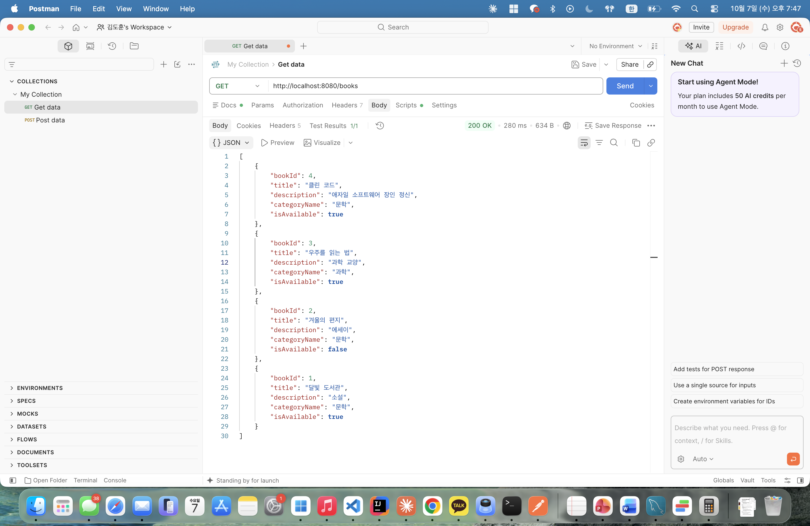
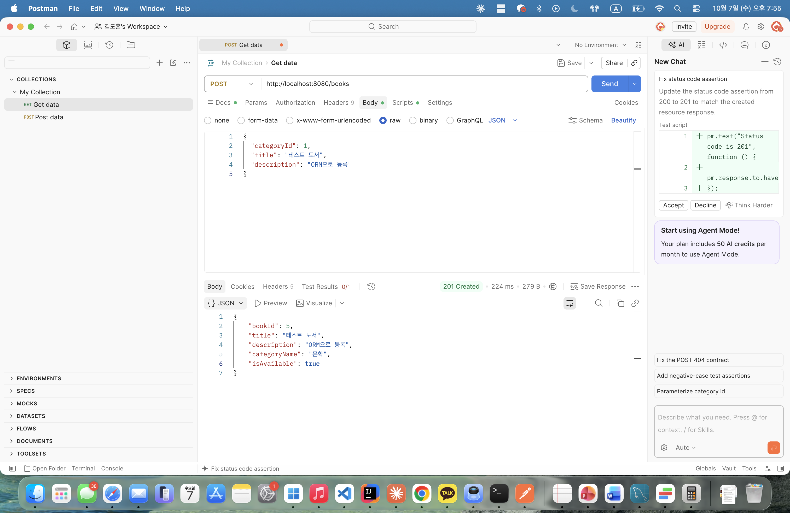
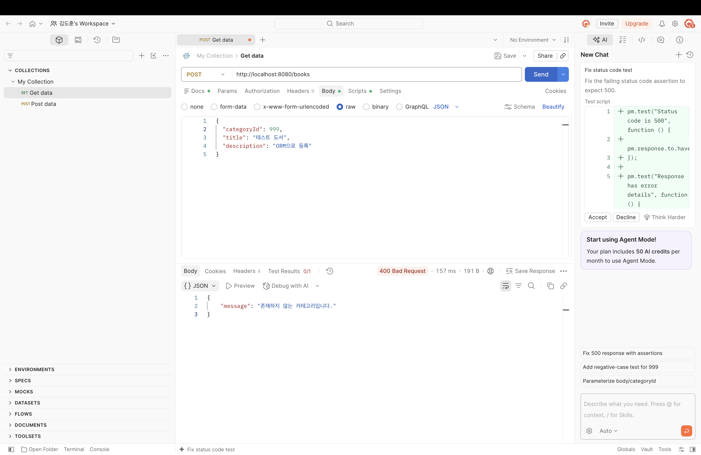
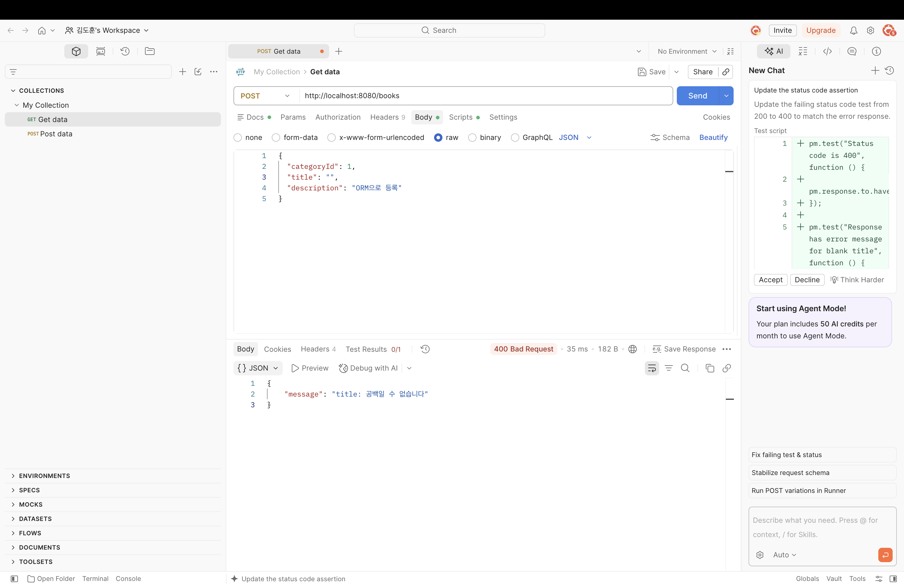

- **미션 기록**

# Backend Chapter04

- 작업 브랜치: `feature/week4` (3주차 커밋 `5736849`에서 분기)

---

## 1. 필수 구현

3주차의 `GET /books`, `POST /books`를 그대로 두고, 내부 구현만 Raw SQL에서 JPA로 바꿨습니다.

### 1-1. 엔티티와 다대일 관계

`book` 테이블을 `Book`, `category` 테이블을 `Category` 엔티티로 옮겼습니다. `book.category_id` FK는 `@ManyToOne`으로 표현해서 FK 숫자 대신 객체 관계를 갖게 했습니다.

```java
@Entity
@Table(name = "book")
public class Book {

    @Id
    @GeneratedValue(strategy = GenerationType.IDENTITY)
    @Column(name = "book_id")
    private Long bookId;

    @ManyToOne(fetch = FetchType.LAZY)
    @JoinColumn(name = "category_id", nullable = false)
    private Category category;

    @Column(nullable = false, length = 100)
    private String title;

    @Column(columnDefinition = "TEXT")
    private String description;

    @Column(name = "is_available", nullable = false)
    private Boolean isAvailable = true;
    // ...
}
```

```java
@Entity
@Table(name = "category")
public class Category {

    @Id
    @GeneratedValue(strategy = GenerationType.IDENTITY)
    @Column(name = "category_id")
    private Long categoryId;

    @Column(nullable = false, length = 50)
    private String name;
}
```

- 코드의 camelCase 필드와 DB의 snake_case 컬럼은 `@Column(name = ...)`으로 명시해서 매핑했습니다.
- `application.yaml`에 `ddl-auto: validate`를 설정했습니다. 서버가 뜰 때 엔티티와 실제 테이블 구조가 맞는지 검증하고, 불일치하면 기동이 실패합니다.
- `open-in-view: false`로 설정했습니다. 그래서 엔티티를 Controller로 그대로 반환하지 않고, Service의 트랜잭션 안에서 DTO로 변환합니다.

### 1-2. Repository: SQL 없이 조회와 저장

```java
public interface BookRepository extends JpaRepository<Book, Long> {
    List<Book> findAllByOrderByBookIdDesc();   // 최신 등록순 조회
}

public interface CategoryRepository extends JpaRepository<Category, Long> {
}
```

`JpaRepository`가 `save`, `findById` 같은 기본 CRUD를 제공하고, 최신순 조회는 메서드 이름만으로 쿼리가 만들어집니다. `CategoryRepository`는 POST에서 카테고리 존재 여부를 확인하는 데 씁니다.

### 1-3. DTO: 요청과 응답의 모양을 분리

```java
public record CreateBookRequest(
        @NotNull Long categoryId,
        @NotBlank @Size(max = 100) String title,
        String description
) {}

public record BookResponse(
        Long bookId, String title, String description,
        String categoryName, Boolean isAvailable
) {
    public static BookResponse from(Book book) {
        return new BookResponse(
                book.getBookId(), book.getTitle(), book.getDescription(),
                book.getCategory().getName(), book.getIsAvailable());
    }
}
```

- 요청 DTO: `categoryId`는 필수, `title`은 공백 불가 및 100자 이하, `description`은 선택 값입니다.
- 응답 DTO: DB 컬럼명 대신 `bookId`, `title`, `description`, `categoryName`, `isAvailable`만 내보냅니다.

### 1-4. Service

```java
@Transactional(readOnly = true)
public List<BookResponse> getBooks() {
    return bookRepository.findAllByOrderByBookIdDesc().stream()
            .map(BookResponse::from)
            .toList();
}

@Transactional
public BookResponse createBook(CreateBookRequest request) {
    Category category = categoryRepository.findById(request.categoryId())
            .orElseThrow(() -> new IllegalArgumentException("존재하지 않는 카테고리입니다."));

    Book book = new Book(category, request.title(), request.description());
    return BookResponse.from(bookRepository.save(book));
}
```

- `getBooks()`: 최신순으로 엔티티를 조회한 뒤 DTO로 변환합니다. `Category`가 LAZY 로딩이라 트랜잭션 안에서 변환해야 `categoryName`을 안전하게 읽습니다.
- `createBook()`: `categoryId`가 실제로 존재하는지 먼저 확인하고, 없으면 예외를 던져서 저장하지 않습니다.

### 1-5. Controller

```java
@GetMapping
public List<BookResponse> getBooks() {
    return bookService.getBooks();
}

@PostMapping
@ResponseStatus(HttpStatus.CREATED)
public BookResponse createBook(@Valid @RequestBody CreateBookRequest request) {
    return bookService.createBook(request);
}
```

`@Valid`로 요청이 Service에 도달하기 전에 DTO 검증을 수행하고, POST 성공 시 `201 Created`를 반환합니다.

### 1-6. 예외 처리

```java
@RestControllerAdvice
public class GlobalExceptionHandler {

    @ExceptionHandler(MethodArgumentNotValidException.class)   // DTO 검증 실패
    public ResponseEntity<Map<String, String>> handleValidation(MethodArgumentNotValidException e) { ... 400 }

    @ExceptionHandler(IllegalArgumentException.class)          // 없는 카테고리
    public ResponseEntity<Map<String, String>> handleIllegalArgument(IllegalArgumentException e) { ... 400 }
}
```

두 경우 모두 `400 Bad Request`와 `{"message": "..."}` 형태로 응답합니다. 이 핸들러가 없으면 없는 카테고리는 500(서버 오류)으로 나갑니다.

---

## 2. 실행 결과 (Postman)

### 1) 도서 전체 목록 조회 (GET /books)

`GET /books`를 호출했습니다.



`200 OK`가 나오고, 도서가 `bookId` 4, 3, 2, 1 순서로 최신순 정렬되어 내려옵니다. 응답에는 `bookId`, `title`, `description`, `categoryName`, `isAvailable` 다섯 필드만 있고 DB 컬럼명은 보이지 않으므로 검증 완료.

### 2) 신규 도서 등록 (POST /books)

`categoryId: 1`, `title`, `description`을 담아 `POST /books`를 호출했습니다.



`201 Created`가 나오고, `bookId: 5`가 자동 부여되며 `categoryName: "문학"`이 함께 내려옵니다. 도서가 저장되고 카테고리와 연결됐으므로 검증 완료.

### 3) 존재하지 않는 카테고리 오류

`categoryId: 999`로 `POST /books`를 호출했습니다.



`400 Bad Request`와 `"존재하지 않는 카테고리입니다."`가 나옵니다. 저장하지 않고 서버 오류(500)가 아닌 클라이언트 오류로 응답했으므로 검증 완료.

### 4) 요청 검증 실패 오류

`title`을 빈 문자열 `""`로 해서 `POST /books`를 호출했습니다.



`400 Bad Request`와 `"title: 공백일 수 없습니다"`가 나옵니다. `@NotBlank` 검증이 Service에 도달하기 전에 요청을 막았고, 문제가 된 필드도 알려 주므로 검증 완료.

> **검증:** GET은 5개 필드를 최신순으로, POST는 201과 저장된 도서를, 없는 `categoryId`와 빈 `title`은 400과 원인 메시지를 반환해서 요구사항과 일치합니다.

---

## 3. 3주차 Raw SQL 방식과 바뀐 점

| 구분 | 3주차 (Raw SQL) | 4주차 (JPA) |
| --- | --- | --- |
| 데이터 접근 | `JdbcTemplate`으로 SQL 문자열을 직접 작성하고 `?` 파라미터 순서를 직접 관리 | 엔티티와 `JpaRepository` 메서드가 SQL 생성을 담당 |
| 데이터 모양 | `List<Map<String, Object>>`, 컬럼명이 그대로 응답에 노출 | 엔티티는 DB 구조, DTO는 API 계약으로 분리 |
| 요청 검증 | 없음 (`Map`을 그대로 받아 사용) | `@Valid`와 `@NotNull`, `@NotBlank`, `@Size`로 사전 검증 |
| 관계 표현 | `category_id` 숫자만 들고 다님 | `@ManyToOne`으로 `Book`과 `Category`의 객체 관계 표현 |
| 오류 처리 | 없는 `categoryId`는 DB FK 오류로 이어짐 | 저장 전에 존재 여부를 확인하고 400으로 응답 |

3주차에는 SQL 문자열과 파라미터 순서, DB 컬럼명이 코드와 응답에 그대로 드러났습니다. 4주차에는 엔티티와 Repository 메서드로 조회와 저장을 표현하고, DTO로 API에 필요한 데이터만 골라 보냅니다. 또 요청 검증과 예외 처리가 추가되어 잘못된 요청이 DB까지 가기 전에 걸러집니다. 다만 ORM이 DB 지식을 대체하지는 않았습니다. FK 관계를 이해해야 `@ManyToOne`을 매핑할 수 있었고, LAZY 로딩 때문에 트랜잭션 범위를 알아야 `categoryName`을 안전하게 읽을 수 있었습니다.

---