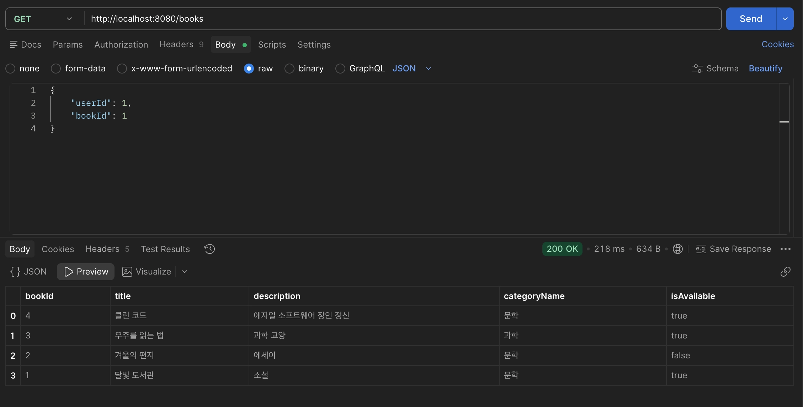
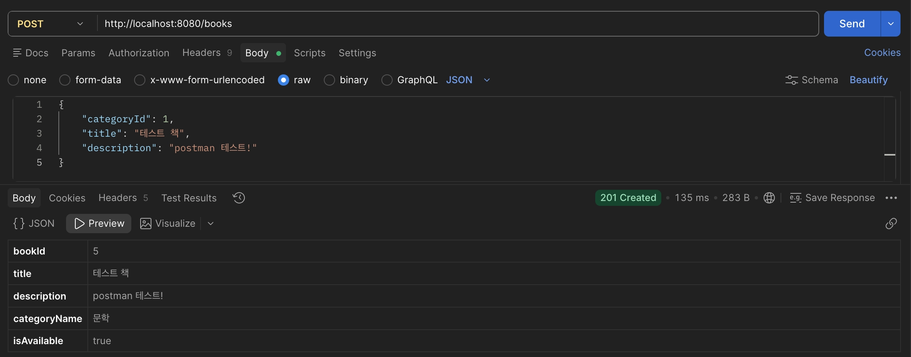
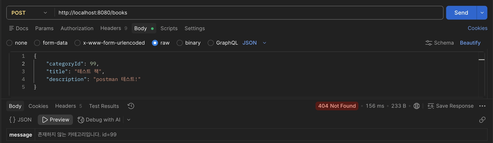

- **미션 기록**
    
    ## 1. 핵심 코드
    
    ### Entity
    
    ```java
    @Entity
    @Table(name = "book")
    @Getter
    @NoArgsConstructor(access = AccessLevel.PROTECTED)
    public class Book {
    
        @Id
        @GeneratedValue(strategy = GenerationType.IDENTITY)
        @Column(name = "book_id")
        private Long bookId;
    
        @ManyToOne(fetch = FetchType.LAZY)
        @JoinColumn(name = "category_id", nullable = false)
        private Category category;
    
        @Column(nullable = false, length = 100)
        private String title;
    
        @Column(columnDefinition = "TEXT")
        private String description;
    
        @Column(name = "is_available", nullable = false)
        private Boolean isAvailable = true;
    
        public Book(Category category, String title, String description){
            this.category = category;
            this.title = title;
            this.description = description;
        }
    }
    ```
    
    ### DTO
    
    ```java
    public record CreateBookRequest(
            @NotNull Long categoryId,
            @NotBlank @Size(max = 100) String title,
            String description
    ) {
    }
    ```
    
    ```java
    public record BookResponse(
            Long bookId,
            String title,
            String description,
            String categoryName,
            Boolean isAvailable
    ) {
        //Entity -> DTO
        public static BookResponse from(Book book){
            return new BookResponse(
                    book.getBookId(),
                    book.getTitle(),
                    book.getDescription(),
                    book.getCategory().getName(),
                    book.getIsAvailable()
            );
        }
    }
    ```
    
    ### Repository
    
    ```java
    public interface BookRepository extends JpaRepository<Book, Long>{
        List<Book> findAllByOrderByBookIdDesc();
    }
    ```
    
    ### Service
    
    ```java
    @Service
    @RequiredArgsConstructor
    public class BookService {
    
        private final BookRepository bookRepository;
        private final CategoryRepository categoryRepository;
    
        public List<BookResponse> getAllBooks() {
            return bookRepository.findAllByOrderByBookIdDesc()
                    .stream()
                    .map(BookResponse::from)
                    .toList();
        }
    
        @Transactional
        public BookResponse createBook(CreateBookRequest request){
            Category category = categoryRepository.findById(request.categoryId())
                    .orElseThrow(() -> new CategoryNotFoundException(request.categoryId()));
    
            Book book = new Book(category, request.title(), request.description());
    
            return BookResponse.from(bookRepository.save(book));
        }
    }
    ```
    
    ### Controller
    
    ```java
    @RestController
    @RequestMapping("/books")
    @RequiredArgsConstructor
    public class BookController {
    
        private final BookService bookService;
    
        @GetMapping
        public List<BookResponse> getBooks(){
            return bookService.getAllBooks();
        }
    
        @PostMapping
        @ResponseStatus(HttpStatus.CREATED)
        public BookResponse createBook(@Valid @RequestBody CreateBookRequest request){
            return bookService.createBook(request);
        }
    }
    ```
    
    ### 예외 처리
    
    ```java
    public class CategoryNotFoundException extends RuntimeException{
        public CategoryNotFoundException(Long id){
            super("존재하지 않는 카테고리입니다. id=" + id);
        }
    }
    ```
    
    ```java
    @RestControllerAdvice
    public class GlobalExceptionHandler {
    
        @ExceptionHandler(CategoryNotFoundException.class)
        @ResponseStatus(HttpStatus.NOT_FOUND)
        public Map<String, String> handleCategoryNotFound(CategoryNotFoundException e){
            return Map.of("message", e.getMessage());
        }
    }
    ```
    
    ## 2. Postman 실행 결과
    
    ### GET /books 성공 (200)
    
    
    
    ### POST /books 성공 (201)
    
     
    
    ### 오류 결과: 없는 카테고리 (404)
    
     
    
    ## 3. 3주차 Raw SQL 방식과 비교해 바뀐 점
    
    - **SQL 작성 방식**: 3주차에는 `JdbcTemplate`으로 `SELECT * FROM book`, `INSERT INTO book (...) VALUES (?, ?, ?, true)` 같은 SQL 문자열을 직접 작성했지만, 이제는 `JpaRepository`를 상속하고 `save()`와 `findAllByOrderByBookIdDesc()` 같은 메서드 이름만으로 쿼리가 만들어져 SQL 문자열이 사라졌다.
    - **데이터 표현 방식**: 이전에는 `Map<String, Object>`로 요청과 응답을 주고받아 필드 이름 오타나 타입 오류를 컴파일 시점에 잡을 수 없었는데, 이제는 `Book` Entity와 `CreateBookRequest`, `BookResponse` DTO로 타입이 명확해졌고 Entity를 응답에 직접 노출하지 않고 DTO로 변환하게 되었다.
    - **검증과 오류 처리**: 이전에는 입력 검증이 없었고 등록 성공 시 문자열 메시지만 반환했지만, 이제는 `@Valid`와 `@NotNull`, `@NotBlank`로 요청 값을 검증하고, `201 Created`와 생성된 도서 정보를 반환하며, 없는 카테고리는 `CategoryNotFoundException`과 `@RestControllerAdvice`로 500이 아닌 404 응답으로 처리한다.
    - **연관관계**: 이전에는 `category_id`를 숫자 값으로 그대로 INSERT 했지만, 이제는 `@ManyToOne`으로 `Category` 객체와 연결되어 `categoryName`을 응답에 함께 담을 수 있다.
    
    ## 4. 요구사항 일치 검증
    
    Postman으로 GET 200, POST 201, 없는 카테고리 404를 확인함.