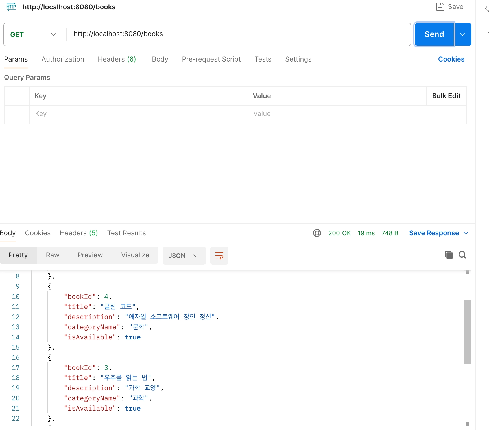
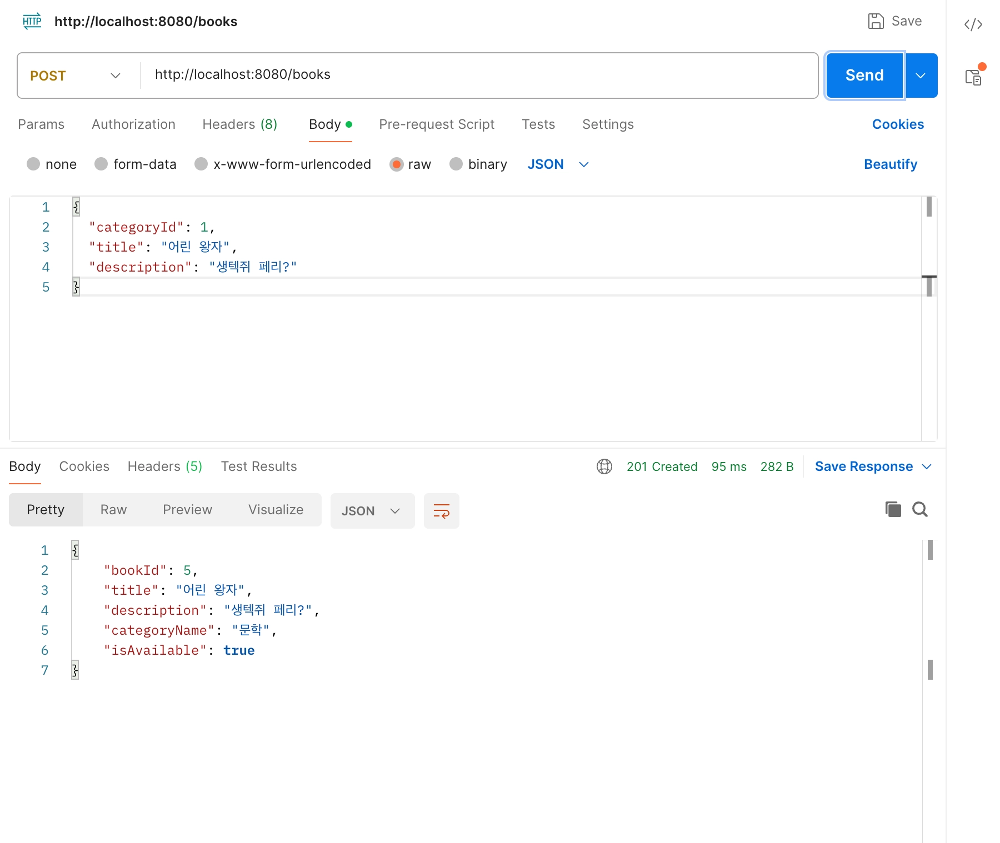
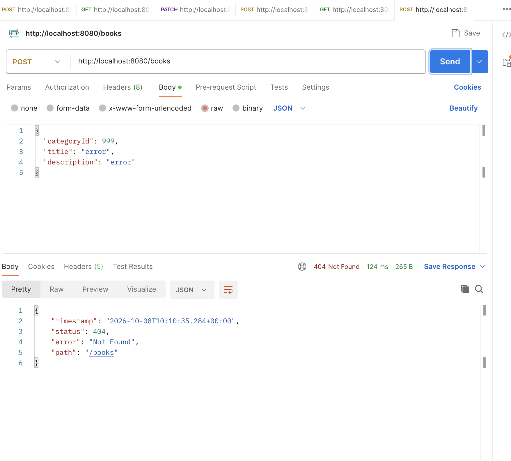
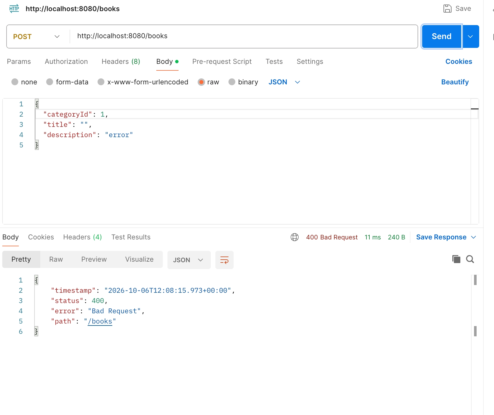
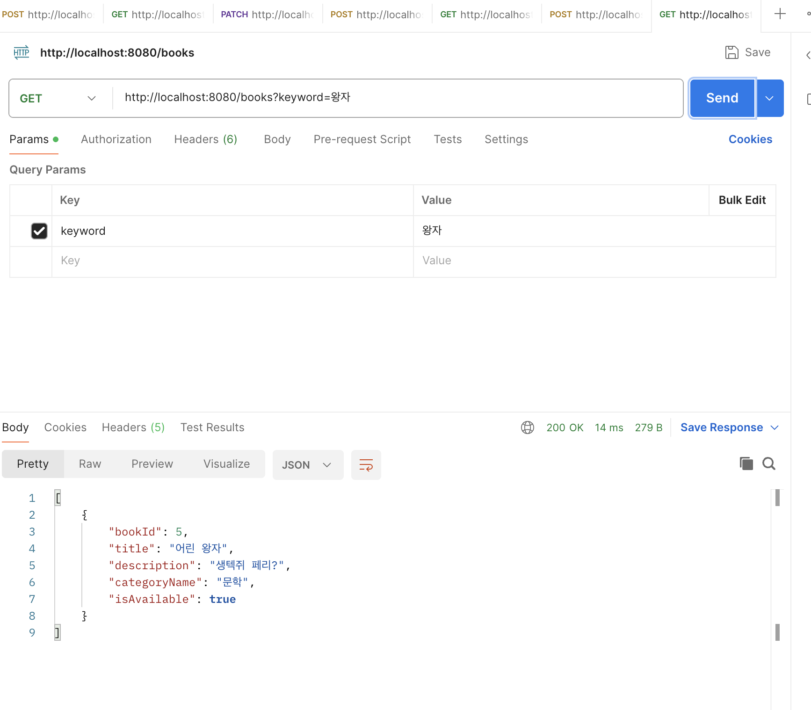
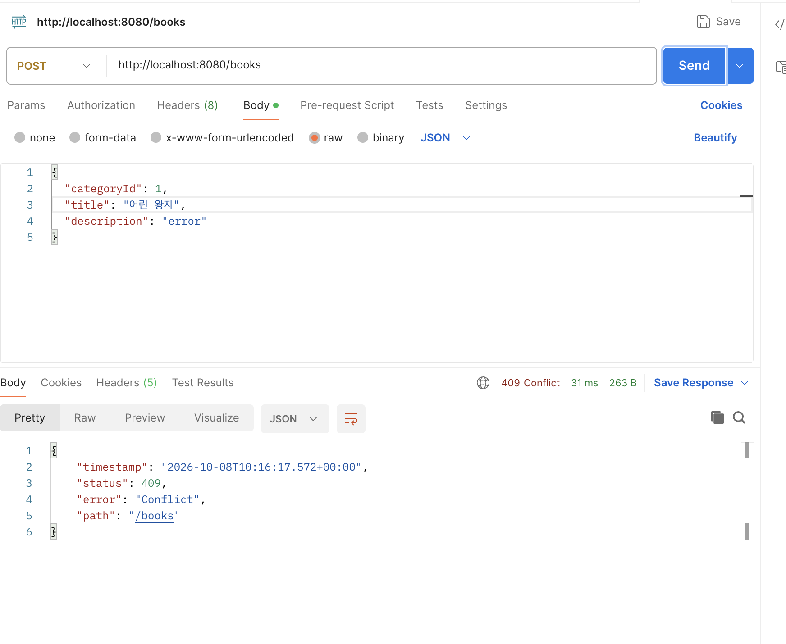

- **미션 기록**

  **필수 미션**

  **1. Book·Category 엔티티와 관계 매핑**

    ```java
    @Entity
    @Table(name = "category")
    @Getter
    @NoArgsConstructor(access = AccessLevel.PROTECTED)
    public class Category {
    
        @Id
        @GeneratedValue(strategy = GenerationType.IDENTITY)
        @Column(name = "category_id")
        private Long categoryId;
    
        @Column(name = "name")
        private String name;
    }
    ```

    ```java
    @Id
    @GeneratedValue(strategy = GenerationType.IDENTITY)
    @Column(name = "book_id")
    private Long bookId;
    
    @ManyToOne(fetch = FetchType.LAZY)
    @JoinColumn(name = "category_id", nullable = false)
    private Category category;
    ```

    - `Category`와 `Book`을 엔티티로 매핑하고, `Book.category`의 외래 키를 `category_id`로 지정. 도서 여러 권이 하나의 카테고리를 참조하는 다대일 관계.
    - 저장소는 `JpaRepository<Book, Long>`와 `JpaRepository<Category, Long>`을 상속. 3주차처럼 기본 조회·저장 SQL을 직접 작성하지 않아도 Repository 메서드 사용 가능.

  **2. GET /books — 최신순 도서 목록**

    ```java
    List<Book> findAllByOrderByBookIdDesc();
    ```

    ```java
    @Transactional(readOnly = true)
    public List<BookResponse> getBooks() {
        return bookRepository.findAllByOrderByBookIdDesc().stream()
                .map(BookResponse::from)
                .toList();
    }
    ```

    ```java
    public static BookResponse from(Book book) {
        return new BookResponse(
                book.getBookId(),
                book.getTitle(),
                book.getDescription(),
                book.getCategory().getName(),
                book.getIsAvailable()
        );
    }
    ```

    ```java
    @GetMapping("/books")
    public List<BookResponse> getBooks() {
        return bookService.getBooks();
    }
    ```

    - `bookId` 내림차순 조회 후 응답 DTO로 변환. 도서 ID·제목·설명·카테고리 이름·대여 가능 여부만 반환하고 Entity 자체는 노출하지 않음.

  

  **3. POST /books — 도서 등록과 입력 검증**

    ```java
    public record BookRequest(
            @NotNull Long categoryId,
            @NotBlank @Size(max = 100) String title,
            String description
    ) {
    }
    ```

    ```java
    @Transactional
    public BookResponse createBook(BookRequest request) {
        Category category = categoryRepository.findById(request.categoryId())
                .orElseThrow(() -> new ResponseStatusException(
                        HttpStatus.NOT_FOUND, "존재하지 않는 카테고리입니다."
                ));
    
        if(bookRepository.existsByTitle(request.title())) {
            throw new ResponseStatusException(
                    HttpStatus.CONFLICT, "이미 등록된 도서 제목입니다."
            );
        }
    
        Book book = new Book(category, request.title(), request.description());
    
        return BookResponse.from(bookRepository.save(book));
    }
    ```

    ```java
    @ResponseStatus(HttpStatus.CREATED)
    @PostMapping("/books")
    public BookResponse createBooks(
            @Valid @RequestBody BookRequest request
    ) {
        return bookService.createBook(request);
    }
    ```

    - `@Valid`로 제목·카테고리 ID의 기본 형식을 검사하고, Service에서 카테고리 존재 여부를 확인. 없는 카테고리는 404, 저장 성공 시 Controller의 `@ResponseStatus(CREATED)`로 201을 반환하도록 구성.

  

  

  

  **3주차 Raw SQL 방식과 비교**

    - 3주차에는 `JdbcTemplate`에서 `SELECT`·`INSERT` SQL을 직접 작성하고 `Map<String, Object>`로 요청·응답을 다룸.
    - 4주차에는 `Book`·`Category` 엔티티와 `JpaRepository`로 테이블 관계 및 기본 저장 동작을 표현하고, 메서드 이름으로 최신순 조회 조건을 지정.
    - 요청·응답 DTO를 분리해 API에 노출할 필드를 명확히 했고, 입력 검증과 카테고리 존재 여부도 각 단계에서 처리.

  **선택 미션**

  **1. 카테고리 이름 포함 — Response DTO**

    ```java
    public record BookResponse(
            Long bookId,
            String title,
            String description,
            String categoryName,
            Boolean isAvailable
    ) {
        public static BookResponse from(Book book) {
            return new BookResponse(
                    book.getBookId(),
                    book.getTitle(),
                    book.getDescription(),
                    book.getCategory().getName(),
                    book.getIsAvailable()
            );
        }
    }
    ```

    - 필수 GET 구현의 `BookResponse.from(book)`에서 `book.getCategory().getName()`을 `categoryName`에 담음. Entity 전체나 Category 객체 대신 화면에 필요한 이름만 응답.

  **2. 도서 제목 검색 — GET /books?keyword=**

    ```java
    @GetMapping(value = "/books", params = "keyword")
    public List<BookResponse> getBooksByTitle(
            @RequestParam String keyword
    ) {
        return bookService.getBooksByTitle(keyword);
    }
    ```

    ```java
    List<Book> findAllByTitleContaining(String keyword);
    ```

    ```java
    @Transactional(readOnly = true)
    public List<BookResponse> getBooksByTitle(String keyword) {
        return bookRepository.findAllByTitleContaining(keyword).stream()
                .map(BookResponse::from)
                .toList();
    }
    ```

    - `keyword` 쿼리 파라미터가 있으면 제목 포함 검색 메서드로 연결. 결과도 전체 조회와 동일한 `BookResponse` 형태로 반환

  

  **3. 중복 도서 제목 방지**

    ```java
    @Table(
            name = "book",
            uniqueConstraints = @UniqueConstraint(
                    name = "uk_title",
                    columnNames = {"title"}
            )
    )
    ```

    ```java
    boolean existsByTitle(String title);
    ```

    ```java
    if(bookRepository.existsByTitle(request.title())) {
        throw new ResponseStatusException(
                HttpStatus.CONFLICT, "이미 등록된 도서 제목입니다."
        );
    }
    ```

    - `title`에 DB UNIQUE 제약을 두고, 저장 전 중복 여부를 검사해 일반적인 중복 요청에 409를 반

  