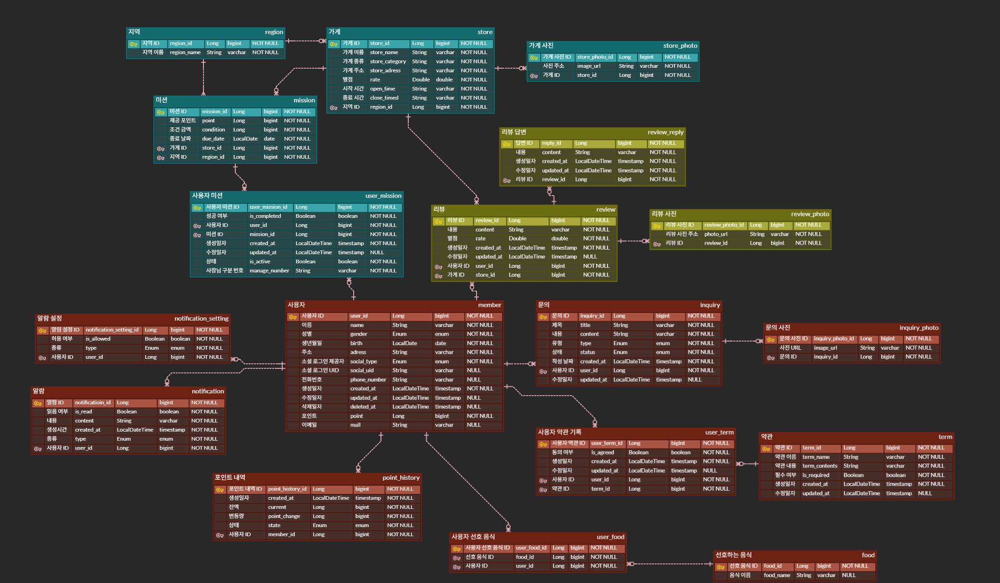

설명

<aside>

- **사용자 / 약관 / 선호 음식**: 회원가입 과정에서 입력하는 기본 정보와 약관 동의, 선호 음식 정보를 각각 관리할 수 있도록 분리했습니다
- **지역 / 가게 / 미션**: 지역별 가게를 보여주고, 각 가게에서 미션을 진행할 수 있도록 지역 → 가게 → 미션 형태로 연결했습니다
- **사용자 미션**: 사용자와 미션은 다대다 관계이기 때문에 user_mission 중간 테이블을 두었습니다. 여기서 각 사용자의 미션 참여 상태와 완료 여부를 관리합니다
- **포인트 내역**: 미션 완료 등으로 포인트가 변경된 기록을 확인할 수 있도록 별도의 내역 테이블로 관리했습니다
- **리뷰 / 리뷰 사진 / 리뷰 답변**: 리뷰에 사진을 여러 장 등록할 수 있고 답변도 따로 관리해야 해서 테이블을 분리했습니다
- **알림 / 알림 설정**: 실제 알림 내용과 사용자의 수신 설정은 성격이 달라 따로 관리했습니다
- **문의 / 문의 사진**: 문의에 여러 장의 사진을 첨부할 수 있어서 문의와 사진을 분리했습니다
</aside>