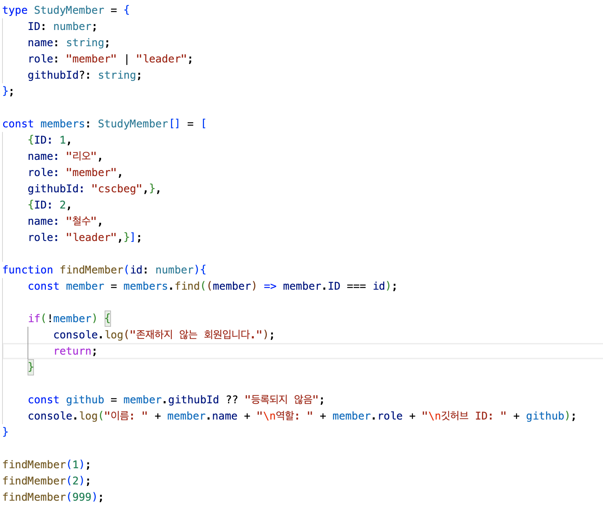
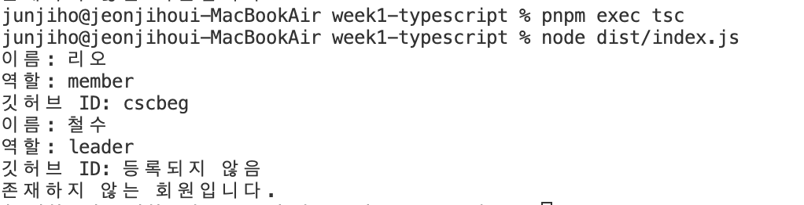
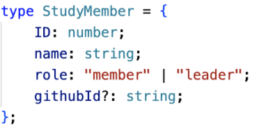
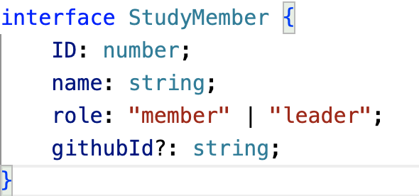
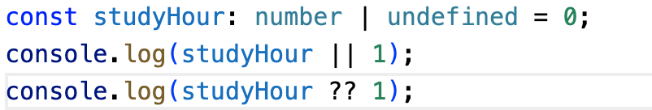
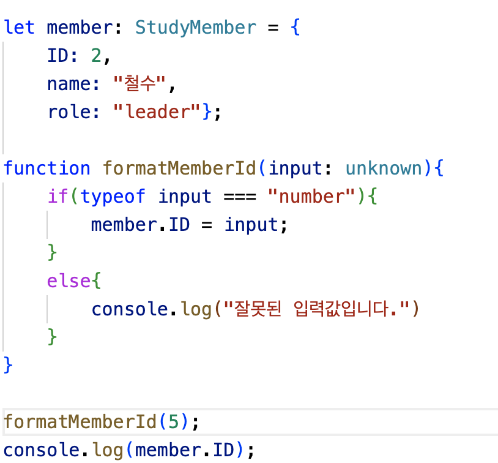

- 필수 미션

  가장 처음에 코드를 시작할 때 틀이 잡히지 않아 위 페이지를 올려 찾아보며 작성하였습니다.

  type, 배열 등 내부 속성들을 구분할 때 어떤건 “,” 어떤건 “;” 으로 구분하여 이 부분에서 조금 헷갈렸었습니다.

  find함수를 사용할 때 화살표를 사용하는 것이 익숙하진 않아 찾아보며 코드를 작성하였습니다.

- 선택 미션

  type과 interface 모두 객체를 표현할 수 있다는 공통점있지만 객체만 표현할 수있는 interface와 달리 type은 객체뿐만 아닌 원시타입, 유니언 타입도 표현이 가능하다. type의 경우 같은 이름으로 재선언되지만 interface의 경우 호환되는 경우 하나로 합쳐진다.
    
  ---

  studyHour은 number 또는 undefined 타입이 될 수 있으며 0으로 초기화가 되어있다.

  ||의 경우 왼쪽 값이 어떤 falsy의 값이든 오른쪽 값을 사용하게 되어 0이 falsy이므로 오른쪽 값인 1이 나오고 ??의 경우 왼쪽 값이 null 혹은 undefined일 경우에만 오른쪽 값을 사용하여 왼쪽 값인 0이 나오게 된다.
    
  ---

  알맞게 숫자로 들어온 경우 바꾸어주고 다른 타입을 들어오면 받지 않는다.