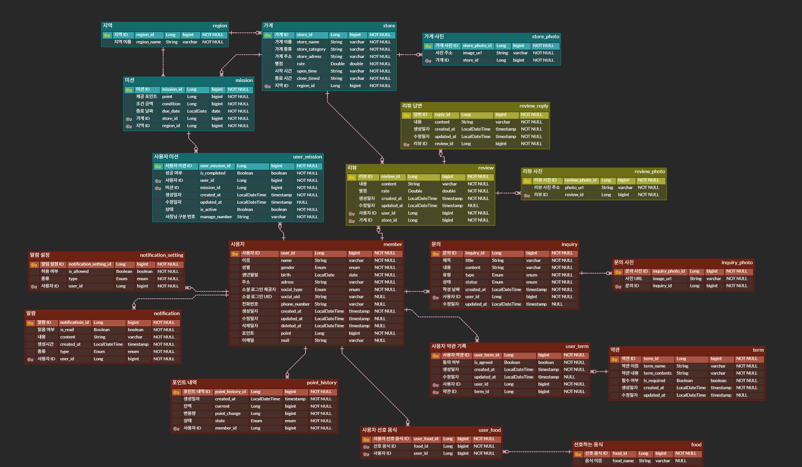

설명

<aside>

- **사용자 / 약관 / 선호 음식**: 회원가입 과정에서 입력하는 기본 정보와 약관 동의, 선호 음식 정보를 각각 관리할 수 있도록 분리했습니다
- **지역 / 가게 / 미션**: 지역별 가게를 보여주고, 각 가게에서 미션을 진행할 수 있도록 지역 → 가게 → 미션 형태로 연결했습니다
- **사용자 미션**: 사용자와 미션은 다대다 관계이기 때문에 user_mission 중간 테이블을 두었습니다. 여기서 각 사용자의 미션 참여 상태와 완료 여부를 관리합니다
- **포인트 내역**: 미션 완료 등으로 포인트가 변경된 기록을 확인할 수 있도록 별도의 내역 테이블로 관리했습니다
- **리뷰 / 리뷰 사진 / 리뷰 답변**: 리뷰에 사진을 여러 장 등록할 수 있고 답변도 따로 관리해야 해서 테이블을 분리했습니다
- **알림 / 알림 설정**: 실제 알림 내용과 사용자의 수신 설정은 성격이 달라 따로 관리했습니다
- **문의 / 문의 사진**: 문의에 여러 장의 사진을 첨부할 수 있어서 문의와 사진을 분리했습니다
</aside>

CREATE TABLE `region` (
	`id`	BIGINT	NOT NULL,
	`name`	VARCHAR(50)	NOT NULL,
	`created_at`	DATETIME	NOT NULL
);

CREATE TABLE `food_category` (
	`id`	BIGINT	NOT NULL,
	`name`	VARCHAR(30)	NOT NULL,
	`created_at`	DATETIME	NOT NULL
);

CREATE TABLE `member` (
	`id`	BIGINT	NOT NULL,
	`region_id`	BIGINT	NOT NULL,
	`social_type`	VARCHAR(20)	NOT NULL,
	`social_id`	VARCHAR(100)	NOT NULL,
	`email`	VARCHAR(100)	NULL,
	`name`	VARCHAR(50)	NOT NULL,
	`gender`	VARCHAR(10)	NULL,
	`birth_date`	DATE	NOT NULL,
	`point`	INT	NOT NULL,
	`status`	VARCHAR(20)	NOT NULL,
	`inactive_date`	DATETIME	NULL,
	`created_at`	DATETIME	NOT NULL,
	`updated_at`	DATETIME	NOT NULL
);

CREATE TABLE `member_prefer` (
	`id`	BIGINT	NOT NULL,
	`member_id`	BIGINT	NOT NULL,
	`food_category_id`	BIGINT	NOT NULL,
	`created_at`	DATETIME	NOT NULL
);

CREATE TABLE `store` (
	`id`	BIGINT	NOT NULL,
	`region_id`	BIGINT	NOT NULL,
	`food_category_id`	BIGINT	NOT NULL,
	`name`	VARCHAR(100)	NOT NULL,
	`address`	VARCHAR(255)	NOT NULL,
	`phone`	VARCHAR(20)	NULL,
	`score`	DECIMAL(2,1)	NOT NULL,
	`status`	VARCHAR(20)	NOT NULL,
	`created_at`	DATETIME	NOT NULL,
	`updated_at`	DATETIME	NOT NULL
);

CREATE TABLE `mission` (
	`id`	BIGINT	NOT NULL,
	`store_id`	BIGINT	NOT NULL,
	`title`	VARCHAR(100)	NOT NULL,
	`min_order_amount`	INT	NOT NULL,
	`reward_point`	INT	NOT NULL,
	`period_days`	INT	NOT NULL,
	`status`	VARCHAR(20)	NOT NULL,
	`created_at`	DATETIME	NOT NULL
);

CREATE TABLE `member_mission` (
	`id`	BIGINT	NOT NULL,
	`member_id`	BIGINT	NOT NULL,
	`mission_id`	BIGINT	NOT NULL,
	`mission_status`	VARCHAR(20)	NOT NULL,
	`auth_code`	VARCHAR(20)	NULL,
	`challenged_at`	DATETIME	NOT NULL,
	`completed_at`	DATETIME	NULL,
	`earned_point`	INT	NULL
);

CREATE TABLE `review` (
	`id`	BIGINT	NOT NULL,
	`member_id`	BIGINT	NOT NULL,
	`store_id`	BIGINT	NOT NULL,
	`member_mission_id`	BIGINT	NOT NULL,
	`score`	INT	NOT NULL,
	`content`	TEXT	NOT NULL,
	`status`	VARCHAR(20)	NOT NULL,
	`created_at`	DATETIME	NOT NULL,
	`updated_at`	DATETIME	NOT NULL
);

ALTER TABLE `region` ADD CONSTRAINT `PK_REGION` PRIMARY KEY (
	`id`
);

ALTER TABLE `food_category` ADD CONSTRAINT `PK_FOOD_CATEGORY` PRIMARY KEY (
	`id`
);

ALTER TABLE `member` ADD CONSTRAINT `PK_MEMBER` PRIMARY KEY (
	`id`
);

ALTER TABLE `member_prefer` ADD CONSTRAINT `PK_MEMBER_PREFER` PRIMARY KEY (
	`id`
);

ALTER TABLE `store` ADD CONSTRAINT `PK_STORE` PRIMARY KEY (
	`id`
);

ALTER TABLE `mission` ADD CONSTRAINT `PK_MISSION` PRIMARY KEY (
	`id`
);

ALTER TABLE `member_mission` ADD CONSTRAINT `PK_MEMBER_MISSION` PRIMARY KEY (
	`id`
);

ALTER TABLE `review` ADD CONSTRAINT `PK_REVIEW` PRIMARY KEY (
	`id`
);

