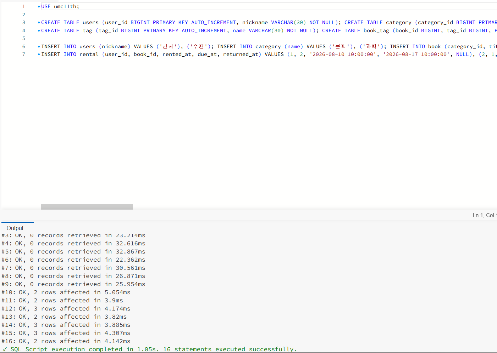
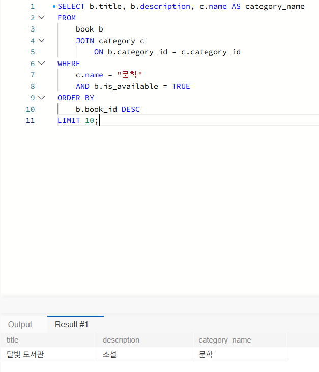
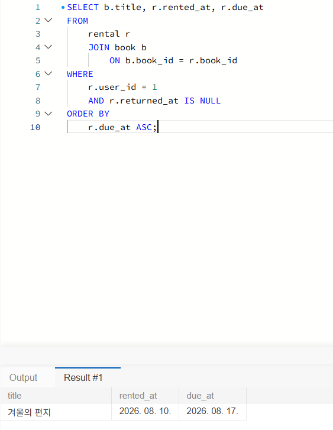
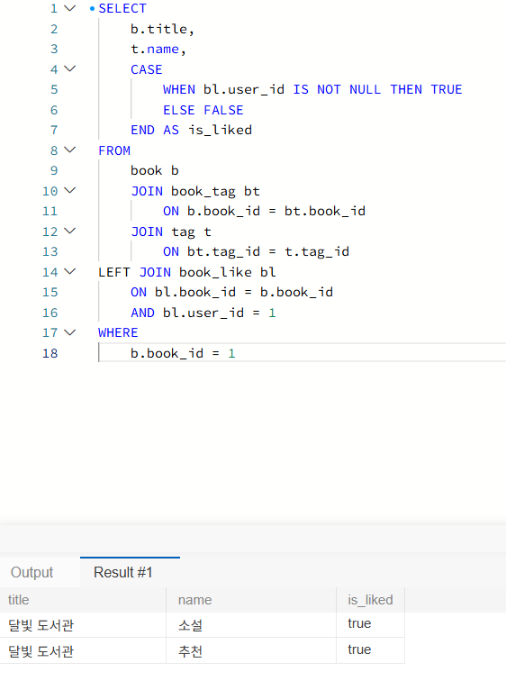

**01_schema.sql·02_seed.sql 실행 확인 화면**

**미션 1.**

기준 테이블은 book이며 책의 **카테고리 이름을 함께 조회하기 위해** category 테이블을 category_id 로 JOIN함 WHERE절에서 **문학 카테고리이면서 현재 대여 가능한 책**만 조회하고, book_id를 내림차순으로 정렬해 최근 등록된 책부터 최대 10개만 가져옴

**미션 2.**

기준 테이블은 rental이며 대여 정보와 함께 책 제목을 가져오기 위해 book 테이블을 book_id로 JOIN함

WHERE절에서 1번 사용자가 대여했고 아직 반납하지 않은 책만 조회하고, due_at을 오름차순으로 정렬해 반납 예정일이 빠른 책부터 보여줌

**미션 3.**

기준 테이블은 book이며 책에 연결된 태그를 조회하기 위해 book_tag와 tag 테이블을 JOIN함

특정 사용자가 해당 책에 좋아요를 눌렀는지 확인하기 위해 book_like를 LEFT JOIN하고, 좋아요 기록이 있으면 true, 없으면 false로 표시함

WHERE절에서 1번 책만 조회하며 책 하나에 여러 태그가 연결될 수 있어 태그별로 여러 행이 조회됨