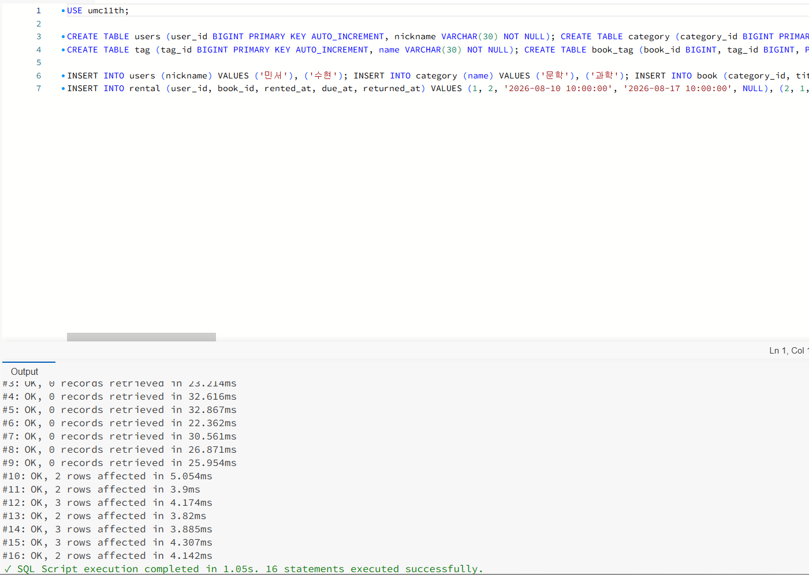
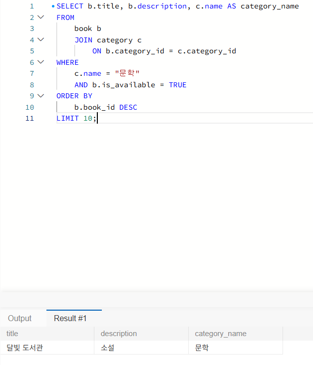
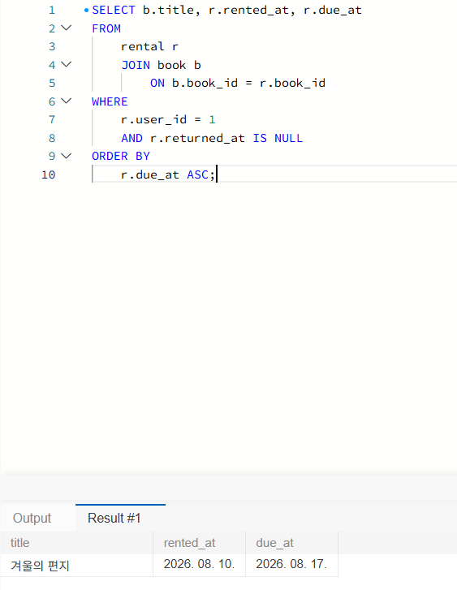
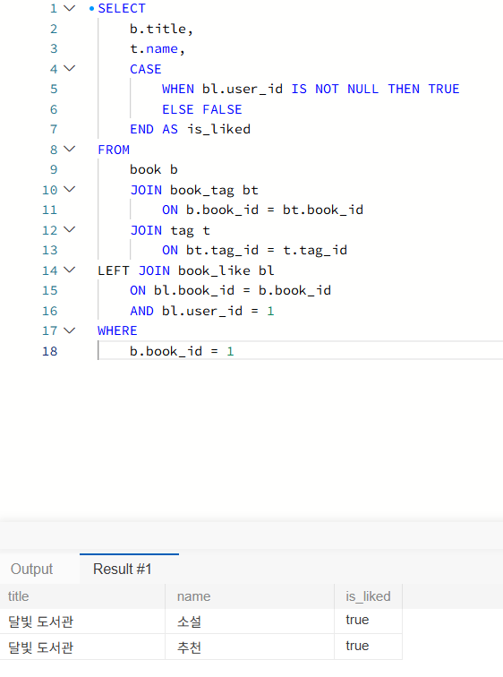

**01_schema.sql·02_seed.sql 실행 확인 화면**

**미션 1.**

기준 테이블은 book이며 책의 **카테고리 이름을 함께 조회하기 위해** category 테이블을 category_id 로 JOIN함 WHERE절에서 **문학 카테고리이면서 현재 대여 가능한 책**만 조회하고, book_id를 내림차순으로 정렬해 최근 등록된 책부터 최대 10개만 가져옴

**미션 2.**

기준 테이블은 rental이며 대여 정보와 함께 책 제목을 가져오기 위해 book 테이블을 book_id로 JOIN함

WHERE절에서 1번 사용자가 대여했고 아직 반납하지 않은 책만 조회하고, due_at을 오름차순으로 정렬해 반납 예정일이 빠른 책부터 보여줌

**미션 3.**

기준 테이블은 book이며 책에 연결된 태그를 조회하기 위해 book_tag와 tag 테이블을 JOIN함

특정 사용자가 해당 책에 좋아요를 눌렀는지 확인하기 위해 book_like를 LEFT JOIN하고, 좋아요 기록이 있으면 true, 없으면 false로 표시함

WHERE절에서 1번 책만 조회하며 책 하나에 여러 태그가 연결될 수 있어 태그별로 여러 행이 조회됨
1. “문학”이라는 이름은 category에 있기 때문에 결과에 카테고리 이름을 보여 주려면 category를 JOIN한다. WHERE 조건은 이름이 문학이고 대여가능한 책.
2. 책 제목을 보여 주기 위해 book을 JOIN한다. WHERE 조건에서 반납일이 비어 있다는 뜻으로 IS NULL을 사용한다. NULL이라고 쓰면 결과가 항상 0행이 되므로 IS NULL 사용.
3. LEFT JOIN을 쓴 이유는 태그가 하나도 없는 책도 결과에서 사라지지 않게 하기 위함이다. 일반 JOIN이면 짝이 없는 책은 행이 사라진다. 사용자 조건을 book_like ON 절에 넣어서 좋아요를 안 눌렀어도 상세 화면은 보이도록 한다.
