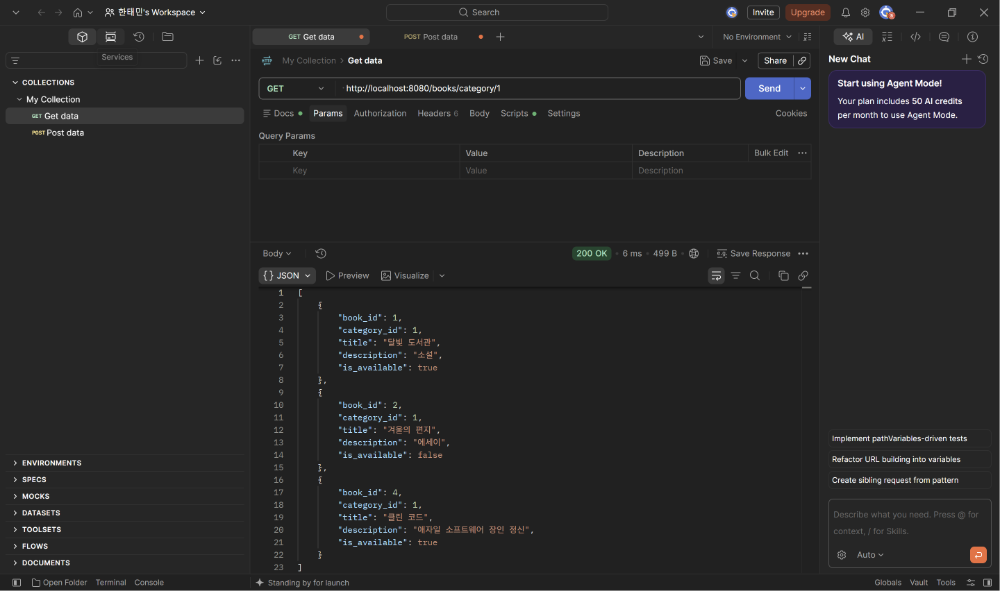
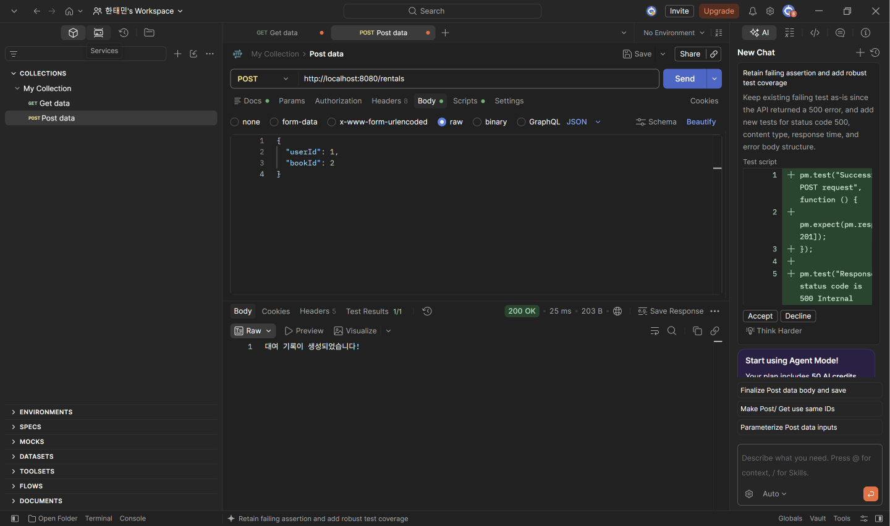

## 미션 1. 특정 카테고리 도서 목록 조회 API

실습에서 만든 BookRepository, BookService, BookController에 메서드를 하나씩 추가했다.

**BookRepository**

```java
public List<Map<String, Object>> findByCategoryId(Long categoryId) {
    String sql = "SELECT * FROM book WHERE category_id = ?";
    return jdbcTemplate.queryForList(sql, categoryId);
}
```

- WHERE category_id = ? 조건으로 해당 카테고리의 책만 조회한다.
- 값을 문자열로 이어 붙이지 않고 ? 자리에 넣는 파라미터 바인딩을 사용했다. (SQL Injection 방지)

**BookService**

```java
public List<Map<String, Object>> getBooksByCategory(Long categoryId) {
    return bookRepository.findByCategoryId(categoryId);
}
```

**BookController**

```java
@GetMapping("/category/{categoryId}")
public List<Map<String, Object>> getBooksByCategory(@PathVariable Long categoryId) {
    return bookService.getBooksByCategory(categoryId);
}
```

- 클래스의 @RequestMapping("/books")와 합쳐져서 최종 주소가 /books/category/{categoryId}가 된다.
- @PathVariable로 주소의 {categoryId} 자리 값을 꺼내 categoryId 변수에 담는다.

### 실행 결과



- 200 OK와 함께 category_id가 1인 책(달빛 도서관, 겨울의 편지 등)만 반환되었다.

## 미션 2. 신규 도서 대여 기록 생성 API

대여는 도서와 다른 기능이라 RentalRepository, RentalService, RentalController를 새로 만들었다.

**RentalRepository**

```java
public void save(Map<String, Object> body) {
    String sql = "INSERT INTO rental (user_id, book_id, rented_at, due_at) VALUES (?, ?, NOW(), DATE_ADD(NOW(), INTERVAL 7 DAY))";    
    
    jdbcTemplate.update(
                sql,
                body.get("userId"),            
                body.get("bookId")    
    );
}
```

- userId, bookId만 요청 Body에서 받고, rented_at은 NOW(), due_at은 DATE_ADD(NOW(), INTERVAL 7 DAY)로 DB가 직접 계산하게 했다.
- rental_id는 AUTO_INCREMENT, returned_at은 아직 반납 전이라 NULL이어야 하므로 INSERT에서 생략했다.

**RentalService**

```java
public void createRental(Map<String, Object> body) {
    rentalRepository.save(body);
}
```

**RentalController**

```java
@RestController
@RequestMapping("/rentals")
@RequiredArgsConstructor
public class RentalController {
    private final RentalService rentalService;    
    @PostMapping    
    public String createRental(@RequestBody Map<String, Object> body) {
            rentalService.createRental(body);        
            return "대여 기록이 생성되었습니다!";    
            }
}
```

- @RequestBody로 JSON Body를 Map으로 받아서 Service로 넘긴다.

### 실행 결과



- 200 OK와 함께 "대여 기록이 생성되었습니다!" 응답을 받았다.