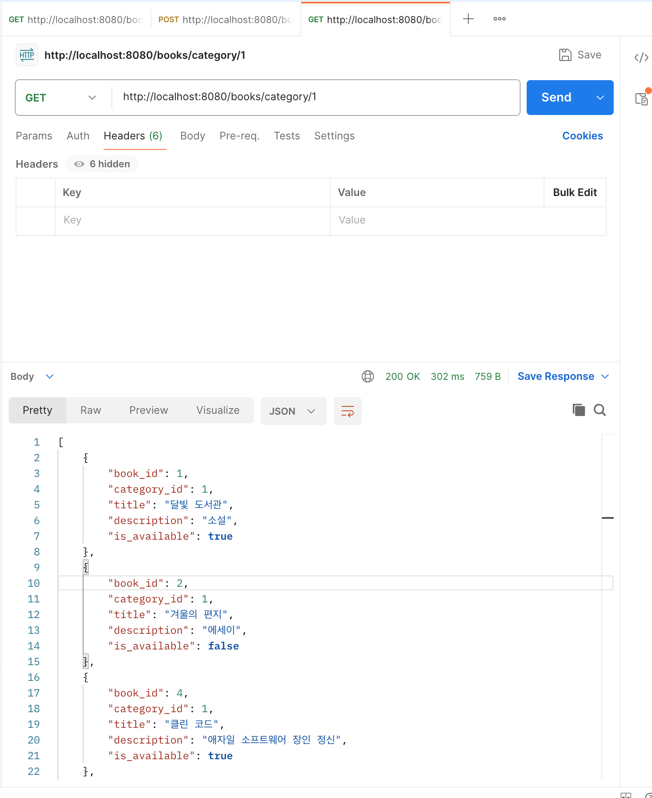
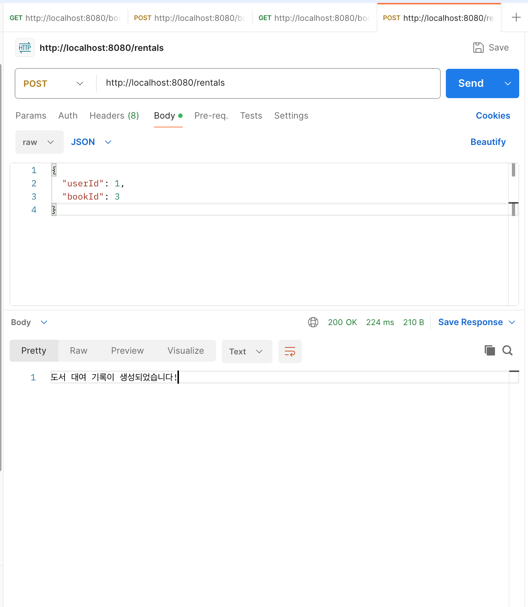
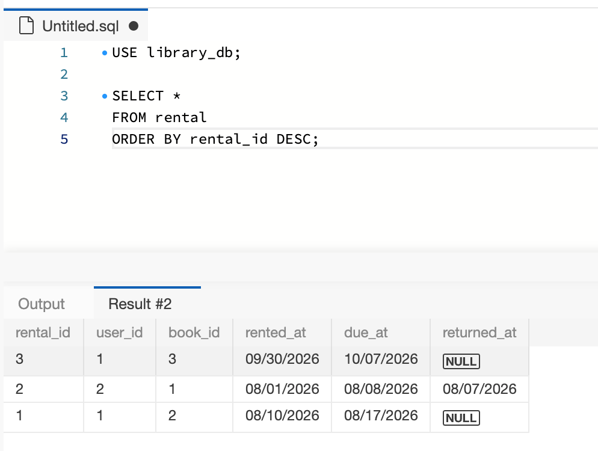
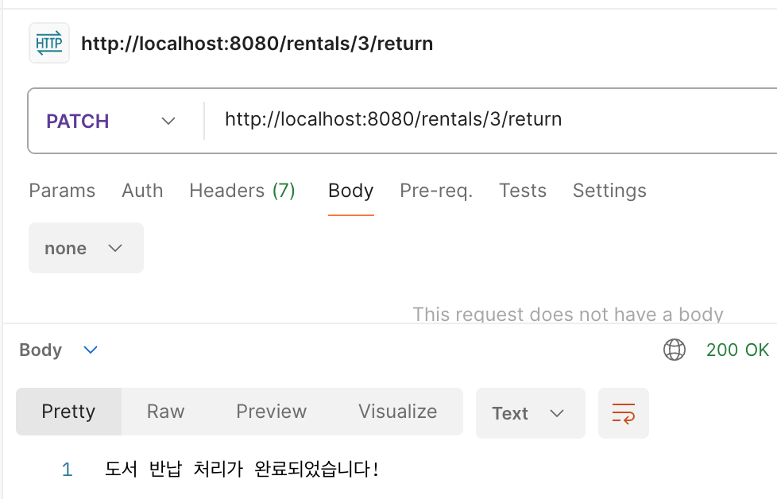
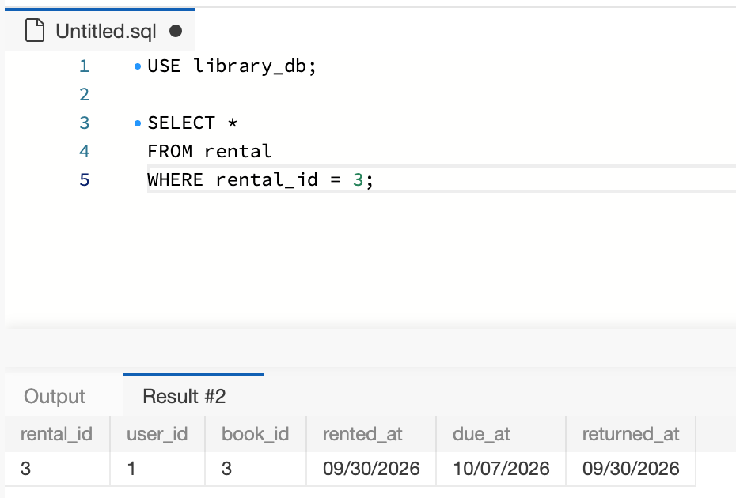

- **미션 기록**
    1. **특정 카테고리 도서 목록 조회 API 구현 (GET /books/category/{categoryId})**

        ```jsx
        public List<Map<String, Object>> findByCategoryId(Long categoryId) {
            String sql = """
                SELECT book_id, category_id, title, description, is_available
                FROM book
                WHERE category_id = ?
                ORDER BY book_id ASC
                """;
        
            return jdbcTemplate.queryForList(sql, categoryId);
        }
        ```

       categoryId를 받아서 List를 반환한다.

       여러줄의 문자열을 저장하기 위해 String sql = “””을 사용하여 SQL쿼리 자체를 sql 변수에 저장한다.

       book 테이블에서 입력받은 categoryId를 이용해서 category_id로 필터링한 후 book_id, category_id, title, description, is_available을 반환하게 된다.

       jdbcTemplate을 사용하여 SQL실행 및 ?에 값을 넣는다

        ```jsx
        public List<Map<String, Object>> getBooksByCategoryId(Long categoryId) {
            return bookRepository.findByCategoryId(categoryId);
        }
        ```

       BookRepository의 findByCategoryId를 호출하여 받은 categoryId를 전달하여 조회를 요청하고 받은 결과를 그대로 반환한다

        ```jsx
        import org.springframework.web.bind.annotation.PathVariable;
        
        @GetMapping("/category/{categoryId}")
        public List<Map<String, Object>> getBooksByCategory(
                @PathVariable Long categoryId
        ) {
            return bookService.getBooksByCategoryId(categoryId);
        }
        ```

       URL 경로 안의 값을 받아오기 위해 PathVariable을 사용한다.

       GET /category/1 처럼 들어오면 @GetMapping 메서드가 실행되 받은 categoryId를 Long타입으로 저장 후 Service에 전달해 도서목록 조회 후 JSON으로 반환한다.




    2. **신규 도서 대여 기록 생성 API 구현 (POST /rentals)**

        ```jsx
        package com.umc.study.repository;
        
        import lombok.RequiredArgsConstructor;
        import org.springframework.jdbc.core.JdbcTemplate;
        import org.springframework.stereotype.Repository;
        
        @Repository
        @RequiredArgsConstructor
        public class RentalRepository {
        
            private final JdbcTemplate jdbcTemplate;
        
            public int save(Long userId, Long bookId) {
                String sql = """
                    INSERT INTO rental (
                        user_id,
                        book_id,
                        rented_at,
                        due_at,
                        returned_at
                    )
                    VALUES (?, ?, NOW(), DATE_ADD(NOW(), INTERVAL 7 DAY), NULL)
                    """;
        
                return jdbcTemplate.update(sql, userId, bookId);
            }
        }
        ```

       대여기록을 데이터베이스에 저장하는 역할을 한다.

       @Repository 로 이 클래스가 데이터베이스 접근을 담당하는 Repository라는 걸 Spring에 알려준다.

       @RequiredArgsConstructor 로 jdbcTemplate을 자동으로 주입받는 생성자를 만들어 준다.

       VALUES에 첫번째 ?에 userId, 두번째 ?에 bookId를 넣고 NOW()으로 현재 시간, DATE_ADD(NOW(), INTERVAL 7 DAY)로 현재 시간에서 7일 뒤, returned_at은 NULL으로 아직 반납하지 않은 상태를 나타낸다.

        ```jsx
        package com.umc.study.service;
        
        import com.umc.study.repository.RentalRepository;
        import lombok.RequiredArgsConstructor;
        import org.springframework.stereotype.Service;
        
        @Service
        @RequiredArgsConstructor
        public class RentalService {
        
            private final RentalRepository rentalRepository;
        
            public void createRental(Long userId, Long bookId) {
                rentalRepository.save(userId, bookId);
            }
        }
        ```

       대여 기능의 흐름 담당

       createRental()은 Controller에서 전달받은 userId와 bookId를 save 메서드로 넘겨 대여 기록 저장을 요청한다.

        ```jsx
        package com.umc.study.controller;
        
        import com.umc.study.service.RentalService;
        import lombok.RequiredArgsConstructor;
        import org.springframework.web.bind.annotation.PostMapping;
        import org.springframework.web.bind.annotation.RequestBody;
        import org.springframework.web.bind.annotation.RequestMapping;
        import org.springframework.web.bind.annotation.RestController;
        
        import java.util.Map;
        
        @RestController
        @RequestMapping("/rentals")
        @RequiredArgsConstructor
        public class RentalController {
        
            private final RentalService rentalService;
        
            @PostMapping
            public String createRental(@RequestBody Map<String, Object> body) {
                Long userId = ((Number) body.get("userId")).longValue();
                Long bookId = ((Number) body.get("bookId")).longValue();
        
                rentalService.createRental(userId, bookId);
        
                return "도서 대여 기록이 생성되었습니다!";
            }
        }
        ```

       @RestController : 메서드 반환값을 HTTP응답으로 보낸다.

       @RequestMapping(”/rentals”) : 이 Controller의 기본 URL을 /rentals로 정한다.

       @RequiredArgsConstructor : rentalService를 자동으로 주입받는다.

       @PostMapping : 기본 주소와 합쳐져 POST /rentals 요청 처리

       createRental() : Postman에서 보낸 JSON본문을 body에 받아 userId와 bookID를 Long타입으로 바꾼 후 Service에 전달하여 대여 기록 저장 요청 후 성공시 "도서 대여 기록이 생성되었습니다!" 반환하게 한다.




       (선택)**도서 반납 처리 API 구현 (PATCH /rentals/{rentalId}/return)**

        ```jsx
        public int updateReturnedAt(Long rentalId) {
            String sql = """
                UPDATE rental
                SET returned_at = NOW()
                WHERE rental_id = ?
                """;
        
            return jdbcTemplate.update(sql, rentalId);
        }
        ```

       특정 대여 기록의 반납 시간을 현재 시간으로 변경하는 메서드이다

       반납할 대여 기록의 rentalId를 받아 rental 테이블의 returned_at 을 현재 시간으로 바꾼다.

       ?에 rentalId가 들어가 해당 대여 기록만 수정하게 된다.

        ```jsx
        public void returnRental(Long rentalId) {
            rentalRepository.updateReturnedAt(rentalId);
        }
        ```

       반납 요청을 Repository에 전달

        ```jsx
        import org.springframework.web.bind.annotation.PatchMapping;
        import org.springframework.web.bind.annotation.PathVariable;
        
        @PatchMapping("/{rentalId}/return")
        public String returnRental(@PathVariable Long rentalId) {
            rentalService.returnRental(rentalId);
        
            return "도서 반납 처리가 완료되었습니다!";
        }
        ```

       요청을 받아 도서 반납 처리

       PATCH를 이용해 데이터 일부를 수정한다.

       URL에서 rentalId를 꺼내 Long 타입을 저장 후 Service로 전달해 실제 반납 시간 갱신을 요청한다.



