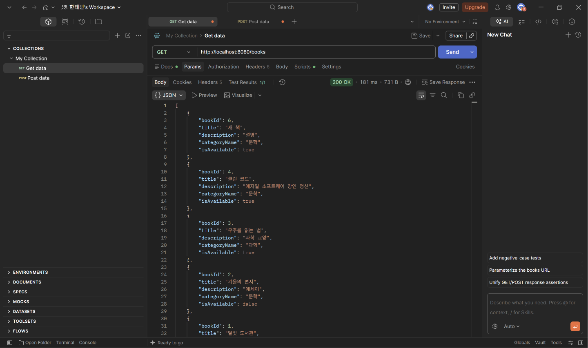
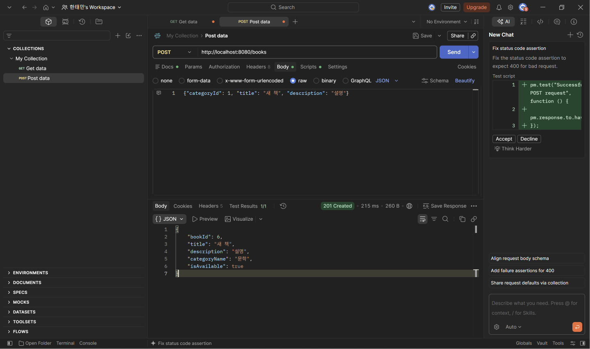
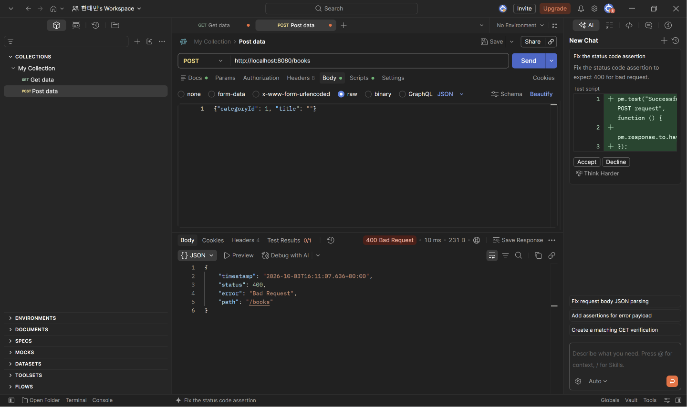

## 1. Entity

**Book**

```java
@Entity
@Table(name = "book")
@Getter
@NoArgsConstructor(access = AccessLevel.PROTECTED)
public class Book {

    @Id
    @GeneratedValue(strategy = GenerationType.IDENTITY)
    @Column(name = "book_id")
    private Long bookId;

    @ManyToOne(fetch = FetchType.LAZY)
    @JoinColumn(name = "category_id", nullable = false)
    private Category category;

    @Column(nullable = false, length = 100)
    private String title;

    @Column(columnDefinition = "TEXT")
    private String description;

    @Column(name = "is_available", nullable = false)
    private Boolean isAvailable = true;

    public Book(Category category, String title, String description) {
        this.category = category;
        this.title = title;
        this.description = description;
    }
}
```

**Category**

```java
@Entity
@Table(name = "category")
@Getter
@NoArgsConstructor(access = AccessLevel.PROTECTED)
public class Category {

    @Id
    @GeneratedValue(strategy = GenerationType.IDENTITY)
    @Column(name = "category_id")
    private Long categoryId;

    @Column(nullable = false)
    private String name;
}
```

- @ManyToOne과 @JoinColumn(name = "category_id")로 "도서 여러 권은 하나의 카테고리에 속한다"는 다대일 관계를 표현했다.

---

## 2. Repository

```java
public interface BookRepository extends JpaRepository<Book, Long> {
    List<Book> findAllByOrderByBookIdDesc();
}

public interface CategoryRepository extends JpaRepository<Category, Long> {
}
```

- JpaRepository를 상속해서 save, findById를 SQL 없이 사용했다.
- findAllByOrderByBookIdDesc는 메서드 이름으로 최신순(book_id 내림차순) 조회 SQL이 만들어진다.

---

## 3. DTO

```java
public record CreateBookRequest(
        @NotNull Long categoryId,
        @NotBlank @Size(max = 100) String title,
        String description
) {}
```

```java
public record BookResponse(
        Long bookId,
        String title,
        String description,
        String categoryName,
        Boolean isAvailable
) {
    public static BookResponse from(Book book) {
        return new BookResponse(
                book.getBookId(),
                book.getTitle(),
                book.getDescription(),
                book.getCategory().getName(),
                book.getIsAvailable()
        );
    }
}
```

- 요청 DTO에 검증 규칙을 붙였다. categoryId는 필수, title은 비어 있으면 안 되고 100자 이하다.
- 응답 DTO는 엔터티를 그대로 내보내지 않고, 필요한 값 5개만 담는다. 카테고리는 이름만 넣는다.

---

## 4. Service

```java
@Service
@RequiredArgsConstructor
public class BookService {
    private final BookRepository bookRepository;
    private final CategoryRepository categoryRepository;

    @Transactional(readOnly = true)
    public List<BookResponse> getBooks() {
        return bookRepository.findAllByOrderByBookIdDesc().stream()
                .map(BookResponse::from)
                .toList();
    }

    @Transactional
    public BookResponse createBook(CreateBookRequest request) {
        Category category = categoryRepository.findById(request.categoryId())
                .orElseThrow(CategoryNotFoundException::new);

        Book book = new Book(category, request.title(), request.description());
        return BookResponse.from(bookRepository.save(book));
    }
}
```

- getBooks: Book 목록을 최신순으로 조회해서 BookResponse 목록으로 바꾼다.
- createBook: categoryId로 카테고리가 있는지 먼저 확인하고, 없으면 CategoryNotFoundException을 던져 저장하지 않는다.

---

## 5. Controller

```java
@RestController
@RequiredArgsConstructor
@RequestMapping("/books")
public class BookController {
    private final BookService bookService;

    @GetMapping
    public List<BookResponse> getBooks() {
        return bookService.getBooks();
    }

    @PostMapping
    @ResponseStatus(HttpStatus.CREATED)
    public BookResponse createBook(@Valid @RequestBody CreateBookRequest request) {
        return bookService.createBook(request);
    }
}
```

- @Valid로 요청 DTO를 검사해서, 잘못된 요청은 Service에 가기 전에 400으로 응답한다.
- @ResponseStatus(HttpStatus.CREATED)로 등록 성공 시 201을 반환한다.

## 6. 예외 처리

```java
public class CategoryNotFoundException extends RuntimeException {

    public CategoryNotFoundException() {
        super("존재하지 않는 카테고리입니다.");
    }
}
```

```java
@RestControllerAdvice
public class GlobalExceptionHandler {

    @ExceptionHandler(CategoryNotFoundException.class)
    public ResponseEntity<Map<String, String>> handleCategoryNotFound(CategoryNotFoundException e) {
        return ResponseEntity.status(HttpStatus.NOT_FOUND)
                .body(Map.of("message", e.getMessage()));
    }
}
```

- 없는 카테고리면 Service에서 CategoryNotFoundException을 던진다.
- GlobalExceptionHandler가 이 예외를 받아 404와 메시지로 응답한다.

---

## 실행 결과

**GET /books (성공)**



**POST /books (성공, 201)**

```json
{  "categoryId": 1,  "title": "새 책",  "description": "설명"}
```



**POST /books (빈 제목, 400)**

```json
{  "categoryId": 1,  "title": ""}
```



**POST /books (없는 카테고리, 404)**

```json
{  "categoryId": 99,  "title": "새 책"}
```

.png)

**검증**: GET은 categoryName이 포함된 도서 목록을 최신순으로 반환하고, POST는 정상 요청에 201, 빈 제목에 400, 없는 카테고리에 404를 반환해 요구사항과 일치한다.

---

## 3주차 Raw SQL 방식과 비교

- 3주차에는 SQL 문자열을 직접 쓰고 ? 순서를 맞춰야 했지만, 4주차에는 엔터티와 JpaRepository를 만들어 두면 Hibernate가 SQL을 대신 만든다.
- 3주차에는 요청을 Map으로 받아 키 이름이 틀려도 null이 들어갔지만, 4주차에는 CreateBookRequest로 받을 값의 이름과 타입을 정하고 @Valid로 검사한다.
- 3주차 응답은 book_id, category_id처럼 DB 컬럼이 그대로 나갔지만, 4주차에는 BookResponse로 필요한 값만 골라 bookId, categoryName 형태로 응답한다.
- 3주차에는 카테고리 이름을 보려면 JOIN SQL을 써야 했지만, 4주차에는 @ManyToOne 관계 덕분에 book.getCategory().getName()으로 꺼낼 수 있다.