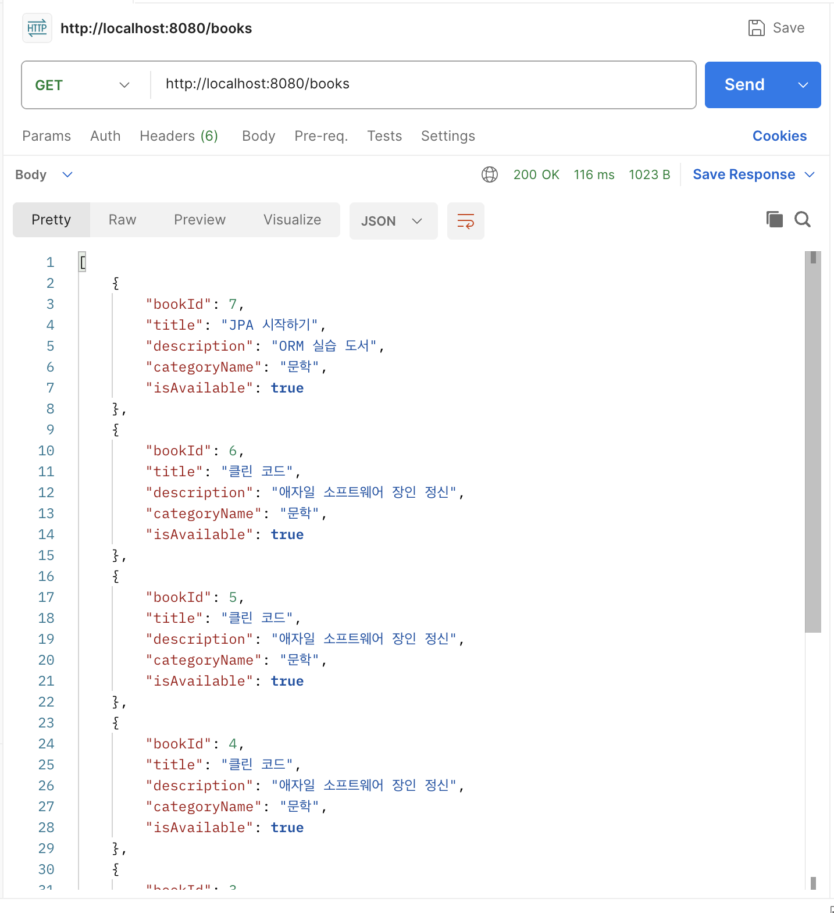
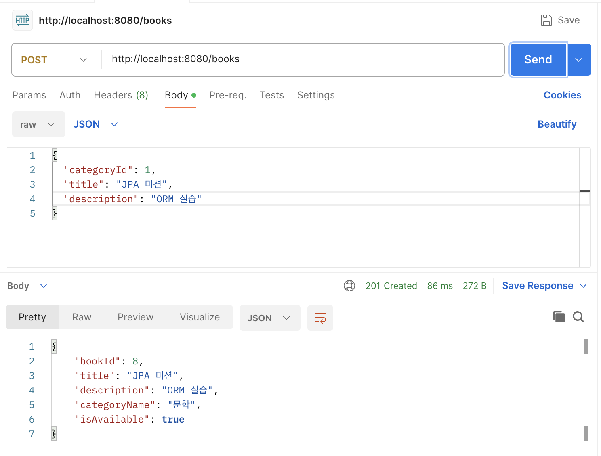
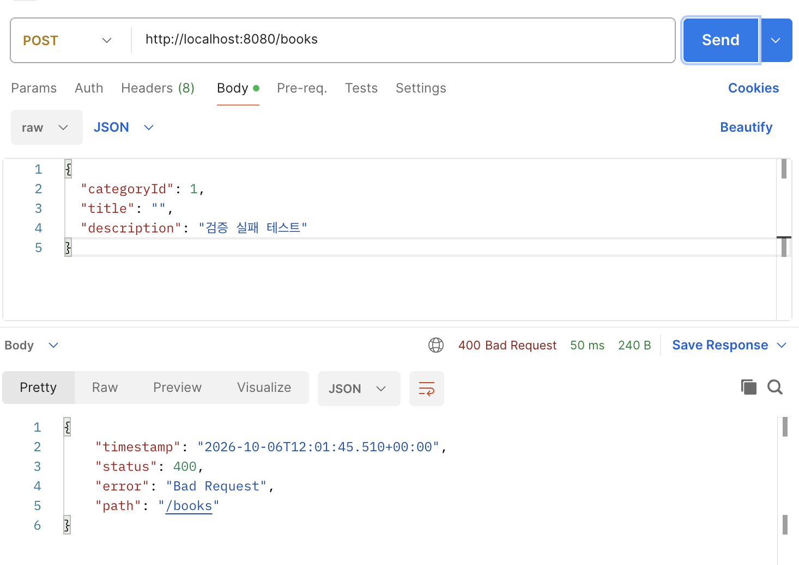

- **미션 기록**

    ```jsx
    package example.umc_11th_web_spring.entity;
    
    import jakarta.persistence.Column;
    import jakarta.persistence.Entity;
    import jakarta.persistence.FetchType;
    import jakarta.persistence.GeneratedValue;
    import jakarta.persistence.GenerationType;
    import jakarta.persistence.Id;
    import jakarta.persistence.JoinColumn;
    import jakarta.persistence.ManyToOne;
    import jakarta.persistence.Table;
    import lombok.AccessLevel;
    import lombok.Getter;
    import lombok.NoArgsConstructor;
    
    @Entity
    @Table(name = "book")
    @Getter
    @NoArgsConstructor(access = AccessLevel.PROTECTED)
    public class Book {
    
        @Id
        @GeneratedValue(strategy = GenerationType.IDENTITY)
        @Column(name = "book_id")
        private Long bookId;
    
        @ManyToOne(fetch = FetchType.LAZY)
        @JoinColumn(name = "category_id", nullable = false)
        private Category category;
    
        @Column(nullable = false, length = 100)
        private String title;
    
        @Column(columnDefinition = "TEXT")
        private String description;
    
        @Column(name = "is_available", nullable = false)
        private Boolean isAvailable = true;
    
        public Book(Category category, String title, String description) {
            this.category = category;
            this.title = title;
            this.description = description;
        }
    }
    ```

    ```jsx
    package example.umc_11th_web_spring.entity;
    
    import jakarta.persistence.Column;
    import jakarta.persistence.Entity;
    import jakarta.persistence.GeneratedValue;
    import jakarta.persistence.GenerationType;
    import jakarta.persistence.Id;
    import jakarta.persistence.Table;
    import lombok.AccessLevel;
    import lombok.Getter;
    import lombok.NoArgsConstructor;
    
    @Entity
    @Table(name = "category")
    @Getter
    @NoArgsConstructor(access = AccessLevel.PROTECTED)
    public class Category {
    
        @Id
        @GeneratedValue(strategy = GenerationType.IDENTITY)
        @Column(name = "category_id")
        private Long categoryId;
    
        @Column(nullable = false, length = 50)
        private String name;
    }
    ```

  특히

    ```jsx
    @ManyToOne(fetch = FetchType.LAZY)
        @JoinColumn(name = "category_id", nullable = false)
        private Category category;
    ```

  위 부분에서 다대일 관계를 구현하게 된다.

  @ManyToOne : 하나의 카테고리에 여러 책이 속할 수 있다.

  fetch = FetchType.LAZY : 책을 조회할 때가 아닌 getCategory()를 할 때 카테고리 정보를 가져오게 된다.

  @JoinColumn : category_id로 Category 테이블 연결

  nullable = false : 카테고리가 null은 안된다.





    ```jsx
    public record CreateBookRequest(
            @NotNull Long categoryId,
            @NotBlank @Size(max = 100) String title,
            String description
    ) {
    ```

  DTO 입력값 검증

    ```jsx
    public BookResponse createBook(@Valid @RequestBody CreateBookRequest request) {
            return bookService.createBook(request);
        }
    ```

  @Valid로 위 DTO 검증 실행

    ```jsx
    Category category = categoryRepository.findById(request.categoryId())
                    .orElseThrow(() -> new IllegalArgumentException("존재하지 않는 카테고리입니다."));
    ```

  존재하지 않는 카테고리 구현

  findById로 categoryId 조회 후 orElseThrow가 예외를 발생시켜 없는 카테고리를 가진 책이 저장되지 않는다.

    ```jsx
    public interface BookRepository extends JpaRepository<Book, Long> {
    
        List<Book> findAllByOrderByBookIdDesc();
    }
    ```

    ```jsx
    public interface CategoryRepository extends JpaRepository<Category, Long> {
    }
    ```

  실패 예시



  3주차 Raw SQL 방식에서는 JdbcTemplate으로 SQL문을 직접 작성 후 Map<String, Object> 형태로 받아 처리했다. ORM방식에선 Book, Category 엔티티로 테이블 구조와 관계를 표현하고 JpaRepository를 통해 조회와 저장을 수행한다.