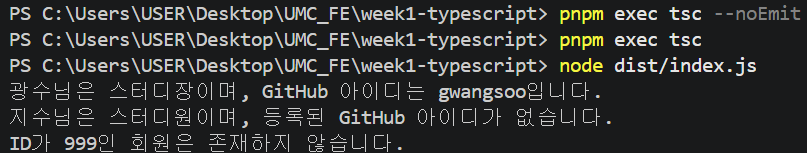

# Chapter01

## 1. 구현 방법

### 회원 타입 정의

회원의 ID, 이름, 역할, GitHub 아이디를 표현하기 위해 `StudyMember` 타입을 정의했다.

GitHub 아이디는 회원에 따라 없을 수도 있으므로 `?`를 사용해 선택적 속성으로 만들었다.

```tsx
type StudyMember = {
  id: number;
  name: string;
  role: string;
  githubId?: string;
};
```

### 회원 데이터 생성

`StudyMember[]` 타입의 배열에 서로 다른 정보를 가진 회원 두 명을 작성했다.

GitHub 아이디가 있는 경우와 없는 경우를 모두 확인하기 위해 한 명에게만 GitHub 아이디를 넣었다.

```tsx
const members: StudyMember[] = [
  {
    id: 1,
    name: "광수",
    role: "스터디장",
    githubId: "gwangsoo",
  },
  {
    id: 2,
    name: "지수",
    role: "스터디원",
  },
];
```

### 회원 검색 및 예외 처리

`getMemberInfo()` 함수가 회원 ID를 전달받도록 만들었다.

`find()`를 사용해 ID가 일치하는 회원을 찾고, 다음 세 가지 상황에 맞는 안내 문구를 반환하도록 구현했다.

- 회원과 GitHub 아이디가 모두 존재하는 경우
- 회원은 있지만 GitHub 아이디가 없는 경우
- 해당 ID를 가진 회원이 존재하지 않는 경우

```tsx
function getMemberInfo(id: number): string {
  const foundMember = members.find(
    (member) => member.id === id
  );

  if (!foundMember) {
    return `ID가 ${id}인 회원은 존재하지 않습니다.`;
  }

  const githubInfo = foundMember.githubId
    ? `GitHub 아이디는 ${foundMember.githubId}입니다.`
    : "등록된 GitHub 아이디가 없습니다.";

  return `${foundMember.name}님은 ${foundMember.role}이며, ${githubInfo}`;
}

console.log(getMemberInfo(1));
console.log(getMemberInfo(2));
console.log(getMemberInfo(999));
```

## 2. 실행 방법

프로젝트의 최상위 폴더에서 다음 명령어를 순서대로 실행했다.

### 타입 검사

```bash
pnpm exec tsc --noEmit
```

JavaScript 파일을 생성하지 않고 TypeScript 타입 오류가 있는지 검사했다. 오류가 없으면 별도의 메시지가 출력되지 않는다.

### 컴파일

```bash
pnpm exec tsc
```

`src/index.ts`를 JavaScript 파일인 `dist/index.js`로 컴파일했다.

### 실행

```bash
node dist/index.js
```

컴파일된 JavaScript 파일을 Node.js로 실행했다.

## 3. 실행 결과

회원 ID `1`, `2`, `999`를 전달해 각각의 결과를 확인했다.



- ID `1`: GitHub 아이디가 있는 회원
- ID `2`: GitHub 아이디가 없는 회원
- ID `999`: 존재하지 않는 회원