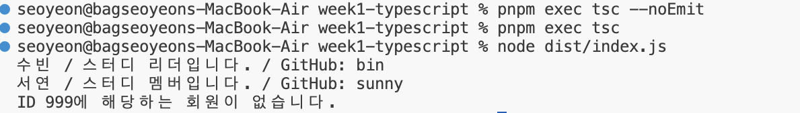

## TypeScript 미션

### 코드

```typescript
type MemberRole = "leader" | "member";

interface StudyMember {
  id: number;
  name: string;
  role: MemberRole;
  githubId?: string;
}

const teamMembers: StudyMember[] = [
  {
    id: 1,
    name: "수빈",
    role: "leader",
    githubId: "bin",
  },
  {
    id: 2,
    name: "서연",
    role: "member",
    githubId: "sunny",
  },
  {
    id: 3,
    name: "성현",
    role: "member",
  },
];

function getRoleMessage(role: MemberRole): string {
  switch (role) {
    case "leader":
      return "스터디 리더입니다.";
    case "member":
      return "스터디 멤버입니다.";
  }
}

function printMemberInfo(memberId: number): string {
  const member = teamMembers.find(({ id }) => id === memberId);

  if (member === undefined) {
    return `ID ${memberId}에 해당하는 회원이 없습니다.`;
  }

  const github = member.githubId ?? "GitHub 계정 없음";
  const roleMessage = getRoleMessage(member.role);

  return `${member.name} / ${roleMessage} / GitHub: ${github}`;
}

console.log(printMemberInfo(1));
console.log(printMemberInfo(2));
console.log(printMemberInfo(999));
```

### 실행 결과



### 설명

회원 정보를 `interface`로 정의하고, 역할은 `"leader" | "member"` 유니온 타입으로 제한했습니다.

회원 ID로 데이터를 찾은 뒤 역할에 따라 안내 문구를 출력하고, GitHub ID가 없는 경우에는 기본 문구가 출력되도록 구현했습니다. 존재하지 않는 회원 ID도 오류 없이 처리하도록 했습니다.