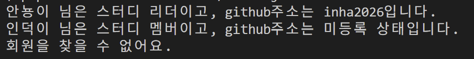

# 1주차 미션 — TypeScript 스터디 회원 관리


## 전체 코드

```ts
type MemberRole = "studyLeader" | "studyMember";

interface StudyMember {
  id: number;
  name: string;
  role: MemberRole;
  githubId?: string;
}

const members: StudyMember[] = [
  { id: 1, name: "안뇽이", role: "studyLeader", githubId: "inha2026" },
  { id: 2, name: "인덕이", role: "studyMember" },
];

function printInfo(id: number) {
  const found = members.find((member) => member.id === id);

  if (!found) {
    return "회원을 찾을 수 없어요.";
  }

  const githubID = found.githubId ?? "미등록 상태";
  const roleLabel = found.role === "studyLeader" ? "스터디 리더" : "스터디 멤버";

  return `${found.name} 님은 ${roleLabel}이고, github주소는 ${githubID}입니다.`;
}

console.log(printInfo(1));
console.log(printInfo(2));
console.log(printInfo(999));
```

## 실행 결과

