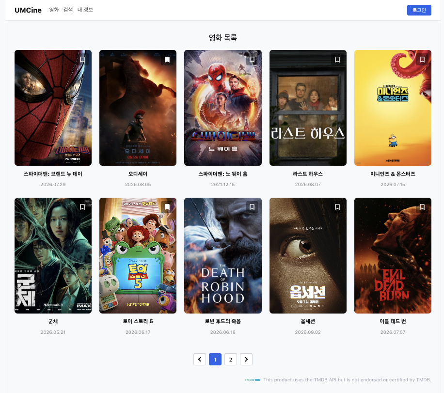

## 필수 미션

### 구현 화면



### Header

```tsx
// header.tsx
export const Header = () => {
  return (
    <header className="header-topbar">
      <div className="header-inner">
        <div className="nav-left">
          <strong className="logo">UMCine</strong>
          <nav className="nav-links">
            <button type="button">영화</button>
            <button type="button">검색</button>
            <button type="button">내 정보</button>
          </nav>
        </div>
        <div className="nav-right">
          <button type="button" className="login-btn">로그인</button>
        </div>
      </div>
    </header>
  );
};
```

### MovieCard

```tsx
// movie-card.tsx
import type { MouseEvent } from "react";
import type { Movie } from "../types/movie";

interface MovieCardProps {
  movie: Movie;
  onToggleBookmark: (id: number) => void;
}

export const MovieCard = ({ movie, onToggleBookmark }: MovieCardProps) => {
  const handleBookmarkClick = (e: MouseEvent<HTMLButtonElement>) => {
    e.stopPropagation();
    onToggleBookmark(movie.id);
  };

  return (
    <article className="article-movie-card">
      <div className="div-poster">
        

        <button
          type="button"
          className="bookmark-btn"
          onClick={handleBookmarkClick}
          aria-label={movie.isBookmarked ? "북마크 취소" : "북마크 추가"}
        >
          
        </button>
      </div>

      <div className="div-movie-title">
        <strong title={movie.title}>{movie.title}</strong>
      </div>

      <div className="div-movie-meta">
        <span>{movie.releaseDate}</span>
      </div>
    </article>
  );
};
```

### MovieGrid

```tsx
// movie-grid.tsx
import type { Movie } from "../types/movie";
import { MovieCard } from "./movie-card";

interface MovieGridProps {
  movies: Movie[];
  onToggleBookmark: (id: number) => void;
}

export const MovieGrid = ({ movies, onToggleBookmark }: MovieGridProps) => {
  return (
    <div className="div-movie-grid">
      {movies.map((movie) => (
        <MovieCard
          key={movie.id}
          movie={movie}
          onToggleBookmark={onToggleBookmark}
        />
      ))}
    </div>
  );
};
```

### Pagination

```tsx
// pagination.tsx
export const Pagination = () => {
  return (
    <div className="pagination">
      <button type="button" disabled aria-label="이전 페이지">
        
      </button>
      <button type="button" className="active">1</button>
      <button type="button">2</button>
      <button type="button" aria-label="다음 페이지">
        
      </button>
    </div>
  );
};
```