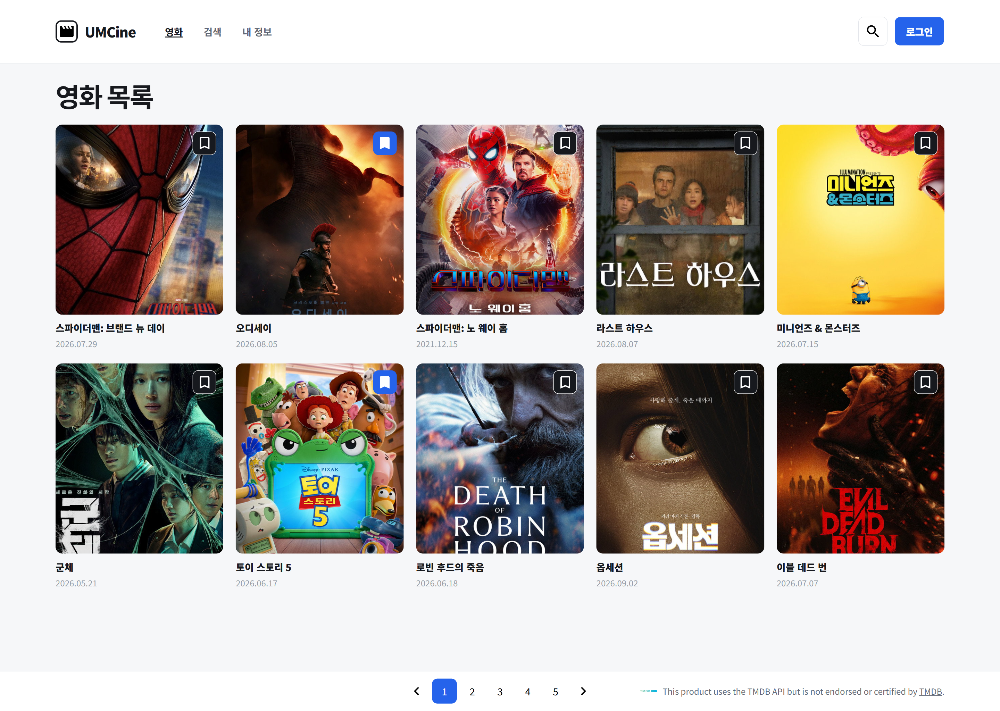

# Chapter02

## 1. 구현 방법

### 컴포넌트 분리

영화 목록 화면을 역할에 따라 여러 컴포넌트로 분리했다.

헤더, 영화 카드, 영화 목록, 페이지네이션을 각각 별도의 컴포넌트로 만들고 영화 데이터와 타입도 분리하여 관리했다.

```
src/
├─ components/
│  ├─ layout/
│  │  └─ header.tsx
│  └─ movies/
│     ├─ movie-card.tsx
│     ├─ movie-grid.tsx
│     └─ pagination.tsx
├─ data/
│  └─ movies.ts
└─ types/
   └─ movie.ts
```

- `header.tsx`: UMCine 로고와 상단 영역
- `movie-card.tsx`: 하나의 영화 정보와 북마크 버튼
- `movie-grid.tsx`: 여러 개의 영화 카드를 목록으로 출력
- `pagination.tsx`: 페이지 이동 UI
- `movies.ts`: 화면에 표시할 영화 데이터
- `movie.ts`: 영화 데이터의 타입 정의

### 영화 목록 출력

`movies.ts`에 저장된 영화 데이터를 `MovieGrid`에 전달했다.

`map()`을 사용해 각 영화 데이터를 `MovieCard`로 만들고, 영화 정보와 북마크 상태를 변경하기 위한 함수를 props로 전달했다.

```tsx
{movies.map((movie) => (
  <MovieCard
    key={movie.id}
    movie={movie}
    onToggleBookmark={onToggleBookmark}
  />
))}
```

이를 통해 하나의 `MovieCard` 컴포넌트를 재사용하면서 각 영화의 포스터, 제목, 개봉일이 표시되도록 구현했다.

### 북마크 상태 관리

각 영화의 북마크 상태를 변경하기 위해 `useState`를 사용했다.

초기 영화 데이터를 state에 저장하여 북마크 상태가 변경되면 화면에도 변경된 상태가 반영되도록 했다.

```tsx
const [movies, setMovies] = useState(initialMovies);
```

북마크 버튼을 클릭하면 해당 영화의 ID를 `handleToggleBookmark()`에 전달하도록 했다.

`map()`으로 영화 목록을 확인하고 ID가 일치하는 영화의 `isBookmarked` 값만 반대로 변경했다.

```tsx
function handleToggleBookmark(movieId: number) {
  setMovies((currentMovies) =>
    currentMovies.map((movie) =>
      movie.id === movieId
        ? { ...movie, isBookmarked: !movie.isBookmarked }
        : movie,
    ),
  );
}
```

따라서 하나의 북마크 버튼을 클릭해도 다른 영화의 상태에는 영향을 주지 않고 선택한 영화의 북마크 상태만 변경된다.

### 북마크 이벤트 전달

북마크 상태는 `App`에서 관리하고 실제 북마크 버튼은 `MovieCard`에 있기 때문에 상태 변경 함수를 props로 전달했다.

`App`에서 `MovieGrid`로 함수를 전달하고, 다시 각 `MovieCard`로 전달하도록 구성했다.

```tsx
<MovieGrid
  movies={movies}
  onToggleBookmark={handleToggleBookmark}
/>
```

`MovieCard`에서는 북마크 버튼을 클릭하면 현재 영화의 ID를 전달하도록 했다.

```tsx
onClick={() => onToggleBookmark(movie.id)}
```

따라서 다음과 같은 순서로 북마크 상태가 변경된다.

**북마크 버튼 클릭 → 영화 ID 전달 → 해당 영화의 state 변경 → 화면 재렌더링**

### 북마크 상태에 따른 UI 변경

각 영화의 `isBookmarked` 값에 따라 표시되는 북마크 아이콘이 달라지도록 구현했다.

```tsx

```

- `isBookmarked`가 `true`인 경우: 채워진 북마크 아이콘
- `isBookmarked`가 `false`인 경우: 비어 있는 북마크 아이콘

북마크 상태에 따라 버튼의 class도 변경하여 북마크 여부가 UI에 함께 반영되도록 했다.

```tsx
className={`bookmark-button ${
  movie.isBookmarked ? "bookmarked" : ""
}`}
```

## 2. 실행 결과

Figma의 영화 목록 화면을 기준으로 최종 화면을 확인했다.



- 총 10개의 영화 데이터가 정상적으로 표시되는 것을 확인했다.
- 각 영화의 포스터, 제목, 개봉일이 정상적으로 표시되는 것을 확인했다.
- 북마크 버튼을 클릭하면 선택한 영화의 북마크 상태만 변경되는 것을 확인했다.
- 북마크 상태에 따라 아이콘과 버튼 UI가 변경되는 것을 확인했다.
- 페이지네이션과 TMDB 안내 영역이 정상적으로 표시되는 것을 확인했다.
- `pnpm build`를 실행하여 최종 빌드가 정상적으로 완료되는 것을 확인했다.
