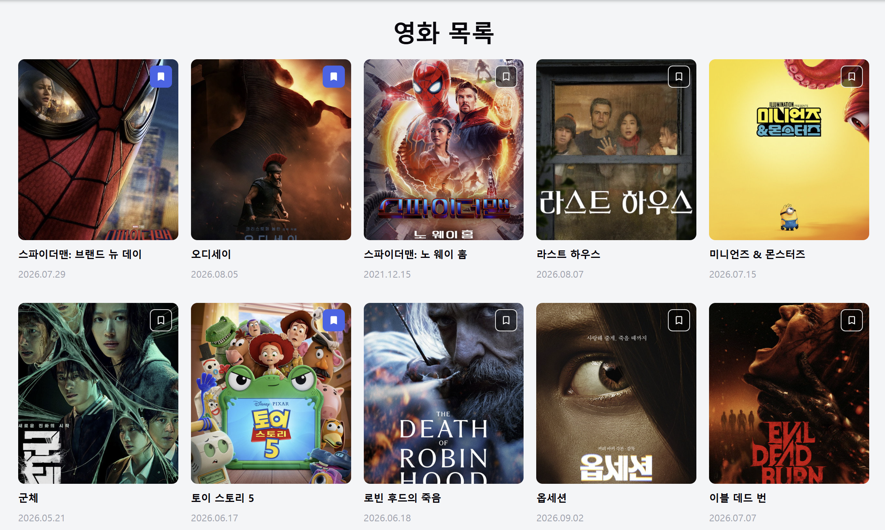

# 2주차 미션 — UMCine 영화 목록 화면

## 완성 화면



## 컴포넌트 구조

### 폴더 구조

```
src/
├── components/
│   ├── header.tsx
│   ├── movie-card.tsx
│   └── movie-grid.tsx
├── data/
│   └── movies.ts
├── types/
│   └── movie.ts
├── App.tsx
└── App.css
```

새 파일과 폴더 이름은 케밥 케이스로, 컴포넌트 함수 이름은 파스칼 케이스로 작성했다.

### 컴포넌트 트리

```
App (movies 상태)
├── Header
├── MovieGrid
│   └── MovieCard × 10
└── Pagination
```

## 핵심 코드

### `App.tsx` — 북마크 상태 관리

```tsx
export default function App() {
  const [movies, setMovies] = useState(initialMovies);

  function handleToggleBookmark(movieId: number) {
    setMovies((currentMovies) =>
      currentMovies.map((movie) =>
        movie.id === movieId
          ? { ...movie, isBookmarked: !movie.isBookmarked }
          : movie,
      ),
    );
  }

  return (
    <div className="app">
      <Header />
      <main className="page">
        <h2 className="page__title">영화 목록</h2>
        <MovieGrid movies={movies} onToggleBookmark={handleToggleBookmark} />
        <Pagination />
      </main>
    </div>
  );
}
```

### `movie-card.tsx` — props와 북마크 버튼

```tsx
interface MovieCardProps {
  movie: Movie;
  onToggleBookmark: (movieId: number) => void;
}

export default function MovieCard({ movie, onToggleBookmark }: MovieCardProps) {
  return (
    <li className="movie-card">
      <div className="movie-card__poster">
        
        <button
          type="button"
          className="movie-card__bookmark"
          aria-pressed={movie.isBookmarked}
          aria-label={movie.isBookmarked ? "북마크 해제" : "북마크 추가"}
          onClick={() => onToggleBookmark(movie.id)}
        >
          
        </button>
      </div>
      <h2 className="movie-card__title">{movie.title}</h2>
      <p className="movie-card__date">{movie.releaseDate}</p>
    </li>
  );
}
```

## 설계 포인트

### 1. 상태는 `App` 한 곳에서 관리

영화 목록 상태는 `App`에서 `useState`로 관리하고, `MovieCard`는 `movie`와 `onToggleBookmark`를 props로 받는다.
카드는 상태를 직접 바꾸지 않고 전달받은 함수에 자신의 `id`를 넘겨 변경을 요청한다. (상태 끌어올리기)

### 2. 원본을 직접 수정하지 않는 업데이트

`map`으로 새 배열을 만들고, 선택한 영화만 스프레드 문법(`{ ...movie }`)으로 새 객체를 만들어 교체했다.
나머지 영화는 기존 객체를 그대로 반환하기 때문에, React가 바뀐 카드만 정확히 감지할 수 있다.
