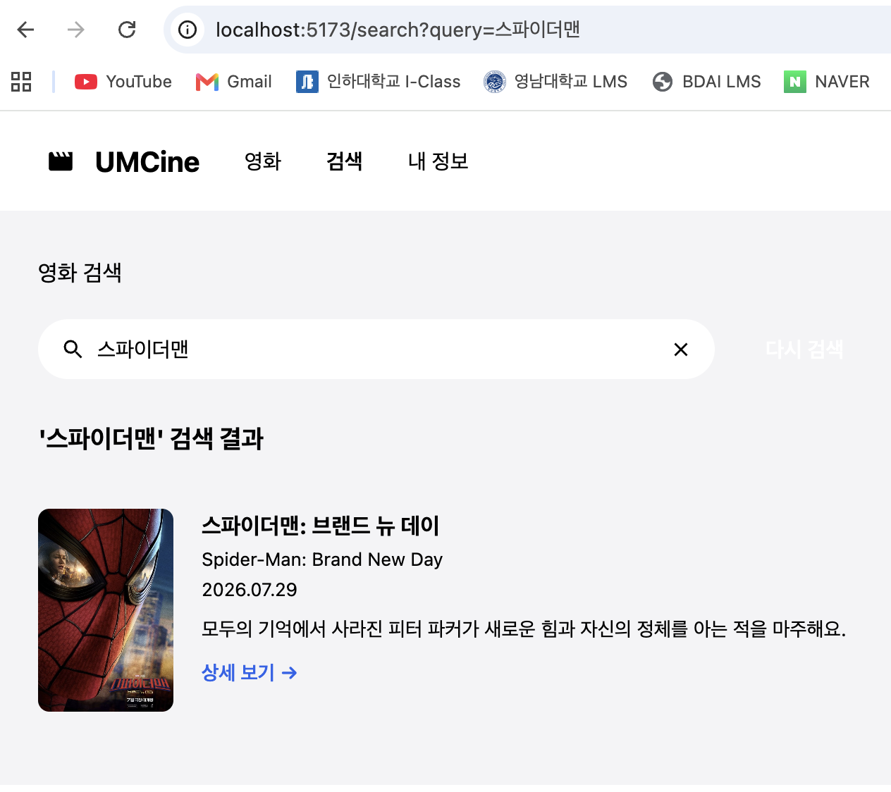
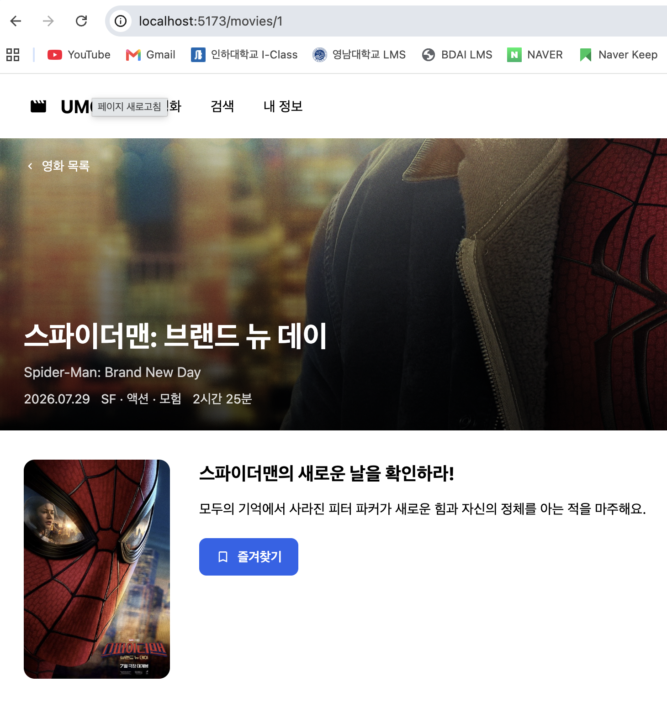

# Frontend Chapter03

## 필수 미션

### 1. 공개 영화 화면에 라우팅 연결하기

TanStack Router를 활용해 메인 화면, 검색 화면, 상세 화면을 각각 매핑했습니다.

#### 영화 목록

```tsx
// routes/index.tsx
import { createFileRoute } from "@tanstack/react-router";
import { MovieListPage } from "../pages/movies/movie-list-page";

export const Route = createFileRoute("/")({
  //파일 기반 라우팅 문법으로, 파일 경로가 src/routes/index.tsx이면 자동으로 "/" 경로로 매핑된다.
  component: MovieListPage,
  //__root.tsx의 <Outlet /> 빈자리에 주소가 /일 때 갈아끼워질 실제 본문으로 MovieListPage를 지정한다.
});

//autoCodeSplitting 옵션을 켜면 이 페이지를 chunk로 분리해놨다가, 주소가 /일 때만 이 chunk를 불러와서 렌더링한다. (즉, 초기 로딩 속도가 빨라진다.)
```

#### 검색 화면

```tsx
// routes.search.tsx
export const Route = createFileRoute("/search")({
  validateSearch: (search): { query?: string } => ({
    query: typeof search.query === "string" ? search.query : undefined,
  }),
  component: SearchPage,
});

/*
search param: /search/?query=오디세이에서 query처럼 지정한 값이 search param으로 들어온다. (query는 임의로 지정한 이름이다.)
validateSearch: search param을 검증하는 함수. URL에서 들어오는 search값을 확인하고
               search param이 query라는 이름으로 들어오면 그대로 쓰고, 아니면 undefined로 처리한다.

- 이후 상위 __root.tsx의 <Outlet /> 빈자리에 주소가 /search일 때 갈아끼워질 실제 본문으로 SearchPage를 지정한다.
*/
```



#### 상세 화면

```tsx
// pages/movies/movie-detail-page.tsx
export function MovieDetailPage() {
  const { movieId } = useParams({ from: "/movies/$movieId" }); //path param을 가져와 영화를 찾고 아래서 상세 정보 표시
  const movie = movies.find((item) => item.id === Number(movieId));

  if (!movie) {
    return <main className={styles.notFound}>영화를 찾을 수 없어요.</main>;
  }
```



### 2. 기존 CSS를 Tailwind CSS로 옮기기

`.card`와 `.posterWrapper` 등의 CSS 클래스를 `flex flex-col text-left`, `relative` 같은 Tailwind 유틸리티로 교체했습니다. (세로 정렬/왼쪽정렬/절대위치설정)

```tsx
<article className="flex flex-col text-left">
      <div className="relative">
        {/* 포스터 영역 링크 */}
        <Link
          to="/movies/$movieId"
          params={{ movieId: String(movie.id) }}
          className="block w-full h-full"
        >
```

`aspect-[2/3]`, `object-cover`, `rounded-[12px]`, `font-semibold` 등을 활용해 기존 디자인과 정확히 일치하도록 수치형 Tailwind 클래스를 적용했습니다. (포스터 비율 유지 / 이미지 꽉 채우게 자름 / 모서리 둥글게 처리)

```tsx
{movie.posterPath && (
            
          )}
```

북마크가 활성화된 상태(`movie.isBookmarked`)에 따라 배경색이 토글되는 클래스를 `cn()` 내부에 삼항 연산자로 깔끔하게 묶었습니다.

```tsx
<button
          type="button"
          aria-pressed={movie.isBookmarked}
          onClick={() => onToggleBookmark(movie.id)}
          className={cn(
            "absolute top-3 right-3 z-10 flex h-8 w-8 items-center justify-center rounded-lg border-none cursor-pointer transition-colors",
            movie.isBookmarked ? "bg-blue-600" : "bg-black/55"
          )}
        >
					  /* 
              movie.isBookmarked 상태에 따른 조건부 배경색 토글
              - true  : 파란색 배경 (bg-blue-600)
              - false : 반투명 검은색 배경 (bg-black/55)
            */
```

---

## 선택 미션

### 현재 route와 일치하는 헤더 메뉴에만 활성 스타일을 표시해 보세요.

TanStack Router의 `<Link>` 컴포넌트에서 제공하는 **`activeProps`** 속성을 사용하면, **현재 브라우저의 URL 경로와 링크의 `to` 경로가 일치할 때** 자동으로 해당 스타일을 적용해 줍니다.

이를 통해 별도의 상태(state)나 수동 조건문 로직을 작성할 필요 없이, 현재 머물고 있는 헤더 메뉴에만 활성 스타일(`navButtonActive`)을 깔끔하고 선언적으로 표시할 수 있습니다.

```tsx
// components/layout/header.tsx
export function Header() {
  return (
    <header className={styles.header}>
      <div className={styles.left}>
        {/* 홈으로 이동하는 로고 링크 */}
        <Link to="/" className={styles.logoButton}> {/*SPA방식으로 주소와 본문(<Outlet />)을 교체*/}
          
          UMCine
        </Link>

        {/* 영화 탭 */}
        <Link
          to="/"
          className={styles.navButton}
          activeProps={{
            className: `${styles.navButton} ${styles.navButtonActive}`,
          }}
          // 현재 주소가 '/'일 때만 이 클래스들이 추가로 적용됨
        >
          영화
        </Link>
```
