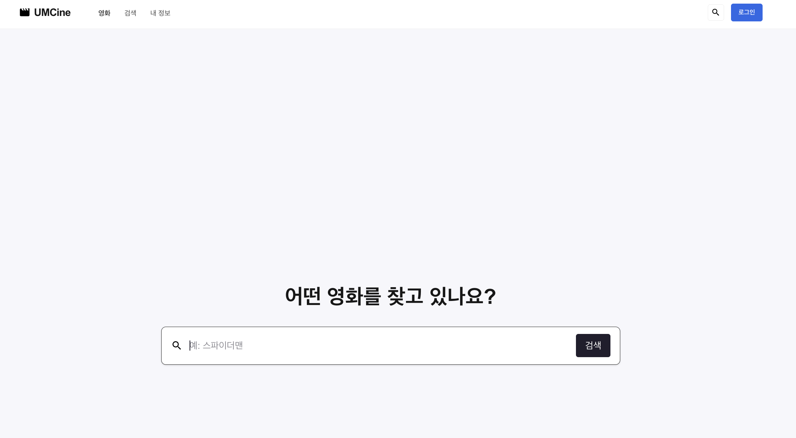
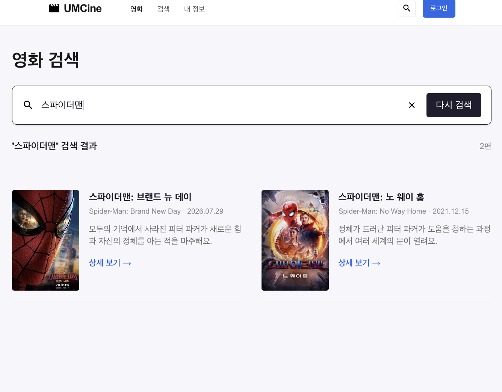

- 필수 미션

  **1. 영화 목록·검색·상세 라우팅**

    - `/`은 영화 목록, `/search?query=...`는 검색, `/movies/$movieId`는 상세 화면으로 연결. 검색어는 URL에서 읽고 제출할 때 다시 URL에 저장 → 직접 접속·새로고침에도 같은 검색 조건 사용

    ```tsx
    export const Route = createFileRoute("/search")({
      validateSearch: (search): { query?: string } => ({
        query: typeof search.query === "string" ? search.query : undefined,
      }),
      component: SearchPage,
    });
    ```

    ```tsx
    const normalizedQuery = query?.trim().toLowerCase() ?? "";
    const searchResults = normalizedQuery
        ? movies.filter(
            (movie) =>
                movie.title.toLowerCase().includes(normalizedQuery) ||
                movie.originalTitle.toLowerCase().includes(normalizedQuery),
        )
        : [];
    
    function handleSubmit(event: SubmitEvent<HTMLFormElement>) {
        event.preventDefault();
        const nextQuery = searchText.trim();
        navigate({
            search: nextQuery ? { query: nextQuery } : {},
        });
    }
    ```

    - `movies`의 제목·원제를 대소문자 구분 없이 검색. 결과 수와 포스터/제목/원제/개봉일/줄거리를 표시하고, 검색어가 없으면 결과 영역을 표시하지 않고 다시 `/search`로 이동, 검색 결과가 0편이면 “검색 결과가 없어요.”를 표시

  **2. 상세 영화 선택과 화면 이동**

    ```tsx
    const { movieId } = useParams({ from: "/movies/$movieId" });
    const movie = movies.find((item) => item.id === Number(movieId));
    
    if (!movie) {
      return <main>영화를 찾을 수 없어요.</main>;
    }
    ```

    ```tsx
    <Link
        className="mt-4 inline-block text-sm font-semibold text-blue-600"
        to="/movies/$movieId"
        params={{ movieId: String(movie.id) }}
    >
        상세 보기 →
    </Link>
    ```

    - 카드와 검색 결과의 `Link`에 해당 영화 ID를 전달. 상세에서는 ID로 로컬 데이터를 찾고 배경/포스터/영화 정보를 표시, 없는 ID는 안내 문구로 처리

  **3. Tailwind 스타일과 상태별 class**

    ```tsx
    className={cn(
        "min-h-[calc(100vh-56px)]",
        normalizedQuery
            ? "mx-auto w-full max-w-[1280px] px-5 py-10"
            : "flex flex-col items-center justify-center gap-8 px-5",
    )}
    ```

    - 검색어 유무에 따라 검색 화면 배치를 변경. 목록·카드·페이지네이션·검색·상세에 Tailwind utility를 적용하고, 카드의 북마크 배경도 `cn`으로 선택.

  

  

  