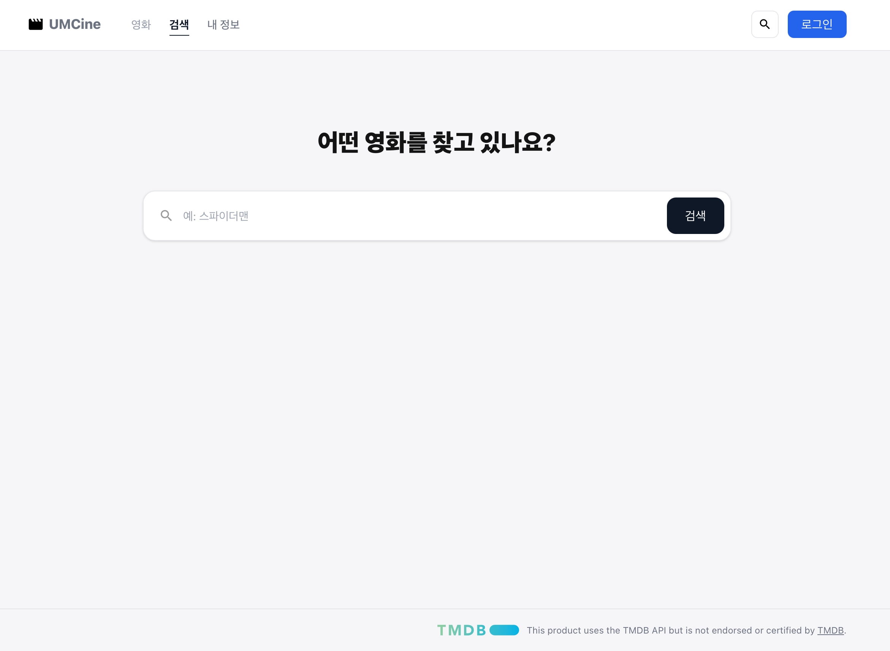
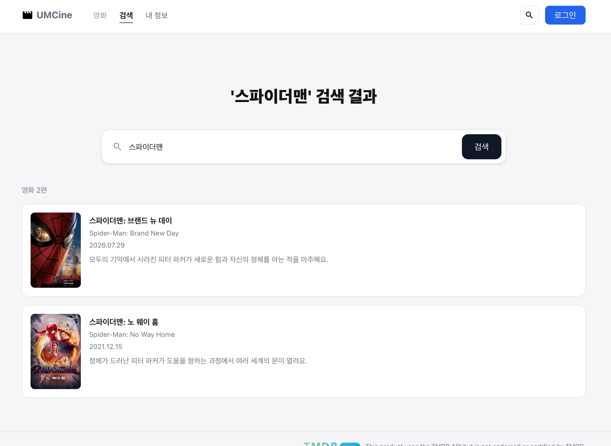
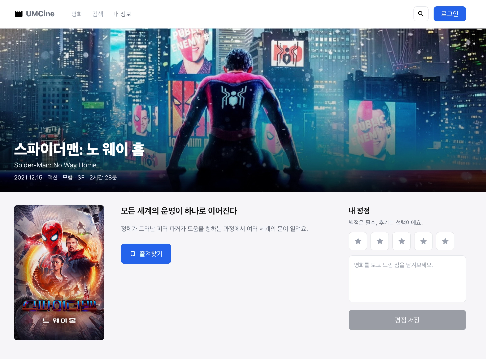
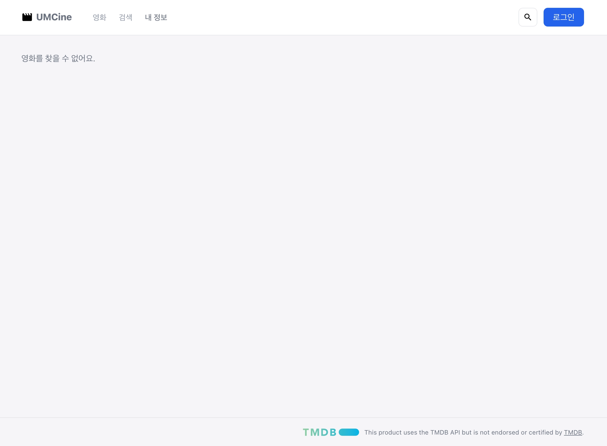

- 필수 미션
    
    ### 1. TanStack Router 설치 및 라우팅 세팅
    
    - `@tanstack/react-router`, `@tanstack/router-plugin` 설치
    - `vite.config.ts`에 `tanstackRouter({ autoCodeSplitting: true })` 플러그인 추가
    - `src/routes/__root.tsx` (공통 레이아웃: Header + Outlet + Footer)
    - `src/routes/index.tsx` → `/` → `MovieListPage`
    - `src/routes/search.tsx` → `/search?query=...` → `SearchPage` (`validateSearch`로 query 파싱)
    - `src/routes/movies.$movieId.tsx` → `/movies/$movieId` → `MovieDetailPage`
    - 기존 `App.tsx`를 `src/pages/movies/movie-list-page.tsx`로 이전, 헤더 내비게이션을 `<a>` → `<Link>`로 교체
    
    ### 2. 검색 화면 구현
    
    - `useSearch`/`useNavigate`로 URL의 query와 입력창 상태를 동기화
    - 결과 리스트에 포스터, 제목, 원제, 개봉일, 줄거리 표시, 각 항목은 상세 화면으로 `Link` 연결
    - 결과 화면
        
        
        
        
        
    
    ### 3. 상세 화면 구현 (Figma 반영)
    
    - 백드롭 히어로 배너: 뒤로가기(`영화 목록`), 제목/원제, 개봉일·장르·러닝타임
    - 포스터, 태그라인, 줄거리, 즐겨찾기 버튼(북마크 토글)
    - 존재하지 않는 영화 ID 접근 시 "영화를 찾을 수 없어요." 표시
    - 결과 화면
        - 존재하는 영화 ID 접근 시
        
        
        
        - 존재하지 않는 영화 ID 접근 시
        
        
        
    
    ### 4. Tailwind CSS 전체 마이그레이션
    
    - `tailwindcss` + `@tailwindcss/vite` 설치, `index.css`에 `@import "tailwindcss"`
    - 디자인 토큰을 Tailwind v4 `@theme`로 등록 (`-color-app-bg`, `-color-app-text-h` 등) → `bg-app-bg`, `text-app-text-h` 같은 유틸리티로 전역 사용
    - `header`, `footer`, `movie-grid`, `pagination`, `movie-card` 등 기존 CSS 파일을 전부 삭제하고 Tailwind utility class로 전환
    - 상태에 따라 달라지는 class는 `cn`(clsx + tailwind-merge)으로 조합
    - 헤더 내비게이션은 TanStack Router의 `Link` render-prop(`{({ isActive }) => ...}`)으로 현재 경로에 따라 활성 탭 스타일 적용
    
    ### 5. 트러블슈팅
    
    - `useEffect` 안에서 setState를 동기 호출하는 패턴이 `react-hooks/set-state-in-effect` lint 규칙에 걸려서, React 공식 가이드의 "렌더 중 상태 조정" 패턴으로 교체
    - 헤더 활성 탭 스타일을 `data-[status=active]:` 임의 변형으로 구현했더니 캐스케이드 순서 문제로 색상이 제대로 안 먹혀서, `Link`의 children render-prop으로 JS에서 직접 `isActive`를 계산하는 방식으로 교체해 해결