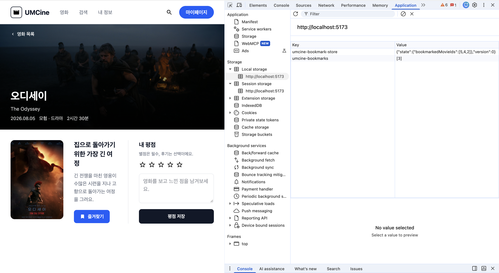
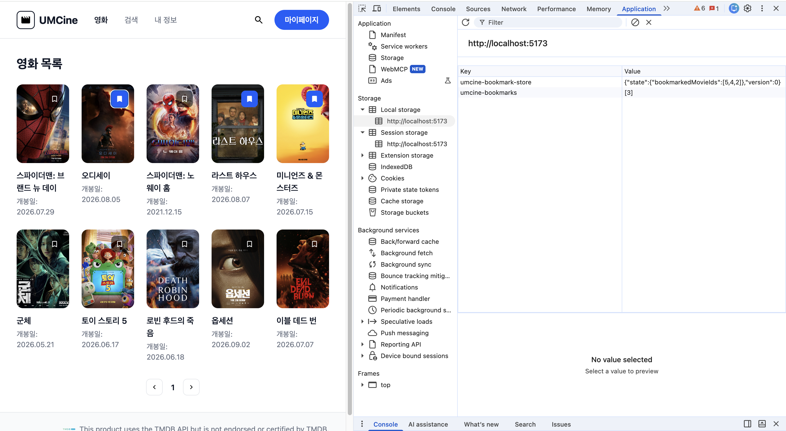
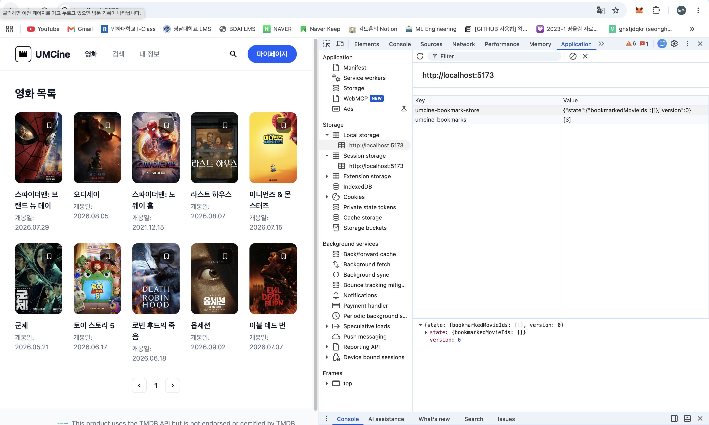
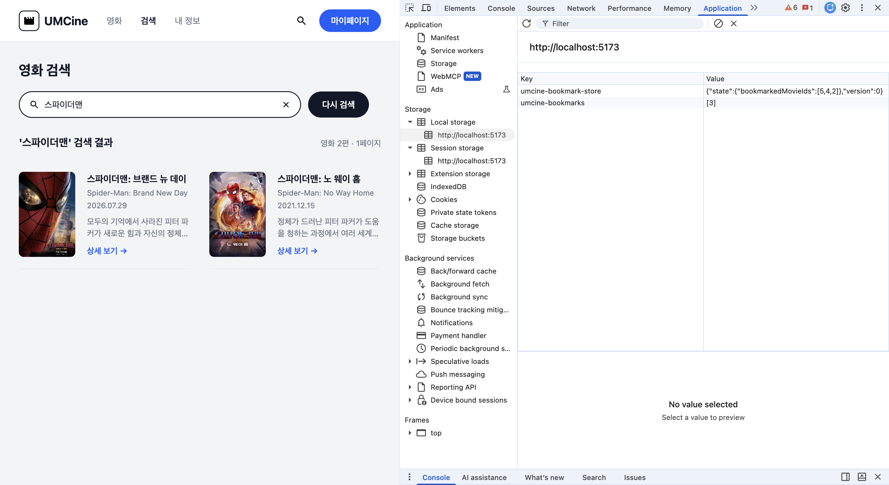
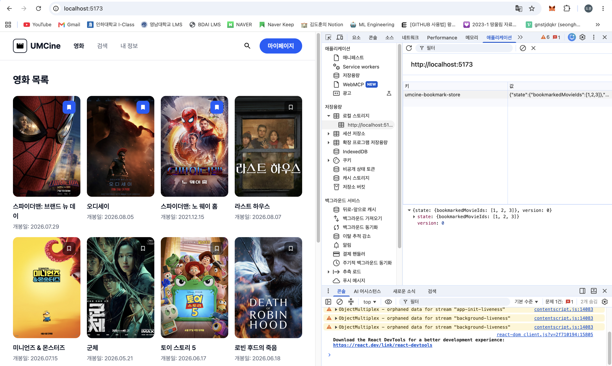

# Frontend Chapter04

## 필수 미션

## 배경 및 문제 상황

기존에는 `movie-grid.tsx` 컴포넌트 내부에서 `useState`와 `localStorage`를 직접 조합하여 북마크 상태를 관리하고, `MovieCard`에 `onToggleBookmark` 콜백을 Prop으로 전달하는 방식이었습니다.

이 방식은 북마크 상태가 `MovieGrid` 컴포넌트 내부에만 갇혀 있어, **검색 화면이나 상세 화면 등 다른 컴포넌트 트리와 동일한 북마크 상태를 공유할 수 없는 한계**가 있었습니다.

## 상태 관리 구조 비교 (Before & After)

### 1) 기존 방식: `useState` + Props 전달 (컴포넌트 지역 상태)

```
[MovieGrid 컴포넌트] (useState로 북마크 보유)
       │
       ▼ (onToggleBookmark props 전달)
[MovieCard 컴포넌트] ──▶ [인라인 <button>]
```

- **한계:** 새로고침 시 초기화, `MovieGrid` 외부(검색/상세 페이지)에서는 북마크 상태에 접근 불가.

### 2) 변경된 방식: Zustand Store + Persist (전역 상태 + 자동 저장)

```
                  ┌──────────────────────────────┐
[목록 BookmarkButton] ──┐                          │
                        ├─ toggleBookmark(id) ─▶  useBookmarkStore   ──persist──▶ localStorage
[상세 즐겨찾기 버튼] ───┘                          │  bookmarkedMovieIds         "umcine-bookmark-store"
                  └──────────────┬───────────────┘            ▲
                                 │ 구독(selector)             │ 앱 시작 시 복원(hydrate)
                                 ▼                            │
            값이 바뀌면 구독 중인 컴포넌트만 리렌더 ───────────┘
```

---

## 필수 미션

### 1. 북마크 상태를 Zustand로 공유하기

#### 전역 스토어 작성 (`stores/bookmark-store.ts`)

목록, 검색, 상세 화면이 모두 동일한 상태를 바라보도록 모듈 레벨의 Zustand 스토어를 만들었습니다.

```typescript
import { create } from "zustand";
import { createJSONStorage, persist } from "zustand/middleware";

interface BookmarkStore {
  bookmarkedMovieIds: number[];
  toggleBookmark: (movieId: number) => void;
}

export const useBookmarkStore = create<BookmarkStore>()(
  persist(
    (set) => ({
      bookmarkedMovieIds: [],
      toggleBookmark: (movieId) =>
        set((state) => ({
          bookmarkedMovieIds: state.bookmarkedMovieIds.includes(movieId)
            ? state.bookmarkedMovieIds.filter((id) => id !== movieId)
            : [...state.bookmarkedMovieIds, movieId],
        })),
    }),
    {
      name: "umcine-bookmark-store",
      storage: createJSONStorage(() => localStorage),
      partialize: (state) => ({ bookmarkedMovieIds: state.bookmarkedMovieIds }),
    },
  ),
);
```

#### 독립 북마크 버튼 컴포넌트 분리 (`components/bookmark-button.tsx`)

Props 전달 없이 스토어를 직접 구독하도록 구현했습니다.

```tsx
import { useBookmarkStore } from "@/stores/bookmark-store";

export function BookmarkButton({ movieId }: { movieId: number }) {
  const isBookmarked = useBookmarkStore((s) => s.bookmarkedMovieIds.includes(movieId));
  const toggleBookmark = useBookmarkStore((s) => s.toggleBookmark);

  return (
    <button
      type="button"
      aria-pressed={isBookmarked}
      onClick={() => toggleBookmark(movieId)}
      className="absolute top-3 right-3 size-8 rounded-lg bg-black/55 ..."
    >
      {/* 북마크 아이콘 */}
    </button>
  );
}
```

#### 컴포넌트 간 Prop Drilling 제거 (`movie-card.tsx` / `movie-grid.tsx`)

- **`movie-card.tsx`**: 인라인 버튼을 `<BookmarkButton movieId={movie.id} />`로 교체하고 `onToggleBookmark` prop을 제거했습니다.
- **`movie-grid.tsx`**: 더 이상 호출되지 않는 `handleToggleBookmark` 함수를 제거하여 타입스크립트 에러를 해결했습니다.
- **`movie-detail-page.tsx`**: 상세 화면의 버튼도 동일하게 `useBookmarkStore`를 구독하여 즉시 상태가 공유되도록 연결했습니다.

#### 결과 확인

영화 목록에서 북마크한 영화(ID: 2, 오디세이)의 상세 페이지로 이동했을 때 "즐겨찾기" 버튼이 활성화 상태로 유지되는 것을 확인했습니다.



### 2. 북마크 상태를 Web Storage에 유지하기

#### 수행한 작업 및 검증

1. **자동 저장 및 복원**: `persist` 미들웨어를 통해 `localStorage`의 `umcine-bookmark-store` 키로 상태가 자동 직렬화 및 복원됩니다.
2. **지속성 검증**: 새로고침(`F5`) 및 브라우저를 닫고 다시 켜도 이전 북마크 상태가 유지됨을 확인했습니다.
3. **Storage 데이터 삭제 시 안전한 초기화**: Application 패널에서 저장값을 직접 지우거나 초기화했을 때 앱 오류 없이 빈 상태(`[]`)로 안전하게 복구되는 것을 확인한 뒤 `pnpm build`를 완료했습니다.

#### 결과 확인

목록에서 선택된 북마크들(오디세이, 라스트 하우스, 미니언즈 등)과 Application 패널의 `umcine-bookmark-store` Value(`[5,4,2]`)가 일치합니다.



Storage 데이터를 초기화했을 때 UI의 북마크 아이콘들이 모두 해제 상태로 안전하게 복구되는 것도 확인했습니다.



검색 화면은 모듈 레벨 전역 스토어인 `useBookmarkStore`를 그대로 공유하므로, 컴포넌트가 언마운트되거나 페이지를 이동해도 상태가 손실되지 않고 보존됨을 확인했습니다.



---

## 미션 외 추가로 수정한 부분

> 과제 요구사항에는 포함되지 않지만, 작업 중 함께 개선한 부분입니다.

### 1) 구식 Storage 키 자동 정리 코드 추가 (`main.tsx`)

기존 방식에서 사용하던 `umcine-bookmarks` 키를 참조하는 코드는 모두 삭제했습니다. 기존 브라우저에 남아있을 수 있는 옛 키를 지워주기 위해 `main.tsx`에 일회용 cleanup 코드를 추가했습니다.

```typescript
// main.tsx
localStorage.removeItem("umcine-bookmarks"); // [일회용] 옛 북마크 키 정리
```

cleanup 코드 적용 후에는 DevTools Application 패널에 새 `umcine-bookmark-store` 키만 남고, 과거 `umcine-bookmarks` 키는 더 이상 생성되지 않는 것을 확인했습니다.



### 2) 폰트 로드 방식 변경 (Build 오류 방지)

- `pnpm add pretendard` 패키지 설치 후 `main.tsx`에서 direct import했습니다.
- `index.css`에 있던 CDN `@import`를 제거하여 Tailwind CSS v4와의 순서 에러를 차단하고 외부 CDN 의존성을 제거했습니다.

### 3) 완벽한 반응형 레이아웃 구현 (375px / 768px / 1280px)

- **목록:** 고정 `grid-cols-5` 삭제 후 `grid-cols-2 sm:grid-cols-3 md:grid-cols-4 lg:grid-cols-5` 반응형 그리드 적용.
- **헤더/상세/검색:** 375px 모바일 환경에서 가로 스크롤이 생기지 않도록 세로 배치 및 여백 조절.
