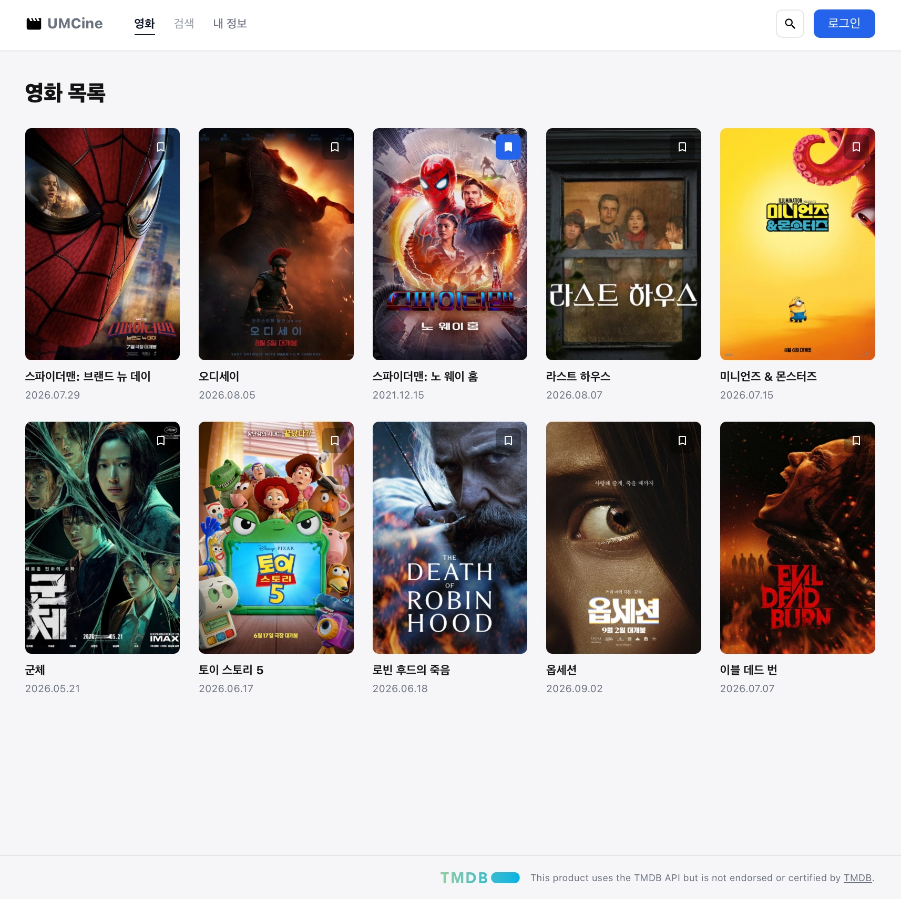
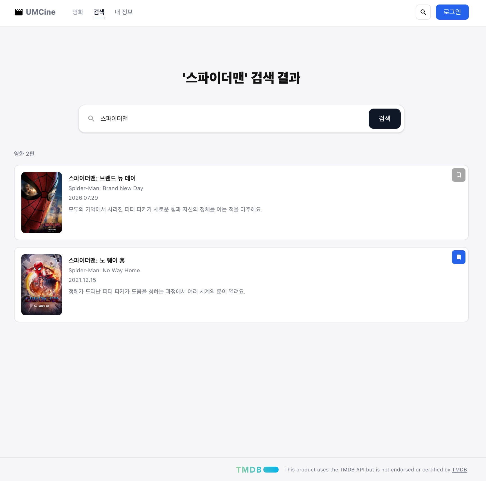
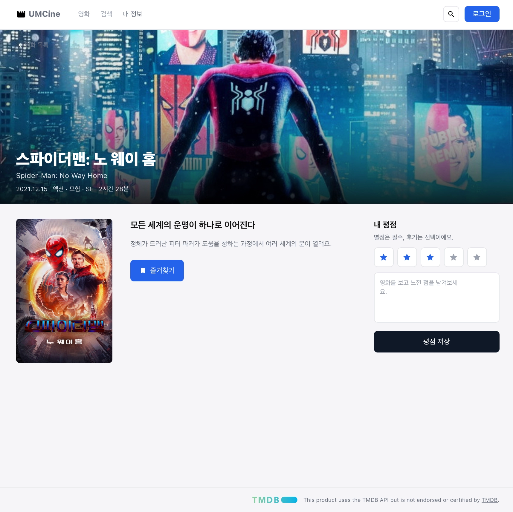
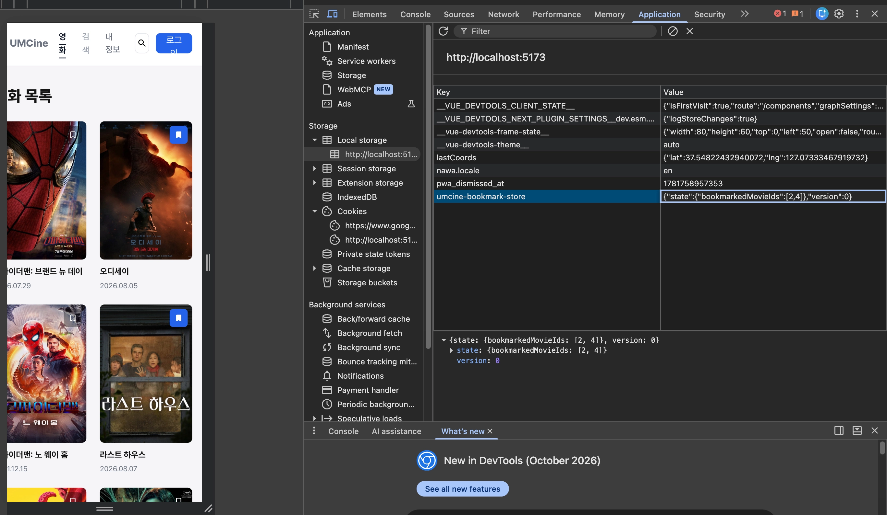
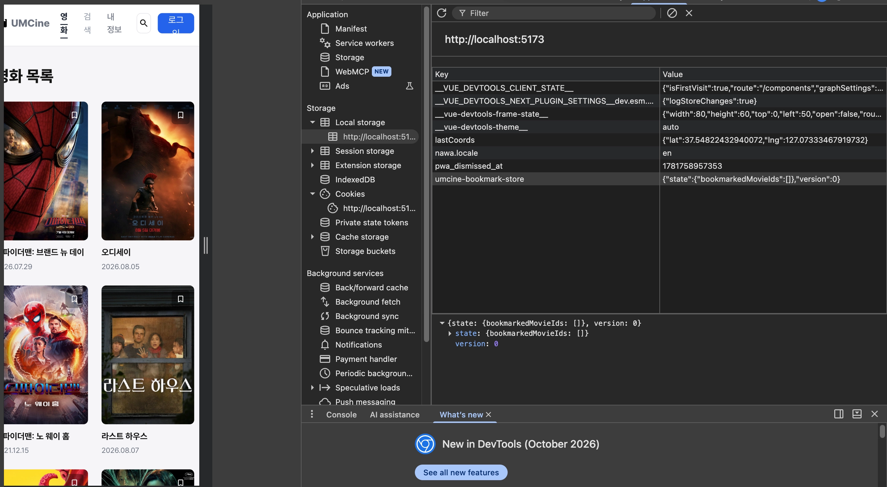

- 필수 미션
    
    # 미션 1. 북마크 상태를 Zustand로 공유하기
    
    ## 구현 내용
    
    ### 1) Zustand store 작성
    
    `src/stores/bookmark-store.ts`에 북마크 ID 배열과 toggle action을 둠.
    
    ```tsx
    export const useBookmarkStore = create<BookmarkStore>()((set) => ({
      bookmarkedMovieIds: [],
      toggleBookmark: (movieId) =>
        set((state) => ({
          bookmarkedMovieIds: state.bookmarkedMovieIds.includes(movieId)
            ? state.bookmarkedMovieIds.filter((id) => id !== movieId)
            : [...state.bookmarkedMovieIds, movieId],
        })),
    }));
    ```
    
    ### 2) selector로 필요한 값만 사용
    
    `src/components/movies/bookmark-button.tsx`에서 현재 영화의 북마크 여부와 action만 골라 씀.
    
    ```tsx
    const isBookmarked = useBookmarkStore((state) =>
      state.bookmarkedMovieIds.includes(movieId),
    );
    const toggleBookmark = useBookmarkStore((state) => state.toggleBookmark);
    ```
    
    ### 3) 목록 · 검색 · 상세 화면 연결
    
    목록(영화 카드)과 검색 결과는 같은 `BookmarkButton`을 쓰고, 상세 화면은 store를 직접 구독.
    
    ```tsx
    // movie-card.tsx, search-page.tsx
    <BookmarkButton movieId={movie.id} />
    
    // movie-detail-page.tsx
    const isBookmarked = useBookmarkStore((state) =>
      state.bookmarkedMovieIds.includes(Number(movieId)),
    );
    const toggleBookmark = useBookmarkStore((state) => state.toggleBookmark);
    ```
    
    ## 결과
    
    
        
    

    
    
    ---
    
    # 미션 2. 북마크 상태를 Web Storage에 유지하기
    
    ## 구현 내용
    
    ### store에 persist 적용
    
    ```tsx
    export const useBookmarkStore = create<BookmarkStore>()(
      persist(
        (set) => ({
          bookmarkedMovieIds: [],
          toggleBookmark: (movieId) =>
            set((state) => ({
              bookmarkedMovieIds: state.bookmarkedMovieIds.includes(movieId)
                ? state.bookmarkedMovieIds.filter((id) => id !== movieId)
                : [...state.bookmarkedMovieIds, movieId],
            })),
        }),
        {
          name: "umcine-bookmark-store",
          storage: createJSONStorage(() => localStorage),
          partialize: (state) => ({
            bookmarkedMovieIds: state.bookmarkedMovieIds,
          }),
        },
      ),
    );
    ```
    
    - `name`: Web Storage에 저장되는 key
    - `storage`: 사용할 브라우저 저장소 (JSON 변환은 `createJSONStorage`가 처리)
    - `partialize`: 함수(action)는 빼고 북마크 ID만 저장
    
    ## 결과 화면
    
    - 저장값 지우기 전
        
        
        
    - 저장 값 지운 후
        
        
