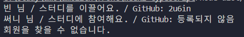

```tsx
type MemberRole = "leader" | "member";

type StudyMember = {
  id: number;
  name: string;
  memberRole: MemberRole;
  githubId?: string;
};

const members: StudyMember[] = [
  {
    id: 1,
    name: "빈",
    memberRole: "leader",
    githubId: "2u6in",
  },
  {
    id: 2,
    name: "써니",
    memberRole: "member",
  },
  {
    id: 3,
    name: "브라이언",
    memberRole: "member",
  },
];

function findMember(memberId: number) {
  return members.find((member) => member.id === memberId);
}

function createMemberCard(memberId: number) {
  const foundMember = findMember(memberId);

  if (!foundMember) {
    return "회원을 찾을 수 없습니다.";
  }

  const roleMessage =
    foundMember.memberRole === "leader"
      ? "스터디를 이끌어요."
      : "스터디에 참여해요.";

  const githubId = foundMember?.githubId ?? "등록되지 않음";

  return (
    foundMember.name +
    " 님 / " +
    roleMessage +
    " / GitHub: " +
    githubId
  );
}

console.log(createMemberCard(1));
console.log(createMemberCard(2));
console.log(createMemberCard(999));
```
