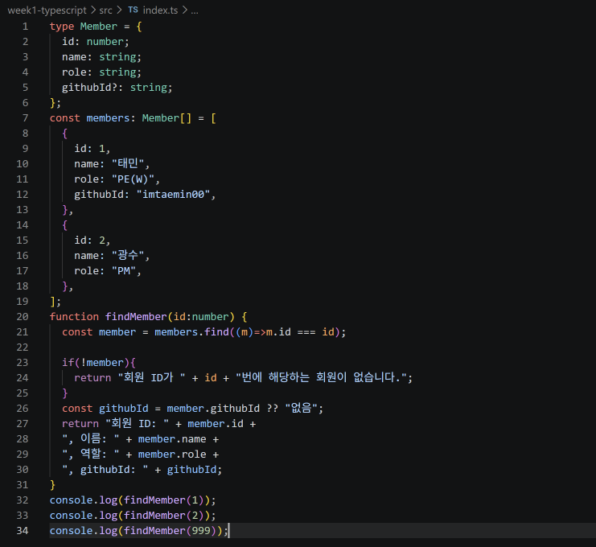
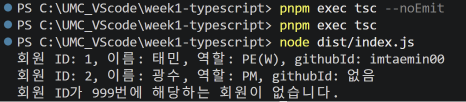

- 필수 미션

  

    - githubId를 옵셔널 프로퍼티(?)로 선언
    - find()는 조건에 맞는 회원이 없으면 undefined를 반환하므로 ,  if(!member)로 먼저 걸러내어 존재하지 않는 회원도 처리할 수 있도록 함
    - 널 병합 연산자 ??을 사용해 githubId가 null이나 undefined인 경우 기본 값으로 “없음”을 가지도록 함
    - 회원 1은 githubId가 있고 회원 2는 없게 설계해 옵셔널 프로퍼티와 널 병합 연산자 ??가 실제로 잘 동작하는지 확인할 수 있도록 함

  

    - 최종 확인 결과