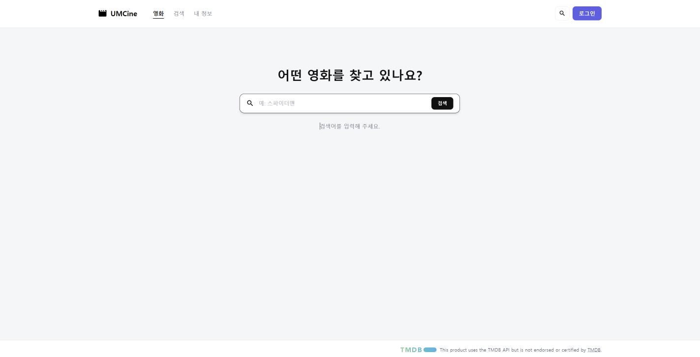
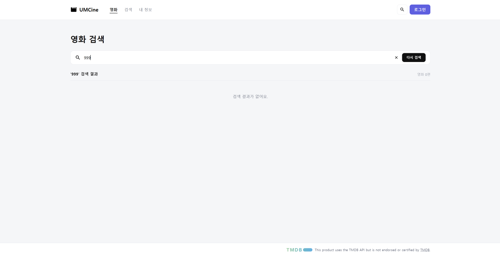
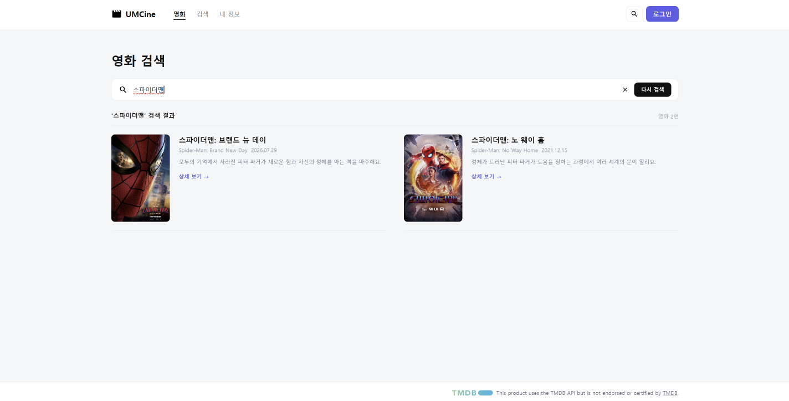
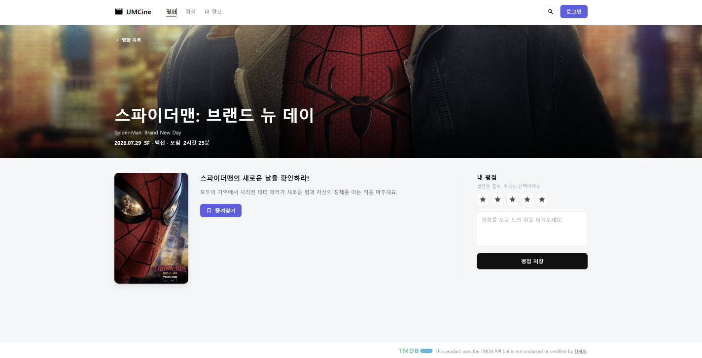

## 핵심 코드

**__root.tsx**

```tsx
export const Route = createRootRoute({  component: () => (    <div className="flex min-h-screen flex-col">      <Header />      <Outlet />      <Footer />    </div>  ),  notFoundComponent: () => <main>페이지를 찾을 수 없어요.</main>,});
```

- 모든 페이지에 공통으로 들어가는 틀이다.
- Header와 Footer는 항상 보이고, Outlet 자리에 주소에 맞는 페이지가 들어간다.
- 없는 주소로 들어가면 notFoundComponent가 보인다.

**search.tsx**

```tsx
export const Route = createFileRoute("/search")({  validateSearch: (search: Record<string, unknown>): { query?: string } => ({    query: typeof search.query === "string" ? search.query : undefined,  }),  component: SearchPage,});
```

- /search 주소에 SearchPage를 연결한다.
- validateSearch는 주소의 ?query= 값이 문자열인지 확인하고, 아니면 undefined로 처리한다.
- 검색어가 주소에 남아 있어서 새로고침해도 검색 결과가 유지된다.

**movies.$movieId.tsx**

```tsx
export const Route = createFileRoute("/movies/$movieId")({  component: MovieDetailPage,});
```

- /movies/1, /movies/2 처럼 $movieId 자리에 영화 번호가 들어가는 주소를 만든다.
- 상세 페이지에서는 useParams로 movieId를 꺼내 해당 영화를 찾는다.

**movie-card.tsx**

```tsx
<Link to="/movies/$movieId" params={{ movieId: String(movie.id) }}>
```

- 포스터와 제목을 누르면 해당 영화의 상세 페이지로 이동한다.
- params로 $movieId 자리에 들어갈 영화 번호를 넘긴다.

```tsx
<button  className={cn(    "absolute right-2 top-2 flex h-7 w-7 items-center justify-center rounded-md border",    movie.isBookmarked ? "border-[#4f5de8] bg-[#4f5de8]" : "border-white bg-black/40"  )}>
```

- 첫 번째 줄은 항상 들어가는 기본 스타일이다.
- 두 번째 줄은 북마크 여부에 따라 달라지는 스타일로, 북마크하면 파란색, 아니면 반투명 검정이 된다.
- cn은 두 스타일을 합쳐 하나의 className으로 만든다.

## 실행 결과








