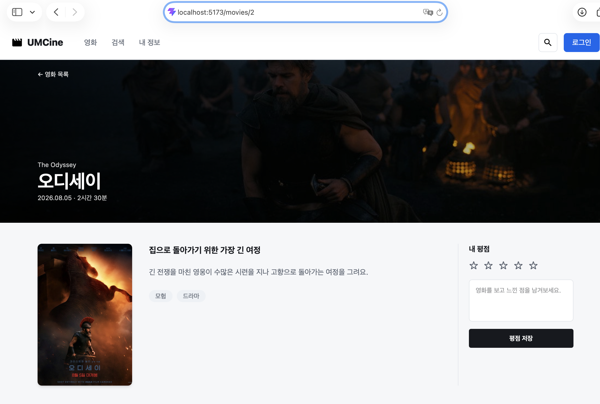
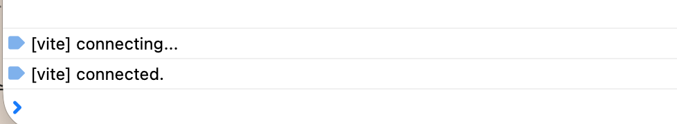
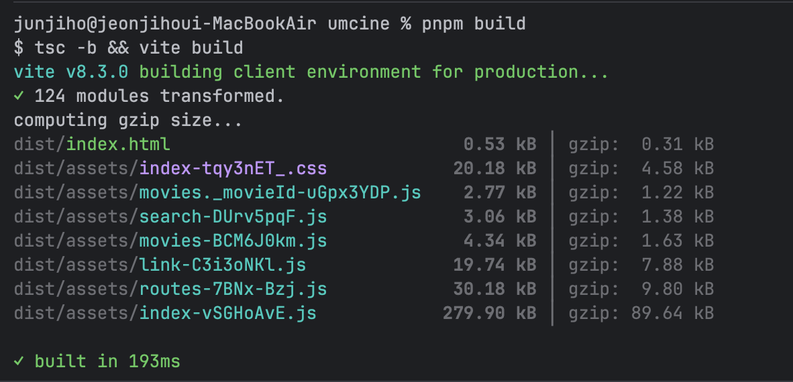

    ```jsx
    export const Route = createFileRoute("/")({
      component: MovieListPage,
    });
    ```

    ```jsx
    export const Route = createFileRoute("/search")({
      validateSearch: (search): { query?: string } => ({
        query: typeof search.query === "string" ? search.query : undefined,
      }),
      component: SearchPage,
    });
    ```

    ```jsx
    export const Route = createFileRoute('/movies/$movieId')({
      component: MovieDetailPage,
    })
    ```

    ```jsx
    const router = createRouter({ routeTree });\
    ```




   

  ==

  북마크를 구현할 때 상태에 따라 북마크 상태가 달라지므로 cn을 사용하였다.

    ```jsx
    className={cn(
                'absolute right-2 top-2 grid h-8 w-8 place-items-center rounded-lg p-0 shadow-[0_2px_8px_rgb(23_25_30_/_12%)]',
                movie.isBookmarked
                  ? 'border border-[#2563eb] bg-[#2563eb]'
                  : 'border border-white/90 bg-black/60',
              )}
    ```





