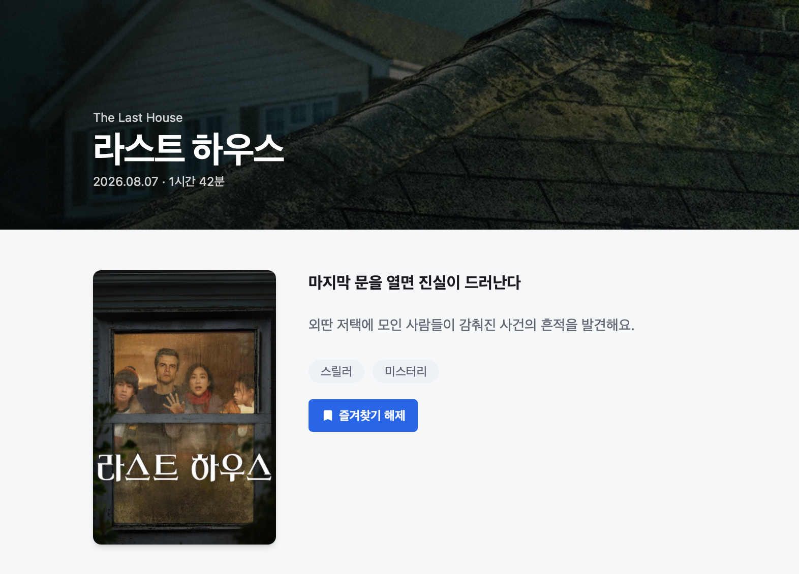
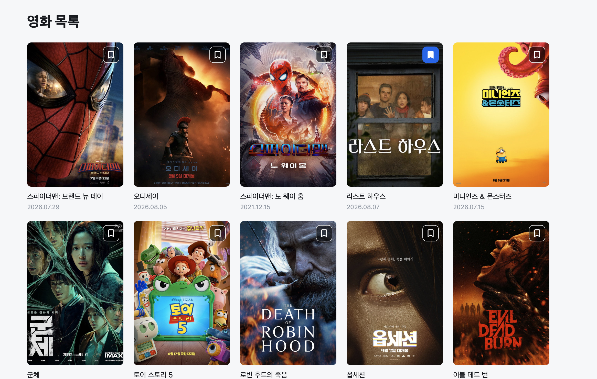
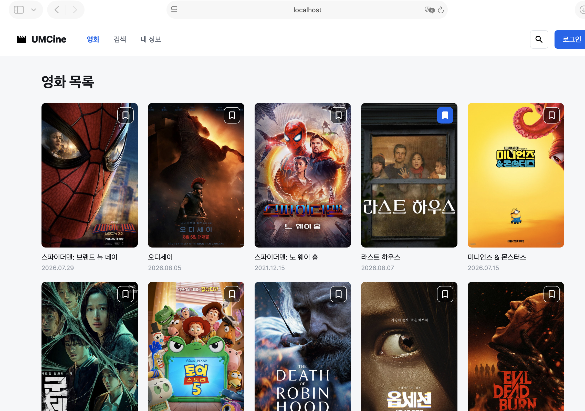
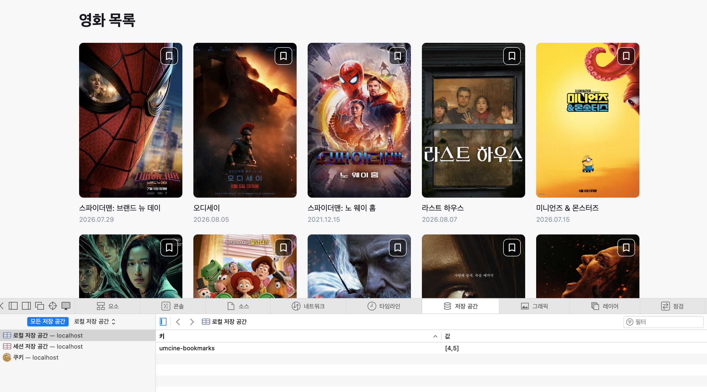

**북마크 상태를 Zustand로 공유하기**

```jsx
const bookmarkedMovieIds = useBookmarkStore(
    (state) => state.bookmarkedMovieIds,
  )
  const toggleBookmark = useBookmarkStore((state) => state.toggleBookmark)
```

목록 화면이 Zustand 전역 상태를 가져온다.

```jsx
<BookmarkButton movieId={movie.id} />
```

북마크 버튼 추가

```jsx
const isBookmarked = useBookmarkStore((state) =>
    state.bookmarkedMovieIds.includes(movieId),
  )
  const toggleBookmark = useBookmarkStore((state) => state.toggleBookmark)
```

버튼이 북마크 여부 확인, 클릭시 추가, 제거





**북마크 상태를 Web Storage에 유지하기**

```jsx
persist(
    (set) => ({
      bookmarkedMovieIds: [],
      toggleBookmark: (movieId) =>
        set((state) => ({
          bookmarkedMovieIds: state.bookmarkedMovieIds.includes(movieId)
            ? state.bookmarkedMovieIds.filter((id) => id !== movieId)
            : [...state.bookmarkedMovieIds, movieId],
        })),
    }),
    {
      name: "umcine-bookmark-store",
      storage: createJSONStorage(() => localStorage),
      partialize: (state) => ({
        bookmarkedMovieIds: state.bookmarkedMovieIds,
      }),
    },
  ),
)
```

persisr로 Zustand상태를 브라우저 저장소에 저장하게 된다.

localStorage에 저장해서 새로고침 및 재실행 후에도 유지되고 키 이름을 “umcine-bookmark-store”로 한다.



새로고침 밑 닫았다가 열어도 북마크가 유지된다.



umcine-mark-store 삭제시 북마크가 사라진다.